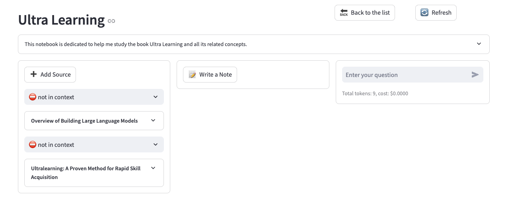

<a id="readme-top"></a>

<!-- [![Contributors][contributors-shield]][contributors-url] -->
[![Forks][forks-shield]][forks-url]
[![Stargazers][stars-shield]][stars-url]
[![Issues][issues-shield]][issues-url]
[![MIT License][license-shield]][license-url]
<!-- [![LinkedIn][linkedin-shield]][linkedin-url] -->


<!-- PROJECT LOGO -->
<br />
<div align="center">
  <a href="https://github.com/CoralShades/acm-ai">
    
  </a>

  <h3 align="center">ACM-AI</h3>

  <p align="center">
    Intelligent Asbestos Compliance Management powered by AI
    <br />
    <br />
    <a href="docs/acm-ai/03-prd.md">📋 Product Requirements</a>
    ·
    <a href="docs/getting-started/index.md">📚 Get Started</a>
    ·
    <a href="docs/acm-ai/04-architecture.md">🏗️ Architecture</a>
    ·
    <a href="docs/deployment/index.md">🚀 Deploy</a>
  </p>
</div>

## Intelligent ACM Compliance Document Management with AI-Powered Analysis



**ACM-AI transforms Asbestos Containing Material (ACM) compliance management:**
- 🏛️ **SAMP Document Processing** - Automated extraction from School Asbestos Management Plans
- 📊 **Intelligent Data Extraction** - Parse hierarchical structures (School → Building → Room → ACM Item)
- 🔍 **AI-Powered Search** - Query ACM registers with natural language
- 📄 **Citation Tracking** - Every data point linked to source PDF page numbers
- 🤖 **Multi-Model AI** - Choose from 16+ providers for privacy and cost control
- 🔒 **100% Private** - All document processing happens locally on your infrastructure
- 📚 **Production Ready** - Comprehensive test suite with 90%+ extraction accuracy

---

## 🎯 Why ACM-AI?

**Transform Your Asbestos Compliance Management:**

| Challenge | Traditional Approach | ACM-AI Solution |
|-----------|---------------------|-----------------|
| **Data Entry** | Manual transcription from PDFs | Automated extraction with 90%+ accuracy |
| **Document Search** | Ctrl+F through individual PDFs | AI-powered natural language queries |
| **Data Validation** | Manual cross-checking across pages | Hierarchical structure validation |
| **Citation Tracking** | Manual page references | Automatic source linking to PDF pages |
| **Report Generation** | Copy-paste from multiple documents | Query and export structured data |
| **Cost** | Hours of manual labor | Minutes of AI processing |

**Key Benefits:**
- 📊 **Structured Data**: Transform unstructured PDFs into queryable database records
- 🏗️ **Hierarchical Tracking**: Maintain School → Building → Room → ACM Item relationships
- 🔍 **Intelligent Search**: "Show all asbestos in Science Block built before 1980"
- 📄 **Audit Trail**: Every extracted record links to source PDF and page number
- 🤖 **Multi-Model AI**: Choose from 16+ providers for cost optimization
- 🔒 **Privacy First**: All processing happens locally on your infrastructure

### Built With

[![Python][Python]][Python-url] [![Next.js][Next.js]][Next-url] [![React][React]][React-url] [![SurrealDB][SurrealDB]][SurrealDB-url] [![LangChain][LangChain]][LangChain-url]

## 🚀 Quick Start

**Get started with ACM-AI in minutes:**

ACM-AI is deployed using Docker for easy setup and consistent environments. Simply configure your AI provider API key and start processing ACM documents!

**Docker Images:**
> **Note:** Docker images are currently in development. For now, please use the development setup below or contact us for early access.

### 🛠️ Development Setup

For development or testing ACM-AI:

```bash
# Clone the repository
git clone https://github.com/CoralShades/acm-ai
cd acm-ai
```

#### Windows (Recommended)
```batch
# Ensure Docker Desktop is running first!

# Start all services with one command:
start-all.bat

# Stop all services:
stop-all.bat

# Optional: Setup local AI (Ollama)
start-ollama.bat      # Interactive setup with GPU/CPU choice
stop-ollama.bat       # Stop Ollama container
```

#### macOS / Linux / WSL
```bash
# Option 1: Smart start with port conflict detection + auto-fix (recommended)
make smart-start              # Pre-flight checks, auto-fix conflicts, start all, verify health
make smart-stop               # Stop all with verification

# Option 2: Start all 4 services in background (logs to /tmp/)
./start-all.sh                # Start all services (with pre-flight checks)
./stop-all.sh                 # Stop all services (with verification)

# Option 3: Start with make (same as Option 2)
make start-all
make stop-all

# Option 4: Start in tmux with 5 panes (4 services + live health dashboard)
make tmux                     # Or: ./start-all-tmux.sh
# Use Ctrl+B then D to detach, Ctrl+B then arrow keys to switch panes

# Service management utilities:
make health                   # Live-updating health dashboard (Ctrl+C to exit)
make preflight                # Pre-flight check (Docker, ports, dependencies)
make fix                      # Auto-fix port conflicts and stale processes

# View logs (for Option 2 & 3):
tail -f /tmp/acm-ai-api.log
tail -f /tmp/acm-ai-worker.log
```

#### Service Manager CLI

A unified Python CLI manages all services with pre-flight checks, port conflict detection, and a rich TUI:

```bash
uv run python scripts/service_manager.py check     # Pre-flight: Docker, ports, dependencies
uv run python scripts/service_manager.py start      # Start all services with health verification
uv run python scripts/service_manager.py stop       # Stop all with verification
uv run python scripts/service_manager.py status     # Show colored service status table
uv run python scripts/service_manager.py health     # Live-updating health dashboard
uv run python scripts/service_manager.py fix        # Fix port conflicts and stale PID files
uv run python scripts/service_manager.py start --auto-fix  # Auto-resolve port conflicts
```

**The 4 services are:**

| Service | Port | Description |
|---------|------|-------------|
| **SurrealDB** | 8000 | Multi-model database |
| **FastAPI Backend** | 5055 | REST API server |
| **Background Worker** | - | Async job processor |
| **Next.js Frontend** | 8503 | Web UI |

#### Manual Setup (All Platforms)
```bash
docker compose up -d surrealdb        # Database on port 8000
uv run run_api.py                     # API on port 5055
uv run surreal-commands-worker --import-modules commands  # Background worker
cd frontend && npm run dev            # Frontend on port 8503
```
uv run run_api.py --import-modules commands

#### LangGraph Studio (Pipeline Visual Debugging)

Use LangGraph Studio to inspect the compiled ACM extraction graph, step through node execution, and inspect state transitions.

```bash
pip install langgraph-cli
langgraph dev
```

- The local server hot-reloads graph changes.
- Studio URL is printed by `langgraph dev`.
- LangGraph Studio web requires a free LangSmith login for access.

#### Docker-Only Development
```bash
# Full containerized development with hot-reload:
docker compose -f docker-compose.dev-local.yml up
```

#### 🦙 Local AI with Ollama (Optional)

Run AI models locally for complete privacy and zero API costs:

```bash
# Interactive setup (Windows)
start-ollama.bat

# Or use Docker Compose profiles directly:
docker compose --profile ollama-cpu up -d    # Office laptops (no GPU)
docker compose --profile ollama-gpu up -d    # Machines with NVIDIA GPU
```

After starting Ollama, pull recommended models:
```bash
docker exec acm-ai-ollama ollama pull qwen3              # Language model
docker exec acm-ai-ollama ollama pull mxbai-embed-large  # Embeddings
```

Then add to your `.env`:
```env
OLLAMA_API_BASE=http://ollama:11434
```

> **💡 Tip:** No GPU or office laptop restrictions? Just skip the Ollama profile and use cloud providers (OpenAI, Anthropic, etc.) instead.

**Access at:** http://localhost:8503

**Requirements:**
- Docker Desktop (must be running)
- Python 3.11+ (via [uv](https://docs.astral.sh/uv/))
- Node.js 18+ (for frontend)
- API key for at least one AI provider (OpenAI, Anthropic, Ollama, etc.)

### 📖 Documentation
- **Getting Started**: See [Getting Started Guide](docs/getting-started/index.md)
- **Installation**: Check our [Installation Guide](docs/getting-started/installation.md)
- **Quick Tutorial**: Try our [Quick Start Tutorial](docs/getting-started/quick-start.md)
- **Architecture**: Review [Architecture Documentation](docs/acm-ai/04-architecture.md)

## Provider Support Matrix

ACM-AI supports multiple AI providers for flexibility and cost optimization:

| Provider     | LLM Support | Embedding Support | Speech-to-Text | Text-to-Speech | Notes |
|--------------|-------------|------------------|----------------|----------------|-------|
| OpenAI       | ✅          | ✅               | ✅             | ✅             | Full-featured, recommended for getting started |
| Anthropic    | ✅          | ❌               | ❌             | ❌             | Claude models |
| Groq         | ✅          | ❌               | ✅             | ❌             | Ultra-fast inference |
| Google (GenAI) | ✅          | ✅               | ❌             | ✅             | Gemini models |
| Vertex AI    | ✅          | ✅               | ❌             | ✅             | Enterprise Google Cloud |
| **Ollama** 🦙 | ✅          | ✅               | ❌             | ❌             | **Local & free** - [Docker setup included](#-local-ai-with-ollama-optional) |
| Perplexity   | ✅          | ❌               | ❌             | ❌             | Search-augmented |
| ElevenLabs   | ❌          | ❌               | ✅             | ✅             | Premium voice synthesis |
| Azure OpenAI | ✅          | ✅               | ❌             | ❌             | Enterprise Azure |
| Mistral      | ✅          | ✅               | ❌             | ❌             | European AI |
| DeepSeek     | ✅          | ❌               | ❌             | ❌             | Advanced reasoning (R1) |
| Voyage       | ❌          | ✅               | ❌             | ❌             | Specialized embeddings |
| xAI          | ✅          | ❌               | ❌             | ❌             | Grok models |
| OpenRouter   | ✅          | ❌               | ❌             | ❌             | 100+ models via single API |
| OpenAI Compatible* | ✅          | ❌               | ❌             | ❌             | LM Studio, custom endpoints |

*Supports LM Studio and any OpenAI-compatible endpoint

> **🔒 Privacy-First Option:** Use Ollama for 100% local processing - your ACM data never leaves your infrastructure. Perfect for sensitive compliance documents.

## ✨ Key Features

### ACM-Specific Capabilities
- **📄 SAMP Document Processing**: Automated extraction from School Asbestos Management Plans
- **🏗️ Hierarchical Data Structure**: School → Building → Room → ACM Item relationships
- **🎯 Smart Pattern Recognition**: Detects building IDs, room codes, area types automatically
- **📊 Structured Database**: Transform PDFs into queryable ACMRecord objects
- **🔍 Field-Level Extraction**: Product, material description, friable status, risk, condition, extent
- **📍 Citation Tracking**: Every record links to source document and page number
- **🤖 Background Processing**: Async extraction with retry logic and error handling
- **✅ High Accuracy**: 90%+ field accuracy on real-world ACM registers

### V3: Salesforce Integration (NEW)
- **🔗 Salesforce Schema Alignment**: Building__c + Item__c field mappings with dependent picklist validation
- **🔄 Multi-Provider Extraction**: Docling + MinerU dual-provider pipeline with consensus layer
- **📊 Two-View Register UI**: Building Grid + Item Grid with AG Grid dynamic columns
- **📡 Real-Time Streaming**: SSE-based extraction progress with per-record updates
- **✅ SF Validation**: Dependent picklist validation against Salesforce vocabulary
- **📋 Raw Table Review**: Side-by-side raw extraction and provenance viewer
- **📦 Bulk Operations**: Bulk edit, validate, and Salesforce-ready CSV/Excel export

### AI-Powered Intelligence
- **🤖 Multi-Model Support**: 16+ providers including OpenAI, Anthropic, Ollama, Google, LM Studio
- **💬 Natural Language Queries**: "Show all friable asbestos in buildings before 1980"
- **🔍 Semantic Search**: Vector search across ACM descriptions and locations
- **📝 AI-Assisted Analysis**: Generate compliance reports and risk summaries
- **⚡ Reasoning Models**: Full support for thinking models like DeepSeek-R1

### Platform Features
- **🔒 Privacy-First**: Your sensitive compliance data stays under your control
- **🎯 Multi-Notebook Organization**: Manage multiple school districts or properties
- **📚 Universal Content Support**: PDFs, Office docs, web pages, and more
- **🌐 Comprehensive REST API**: Full programmatic access [](http://localhost:5055/docs)
- **🔐 Optional Password Protection**: Secure public deployments with authentication

## 📚 Documentation

### Getting Started
- **[📖 Introduction](docs/getting-started/introduction.md)** - Learn what ACM-AI offers
- **[⚡ Quick Start](docs/getting-started/quick-start.md)** - Get up and running in 5 minutes
- **[🔧 Installation](docs/getting-started/installation.md)** - Comprehensive setup guide
- **[📋 Product Requirements](docs/acm-ai/03-prd.md)** - Complete PRD and feature list

### User Guide
- **[📱 Interface Overview](docs/user-guide/interface-overview.md)** - Understanding the layout
- **[📚 Notebooks](docs/user-guide/notebooks.md)** - Organizing your ACM data
- **[📄 Sources](docs/user-guide/sources.md)** - Managing SAMP documents
- **[📝 Notes](docs/user-guide/notes.md)** - Creating and managing notes
- **[💬 Chat](docs/user-guide/chat.md)** - AI conversations
- **[🔍 Search](docs/user-guide/search.md)** - Finding ACM records

### Advanced Topics
- **[🏗️ Architecture](docs/acm-ai/04-architecture.md)** - System architecture and design
- **[🔧 Content Transformations](docs/features/transformations.md)** - Customize content processing
- **[🤖 AI Models](docs/features/ai-models.md)** - AI model configuration
- **[🔧 REST API Reference](docs/development/api-reference.md)** - Complete API documentation
- **[🔐 Security](docs/deployment/security.md)** - Password protection and privacy
- **[🚀 Deployment](docs/deployment/index.md)** - Complete deployment guides

<p align="right">(<a href="#readme-top">back to top</a>)</p>

## 🗺️ Roadmap

### Completed Milestones

**Phase 1 - Core Extraction (COMPLETE)**
- ✅ **ACMRecord Domain Model**: Full Pydantic model with SurrealDB integration
- ✅ **ACM Extraction Engine**: Regex-based parser for Docling markdown output
- ✅ **Hierarchical Context Tracking**: School → Building → Room → Item relationships
- ✅ **Background Command Processing**: Async extraction with retry logic
- ✅ **Comprehensive Test Suite**: 47 passing tests (unit + integration)
- ✅ **High Accuracy**: 90%+ field accuracy on real ACM register samples

**Phase 2 - V3 Salesforce Integration (COMPLETE -- 37/37 stories, 110 SP)**
- ✅ **Salesforce Schema Alignment**: Building__c + Item__c field mappings (143+154 fields, 41 picklists)
- ✅ **Multi-Provider Extraction**: Docling + MinerU dual-provider pipeline with consensus layer
- ✅ **Two-View Register UI**: Building Grid + Item Grid with AG Grid dynamic columns
- ✅ **Real-Time SSE Streaming**: Per-record extraction progress with PipelineEventBus
- ✅ **Dependent Picklist Validation**: SF vocabulary validation with correction loop
- ✅ **Raw Table Review**: Side-by-side raw extraction tables and provenance viewer
- ✅ **Bulk Operations**: Bulk edit, validate, and Salesforce-ready CSV/Excel export
- ✅ **Performance Optimization**: GPU memory management, pipeline instrumentation
- ✅ **Pre-Extraction Intelligence**: Document structure analysis, building inventory, page tagging
- ✅ **Ollama-First Provider Priority**: Local-first extraction with Anthropic/OpenRouter cloud fallback

**Phase 3 - Per-Row Extraction + UX Hardening (COMPLETE)**
- ✅ **Per-Row ACM Extraction**: One LLM call per table row, 9-field schema, deterministic post-processing (E37)
- ✅ **Navigation Performance**: App-shell skeleton on cold start, 17 route-level loading skeletons, navigation timing E2E test

### Next for ACM-AI
- **Salesforce Data Push**: Direct sync of validated records to Salesforce org
- **Multi-Tenant Deployment**: Support multiple school districts with isolated data
- **Role-Based Access Control**: User roles and permissions for compliance teams
- **Risk Analytics Dashboard**: High-risk materials by building/school with trend analysis

See the [open issues](https://github.com/CoralShades/acm-ai/issues) for proposed features and to request new capabilities.

<p align="right">(<a href="#readme-top">back to top</a>)</p>


## 🤝 Community & Contributing

### Get Support
- 🐛 **[GitHub Issues](https://github.com/CoralShades/acm-ai/issues)** - Report bugs and request features
- ⭐ **Star this repo** - Show your support and help others discover ACM-AI
- 📧 **Contact**: For enterprise support or custom integrations, contact the CoralShades team

### Contributing
We welcome contributions! We're especially looking for help with:
- **ACM Extraction Improvements**: Enhance parsing accuracy and handle edge cases
- **Frontend Development**: Build ACM-specific UI components and dashboards
- **Real-world Testing**: Test with actual SAMP PDFs and report issues
- **Export & Reporting**: Add CSV/Excel export and compliance reporting features
- **Documentation**: Improve guides for ACM compliance workflows
- **Testing**: Expand test coverage with more ACM register variations

**Current Tech Stack**: Python, FastAPI, Next.js, React, SurrealDB, Docling, LangChain

See our [Contributing Guide](CONTRIBUTING.md) for detailed information on how to get started.

<p align="right">(<a href="#readme-top">back to top</a>)</p>


## 📄 License

ACM-AI is MIT licensed. See the [LICENSE](LICENSE) file for details.

## 📞 Contact

**ACM-AI Project**:
- 🐛 [GitHub Issues](https://github.com/CoralShades/acm-ai/issues) - Report bugs and request features
- 🌐 [CoralShades Organization](https://github.com/CoralShades) - View all our projects
- 📧 **Enterprise Support**: Contact us for custom integrations and enterprise deployments

## 🙏 Acknowledgments

ACM-AI is built with amazing open-source technologies:

### Core Technologies
* **[FastAPI](https://fastapi.tiangolo.com/)** - High-performance Python web framework
* **[Next.js](https://nextjs.org/)** - React framework for production
* **[SurrealDB](https://surrealdb.com/)** - Multi-model database
* **[LangChain](https://www.langchain.com/)** - LLM application framework
* **[Docling](https://github.com/docling-project/docling)** - Document processing and parsing
* **[Pydantic](https://docs.pydantic.dev/)** - Data validation using Python type hints

<p align="right">(<a href="#readme-top">back to top</a>)</p>


<!-- MARKDOWN LINKS & IMAGES -->
<!-- https://www.markdownguide.org/basic-syntax/#reference-style-links -->
[contributors-shield]: https://img.shields.io/github/contributors/CoralShades/acm-ai.svg?style=for-the-badge
[contributors-url]: https://github.com/CoralShades/acm-ai/graphs/contributors
[forks-shield]: https://img.shields.io/github/forks/CoralShades/acm-ai.svg?style=for-the-badge
[forks-url]: https://github.com/CoralShades/acm-ai/network/members
[stars-shield]: https://img.shields.io/github/stars/CoralShades/acm-ai.svg?style=for-the-badge
[stars-url]: https://github.com/CoralShades/acm-ai/stargazers
[issues-shield]: https://img.shields.io/github/issues/CoralShades/acm-ai.svg?style=for-the-badge
[issues-url]: https://github.com/CoralShades/acm-ai/issues
[license-shield]: https://img.shields.io/github/license/CoralShades/acm-ai.svg?style=for-the-badge
[license-url]: https://github.com/CoralShades/acm-ai/blob/master/LICENSE.txt
[product-screenshot]: images/screenshot.png
[Next.js]: https://img.shields.io/badge/Next.js-000000?style=for-the-badge&logo=next.js&logoColor=white
[Next-url]: https://nextjs.org/
[React]: https://img.shields.io/badge/React-61DAFB?style=for-the-badge&logo=react&logoColor=black
[React-url]: https://reactjs.org/
[Python]: https://img.shields.io/badge/Python-3776AB?style=for-the-badge&logo=python&logoColor=white
[Python-url]: https://www.python.org/
[LangChain]: https://img.shields.io/badge/LangChain-3A3A3A?style=for-the-badge&logo=chainlink&logoColor=white
[LangChain-url]: https://www.langchain.com/
[SurrealDB]: https://img.shields.io/badge/SurrealDB-FF5E00?style=for-the-badge&logo=databricks&logoColor=white
[SurrealDB-url]: https://surrealdb.com/
