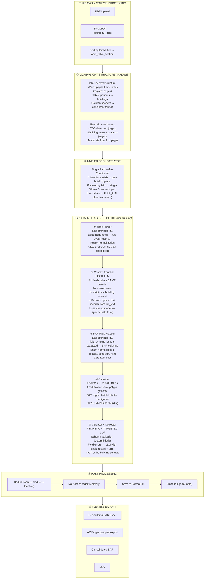
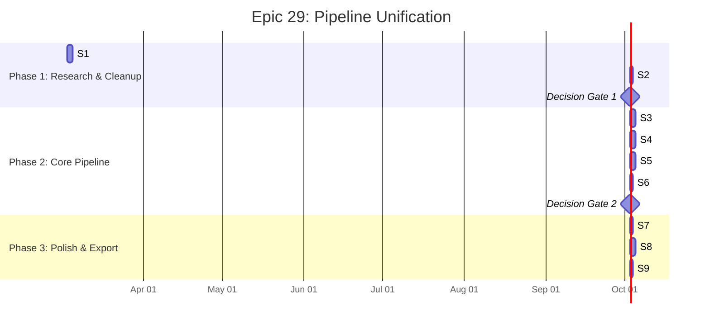

# ACM-AI BMAD Architecture Audit — Pipeline Gap Analysis

**Source:** `V3/bmad-architecture-audit.html`
**Generated:** March 2026
**Scope:** Comprehensive audit of the existing extraction pipeline against the unified pipeline vision
**Outcome:** 6 gaps identified → Epic 29 (Pipeline Unification), 9 stories, 20 SP

---

## Relevance Assessment

**Status: CURRENT — Foundation document for Epic 29. Significant overlap with e30-multi-agent-audit-unified.md but distinct scope.**

### Overlap with `e30-multi-agent-audit-unified.md`

| Topic | This Audit (E29) | E30 Unified Audit | Verdict |
|-------|-----------------|-------------------|---------|
| Dual-path architecture (GAP-1) | Deep analysis + remediation | Brief mention in W10 | **This doc is authoritative** |
| Tables-as-primary (GAP-2) | Empirical evidence table, E25 data | Not covered | **This doc is authoritative** |
| Monolithic LLM extraction (GAP-3) | Specialized agent design | Mentioned in W10, W12 | **Complementary** |
| Export rigidity (GAP-4) | Export endpoints analysis | Covered in W11 | **Complementary** |
| Salesforce field names / object split | NOT covered | CRITICAL focus (W1-W7) | **E30 audit is authoritative** |
| Dependent picklist validation | Not covered | Covered in W6 | **E30 audit is authoritative** |
| Provider simplification (Esperanto) | Not covered | Covered in W8-W9 | **E30 audit is authoritative** |
| Story breakdown + regression strategy | Full 9-story plan | Not covered | **This doc is authoritative** |

**Summary:** This audit owns the pipeline architecture redesign (E29). The E30 audit owns the Salesforce data model alignment. They are complementary — both must be read for V3 planning. E29 stories execute first; E30 builds on top.

**V3 planning steps that MUST reference this document:**
- `Create Architecture` — The 6 gaps define the delta between E26 and V3 target state
- `Create Epics and Stories` — E29 story breakdown is the execution plan for pipeline unification
- `Party Mode` — Assign this doc to the Dev agent as the pipeline redesign spec
- `Technical Research` — LLM cost comparison table (§GAP-3) is evidence for provider choices

**Key sections for downstream agents:**
1. §Gap Scorecard — 6-row decision table with story assignments
2. §GAP-3 Specialized Agent Design — The agent pipeline is the V3 architecture target
3. §Target: Unified Pipeline v2 — Mermaid diagram of the redesigned pipeline
4. §Epic 29 Story Breakdown — 9 stories with ACs, ready to implement
5. §Regression Strategy — Benchmarks that must not regress

---

## 01 / Executive Summary

### Core Finding

The pipeline contains a **conditional dual-path architecture** (legacy vs orchestrator) that violates the stated principle: "Every PDF needs to use 1 single pipeline." Additionally, AI is used for bulk extraction when empirical evidence (E25) shows Docling DataFrames alone achieve 93.5% — the AI should interpret and fill gaps, not extract from scratch.

### Vision Statement (from Demi)

> "Every PDF needs to use 1 single orchestrator/pipeline/workflow. Since we do not know what PDF user might upload, which consultant, format is. The table extraction needs to extract the table correctly then the AI needs to be used (multi agent, request — any way you prefer or best for our use case) for the rest of the steps to fill the data based on the BAR format (but it's not the final export type, user will/might need per building, ACM exports)."

### Decisions Locked In

| Decision | Choice | Impact |
|----------|--------|--------|
| Legacy path | REMOVE entirely — orchestrator handles all cases | Eliminates dual-path unpredictability |
| Table priority | DataFrames are primary — AI fills gaps only | Inverts current architecture fundamentally |
| AI decomposition | Specialized pipeline agents — deterministic first, LLM surgical | Reduces LLM cost ~60%, improves debuggability |
| Export flexibility | Both per-building AND ACM-type exports | New export endpoints required |
| Dead code | Aggressive cleanup NOW | Remove legacy path, MinerU, old flags in Phase 1 |
| Execution | New epic with research spike first | Clean design, empirical validation before implementation |

---

## 02 / Gap Scorecard

| ID | Gap | Severity | Current State | Target State | Stories |
|----|-----|----------|--------------|-------------|---------|
| GAP-1 | Dual extraction path | **Critical** | Conditional edge: orchestrator OR legacy | Single unified orchestrator for all documents | E29-S2, S3 |
| GAP-2 | Tables are supplementary, not primary | **High** | `full_text` primary, DataFrames appended | DataFrames primary, `full_text` for context/recovery | E29-S1, S3 |
| GAP-3 | Monolithic LLM extraction call | **High** | Single prompt extracts all 40+ fields | Specialized agents: parser → enricher → mapper → classifier → validator | E29-S4, S5 |
| GAP-4 | Export locked to BAR-only | Medium | 13 hardcoded columns, no per-building | Per-building + ACM-type exports via field mapping | E29-S8 |
| GAP-5 | Wasted pre-extraction LLM calls | Medium | 4 LLM calls that ALL fail → heuristic fallback | Derive structure from tables + lightweight heuristics | E29-S3 |
| GAP-6 | Dead code & feature flag debt | Low | Legacy path, MinerU refs, old flags in codebase | Aggressive cleanup: remove all dead paths | E29-S2 |

---

## 03 / GAP 1: Dual Extraction Path (Critical)

### Current State

Conditional edge after `tag_pages`:

```
tag_pages → should_use_orchestrator()?
  → TRUE:  orchestrate → validate → ...
  → FALSE: prepare → extract → loop → validate → ...
```

Returns `FALSE` when `building_inventory` is `None` or has 0 buildings. Any document where pre-extraction intelligence fails gets a completely different extraction path — different prompts, different chunking, different accuracy characteristics.

**Evidence:** E1-S20 explicitly preserves legacy path "for backward compatibility." Tests assert both paths are reachable in the compiled graph.

### Target State

Single orchestrator path for ALL documents:

```
tag_pages → orchestrate → agent_pipeline → validate → ...
```

When building inventory fails, the orchestrator treats the entire document as a single building (page 1 to last page). No conditional edge. No legacy path. One pipeline, one set of prompts, one accuracy profile.

**Fallback:** If Docling tables AND inventory both fail, orchestrator creates a single "Unknown Building" extraction plan with `FULL_LLM` strategy covering all pages.

### Production Risk

With 2000+ documents from unknown consultants, the probability of pre-extraction intelligence failing for some documents is high. Every such document silently gets the legacy path — which was never optimised for E26 improvements (Docling tables, dedup key fix, regex recovery). This creates an accuracy cliff that won't show up until production.

---

## 04 / GAP 2: Tables Supplementary, Not Primary (High)

### Current State

```
LLM receives:
1. Building text content (PyMuPDF) ← PRIMARY
2. "## Structured Table Data"       ← SUPPLEMENTARY
3. Prompt: "prioritize structured data"
```

The AI must read through unstructured text AND structured tables, then figure out which source to trust. The prompt says to prioritize tables, but the architecture doesn't enforce this — it's a suggestion.

### Target State

```
Pipeline:
1. Docling DataFrames → raw records (deterministic)
2. Records with missing fields → Context Enricher LLM
   (receives: record + relevant full_text excerpt)
3. full_text scanned for records tables missed
```

The AI never sees raw tables. It sees structured records with specific blank fields to fill.

### Empirical Evidence

| Approach | Accuracy | LLM Calls | Cost |
|----------|---------|-----------|------|
| PyMuPDF text → LLM extracts everything (E23 baseline) | 28/31 (90.3%) | 1-3 per building | High |
| Docling DataFrames alone, NO LLM (E25 spike) | 29/31 (93.5%) | 0 | Zero |
| Hybrid: text + DataFrames supplementary (E26 current) | 31/31 (100%) | 1-3 per building | High |
| **Target: DataFrames primary + surgical AI + regex** | **Target: 31/31** | **~0.3 per building** | **~60% reduction** |

---

## 05 / GAP 3: Monolithic LLM Extraction (High)

### Current State: Single LLM Call

The `building_extraction.jinja` prompt asks the LLM to simultaneously:

```
① Identify records from tables/text
② Map to building/room context
③ Normalise sample results
④ Map to 40+ BAR fields
⑤ Classify product types
⑥ Assess risk status
```

**Problem:** When record #9 (Battery Charger) was missed, debugging required analysing the entire prompt + full context to find why. Each field error could stem from any of 6 interleaved responsibilities.

### Target State: Specialized Agents

Six discrete steps, each independently testable:

```
① Table Parser    [DETERMINISTIC]  — DataFrame → raw records
② Context Enricher [LIGHT LLM]    — fill fields tables can't provide
③ BAR Mapper       [DETERMINISTIC] — field schema lookup
④ Classifier       [REGEX+LLM]    — product group/type taxonomy
⑤ Validator        [PYDANTIC+LLM] — schema check + targeted correction
⑥ Recovery         [REGEX]        — dedup + No Access scanner
```

**Benefit:** 3 of 6 steps are zero LLM cost. Each step has its own accuracy metric against ground truth.

---

## 06 / GAP 4: Export Rigidity (Medium)

Export endpoints use 13 hardcoded columns. No per-building or ACM-type export options.

The E5-S4 field mapping configuration was implemented in SurrealDB (`field_schema` table with 47 BAR field definitions), but the actual export endpoints (`api/routers/acm.py:237-439`) still use hardcoded column lists. The mapping infrastructure exists but isn't wired up.

Compliance officers need:
- Per-building exports (one file per building)
- ACM-type exports (grouped by material/risk, not building)

---

## 07 / GAP 5: Wasted Pre-Extraction Intelligence (Medium)

4 LLM calls that systematically fail due to the `completionState` envelope, wasting ~43 seconds per document:

| Stage | LLM Call | Outcome | Fallback | Wasted Time |
|-------|---------|---------|---------|------------|
| Document Structure | `with_structured_output()` | ❌ ValidationError | Heuristic (works) | ~8s |
| Building Inventory | `with_structured_output()` | ❌ ValidationError | Heuristic (works) | ~12s |
| Page Tagging | `with_structured_output()` | ❌ ValidationError | Default section assignment | ~15s |
| Metadata | `with_structured_output()` | ❌ ValidationError | None (optional) | ~8s |

With the "tables as primary" architecture, much of this intelligence becomes derivable FROM the table structure itself: which pages have tables (register pages), how many table groups exist (buildings), what column headers say (consultant format).

---

## 08 / GAP 6: Dead Code & Feature Flag Debt (Low)

| Dead Code | Location | Action |
|-----------|---------|--------|
| Legacy `prepare → extract → loop` path | `acm_extraction.py` | Remove entirely |
| `should_use_orchestrator()` conditional | `acm_extraction.py` | Remove (always orchestrate) |
| MinerU HTML fallback in `prepare_context()` | `acm_extraction.py:1028-1057` | Remove (MinerU deleted) |
| `DOCLING_TABLE_STRUCTURE` flag (E24 — "DO NOT USE") | `source_commands.py` | Remove flag + guarded code |
| `DOCLING_DIRECT_TABLE_EXTRACTION` flag | `source_commands.py` | Remove flag (now default `true`) |
| Legacy `extract_records` node function | `acm_extraction.py` | Remove (replaced by orchestrator) |
| Legacy `prepare_context` node function | `acm_extraction.py` | Remove (replaced by orchestrator) |

---

## 09 / Target: Unified Pipeline v2

Every document flows through this single path. No conditional routing. No legacy fallback.



**Key Architectural Change:** The AI never sees raw tables or unstructured text. It receives structured records with specific blank fields and the relevant text excerpt to fill them from. This transforms the AI task from "extract everything from this text" to "fill in these 5 fields given this context" — a fundamentally simpler, cheaper, and more reliable task.

---

## 10 / Agent Design: Per-Building Pipeline

### Agent ① — Table Parser (Deterministic)

- **Input:** Docling DataFrame(s) for this building's page range
- **Process:** Iterate DataFrame rows → raw `ACMRecord` with fields mapped from column headers. Apply regex normalization: fix split sample numbers (`34511-039- 001` → `34511-039-001`), strip "Asbestos " prefix from hazard status, normalize "Same as" → "As Per"
- **Output:** List of raw `ACMRecord` objects with ~60-70% of fields populated
- **LLM cost:** Zero
- **Expected accuracy:** 29/31 records (based on E25 evidence)

### Agent ② — Context Enricher (Light LLM)

- **Input:** Records with missing fields + relevant `full_text` excerpt for this building's page range
- **Process:** For each record with missing fields (`floor_level`, `area_type`, `building_year`, `hygienist_recommendations`, etc.), send a targeted prompt with JUST that record and the relevant text paragraph. Additionally, scan `full_text` for records NOT in the DataFrames (sparse text sections, "No Access" entries on continuation pages).
- **Output:** Enriched records + newly discovered records from text-only sections
- **LLM cost:** ~0.5 calls per building (batch missing-field records into one call). Could use a cheaper model.
- **Key insight:** `full_text` matters as the context provider for fields that don't exist in table columns (narrative descriptions, recommendations, area measurements) — NOT as the primary extraction source.

### Agent ③ — BAR Field Mapper (Deterministic)

- **Input:** Enriched records with extracted field names
- **Process:** Apply `field_schema` configuration (already in SurrealDB from E5-S4) to map extracted field names → BAR column positions. Normalize enum values: `friable` → `{Friable, Non-friable, Both}`, `material_condition` → `{Good, Fair, Poor}`, `risk_status` → `{Low, Medium, High, Very High}`.
- **Output:** BAR-mapped records with standardised field names and validated enum values
- **LLM cost:** Zero

### Agent ④ — Classifier (Regex + LLM Fallback)

- **Input:** BAR-mapped records missing `acm_product_group` and `acm_product_type`
- **Process:** Apply regex patterns for common ACM types (vinyl tiles → T2 Non-friable, pipe lagging → T1 Friable, etc.). Collect unmatched products. If any remain, batch them into a single LLM call with the BAR taxonomy reference.
- **Output:** All records with product classification assigned
- **LLM cost:** ~0.2 calls per building (only for ambiguous products). 80% of products match regex patterns.

### Agent ⑤ — Validator + Corrector (Pydantic + Targeted LLM)

- **Input:** Classified records
- **Process:** Pydantic validation against `ACMExtractionRecord` schema. For field errors: send a targeted LLM call with JUST the failing record + specific error message + relevant text excerpt. Max 3 retries per record.
- **Output:** Validated records ready for storage
- **LLM cost:** ~0.1 calls per building (only records that fail validation)
- **Key improvement:** "Record #9 is missing field 'product'. Here's the source text: ..." vs "Here's the entire building. Please re-extract all 31 records because one had an error."

### LLM Cost Comparison

| Agent | Current LLM Calls | Target LLM Calls | Reduction |
|-------|------------------|-----------------|-----------|
| Pre-extraction intelligence | 4 calls (all fail) | 0 (table-derived + heuristic) | 100% |
| Record extraction | 1-3 per building (full extraction) | 0 (deterministic table parsing) | 100% |
| Context enrichment | N/A (part of extraction) | ~0.5 per building (targeted fills) | New (much smaller calls) |
| Classification | 0-1 per building | ~0.2 per building | ~80% |
| Validation correction | 0-3 per building (full context) | ~0.1 per building (single record) | ~97% token reduction |
| **Total per building** | **5-11 calls** | **~0.8 calls** | **~85% reduction** |

---

## 11 / Epic 29: Execution Plan

Three phases with decision gates between each:



### Decision Gates

**Gate 1 (after S1 + S2):** Research spike must prove DataFrame-first extraction achieves ≥ 29/31 on Broadmeadows WITHOUT any LLM calls. If it can't, the "tables as primary" architecture needs revision before Phase 2 begins.

- Pass criteria: Table Parser agent alone produces ≥ 29 records with ≥ 60% of BAR fields populated. Dead code cleanup passes all existing tests.

**Gate 2 (after S6):** Full agent pipeline must match or exceed current accuracy: Broadmeadows 31/31, Alexander ≥ 40/43.

- Pass criteria: Broadmeadows = 31/31. Alexander ≥ 40/43. Per-agent accuracy metrics documented.

---

## 12 / Story Breakdown

### Phase 1: Research & Cleanup (3 days)

#### E29-S1: Research Spike — DataFrame-First Extraction Validation

**2 SP · Gaps: GAP-2 · File:** `scripts/research/e29_s1_dataframe_first_spike.py`

Empirically validate that Docling DataFrames can be the primary extraction source. Build a standalone script that converts DataFrames → raw ACMRecords without any LLM, measure field coverage and record count against Broadmeadows and Alexander ground truth.

**Acceptance Criteria:**
1. Broadmeadows: ≥ 29/31 records identified from DataFrames alone (no LLM)
2. Field coverage: ≥ 60% of BAR fields populated from DataFrame columns
3. Alexander: ≥ 35/43 records identified from DataFrames alone
4. Document which fields CAN vs CANNOT be derived from tables
5. Produce a "fields requiring AI enrichment" list with justification
6. Measure processing time (target: < 5s per document for table parsing)

---

#### E29-S2: Aggressive Dead Code Cleanup

**1 SP · Gaps: GAP-1, GAP-6 · Files:** `acm_extraction.py`, `source_commands.py`, `orchestrator.py`

Remove all dead paths: legacy `prepare→extract→loop`, MinerU HTML fallback, `DOCLING_TABLE_STRUCTURE` flag, `DOCLING_DIRECT_TABLE_EXTRACTION` flag (promote to always-on), `should_use_orchestrator()` conditional. Clean compile, all tests pass.

**Acceptance Criteria:**
1. Legacy `prepare_context()` and `extract_records()` nodes removed from graph
2. `should_use_orchestrator()` conditional removed — graph always routes to orchestrate
3. MinerU HTML fallback code removed from `prepare_context()`
4. `DOCLING_TABLE_STRUCTURE` flag and guarded code removed
5. `DOCLING_DIRECT_TABLE_EXTRACTION` flag removed (always-on behaviour)
6. `uv run ruff check .` passes
7. `uv run pytest tests/` — all previously-passing tests still pass
8. Broadmeadows extraction still produces 31/31 (regression gate)

---

### Phase 2: Core Pipeline (7 days)

#### E29-S3: Unified Orchestrator — Single Path, No Legacy

**3 SP · Gaps: GAP-1, GAP-5 · Files:** `orchestrator.py`, `acm_extraction.py`, `document_structure.py`, `building_inventory.py`, `page_tagger.py`

Redesign the orchestrator to handle ALL documents through one path. When building inventory exists: per-building plans. When inventory fails: create single "Whole Document" plan covering all pages. Derive structure from Docling table metadata. Remove 4 wasted LLM calls.

**Acceptance Criteria:**
1. NO conditional edges in LangGraph — single path from `tag_pages → orchestrate`
2. `should_use_orchestrator()` removed entirely
3. When building inventory present: per-building plans (unchanged logic)
4. When building inventory absent: single "Whole Document" plan (page 1 → last page, FULL_LLM)
5. Pre-extraction intelligence uses table-derived structure (table page ranges → register pages)
6. Heuristic fallbacks for building names (regex from `full_text`, not LLM)
7. 4 pre-extraction LLM calls eliminated (or made optional behind a flag)
8. Broadmeadows: 31/31 maintained
9. Alexander: ≥ 40/43 (improves from current 0/43 by inheriting E27 fix)

---

#### E29-S4: Table Parser + BAR Mapper Agents

**3 SP · Gaps: GAP-2, GAP-3 · Files:** `extractors/table_parser.py` (NEW), `extractors/bar_mapper.py` (NEW)

Implement the two deterministic agents. Table Parser (DataFrame → raw ACMRecords) and BAR Field Mapper (extracted fields → BAR column schema). These replace the "extraction" part of the current LLM call with zero-cost deterministic transformations.

**Acceptance Criteria:**
1. Table Parser: DataFrame rows → raw ACMRecord list (no LLM)
2. Table Parser: regex normalization (sample numbers, "Asbestos " prefix, "Same as" → "As Per")
3. Table Parser: Broadmeadows → ≥ 29 raw records from 3 tables
4. BAR Mapper: uses `field_schema` table for column mapping (not hardcoded)
5. BAR Mapper: enum normalization for friable, condition, risk_status
6. BAR Mapper: handles consultant-specific column name variations
7. Unit tests for both agents with Broadmeadows DataFrame fixtures
8. Per-agent accuracy metrics documented

---

#### E29-S5: Context Enricher + Classifier Agents

**3 SP · Gaps: GAP-2, GAP-3 · Files:** `extractors/context_enricher.py` (NEW), `extractors/classifier.py` (MODIFY)

Implement the two agents that use AI. Context Enricher fills fields tables can't provide using `full_text` excerpts. Classifier uses regex primary, LLM fallback for ACM Product Group/Type.

**Acceptance Criteria:**
1. Context Enricher: receives records with missing fields + relevant `full_text` excerpt
2. Context Enricher: batch-fills fields (`floor_level`, `area_type`, `hygienist_recommendations`, etc.)
3. Context Enricher: recovers records from sparse text sections not in DataFrames
4. Context Enricher: ≤ 1 LLM call per building (batched)
5. Classifier: 80%+ products resolved by regex (match existing E1-S9 patterns)
6. Classifier: remaining products batched into single LLM call
7. Broadmeadows combined: 31/31 records, all product classifications correct
8. LLM token usage measured and compared to current approach

---

#### E29-S6: Validator + Corrector Agent (Targeted)

**2 SP · Gaps: GAP-3 · Files:** `extractors/validator.py` (NEW), `acm_extraction.py` (MODIFY)

Redesign the validation/correction loop to send individual failing records with specific error messages, not entire building context. Maintain Pydantic schema validation, deduplication, and No-Access regex recovery.

**Acceptance Criteria:**
1. Pydantic validation unchanged (same schema, same rules)
2. Field errors: LLM receives SINGLE failing record + error + relevant text (not full building)
3. Structural errors: re-chunk retry with different boundaries
4. Max 3 retries per record (unchanged)
5. Dedup key: room + product + location (unchanged from E26)
6. No-Access regex recovery (unchanged from E26)
7. Token usage per correction call reduced ≥ 80% vs current
8. Broadmeadows: 31/31 after full pipeline

---

### Phase 3: Polish & Export (4 days)

#### E29-S7: Dual-Benchmark Accuracy Validation

**1 SP · Regression Gate · Files:** `scripts/research/e29_s7_accuracy_validation.py`, `docs/reviews/e29-s7-validation-results.md`

Full pipeline validation against both benchmark documents. Per-agent accuracy metrics. LLM cost comparison vs E26 baseline.

**Acceptance Criteria:**
1. Broadmeadows: 31/31 (100%) — NO regression tolerated
2. Alexander: ≥ 40/43 (baseline recovery from 0/43)
3. Per-agent accuracy breakdown documented (Table Parser: X/31, Enricher: +Y, etc.)
4. LLM cost comparison: token count per document vs E26 baseline
5. Processing time comparison: seconds per document vs E26 baseline
6. Validation report: `docs/reviews/e29-s7-validation-results.md`

---

#### E29-S8: Flexible Export — Per-Building + ACM-Type

**3 SP · Gaps: GAP-4 · Files:** `api/routers/acm.py`, `frontend/src/components/ExportDialog.tsx` (NEW)

Wire export endpoints to use `field_schema` mappings (not hardcoded columns). Add per-building export (separate file per building) and ACM-type export (grouped by material/risk).

**Acceptance Criteria:**
1. Export endpoints use `field_schema` table for column mapping (not hardcoded)
2. Per-building export: one Excel file per building with BAR columns
3. ACM-type export: records grouped by product type / risk status
4. Consolidated BAR export (existing, but now using `field_schema`)
5. CSV export with all 47 BAR columns
6. Frontend: export dialog with format selection (consolidated, per-building, ACM-type)
7. All exports include site config fields (department, agency, building_type)

---

#### E29-S9: Integration Testing + Performance Baseline

**2 SP · Production Readiness · Files:** `tests/test_unified_pipeline.py` (NEW), `docs/architecture/pipeline-v2.md` (NEW)

End-to-end integration tests for the complete unified pipeline. Performance benchmarking for production readiness.

**Acceptance Criteria:**
1. E2E test: upload PDF → source processing → extraction → records in DB → export
2. Performance: Broadmeadows < 120s (current: ~207s, target: ~90s with fewer LLM calls)
3. Performance: Alexander < 300s
4. No uncaught exceptions in pipeline for malformed/empty PDFs
5. Pipeline architecture document updated to reflect v2
6. Agent specifications documented with input/output schemas

---

## 13 / Regression Strategy

### Immovable Benchmarks

- **Broadmeadows: 31/31 (100%)** — zero tolerance for regression
- **Alexander: ≥ 40/43** — must recover from current 0/43
- Validated at every story completion, not just at the end

### Per-Agent Metrics (New Capability)

Measure accuracy at each pipeline stage, not just final output:
- Table Parser: X/31 records found
- Enricher: +Y records recovered
- Classifier: Z% correct

### Test Strategy per Story

| Story | Test Type | Gate |
|-------|----------|------|
| E29-S1 (Spike) | Script output comparison vs ground truth CSV | ≥ 29/31 Broadmeadows, ≥ 35/43 Alexander |
| E29-S2 (Cleanup) | Existing test suite pass + full extraction run | 31/31 Broadmeadows (no regression) |
| E29-S3 (Orchestrator) | Unit tests + integration extraction | 31/31 Broadmeadows, ≥ 40/43 Alexander |
| E29-S4 (Parser+Mapper) | Unit tests with DataFrame fixtures | ≥ 29/31 records identified deterministically |
| E29-S5 (Enricher+Classifier) | Unit tests + combined pipeline test | 31/31 Broadmeadows combined |
| E29-S6 (Validator) | Unit tests + full pipeline test | 31/31 final output, token cost measured |
| E29-S7 (Validation) | Comprehensive dual-benchmark | **DECISION GATE — must pass before S8-S9** |
| E29-S8 (Export) | Export file validation | All export types produce valid Excel/CSV |
| E29-S9 (Integration) | E2E + performance benchmarks | < 120s Broadmeadows, < 300s Alexander |

---

## 14 / Risk Assessment

| Risk | Probability | Impact | Mitigation |
|------|------------|--------|-----------|
| DataFrames can't identify all records (tables miss sparse text) | Low (E25 proved 29/31) | High | Context Enricher scans `full_text` for unmatched records. Regex recovery remains as final safety net. |
| Column header variation across consultants breaks Table Parser | Medium | High | Research spike (S1) tests both Broadmeadows (Prensa) AND Alexander (Greencap) formats. Fuzzy column matching with configurable aliases. |
| Context Enricher LLM can't fill specific fields accurately | Low-Medium | Medium | Fields that can't be enriched are left as null/unknown — better to have a gap than a hallucination. Validation flags incomplete records. |
| Dead code cleanup breaks something unexpected | Low | Medium | S2 has explicit regression gate: 31/31 Broadmeadows must pass. Git revert is trivial if needed. |
| Orchestrator "Whole Document" fallback produces worse results than legacy path | Medium | High | S3 tests this explicitly. The "Whole Document" plan is equivalent to legacy but using the new agent pipeline. |
| Performance regression from multiple agent calls | Low | Low | Most agents are deterministic (microseconds). Net LLM calls decrease. Performance target: < 120s (current: 207s). |

**Safety Net:** The research spike (S1) runs BEFORE any production code changes. If empirical results don't support "tables as primary", we can adjust the target architecture before investing in implementation.

---

*ACM-AI BMAD Architecture Audit — Epic 29: Pipeline Unification*
*Generated March 2026 · 6 gaps · 9 stories · 20 story points · ~14 days estimated*
