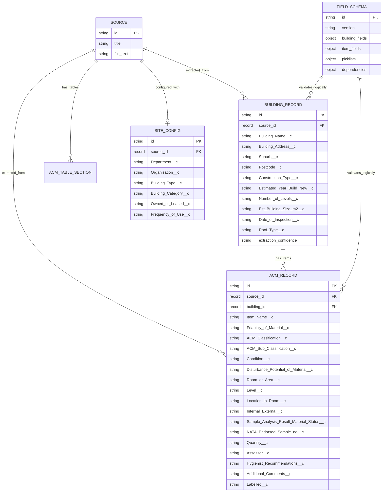

# E30 Salesforce Alignment - Multi-Agent Audit (Corrected)

Date: 2026-03-02  
Scope: SCP-20260301-SF impact audit against current repository state

## [Winston] Audit Findings
1. The core model is still BAR-centric and flat. `open_notebook/domain/acm.py` stores building-level and item-level fields together on `acm_record`; there is no `BuildingRecord` domain model or `building_record` table.
2. SurrealDB already has `field_schema` (migration 17) and `site_config` (migration 13), but both are configured for BAR behavior, not Salesforce object metadata and dependency chains.
3. `building_id` is a string on `acm_record` (migration 10), not a true FK relationship to a parent building table. E30 needs `acm_record.building_id -> record<building_record>`.
4. API building views are derived from grouped `acm_record` rows plus shared `site_config` (`/api/acm/jobs/{source_id}/buildings`), not from a dedicated persisted building entity.
5. The orchestrator remains single-output: `orchestrate_extraction()` returns ACM records only; it does not return a separate building payload.
6. Prompt strategy is not E30-compliant: `prompts/acm/building_extraction.jinja` still extracts ACM rows, and `prompts/acm/extraction.jinja` is BAR vocabulary oriented.
7. Dependent-picklist validation is missing. `acm_validator.py` validates field-level enums and BAR business rules but does not enforce `Friability -> ACM_Classification -> ACM_Sub_Classification` or building dependency chains.
8. `_unwrap_completion_state()` has already been removed from active code paths (good), but E30-S7 still requires provider simplification because extraction model provisioning still supports non-Anthropic fallbacks.
9. Export path is still single-object oriented (`/api/acm/export`, `/api/acm/export/excel`) rather than dedicated Salesforce `Building__c` + `Item__c` outputs.
10. Updated ER diagram description (target state for E30):

## [Mary] Audit Findings
1. FR-1401 gap: building data is not persisted in `building_record`; it is denormalized across ACM rows.
2. FR-1402 partial gap: ACM persistence exists, but with BAR field names/semantics rather than SF API names and constraints.
3. FR-1403 gap: no dependent validation chain exists for friability/classification/sub-classification.
4. FR-1404 gap: no runtime building dependency validation; requirement wording references `Building_Sub_Category` but current field summaries do not show a clear `Building_Sub_Category__c` field (requirement ambiguity).
5. FR-1405 conflict: current validators normalize values case-insensitively; FR requires exact case-sensitive SF picklist values. Also BAR `Good` conflicts with SF `Stable`.
6. FR-1406 gap: no dedicated `Building__c.csv` export currently exists.
7. FR-1407 gap: no dedicated Salesforce `Item__c.csv` export currently exists.
8. FR-1408 partial gap: schema config infrastructure exists (`field_schema` + `/api/acm/field-config`) but currently loads BAR schema files (`register_row.schema.json`, `register_enums.json`), not Salesforce object metadata from `building-list.txt`/`item-list.txt`.
9. FR-1409 partial gap: orchestrator path is Anthropic-preferred, but platform model provisioning remains multi-provider with OpenRouter/OpenAI/Ollama fallback.
10. FR-1410 gap: extraction is not split into two AI calls producing separate building and item objects.
11. FR-1411 gap: no runtime mechanism exists to subset `Item_Name__c` choices by selected product group.
12. FR-1412 partial gap: negative-condition business rule exists in BAR validator, but it is not yet enforced end-to-end with Salesforce fields/exports.
13. PRD governance gap: FR-1401..FR-1412 are present in SCP but not yet merged into canonical planning artifacts (`03-prd.md`, `04-architecture.md`, `05-epics-and-stories.md`).

## [John] Audit Findings
1. Story complexity gap by story (SCP estimate -> revised estimate):
| Story | SCP SP | Revised SP | Why |
|---|---:|---:|---|
| S1 Schema Config Loader | 3 | 5 | Parsing + dependency modeling + API/backward compatibility with existing field-config endpoints |
| S2 Building Record Model | 3 | 5 | New table + domain model + API refactor away from grouped `acm_record` |
| S3 ACM SF Schema Alignment | 2 | 4 | Additive migration + aliases + dual-schema coexistence during cutover |
| S4 Dependent Validator | 3 | 5 | Multi-chain validation, strict casing, warning/reject policy, integration touchpoints |
| S5 Building Prompt | 2 | 4 | Template rewrite plus pipeline support for separate building output object |
| S6 ACM Prompt | 3 | 4 | SF vocabulary, dynamic picklist injection, subset logic for `Item_Name__c` |
| S7 Anthropic Direct | 2 | 3 | Must reconcile with existing model catalog/defaulting/fallbacks |
| S8 Salesforce Export | 2 | 4 | Dual CSV + dual-sheet Excel + parent-child external-ID linkage |
| S9 AG Grid Two-View | 2 | 4 | New data contracts, view switching, cascading dependent picklists |
| S10 E2E Alignment | 3 | 5 | End-to-end compliance matrix (picklists, dependencies, exports, benchmarks) |
2. Revised total: 43 SP (vs SCP 28 SP).
3. Missing story: data migration/cutover from flat `acm_record` building fields to normalized `building_record` with rollback plan.
4. Missing story: BAR -> SF vocabulary migration for existing records and fixtures (especially `Condition` and taxonomy naming deltas).
5. Missing story: canonical artifact update package (PRD, architecture, epics, sprint-status, frontend typing contracts) should be explicit, not hidden in S10.
6. Sequencing risk: E30 depends on E29 completion, but sprint-status currently shows `epic-29: in-progress`; starting E30 implementation now creates rework risk on extraction internals.
7. Sequencing risk: S5/S6 are blocked by S2/S3/S4 outputs and should not run as prompt-only stories.
8. Sequencing risk: S8/S9 should be gated on finalized schema aliases and validator behavior to prevent contract churn.
9. Recommendation: split E30 into 13 delivery units (10 planned + 3 missing) and stage with a schema-freeze gate before UI/export work.

## [Bob] Audit Findings
1. `docs/sprint-artifacts/sprint-status.yaml` has no `epic-30` block; add `epic-30` and `e30-s1..e30-s10` statuses with dependency note "blocked by epic-29 completion."
2. Sprint-status consistency issue: E29 story statuses show S1/S2/S3/S4 done, but summary comments still say "S2 not implemented - Gate 1 FAIL." This should be corrected or archived as stale.
3. Sprint-status summary counts are stale/inconsistent with body content and should be recomputed after E29 reconciliation and E30 insertion.
4. `_bmad-output/project-planning-artifacts/acm-ai/05-epics-and-stories.md` includes Epic 29 but no Epic 30; add canonical E30 epic/story entries.
5. `_bmad-output/project-planning-artifacts/acm-ai/04-architecture.md` is still BAR-oriented and needs an E30 architectural delta or full refresh.
6. Replan needed: S5/S6 should be gated behind S2/S3/S4 completion.
7. Replan needed: S8/S9 should be gated behind schema/validator freeze.
8. Add replanned stories for migration/cutover and artifact reconciliation.
9. Archive/update decision needed for E29 recovery stories (`e29-r1`, `e29-r2`) before E30 start so dependency status is unambiguous.

## [Quinn] Audit Findings
1. Current E2E suite targets BAR extraction accuracy and generic exports; it does not assert Salesforce object-level correctness (`Building__c` + `Item__c`).
2. E30-S10 coverage gap: no automated assertion of strict case-sensitive SF picklist values across exported fields.
3. Coverage gap: no comprehensive dependent-picklist chain tests for friability/classification/sub-classification invalid combinations.
4. Coverage gap: no comprehensive building dependency tests for building type/category chain behavior.
5. Coverage gap: no tests validating `Building__c.csv` + `Item__c.csv` linkage strategy (external ID/parent-child matching).
6. Coverage gap: no tests verifying `Item_Name__c` choices are constrained by selected product group context.
7. Coverage gap: no explicit regression tests for dual-prompt/two-phase extraction behavior (separate building output + item output consistency).
8. Coverage gap: no migration tests proving old BAR-shaped records remain readable and correctly transformed during cutover.
9. Coverage gap: no provider-policy tests enforcing Anthropic-only extraction path under runtime defaults/fallback scenarios.
10. Coverage gap: no UI E2E tests for two-view grid behavior with dependent cascading dropdowns and invalid-value prevention.

## [Amelia] Audit Findings
1. File-by-file E30 impact matrix (requested scope):
| File | Current behavior | Required E30 change | Impact |
|---|---|---|---|
| `open_notebook/graphs/acm_extraction.py` | Saves only `ACMRecord`; legacy `acm/extraction` prompt path remains in code; orchestrator output is consumed as record list only. | Add persistence for `BuildingRecord` + child linkage, update save flow for two-object payloads, and retire/feature-flag BAR legacy path during cutover. | High |
| `open_notebook/extractors/orchestrator.py` | Per-building extraction uses `acm/building_extraction` but returns ACM record list only; no distinct Building object extraction call. | Implement two-phase extraction per building (Building__c fields then Item__c fields), carry schema-config-driven picklists/dependencies into both prompts, return `{building, items[]}` payload. | High |
| `open_notebook/extractors/acm_schemas.py` | `ACMExtractionRecord` uses BAR names/semantics and BAR normalizations. | Introduce SF-aligned schema fields/aliases, strict value handling for SF picklists, and transition compatibility from BAR names. | High |
| `api/model_provisioning.py` | Multi-provider model catalog/defaulting/fallback chain (`ollama`, `anthropic`, `openai`, `openrouter`). | Constrain extraction-critical provisioning to Anthropic direct policy for E30 while defining boundaries for non-extraction features. | Medium-High |
| `commands/source_commands.py` | Runs `source_graph` and Docling table extraction/storage; no building/item object-specific handling. | Ensure command output/events support E30 two-object extraction and new persistence requirements without breaking command lifecycle. | Medium |
| `prompts/acm/building_extraction.jinja` | Despite name, template instructs ACM row extraction and BAR vocabulary handling. | Rewrite to extract Building__c extractable fields only with SF naming and constrained values. | High |
| `prompts/acm/extraction.jinja` | BAR-focused ACM prompt with BAR field names/values. | Rewrite for Item__c extraction with SF field names and dynamic picklist/context injection, including item-name subsetting by classification. | High |
2. Cross-file coupling risk: prompt rewrites and schema changes must ship together or parse/validation will fail.
3. Cross-file coupling risk: orchestrator two-phase change and graph save change must ship together or building records will be dropped.
4. Cross-file coupling risk: Anthropic-only policy in `api/model_provisioning.py` must align with existing `graphs/utils.py` OpenRouter lock behavior to avoid conflicting runtime routing.
