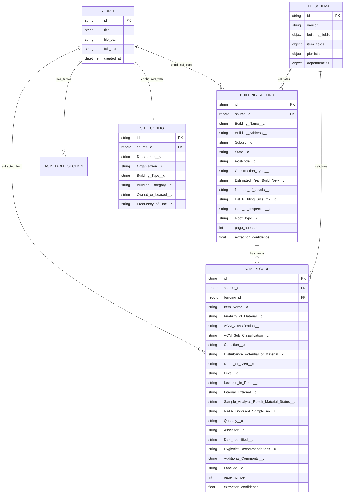

# E30 Salesforce Schema Alignment — Unified Multi-Agent Audit

**Date:** 2026-03-02
**Sprint Change Proposal:** SCP-20260301-SF
**Audit Scope:** Full system audit for E30 implementation impact
**Source Documents:** `e30-multi-agent-audit-codex.md` (Codex), `e30-multi-agent-audit-claude.md` (Claude)
**Agents:** Winston (Architect), Mary (BA), John (PM), Bob (SM), Quinn (QA), Amelia (Dev)

---

## Winston (Architect) — Unified Findings

### Data Model Impact — CRITICAL

1. **W1: Flat ACMRecord must split into two entities.** Current `open_notebook/domain/acm.py` has a single `ACMRecord(ObjectModel)` with `table_name = "acm_record"` containing ~50 fields that mix building-level data (building_name, building_address, suburb, postcode, building_type, building_year, building_construction) with ACM item-level data (product, material_description, friable, etc.). E30 requires splitting into `BuildingRecord` + `ACMRecord` with master-detail FK. There is no `BuildingRecord` domain model or `building_record` table.

2. **W2: No `building_record` table exists in SurrealDB.** Current migrations (37 total) define `acm_record` and `acm_table_section` tables but no `building_record`. E30-S2 requires a new migration creating `building_record` with 29+ extractable SF Building__c fields.

3. **W3: Field names use BAR vocabulary, not Salesforce API names.** ACMRecord uses `product` (not `Item_Name__c`), `friable` (not `Friability_of_Material__c`), `material_condition` (not `Condition__c`), `acm_product_group` (not `ACM_Classification__c`). E30-S3 requires Pydantic aliases for SF API names across 35+ fields.

4. **W4: `building_id` is a freeform string, not a FK.** Current ACMRecord.building_id is a string like "B009" or a building name. E30-S2 requires it to be a record reference (`record<building_record>`) for master-detail.

5. **W5: `field_schema` and `site_config` tables exist but are BAR-configured.** SurrealDB already has `field_schema` (migration 17) and `site_config` (migration 13), but both are configured for BAR behavior—not Salesforce object metadata and dependency chains. E30-S1 must evolve `field_schema` to hold SF picklist values, dependency chains, and versioning. `site_config` must be extended for SF officer-configured fields (Department__c, Organisation__c, Building_Type__c).

6. **W6: No dependent picklist validation.** `acm_validator.py` validates individual enum fields but has NO dependency chain validation. E30-S4 requires: Friability→ACM_Classification→ACM_Sub_Classification (18 classifications × 2 friability = 36 valid combinations) and BuildingType→Category→SubCategory (114 Building_Type → 13 Category values).

7. **W7: API building views are derived, not persisted.** Building views come from grouped `acm_record` rows plus shared `site_config` (`/api/acm/jobs/{source_id}/buildings`), not from a dedicated persisted building entity. E30 requires a first-class `BuildingRecord` with its own CRUD endpoints.

### AI Provider Impact — MEDIUM

8. **W8: System uses Esperanto multi-provider abstraction.** `api/model_provisioning.py` uses `provider/model_name` format with fallback chains (`ollama,anthropic,openai,openrouter`). E30-S7 replaces with direct `ChatAnthropic`. Affects `graphs/utils.py`, `graphs/acm_extraction.py`, `extractors/orchestrator.py`. `_apply_openrouter_preferences()` currently hard-locks to Anthropic via OpenRouter—this intermediary must be removed for direct API access.

9. **W9: `_unwrap_completion_state()` status.** This function has been removed from active code paths (confirmed in Codex audit), but E30-S7 still requires provider simplification because extraction model provisioning retains multi-provider fallback support. All graph nodes must be audited to confirm no residual references.

### Pipeline Impact — MEDIUM

10. **W10: Extraction is NOT per-building two-phase.** Current pipeline extracts ACM records in a single pass per building section. V3 requires TWO AI calls per building (Building__c fields first, then Item__c fields). The orchestrator (`orchestrate_extraction()`) returns ACM records only; it does not return a separate building payload.

11. **W11: Export path is single-object oriented.** Current endpoints (`/api/acm/export`, `/api/acm/export/excel`) produce BAR Excel format, not dedicated Salesforce `Building__c.csv` + `Item__c.csv` Data Loader outputs with external-ID parent-child linkage.

12. **W12: Prompt strategy is not E30-compliant.** `prompts/acm/building_extraction.jinja` (despite its name) still extracts ACM rows with BAR vocabulary. `prompts/acm/extraction.jinja` is BAR vocabulary oriented. Both need rewriting for SF field names and constrained picklist values.

### Target ER Diagram (E30 End State)



---

## Mary (Business Analyst) — Unified Findings

### PRD Gap Analysis — FR-1401 through FR-1412

1. **M1: FR-1401 (Building in building_record) — 100% GAP.** No building_record table, domain model, or API exists. Building data is denormalized across ACM rows. Requires: new `BuildingRecord` model, migration, CRUD API, persistence in extraction pipeline.

2. **M2: FR-1402 (ACM mapped to Item__c) — 40% GAP.** ACMRecord exists but with BAR field names/semantics rather than SF API names and constraints. Specifically missing SF fields: `Internal_External__c`, `Labelled__c` (currently bool, SF wants picklist "Yes"/"No"), `ASSEA_Survey_Guide_Risk_Level__c`, `Date_Identified__c`.

3. **M3: FR-1403 (Friability→Classification→SubClassification dependency chain) — 100% GAP.** Fields exist but use BAR names ("T3 Vinyl products" vs SF "Vinyl products"). No dependency enforcement exists. 18 ACM_Classification × 2 Friability = 36 valid combinations must be enforced.

4. **M4: FR-1404 (BuildingType→Category→SubCategory dependency chain) — 100% GAP.** BuildingType field doesn't exist in current schema. 114 Building_Type → 13 Building_Category values. **Requirement ambiguity**: SCP references `Building_Sub_Category` but current SF field summaries do not show a clear `Building_Sub_Category__c` field—needs clarification.

5. **M5: FR-1405 (Validate against exact SF picklist values) — CONFLICT.** Current validators normalize values case-insensitively; FR requires exact case-sensitive SF picklist values. SF Condition values: `Poor|Fair|Stable|Unknown|N/A (negative)|N/A (assumed negative)`. BAR uses `Good` which has NO SF equivalent—requires "Good"→"Stable" mapping everywhere.

6. **M6: FR-1406 (Export Building__c.csv) — 100% GAP.** No dedicated SF Data Loader Building export exists.

7. **M7: FR-1407 (Export Item__c.csv) — 100% GAP.** No dedicated SF Data Loader Item export exists. Current export is BAR-format Excel only.

8. **M8: FR-1408 (SF schema from JSON config) — PARTIAL.** Schema config infrastructure exists (`field_schema` table + `/api/acm/field-config` endpoint) but currently loads BAR schema files (`register_row.schema.json`, `register_enums.json`), not Salesforce object metadata. `building_list.txt` and `item_list.txt` exist in V3/ but aren't parsed yet.

9. **M9: FR-1409 (Anthropic Claude Sonnet only for extraction) — 100% GAP.** System uses Esperanto multi-provider with OpenRouter/OpenAI/Ollama fallback chain.

10. **M10: FR-1410 (Two-phase AI extraction) — 100% GAP.** Single-pass extraction currently. V3 requires separate Building__c extraction call then Item__c extraction call per building.

11. **M11: FR-1411 (Item_Name__c subsets by Product Group) — 100% GAP.** 294 Item_Name values are too many for a single prompt. No runtime mechanism exists to subset `Item_Name__c` choices by selected product group / ACM_Classification context.

12. **M12: FR-1412 (Negative result → Condition = N/A) — PARTIAL.** BAR-001 business rule exists in `acm_validator.py` but uses BAR vocabulary. Not yet enforced end-to-end with Salesforce field names and export paths.

13. **M13: CRITICAL CONFLICT — BAR "Good" → SF "Stable".** This vocabulary mismatch affects 8+ prompt templates, the validator, the domain model, all test fixtures, and export formatting. Must be addressed as a cross-cutting concern, not per-story.

14. **M14: PRD governance gap.** FR-1401..FR-1412 are present in SCP but not yet merged into canonical planning artifacts (`03-prd.md`, `04-architecture.md`, `05-epics-and-stories.md`). The FRs exist only in the SCP document, creating traceability risk.

---

## John (Product Manager) — Unified Findings

### E30 Story Gap Analysis & Revised Estimates

| # | Story | SCP SP | Revised SP | Justification |
|---|-------|-------:|----------:|----|
| J1 | S1 Schema Config Loader | 3 | 5 | Parse 143+154 field objects, build TWO dependency chain mappings, SurrealDB migration, startup loading, API/backward compatibility with existing field-config endpoints |
| J2 | S2 Building Record Model | 3 | 5 | New table + domain model + API refactor away from grouped `acm_record` + FK update + data migration |
| J3 | S3 ACM SF Schema Alignment | 2 | 4 | Backward-compat additive migration + 294-value picklist + Pydantic aliases for 35+ fields + dual-schema coexistence during cutover |
| J4 | S4 Dependent Validator | 3 | 5 | Multi-chain validation (36 Friability×Classification combos + building chains), strict casing, warning/reject policy, integration touchpoints |
| J5 | S5 Building Prompt | 2 | 4 | Template rewrite plus pipeline support for separate building output object |
| J6 | S6 ACM Prompt | 3 | 4 | SF vocabulary, dynamic picklist injection, subset logic for `Item_Name__c` |
| J7 | S7 Anthropic Direct | 2 | 3 | Must reconcile with existing model catalog/defaulting/fallbacks |
| J8 | S8 Salesforce Export | 2 | 4 | Dual CSV + dual-sheet Excel + parent-child external-ID linkage |
| J9 | S9 AG Grid Two-View | 2 | 4 | New data contracts, view switching, cascading dependent picklists — full frontend feature |
| J10 | S10 E2E Alignment | 3 | 5 | End-to-end compliance matrix (picklists, dependencies, exports, benchmarks) |

### Missing Stories

11. **J11: MISSING STORY — Data Migration Script (E30-S2.5, 3 SP).** No story covers migrating existing `acm_record` building fields to the new normalized `building_record` table. Needs rollback plan and backward-compatibility guarantees.

12. **J12: MISSING STORY — BAR→SF Value Migration (E30-S3.5, 2 SP).** Existing records need "Good"→"Stable" condition mapping, BAR group names→SF classification names, and other vocabulary transformations across the database and all test fixtures.

13. **J13: MISSING STORY — Canonical Artifact Update Package (E30-S10.5, 2 SP).** PRD, architecture doc, epics-and-stories, sprint-status, and frontend typing contracts all need updating. Should be explicit, not hidden inside S10.

14. **J14: MISSING STORY — Frontend Building Detail Page (E30-S9.5, 3 SP).** S9 covers AG Grid two-view but not the broader building list/detail pattern. Officers need a dedicated building detail page for viewing/editing Building__c fields.

### Sequencing & Risk

15. **J15: E29 dependency.** E30 depends on E29 completion. Sprint-status currently shows `epic-29: in-progress`. Starting E30 implementation now creates rework risk on extraction internals.

16. **J16: S5/S6 blocked by foundation stories.** S5 needs S1+S2 (schema config + building model). S6 needs S1+S3+S4 (schema config + SF alignment + validator). These should NOT run as prompt-only stories.

17. **J17: S7 sequencing risk.** If S7 (Anthropic Direct) lands before S5/S6 (prompt rewrites), extraction tests break. S7 should be last in sequence or feature-flagged.

18. **J18: S8/S9 gating.** S8 (export) and S9 (AG Grid) should be gated on finalized schema aliases and validator behavior to prevent contract churn.

19. **J19: S4 unclear validation mode.** Warn vs reject? How do warnings surface to officers in the UI? Acceptance criteria needed for validation policy decisions.

20. **J20: S5/S6 prompt regression risk.** Prompt rewrites risk benchmark regression. Need explicit AC: "Broadmeadows + Alexander benchmarks pass at current or better accuracy levels."

21. **J21: Revised totals.** 14 stories (10 planned + 4 missing), ~48 SP, 16-20 days (vs SCP's 10 stories, 28 SP, 10-12 days).

22. **J22: Recommendation.** Split E30 into 14 delivery units and stage with a **schema-freeze gate** before UI/export work (S8/S9) begins.

---

## Bob (Scrum Master) — Unified Findings

### Sprint Status & Tracking

1. **B1: sprint-status.yaml needs E30 block.** No `epic-30` exists. Add `epic-30` and `e30-s1..e30-s10+` statuses with dependency note "blocked by epic-29 completion." Must not conflict with existing epic numbering.

2. **B2: E29 must be DONE first.** SCP explicitly states dependency. Sprint-status currently shows E29 in-progress. E29 status must be verified and finalized before E30 work begins.

3. **B3: Sprint-status consistency issue.** E29 story statuses show S1/S2/S3/S4 done, but summary comments still say "S2 not implemented - Gate 1 FAIL." This stale data should be corrected or archived before E30 planning.

4. **B4: Sprint-status summary counts are stale.** Counts are inconsistent with body content and should be recomputed after E29 reconciliation and E30 insertion.

### Planning Artifacts

5. **B5: 05-epics-and-stories.md needs E30.** `_bmad-output/project-planning-artifacts/acm-ai/05-epics-and-stories.md` includes Epic 29 but no Epic 30. Add canonical E30 epic/story entries.

6. **B6: 04-architecture.md needs refresh.** Architecture doc is still BAR-oriented and needs an E30 architectural delta section or full refresh for SF alignment.

7. **B7: BMAD story files needed.** Each S1-S10+ needs a `docs/sprint-artifacts/` story file with detailed acceptance criteria, tech spec, and dev agent record.

8. **B8: Earlier epic impact.** E1-S11 (Generic Parser) built `config_loader.py`. E30-S1 directly evolves this component—dependency must be tracked.

### Sequencing & Risk

9. **B9: Dependency graph incomplete.** S5 needs S1+S2 (not just S2). S6 needs S1+S3+S4. Current SCP dependency graph understates prerequisites.

10. **B10: Parallel S2||S3 merge conflict risk.** Both S2 and S3 modify domain models and migrations. If run in parallel, merge conflicts are likely. Recommend sequential or careful coordination.

11. **B11: Add replanned stories.** Migration/cutover and artifact reconciliation stories must be added to sprint-status.yaml.

12. **B12: E29 recovery stories.** Archive/update decision needed for E29 recovery stories (`e29-r1`, `e29-r2`) before E30 start so dependency status is unambiguous.

---

## Quinn (QA) — Unified Findings

### Test Coverage Gaps

1. **Q1: E30-S10 E2E is happy-path only.** Missing test scenarios: error cases, invalid picklist values, dependency chain violations, multi-building PDFs, negative-only buildings.

2. **Q2: No unit tests for SalesforceSchemaConfig (S1).** Complex parsing with dependency chain mappings needs dedicated unit tests before integration.

3. **Q3: No BAR→SF value migration tests (S3.5).** "Good"→"Stable" conversion, BAR group names→SF classification names—all untested.

4. **Q4: Dependent picklist needs exhaustive combination testing.** 36 valid Friability×Classification combos + all invalid combos must be tested. Similarly, building type/category chain behavior needs comprehensive tests.

5. **Q5: Prompt regression not covered.** S5/S6 change extraction prompts. Benchmarks (Broadmeadows, Alexander) may regress. Need automated benchmark assertion in CI.

6. **Q6: Export validation needs SF schema check.** Must verify: correct CSV headers match SF API names, all picklist values are valid SF values, external ID fields present for parent-child linkage.

7. **Q7: AG Grid E2E not in S10 scope.** Playwright tests needed for two-view grid behavior, dependent cascading dropdowns, building drill-down, and invalid-value prevention.

8. **Q8: No SF object-level correctness assertions.** Current E2E suite targets BAR extraction accuracy and generic exports; it does not assert Salesforce object-level correctness (`Building__c` + `Item__c` as separate validated entities).

9. **Q9: No `Building__c.csv` + `Item__c.csv` linkage tests.** Must validate external ID presence, parent-child matching, and referential integrity across the two export files.

10. **Q10: No `Item_Name__c` subsetting tests.** Must verify that Item_Name choices are correctly constrained by selected product group / ACM_Classification context.

11. **Q11: No migration tests for old BAR-shaped records.** Must prove existing BAR-shaped records remain readable and are correctly transformed during cutover to SF schema.

12. **Q12: No provider-policy tests.** Must enforce Anthropic-only extraction path under runtime defaults and verify fallback scenarios are correctly blocked for extraction operations.

13. **Q13: Missing cascading delete test.** Building record deletion should cascade to child ACM records. No test exists for this referential integrity behavior.

14. **Q14: 33+ existing test files reference BAR fields.** ALL need fixture updates for SF vocabulary. BuildingRecord-specific test fixtures must be created. This is a cross-cutting concern spanning every test file.

---

## Amelia (Dev) — Unified Findings

### File-by-File Change Impact Matrix

| File | Impact | Current Behavior | Required E30 Changes |
|------|--------|-----------------|---------------------|
| `open_notebook/domain/acm.py` | **CRITICAL** | Single `ACMRecord(ObjectModel)` with ~50 fields mixing building+ACM data. `table_name = "acm_record"`. | Split into `BuildingRecord` + `ACMRecord`. SF Pydantic aliases for 35+ fields. FK update (`building_id` → `record<building_record>`). ~250 LOC new/changed. |
| `open_notebook/graphs/acm_extraction.py` | **HIGH** | Saves only `ACMRecord`; legacy `acm/extraction` prompt path remains; orchestrator output consumed as record list only. Uses Esperanto via `provision_langchain_model()`. `_apply_openrouter_preferences()` hard-locks to Anthropic via OpenRouter. | Add building extraction node. Persist `BuildingRecord` + child linkage. Update save flow for two-object payloads. Replace Esperanto→`ChatAnthropic`. Retire/feature-flag BAR legacy path. |
| `open_notebook/extractors/orchestrator.py` | **HIGH** | Per-building extraction uses `acm/building_extraction` but returns ACM record list only; no distinct Building object extraction call. | Implement two-phase extraction per building (Building__c fields then Item__c fields). Carry schema-config-driven picklists/dependencies into both prompts. Return `{building, items[]}` payload. |
| `open_notebook/extractors/acm_schemas.py` | **HIGH** | `ACMExtractionRecord` uses BAR names/semantics and BAR normalizations. Hardcoded `RESULT_VALUES`, `FRIABLE_VALUES`, `RISK_STATUS_VALUES`, `MATERIAL_CONDITION_VALUES`. | Introduce SF-aligned schema fields/aliases. Strict value handling for SF picklists. Split into `BuildingExtractionRecord` + `ACMItemExtractionRecord`. Transition compatibility from BAR names. |
| `open_notebook/extractors/validators/acm_validator.py` | **HIGH** | BAR enum validation (sample_result, material_condition, friable, disturbance_potential). Business rules BAR-001, BAR-004. Loads from `register_enums.json`. | Replace BAR enums with SF enums. Add dependent picklist chain validation (Friability→Classification→SubClassification). Strict case-sensitive matching. |
| `open_notebook/extractors/parsers/config_loader.py` | **HIGH** | Loads BAR field schema from `register_row.schema.json` + `register_enums.json`. `DISPLAY_NAME_TO_INTERNAL` mapping (36 entries). `FieldSchemaConfig` class. | Replace/augment to load SF schemas from parsed `building_list.txt`/`item_list.txt`. Build dependency chain mappings. Remap `DISPLAY_NAME_TO_INTERNAL` for SF field names. |
| `prompts/acm/extraction.jinja` | **HIGH** | BAR-focused ACM prompt with BAR field names/values. Hardcoded controlled vocabulary for sample_result, material_condition ("Good"), friable, disturbance_potential. | Rewrite for Item__c extraction with SF field names. Dynamic picklist injection from config. Item_Name subsetting by ACM_Classification. ~420 LOC rework. |
| `prompts/acm/building_extraction.jinja` | **HIGH** | Despite name, template instructs ACM row extraction with BAR vocabulary. Extensive worked examples. | Rewrite to extract Building__c fields only with SF naming and constrained values. OR split into true building prompt + item prompt. ~600 LOC rework. |
| `api/routers/acm.py` | **MEDIUM** | Full ACM REST API: CRUD, export, search, field schema, taxonomy, building management (2,083 lines). | Add `BuildingRecord` CRUD endpoints. Building-filtered ACM queries. Two-file SF export endpoints. SF field names in API responses. |
| `api/model_provisioning.py` | **MEDIUM** | Multi-provider model catalog with `provider/model_name` format. Fallback chain: `ollama,anthropic,openai,openrouter`. | Constrain extraction-critical provisioning to Anthropic direct. Remove fallback chain for extraction operations. Define boundaries for non-extraction features. |
| `commands/source_commands.py` | **MEDIUM** | Runs `source_graph` and Docling table extraction/storage. No building/item object-specific handling. | Ensure command output/events support two-object extraction and new persistence requirements. Add BuildingRecord creation in extraction flow. |
| `migrations/38.surrealql` (NEW) | **MEDIUM** | Does not exist. | Create: `building_record` table with SF Building__c fields. Update `field_schema` for SF picklists/dependencies. Update `site_config` for SF fields. FK constraints on `acm_record.building_id`. |
| `prompts/acm/classification.jinja` | **LOW** | BAR product group/type vocabulary. | Update to SF ACM_Classification/ACM_Sub_Classification vocabulary. |
| `prompts/acm/correction.jinja` | **LOW** | BAR field names and picklist values in correction prompt. | Update to SF field names + SF picklist values. |
| Tests (33+ files) | **HIGH** | All fixtures use BAR vocabulary and flat ACMRecord shape. | All BAR fixtures→SF vocabulary. Add BuildingRecord fixtures. Update assertion field names. ~33+ files affected. |
| Frontend (multiple files) | **HIGH** | Single-view ACM grid. No dependent picklist dropdowns. No building detail page. | Two-view grid (buildings + items). Dependent picklist cascading dropdowns. Building detail page. New data contracts for BuildingRecord. |

### Cross-File Coupling Risks

1. **Prompt ↔ Schema coupling.** Prompt rewrites (S5/S6) and schema changes (S3) must ship together or LLM parse/validation will fail on mismatched field names.
2. **Orchestrator ↔ Graph coupling.** Orchestrator two-phase change (S5/S6) and graph save change (S2) must ship together or building records will be silently dropped.
3. **Provider ↔ Router coupling.** Anthropic-only policy in `api/model_provisioning.py` (S7) must align with existing `graphs/utils.py` OpenRouter lock behavior (`_apply_openrouter_preferences()`) to avoid conflicting runtime routing.
4. **Validator ↔ Config coupling.** Dependent picklist validator (S4) requires schema config loader (S1) to provide dependency chain definitions at runtime.

### Key Technical Risks

- **Type change: `acm_labelled`** — currently `bool` in domain model, SF wants `picklist("Yes"/"No")`. Requires type migration.
- **Required field optionality: `school_name`/`school_code`** — required in current ACMRecord but absent from SF model. Must be made optional or removed.
- **New enum value: `result` field** — maps to SF `Sample_Analysis_Result_Material_Status__c` which adds "Negative - Treated as Positive" (not in current BAR enum).
- **Embedding preservation** — embedding fields (`content_embedding`, `contextual_embedding`) have no SF mapping but are critical for semantic search. Must be preserved during schema migration.
- **`_unwrap_completion_state()` audit** — confirm removal from all graph nodes; any residual references will cause runtime errors after Esperanto removal.

---

## Cross-Agent Consensus

| Area | Gap % | Risk | Stories Affected |
|------|------:|------|-----------------|
| Data Model (flat→split) | 100% | HIGH | S2, S2.5 |
| Dependent Picklists | 100% | HIGH | S1, S4 |
| AI Provider (Esperanto→Anthropic) | 100% | MEDIUM | S7 |
| Extraction Prompts (BAR→SF) | 90% | HIGH | S5, S6 |
| Validation (enum→dependency chain) | 80% | HIGH | S4 |
| Export (BAR Excel→SF CSV) | 100% | HIGH | S8 |
| Frontend (single→two-view grid) | 100% | HIGH | S9, S9.5 |
| Tests (33+ files) | 100% | HIGH | All stories |
| PRD/Architecture Artifacts | 100% | MEDIUM | S10.5 |
| **SP Estimate** | — | **UNDERESTIMATED** | **SCP: 28 SP → Revised: ~48 SP** |
| **Timeline** | — | **UNDERESTIMATED** | **SCP: 10-12 days → Revised: 16-20 days** |
| **Story Count** | — | **UNDERESTIMATED** | **SCP: 10 → Revised: 14** |

### Recommended Delivery Sequence

```
Phase 1 — Foundation (S1 → S2 → S3 → S2.5 → S3.5)
  S1: Schema Config Loader (5 SP)
  S2: Building Record Model (5 SP) — blocked by S1
  S3: ACM SF Schema Alignment (4 SP) — blocked by S1, sequential with S2 (merge conflict risk)
  S2.5: Data Migration Script (3 SP) — blocked by S2
  S3.5: BAR→SF Value Migration (2 SP) — blocked by S3

  ── SCHEMA FREEZE GATE ──

Phase 2 — Extraction (S4 → S5 → S6)
  S4: Dependent Validator (5 SP) — blocked by S1
  S5: Building Prompt (4 SP) — blocked by S1, S2
  S6: ACM Prompt (4 SP) — blocked by S1, S3, S4

Phase 3 — Provider & Export (S7 → S8)
  S7: Anthropic Direct (3 SP) — should land AFTER S5/S6
  S8: Salesforce Export (4 SP) — blocked by schema freeze

Phase 4 — Frontend & Verification (S9 → S9.5 → S10 → S10.5)
  S9: AG Grid Two-View (4 SP) — blocked by schema freeze
  S9.5: Frontend Building Detail Page (3 SP) — blocked by S2, S9
  S10: E2E Alignment (5 SP) — blocked by all above
  S10.5: Canonical Artifact Update (2 SP) — parallel with S10
```

**Total: 14 stories, ~48 SP, 16-20 days**

---

## Appendix: Differences Between Source Audit Documents

### Legend
- **Codex** = `e30-multi-agent-audit-codex.md`
- **Claude** = `e30-multi-agent-audit-claude.md`

### Winston (Architect)

| # | Difference | Codex Position | Claude Position | Resolution |
|---|-----------|----------------|-----------------|------------|
| 1 | `field_schema` / `site_config` existence | Already exist (migration 17, migration 13) but BAR-configured | Do NOT exist — "No equivalent in current codebase" | **Codex correct.** Migrations 13 and 17 create these tables. They exist but need evolution, not creation from scratch. |
| 2 | `_unwrap_completion_state()` status | Already removed from active code paths | Still exists in pipeline stages, needs removal | **Codex correct.** Function was removed. But full audit of residual references still needed. |
| 3 | API building views | Explicitly notes views are derived from grouped `acm_record` rows | Not mentioned as separate finding | **Both valid.** Codex provides additional context about current API behavior. |
| 4 | Export path as single-object | Explicit finding about export being single-object oriented | Not a separate finding (covered implicitly in Mary's FR-1406/1407) | **Codex more explicit.** Merged as W11. |
| 5 | ER diagram format | Mermaid `erDiagram` syntax with SF API field names (`Building_Name__c`) | Text-based ER with internal field names (`building_name`) | **Codex preferred.** SF API names are the target; mermaid is renderable. |
| 6 | ER diagram content | Includes `ACM_TABLE_SECTION` relationship | Includes `acm_table_section`, adds `file_path`, `created_at`, `state`, `date_identified` | **Claude more complete.** Merged both. |

### Mary (Business Analyst)

| # | Difference | Codex Position | Claude Position | Resolution |
|---|-----------|----------------|-----------------|------------|
| 1 | FR-1402 missing fields | Lists gap generically | Lists SPECIFIC missing fields: `Internal_External__c`, `Labelled__c`, `ASSEA_Survey_Guide_Risk_Level__c`, `Date_Identified__c` | **Claude more detailed.** Merged. |
| 2 | FR-1403 combo counts | Not specified | 18 × 2 = 36 valid combinations | **Claude adds data.** Merged. |
| 3 | FR-1404 Building_Sub_Category ambiguity | Flags requirement ambiguity explicitly | States 114→13 mapping but doesn't flag ambiguity | **Both valid.** Both merged—data + ambiguity flag. |
| 4 | FR-1405 exact SF values | Lists both case-sensitivity and Good/Stable | Lists exact SF Condition enum values | **Complementary.** Both merged. |
| 5 | FR-1411 value count | Not mentioned | Notes 294 values too many for single prompt | **Claude adds context.** Merged. |
| 6 | Good→Stable as separate finding | Covered within FR-1405 | Separate finding M12 | **Claude more explicit.** Elevated to M13. |
| 7 | PRD governance gap | Finding #13: FRs not in canonical artifacts | Not mentioned | **Codex unique.** Added as M14. |

### John (Product Manager)

| # | Difference | Codex Position | Claude Position | Resolution |
|---|-----------|----------------|-----------------|------------|
| 1 | SP totals | 43 SP, 13 delivery units | ~40 SP, 12 stories | **Divergent estimates.** Unified to 48 SP / 14 stories (adding both audits' missing stories). |
| 2 | Missing: Artifact update story | Explicitly lists canonical artifact update package | Not mentioned | **Codex unique.** Added as J13/S10.5. |
| 3 | Missing: Frontend Building Detail | Not mentioned | Explicitly calls out list/detail pattern needed | **Claude unique.** Added as J14/S9.5. |
| 4 | S4 validation mode ambiguity | Not mentioned | Flags warn vs reject policy gap | **Claude unique.** Added as J19. |
| 5 | Prompt regression AC | Not mentioned | Needs explicit benchmark AC for S5/S6 | **Claude unique.** Added as J20. |
| 6 | S9 underestimate | Not separately called out | Explicitly flags 2→4 SP | **Claude adds detail.** Merged. |
| 7 | Schema-freeze gate | Recommends schema-freeze gate between foundation and UI/export | Not explicitly recommended | **Codex adds structure.** Adopted in delivery sequence. |

### Bob (Scrum Master)

| # | Difference | Codex Position | Claude Position | Resolution |
|---|-----------|----------------|-----------------|------------|
| 1 | Sprint-status consistency | E29 statuses vs summary comments inconsistency (stale data) | Not mentioned | **Codex unique.** Added as B3, B4. |
| 2 | Architecture doc refresh | 04-architecture.md needs E30 delta | Not mentioned | **Codex unique.** Added as B6. |
| 3 | E29 recovery story archival | Archive/update e29-r1, e29-r2 before E30 | Not mentioned | **Codex unique.** Added as B12. |
| 4 | E1-S11 impact | Not mentioned | config_loader.py built by E1-S11 | **Claude unique.** Added as B8. |
| 5 | BMAD story files | Not mentioned | Each story needs docs/sprint-artifacts/ file | **Claude unique.** Added as B7. |
| 6 | S2||S3 merge conflict | Not mentioned | Parallel S2/S3 risks merge conflicts | **Claude unique.** Added as B10. |

### Quinn (QA)

| # | Difference | Codex Position | Claude Position | Resolution |
|---|-----------|----------------|-----------------|------------|
| 1 | E2E happy-path only | Not framed this way | Explicit with specific missing scenarios | **Claude more actionable.** Merged. |
| 2 | SalesforceSchemaConfig unit tests | Not mentioned | Q2: Complex parsing needs dedicated tests | **Claude unique.** Added. |
| 3 | Cascading delete test | Not mentioned | Q8: Building delete → cascade ACMs | **Claude unique.** Added. |
| 4 | 33+ test file count | Referenced in migration tests context | Explicit finding Q9 with fixture update scope | **Claude more explicit.** Added. |
| 5 | Provider-policy tests | Codex #9: Explicit finding | Not a separate finding | **Codex unique.** Added as Q12. |
| 6 | BAR record readability tests | Codex #8: Old records readable during cutover | Not separately called out | **Codex unique.** Added as Q11. |

### Amelia (Dev)

| # | Difference | Codex Position | Claude Position | Resolution |
|---|-----------|----------------|-----------------|------------|
| 1 | File scope | 7 files (as requested in prompt) | 15+ files (broader audit) | **Claude more comprehensive.** Merged all files. |
| 2 | Impact matrix format | 3-column: Current / Required / Impact | 2-column: Impact / Changes Required | **Both valid.** Unified to 4-column format. |
| 3 | Technical risks | 4 cross-file coupling risks | 5 key technical risks (different category) | **Complementary.** Both sections included. |
| 4 | `domain/acm.py` | Not in scope (wasn't in requested file list) | Explicitly audited as CRITICAL | **Claude adds critical file.** Included. |
| 5 | `acm_validator.py`, `config_loader.py` | Not in scope | Explicitly audited as HIGH | **Claude adds files.** Included. |
| 6 | `api/routers/acm.py` | Not in scope | Explicitly audited as MEDIUM | **Claude adds file.** Included. |
| 7 | labelled bool→picklist risk | Not mentioned | Explicit technical risk | **Claude unique.** Added. |
| 8 | school_name/school_code optionality | Not mentioned | Explicit technical risk | **Claude unique.** Added. |
| 9 | Embedding preservation | Not mentioned | Explicit risk — no SF mapping but critical | **Claude unique.** Added. |
