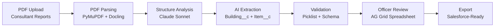
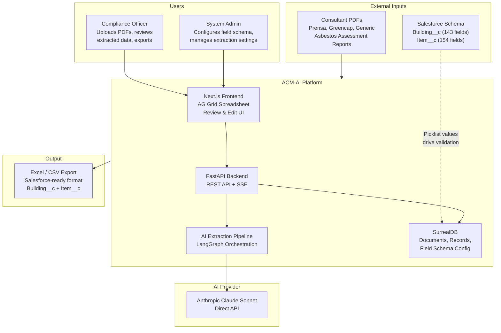
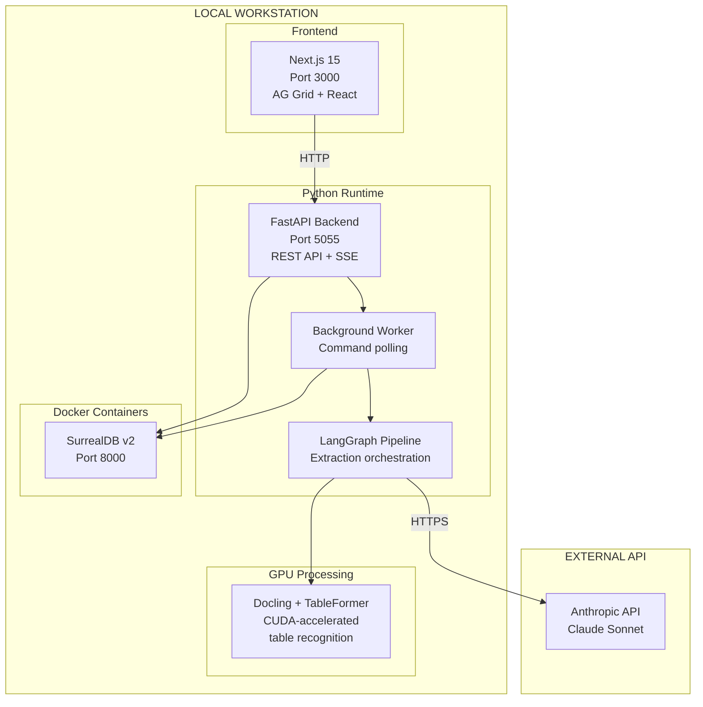
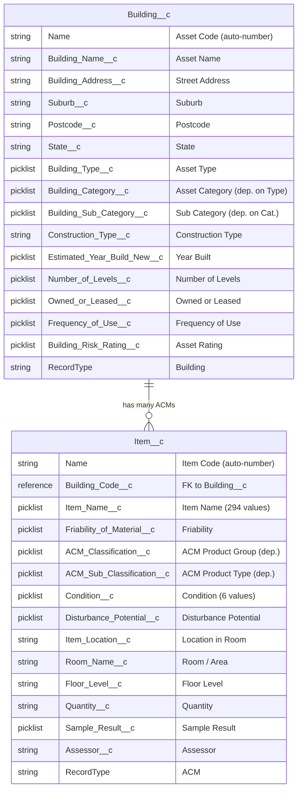
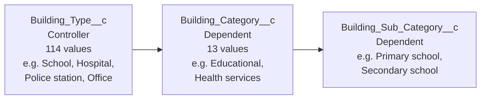
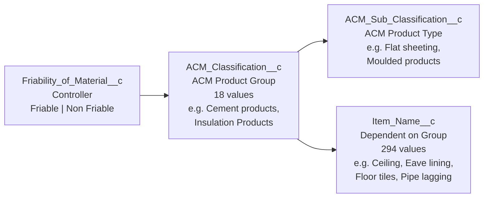
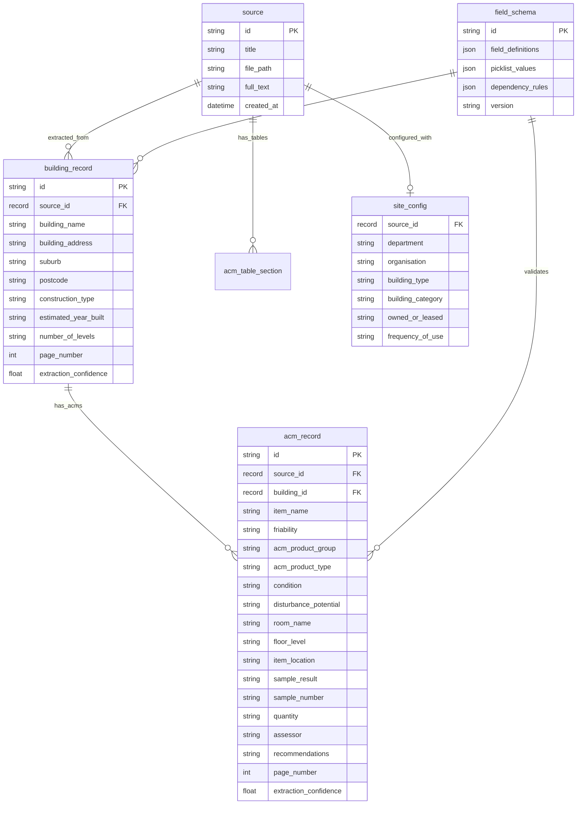
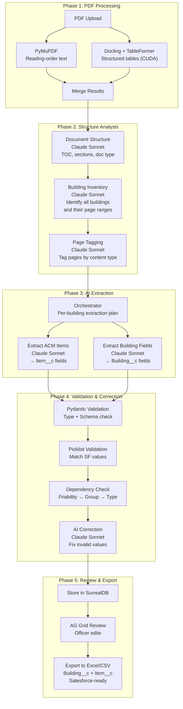

# ACM-AI Solution Architecture v3.0 — VAEA

**Source:** `V3/acm-ai-solution-architecture-v3.html`
**Generated:** March 2026
**Client:** Victorian Asbestos Eradication Agency (VAEA)

---

## Relevance Assessment

**Status: CURRENT — Primary reference document for V3 planning**

This is the client-facing architecture specification for V3. It supersedes all prior architecture documents and should be treated as the source of truth for:
- Salesforce object model (`Building__c` + `Item__c` field mappings)
- Dependent picklist chains (AI must respect these)
- 5-phase pipeline design
- Export format requirements

**V3 planning steps that MUST reference this document:**
- `/bmad:mmm:create-architecture` — Use as the target architecture spec
- `/bmad:mmm:create-epics-and-stories` — Derive stories from the 5 phases
- `/bmad:mmm:dev-story` — Field mapping tables are the ground truth for extraction prompts
- Party Mode — Distribute this doc to Architect + Dev agents as mandatory reading

**Key sections for downstream agents:**
1. Salesforce Object Model (§6) — field names and types
2. Dependent Picklist Chains (§9) — validation constraints
3. Internal Data Schema (§10) — SurrealDB ER diagram
4. Pipeline Phases (§11) — implementation blueprint
5. Design Principles (§12) — architectural guardrails

---

## 01 / Problem Statement

VAEA manages thousands of PDF asbestos assessment reports from multiple consulting firms (Prensa, Greencap, and others). Officers must manually enter every Building and ACM item into Salesforce's `Building__c` and `Item__c` objects — field by field, picklist by picklist. A single PDF can contain multiple buildings and dozens of ACM items. At scale, this is unsustainable.

**Core problems:**
- **Manual Data Entry at Scale** — 29+ building fields and 35+ ACM item fields per record
- **Variable PDF Formats** — Different table layouts per consulting firm; no single template
- **Complex Object Model** — `Building__c` has 143 fields with dependent picklists; `Item__c` has 154 fields
- **One Building → Many ACMs** — A single PDF can contain multiple buildings, each with many ACMs

---

## 02 / Solution Overview

ACM-AI uses a multi-stage AI extraction pipeline powered by Anthropic Claude Sonnet to read PDF tables, identify buildings and ACM items, extract field values, validate against Salesforce picklist values, and output structured data matching `Building__c` and `Item__c` schemas — ready for officer review and export.

**Platform stats:**
- 5 pipeline stages
- 2 Salesforce objects
- 1 AI provider (Anthropic Claude Sonnet)
- 2 PDF engines (PyMuPDF + Docling)

### End-to-End Flow



---

## 03 / System Context

### System Context Diagram



> **No Direct Salesforce Integration:** ACM-AI outputs a Salesforce-ready export (Excel/CSV) matching exact field names and picklist values. The Salesforce schema is loaded into the system to configure prompts, validation, and export — not for live API calls.

---

## 04 / Infrastructure & Deployment

**Current deployment: Local workstation**



---

## 05 / Tech Stack

| Layer | Technology | Purpose |
|-------|-----------|---------|
| Frontend | Next.js 15, React, AG Grid Enterprise | Spreadsheet UI for review and editing |
| Frontend | CopilotKit + AG-UI Protocol | AI chat interface with SSE streaming |
| Backend | FastAPI (Python) | REST API, SSE streaming, command queue |
| Backend | LangGraph | Multi-stage extraction pipeline orchestration |
| AI | Anthropic Claude Sonnet (Direct API) | Document structure analysis, field extraction, classification |
| PDF | PyMuPDF | Reading-order text extraction from PDFs |
| PDF | Docling + TableFormer (CUDA) | Structured table recognition and extraction |
| Database | SurrealDB v2 (Docker) | Document storage, record storage, field schema config, vector search |
| Validation | Pydantic v2 | Schema validation, picklist enforcement, type coercion |

---

## 06 / Salesforce Object Model

`Building__c` is the parent. `Item__c` is the child (Master-Detail via `Building_Code__c`).



**Key Relationship:** `Item__c.Building_Code__c` is Master-Detail to `Building__c`. Every ACM item must belong to exactly one Building. When a Building is deleted, all its Items cascade-delete.

**Record Types in scope:**
- `Building__c` RecordType: **Building** (default). Out of scope: Structure, Vehicle, Master
- `Item__c` RecordType: **ACM** (default). Out of scope: PCB, Lead Containing Paint, Crystalline Silica, etc.

---

## 07 / Building__c Field Mapping

**143 total fields. 29 extractable by AI.**

| Salesforce Field | Label | Type | Source | Notes |
|-----------------|-------|------|--------|-------|
| `Building_Name__c` | Asset Name | string | **AI Extract** | From PDF headings/tables |
| `Building_Address__c` | Asset Address | string | **AI Extract** | Street address from cover page or tables |
| `Suburb__c` | Suburb | string | **AI Extract** | From address text |
| `Postcode__c` | Postcode | string | **AI Extract** | From address text |
| `State__c` | State | picklist | **AI Extract** | Defaults to "Victoria" |
| `Construction_Type__c` | Construction Type | string(100) | **AI Extract** | Free text, e.g. "Fibre cement and timber" |
| `Estimated_Year_Build_New__c` | Estimated Year Built | picklist (330 values) | **AI Extract** | Years 1700–2029 |
| `Number_of_Levels__c` | Number of Levels | picklist (1–99) | **AI Extract** | From building description |
| `Estimated_Size_of_Building__c` | Estimated Size (m²) | string | **AI Extract** | If mentioned in report |
| `Date_of_Inspection__c` | Date of Inspection | date | **AI Extract** | From report date/cover page |
| `Roof_Type__c` | Roof Type | picklist | **AI Extract** | If mentioned in report |
| `Building_Type__c` | Asset Type | picklist (114 values) | Manual / Config | Controller for Asset Category. Set by officer. |
| `Building_Category__c` | Asset Category | picklist (13 values) | Manual / Config | Dependent on `Building_Type__c` |
| `Building_Sub_Category__c` | Sub Category | picklist | Manual / Config | Dependent on `Building_Category__c` |
| `Owned_or_Leased__c` | Owned or Leased | picklist (2) | Manual / Config | Owned \| Leased |
| `Frequency_of_Use__c` | Frequency of Use | picklist | Manual / Config | Administrative field |
| `Department__c` | Department | reference | Manual / Config | Lookup to Dept object |
| `Organisation__c` | Organisation | reference | Manual / Config | Lookup to Org object |
| `Building_Unique_ID__c` | Asset Unique ID | string | Manual / Config | Agency's own ID if applicable |
| `Building_Risk_Rating__c` | Asset Rating | picklist (5) | **Computed** | Very Low → Very High. Derived from child ACMs. |
| `Number_of_ACMs__c` | Number of ACMs | double | **Computed** | Roll-up count from `Item__c` |
| `No_Identified_ACMs__c` | No Identified ACMs | boolean | **Computed** | True if zero positive ACMs |

**Source Legend:**
- **AI Extract** = Can be extracted from PDF by AI
- **Manual / Config** = Must be set by officer or via site configuration
- **Computed** = System-calculated or roll-up field in Salesforce

---

## 08 / Item__c (ACM) Field Mapping

**154 total fields. 35 extractable by AI.**

| Salesforce Field | Label | Type | Source | Notes |
|-----------------|-------|------|--------|-------|
| `Building_Code__c` | Asset Code | reference | **AI Linked** | Master-Detail to `Building__c`. Linked by building name match. |
| `Item_Name__c` | Item Name | picklist (294 values) | **AI Extract** | e.g. "Ceiling", "Eave lining", "Floor tiles" |
| `Friability_of_Material__c` | Friability | picklist | **AI Extract** | "Friable" \| "Non Friable". Controller for ACM Product Group. |
| `ACM_Classification__c` | ACM Product Group | picklist (18) | **AI Extract** | e.g. "Cement products", "Insulation Products" |
| `ACM_Sub_Classification__c` | ACM Product Type | picklist | **AI Extract** | Dependent on ACM Product Group |
| `Condition__c` | Condition | picklist (6) | **AI Extract** | Poor \| Fair \| Stable \| Unknown \| N/A (negative) \| N/A (assumed negative) |
| `Disturbance_Potential__c` | Disturbance Potential | picklist | **AI Extract** | Disturbance assessment from report |
| `Room_Name__c` | Room / Area | string | **AI Extract** | Room or area where ACM is found |
| `Floor_Level__c` | Floor Level | string | **AI Extract** | e.g. "Ground", "Level 1", "Roof" |
| `Item_Location__c` | Location in Room | string | **AI Extract** | Specific location within room |
| `Internal_External__c` | Internal / External | picklist | **AI Extract** | "Internal" \| "External" |
| `Sample_Result__c` | Sample Result | picklist | **AI Extract** | Positive \| Negative \| Assumed Positive \| etc. |
| `NATA_Sample_Number__c` | Sample Number | string | **AI Extract** | NATA lab sample reference |
| `Quantity__c` | Quantity | string | **AI Extract** | e.g. "10 m²", "5 linear meters" |
| `Assessor__c` | Assessor | string | **AI Extract** | Person or company that identified the ACM |
| `Date_Identified__c` | Date Identified | date | **AI Extract** | Date of assessment |
| `ASSEA_Survey_Guide_Risk_Level__c` | ASSEA Risk Level | picklist (3) | **AI Extract** | High \| Medium \| Low |
| `Hygienist_Recommendations__c` | Recommendations | textarea | **AI Extract** | Consultant recommendation text |
| `Additional_Comments__c` | Additional Comments | textarea | **AI Extract** | Any extra notes from report |
| `Labelled__c` | Labelled | picklist | **AI Extract** | Yes \| No — whether ACM is labelled on-site |
| `ACM_Risk_Score__c` | ACM Risk Score | string | **Computed** | Calculated from condition + disturbance |
| `ACM_Sub_Classification_Rating__c` | Friability Scale | double | **Computed** | Numeric score from Product Type + Friability |
| `VAEA_Friability_Scale__c` | VAEA Friability Scale | formula | **Computed** | "VAEA Friable" if scale > 5, else "VAEA Non Friable" |

---

## 09 / Dependent Picklist Chains

**Critical: AI must respect these dependency constraints.**

### Building__c Dependency Chain



### Item__c (ACM) Dependency Chains



**Why this matters:** The AI cannot extract values in isolation. If `Friability = "Non Friable"`, then `ACM Product Group` must be one of the non-friable groups. If `ACM Product Group = "Insulation Products"`, then `Item Name` must be a value valid for insulation. The validation layer enforces these chains.

---

## 10 / Internal Data Schema (SurrealDB)



**Schema Configuration:** The `field_schema` table stores Salesforce picklist values and dependency rules extracted from `building_list.txt` and `item_list.txt`. This drives validation, AG Grid column definitions, and export formatting — ensuring AI outputs conform to Salesforce constraints without a live Salesforce connection.

---

## 11 / AI Extraction Pipeline (5 Phases)

### Full Pipeline Flow



### Phase 1: PDF Processing

**PyMuPDF — Text Extraction:** Extracts reading-order text from every page. Provides raw text context for building identification, metadata extraction, and document structure understanding.

**Docling + TableFormer — Table Extraction:** GPU-accelerated (CUDA) table detection and recognition. Identifies table boundaries, cell contents, and column headers. Critical because ACM data lives in tables — AI needs structured table data to extract individual ACM records accurately.

### Phase 2: Structure Analysis

Three Claude Sonnet calls analyse the document before extraction begins:

1. **Document Structure** — Identifies document type (Division 5, Risk Assessment, Audit), sections, table of contents. Determines how many buildings are in the document.
2. **Building Inventory** — Lists every building with page ranges. Each building gets a processing plan. Critical for PDFs with multiple buildings.
3. **Page Tagging** — Tags each page by content type (cover, TOC, building info, ACM table, appendix).

### Phase 3: AI Extraction

For each building identified in Phase 2, the orchestrator sends relevant pages and table data to Claude Sonnet with two extraction tasks:

1. **Extract Building Fields → `Building__c`**: Building Name, Address, Suburb, Postcode, Construction Type, Year Built, Number of Levels, Date of Inspection, Roof Type, Estimated Size
2. **Extract ACM Items → `Item__c`**: Item Name, Friability, ACM Product Group/Type, Condition, Disturbance Potential, Room/Area, Floor Level, Location, Sample Result/Number, Quantity, Assessor, Recommendations

**Prompt Strategy:**
```
System: "Extract Building + ACM data.
Valid Item Names: [294 values]
Valid Friability: Friable | Non Friable
Valid Conditions: Poor|Fair|Stable|Unknown|N/A..."
User: [table data + context text]
→ JSON: {building: {...}, acm_records: [{...}, ...]}
```

### Phase 4: Validation & Correction

1. **Pydantic Schema Validation** — Type checking, required fields, format coercion (dates, numbers)
2. **Picklist Value Validation** — Every picklist value checked against exact Salesforce values
3. **Dependency Chain Validation** — Verifies dependent picklist values are valid for their controller
4. **AI Correction Loop** — Invalid fields sent to Claude Sonnet with specific error + valid options. Max 3 correction attempts per record before flagging for manual review.

**Business Rule: Negative Result Clears Fields**
When `Sample_Result__c = "Negative"`, system automatically sets `Condition__c = "N/A (negative)"` and `Disturbance_Potential__c = "N/A"`.

### Phase 5: Review & Export

- **AG Grid Spreadsheet** — Interactive spreadsheet for officers to edit, filter, sort, and correct AI errors. Column definitions and picklist dropdowns driven by field schema config.
- **Salesforce-Ready Export** — Excel/CSV with exact Salesforce API field names as column headers. Separate sheets for `Building__c` and `Item__c`. Ready for Salesforce Data Loader.
- **Site Configuration Merge** — Officer-configured fields (Department, Organisation, Building Type, Asset Category, Owned/Leased) merged into export.

---

## 12 / Design Principles

1. **Salesforce Schema Drives Everything** — Picklist values, dependent fields, and field types are the source of truth. Drives AI prompts, validation, grid columns, and export formats.
2. **Hybrid PDF Extraction** — PyMuPDF for text + Docling for tables. Non-blocking; one engine failing doesn't stop the other.
3. **AI Extracts, Rules Validate** — Claude Sonnet handles fuzzy work (interpretation, normalisation). Pydantic + picklist rules handle precise work (validation, dependency enforcement). Never trust AI output without schema validation.
4. **Per-Building Extraction** — Every building extracted independently. Ensures correct Building → ACM grouping for PDFs with 1 or 20 buildings.
5. **Graceful Degradation** — Every AI call has a fallback. Structured output fails? JSON parser. LLM misses a record? Regex recovery. Validation fails? AI correction loop. System always produces output.
6. **Design for the Officer** — End users are compliance officers, not developers. Workflow: upload PDF → review in spreadsheet → export. All complexity is hidden.

---

*ACM-AI Solution Architecture v3.0 — Victorian Asbestos Eradication Agency*
*Generated March 2026 · Building__c (143 fields, 29 extractable) + Item__c (154 fields, 35 extractable)*
