## 14. V3 Architecture — Salesforce Alignment & Multi-Provider Extraction

> **Added:** 2026-03-02 (V3 Scope Expansion)
> **Source:** [PRD v3.0](../../_bmad-output/project-planning-artifacts/acm-ai/03-prd.md) §2.12-2.16, §5.1.5-5.1.7, §5.4.1, §11 | [Party Mode Plan](./v3-party-mode-plan.md) | [Multi-Agent Audit](./e30-multi-agent-audit-unified.md) | [Tech Research](./tech-research-extraction-providers.md)
> **Epics:** E30 (Foundation & SF Schema), E31 (Multi-Provider Extraction), E32 (AI Processing & Validation), E33 (Frontend & UX), E34 (Integration & Polish)
> **Audit Findings Addressed:** W1-W12 (see §14.11 traceability matrix)

This section defines the V3 architecture additions that build on Sections 1-13 (V1/V2 architecture). Sections 1-13 remain authoritative for their scope; Section 14 **supersedes** specific sub-sections where noted.

### 14.0 V3 Architecture Overview

**Key changes from V1/V2:**
- Flat `acm_record` table split into `building_record` (SF Building__c) + `acm_record` (SF Item__c) with master-detail FK
- Single-provider extraction (Docling) → dual-provider (Docling + MinerU 2.x hybrid) with consensus layer
- BAR vocabulary → Salesforce API field names and constrained picklist values
- Single-phase AI extraction → two-phase per-building (Building__c fields, then Item__c fields)
- BAR Excel export → dual-CSV/Excel SF Data Loader format (Building__c.csv + Item__c.csv)
- Esperanto multi-provider → direct ChatAnthropic for extraction (OpenRouter fallback preserved)

**Supersedes:** Section 3.1 (database schema), Section 3.2 (relationships), Section 4.2 (TypeScript response types), Section 5.1 (pipeline stages), Section 7/6.1 (AG Grid columns)

---

### 14.1 Data Model — Building__c + Item__c Split

> **Addresses:** W1 (flat record split), W3 (SF field naming), W4 (building_id FK), W5 (SF API names in Mermaid), W7 (building as first-class entity), Amelia's `labelled` bool→picklist risk

#### 14.1.1 Entity-Relationship Diagram

```mermaid
erDiagram
    source ||--o{ building_record : "has buildings"
    source ||--o{ acm_record : "has items"
    source ||--o{ raw_extraction_table : "has raw extractions"
    source ||--o{ acm_table_section : "has table sections"
    source ||--o| site_config : "has config"
    building_record ||--o{ acm_record : "master-detail (Item__c.Building_Code__c)"
    raw_extraction_table }o--|| acm_table_section : "consensus merge"
    acm_record }o--o| raw_extraction_table : "provenance link"
    acm_record }o--o| acm_table_section : "parent table"
    field_schema ||--o{ building_record : "validates"
    field_schema ||--o{ acm_record : "validates"

    source {
        string id PK
        string name
        string file_path
    }

    building_record {
        string id PK
        record_source source_id FK "record(source)"
        string internal_id "BLD_001 (auto-assigned)"
        string Building_Name__c "SF Asset Name"
        string Building_Address__c "SF Asset Address"
        string Suburb__c "SF Suburb"
        string Postcode__c "SF Postcode"
        string State__c "SF State default Victoria"
        string Construction_Type__c "SF Construction Type"
        string Building_Type__c "SF Asset Type picklist 114 values"
        string Building_Category__c "SF Asset Category dependent on Type"
        string Estimated_Year_Build_New__c "SF Year Built picklist 330 values"
        string Number_of_Levels__c "SF Levels picklist"
        string Est_Building_Size_m2__c "SF Size m2"
        string Date_of_Inspection__c "SF Inspection Date"
        string Roof_Type__c "SF Roof Type"
        string Frequency_of_Use__c "SF Frequency picklist"
        string Owned_or_Leased__c "SF Owned or Leased"
        string External_ID__c "SF External ID upsert key"
        string department "From site_config"
        string organisation "From site_config"
        int page_number
        float extraction_confidence
        string extraction_provider
        string extraction_model
        datetime created_at
        datetime updated_at
    }

    acm_record {
        string id PK
        record_source source_id FK "record(source)"
        record_building building_id FK "record(building_record)"
        record_raw raw_row_id FK "record(raw_extraction_table)"
        string Item_Name__c "SF Item Name picklist 294 values"
        string Friability_of_Material__c "SF Friability picklist"
        string ACM_Classification__c "SF Product Group picklist 18 values"
        string ACM_Sub_Classification__c "SF Product Type dependent picklist"
        string Condition__c "SF Condition picklist 6 values"
        string Disturbance_Potential__c "SF Disturbance Potential picklist"
        string Room_or_Area__c "SF Room Name"
        string Level__c "SF Floor Level"
        string Location_in_Room__c "SF Location"
        string Internal_External__c "SF Int or Ext picklist"
        string Sample_Analysis_Result__c "SF Sample Result picklist"
        string NATA_Endorsed_Sample_no__c "SF Sample Number"
        string Quantity__c "SF Quantity"
        string Assessor__c "SF Assessor"
        string Labelled__c "SF Labelled picklist Yes or No"
        string ASSEA_Risk_Level__c "SF Risk Level picklist"
        string External_ID__c "SF External ID upsert key"
        string extraction_provider
        string extraction_model
        object consensus_metadata "tier scores votes"
        array edit_history "user field old new timestamp"
        int page_number
        float extraction_confidence
        record_table parent_table_id FK
        object table_bbox "x y width height page"
        array embedding "Vector embedding preserved"
        string enriched_text "Contextual embedding preserved"
        datetime created_at
        datetime updated_at
    }

    raw_extraction_table {
        string id PK
        record_source source_id FK "record(source)"
        string provider_id "docling or mineru or google_docai"
        string extraction_backend "pipeline or vlm or hybrid or null"
        int page_number
        string raw_html "HTML table output"
        string raw_markdown "Markdown output VLM"
        object structured_json "Parsed structure"
        object bbox "x y width height"
        float confidence
        array officer_edits "field old new user ts"
        datetime created_at
    }

    acm_table_section {
        string id PK
        record_source source_id FK
        int page_start
        int page_end
        string raw_html
        string raw_text
        string building_name
        string table_type
        object provider_results "docling and mineru results"
        string consensus_tier "HIGH MEDIUM LOW CONTESTED"
        object consensus_scores "Per-field agreement data"
        datetime created
    }

    site_config {
        string id PK
        record_source source_id FK
        string Department__c "Officer-configured"
        string Organisation__c "Officer-configured"
        string Building_Type__c "Default building type"
        string Building_Category__c "Default category"
        string Owned_or_Leased__c "Default ownership"
        string Frequency_of_Use__c "Default frequency"
        datetime created_at
        datetime updated_at
    }

    field_schema {
        string id PK
        string config_json "Serialized SF schema config"
        string version "salesforce-v1"
        object building_fields "Building__c field definitions"
        object item_fields "Item__c field definitions"
        object picklists "SF picklist values"
        object dependencies "Dependency chain mappings"
        datetime created
        datetime updated
    }
```



#### 14.1.2 Pydantic Model Architecture

**Strategy:** SF API field names exposed via Pydantic `Field(alias=...)`. Internal DB column names use snake_case; API responses use SF API names. Dual-schema coexistence: BAR fields preserved as `Optional` during transition.

```python
# open_notebook/domain/building_record.py (NEW — E30-S2)
class BuildingRecord(ObjectModel):
    """SF Building__c mapped domain model. Master record for ACM items."""
    source_id: str
    internal_id: str                                          # BLD#001 (auto-assigned)
    building_name: Optional[str] = Field(None, alias="Building_Name__c")
    building_address: Optional[str] = Field(None, alias="Building_Address__c")
    suburb: Optional[str] = Field(None, alias="Suburb__c")
    postcode: Optional[str] = Field(None, alias="Postcode__c")
    state: Optional[str] = Field("Victoria", alias="State__c")
    construction_type: Optional[str] = Field(None, alias="Construction_Type__c")
    building_type: Optional[str] = Field(None, alias="Building_Type__c")
    building_category: Optional[str] = Field(None, alias="Building_Category__c")
    estimated_year_built: Optional[str] = Field(None, alias="Estimated_Year_Build_New__c")
    number_of_levels: Optional[str] = Field(None, alias="Number_of_Levels__c")
    est_building_size: Optional[str] = Field(None, alias="Est_Building_Size_m2__c")
    date_of_inspection: Optional[str] = Field(None, alias="Date_of_Inspection__c")
    roof_type: Optional[str] = Field(None, alias="Roof_Type__c")
    frequency_of_use: Optional[str] = Field(None, alias="Frequency_of_Use__c")
    owned_or_leased: Optional[str] = Field(None, alias="Owned_or_Leased__c")
    external_id: Optional[str] = Field(None, alias="External_ID__c")
    department: Optional[str] = None    # From site_config
    organisation: Optional[str] = None  # From site_config
    page_number: Optional[int] = None
    extraction_confidence: Optional[float] = None
    extraction_provider: Optional[str] = None
    extraction_model: Optional[str] = None

# open_notebook/domain/acm.py (EVOLVED — E30-S3)
class ACMRecord(ObjectModel):
    """SF Item__c mapped domain model. Child of BuildingRecord."""
    source_id: str
    building_id: Optional[str] = None           # record<building_record> FK (W4)
    raw_row_id: Optional[str] = None            # record<raw_extraction_table> FK
    # SF Item__c fields (Pydantic aliases — W3)
    item_name: Optional[str] = Field(None, alias="Item_Name__c")
    friability: Optional[str] = Field(None, alias="Friability_of_Material__c")
    acm_classification: Optional[str] = Field(None, alias="ACM_Classification__c")
    acm_sub_classification: Optional[str] = Field(None, alias="ACM_Sub_Classification__c")
    condition: Optional[str] = Field(None, alias="Condition__c")
    disturbance_potential: Optional[str] = Field(None, alias="Disturbance_Potential_of_Material__c")
    labelled: Optional[str] = Field(None, alias="Labelled__c")  # Changed: bool -> picklist
    # ... (remaining SF fields as defined in PRD 5.1.7)
    # Provenance
    extraction_provider: Optional[str] = None
    extraction_model: Optional[str] = None
    consensus_metadata: Optional[dict] = None   # {tier, scores, votes}
    edit_history: Optional[list] = None          # [{user, field, old, new, timestamp}]
    # Preserved fields (embedding, enriched_text, page_number, table_bbox, parent_table_id)
```

#### 14.1.3 Migration Strategy for Type Changes

| Field | Old Type | New Type | Migration |
|-------|----------|----------|-----------|
| `building_id` | `string` (freeform "B009") | `record<building_record>` FK | Create `building_record` from grouped data, update FK |
| `labelled` / `acm_labelled` | `bool` | `picklist("Yes"/"No")` | `True`->"Yes", `False`->"No", `null`->`null` |
| `school_name` | `string` (required) | `option<string>` | Make optional (no SF mapping) |
| `school_code` | `string` | `option<string>` | Make optional (no SF mapping) |
| `result` | SF adds `"Negative - Treated as Positive"` | Extend enum | Add new value, no data migration |

**Embedding preservation:** `embedding`, `embedding_text`, `embedding_model`, `embedded_at`, `enriched_text`, `content_embedding`, `contextual_embedding` fields have no SF mapping but are critical for semantic search. These fields are preserved in `acm_record` with no changes.

---

### 14.2 Extraction Pipeline — Dual-Provider Architecture

> **Addresses:** FR-1501-FR-1506, E31, Party Mode Topic 1
> **Supersedes:** Section 5.1 (7-stage pipeline diagram) for V3 extraction path
> **Extends:** Section 5.5 (E29 unified pipeline contract), Section 5.6 (capability registry)

#### 14.2.1 V3 Pipeline Flow

```
Phase 1: PDF Processing (E31)
+------------------------------------------------------------------+
|  PDF Upload                                                       |
|  +-- PyMuPDF -> source.full_text (unchanged)                     |
|  +-- DoclingAdapter -> NormalizedExtractionResult (structure HTML) |
|  |     (~4 GB VRAM, ~22s for 20 pages)                           |
|  +-- MinerUAdapter (hybrid) -> NormalizedExtractionResult         |
|        (~10 GB VRAM, ~15-20s for 20 pages)                       |
|        (VLM image-based markdown + pipeline HTML, auto-routes)   |
|                                                                   |
|  <-- Sequential GPU execution (no concurrent VRAM allocation) --> |
|                                                                   |
|  -> raw_extraction_table (per-provider, per-page, with bbox)     |
|  -> Consensus Layer (3-stage matching, per-field voting)         |
|  -> acm_table_section (consensus-merged, provider_results JSONB) |
+------------------------------------------------------------------+

Phase 2: Structure Analysis (existing + enhanced)
+------------------------------------------------------------------+
|  extract_metadata -> extract_structure -> compile_inventory       |
|  -> tag_pages                                                    |
|  -> Building Inventory + Page Tags                               |
+------------------------------------------------------------------+

Phase 3: AI Extraction -- per building (E32)
+------------------------------------------------------------------+
|  Orchestrator (per building):                                    |
|  Step A: Extract Building__c fields (Claude Sonnet)              |
|    -> BuildingExtractionResult (Pydantic structured output)      |
|    -> building_record in SurrealDB                               |
|  Step B: Extract Item__c fields (Claude Sonnet)                  |
|    -> ACMItemExtractionResult[] (Pydantic structured output)     |
|    -> acm_record[] linked to building_record via FK              |
|                                                                   |
|  Fallback: Anthropic direct -> OpenRouter -> skip building       |
+------------------------------------------------------------------+

Phase 4: Validation & Correction (E32)
+------------------------------------------------------------------+
|  Pydantic schema validation (SF field types)                     |
|  -> SF picklist validation (exact case-sensitive values)         |
|  -> Dependency chain validation:                                 |
|      Friability -> ACM_Classification -> ACM_Sub_Classification  |
|      Building_Type -> Building_Category                          |
|  -> AI correction loop (Claude Sonnet, max 3 retries,           |
|    single-record context)                                        |
|  -> Dedup + No-Access recovery                                  |
|  -> Negative->N/A business rule enforcement                     |
+------------------------------------------------------------------+

Phase 5: Review & Export (E33, E34)
+------------------------------------------------------------------+
|  -> building_record + acm_record in SurrealDB                   |
|  -> AG Grid (building list sidebar + item grid per building)    |
|  -> Provenance viewer (PDF.js + bbox overlay)                   |
|  -> Export: Building__c.csv + Item__c.csv (SF Data Loader)      |
+------------------------------------------------------------------+
```

#### 14.2.2 Provider Adapter Interface

```python
# open_notebook/extractors/providers/base.py (NEW — E31-S2)
from typing import Protocol, runtime_checkable

@runtime_checkable
class ExtractionProvider(Protocol):
    """Abstract interface for table extraction providers."""

    @property
    def provider_id(self) -> str:
        """Unique provider identifier: 'docling', 'mineru', 'google_docai'"""
        ...

    async def extract(
        self,
        pdf_path: str,
        page_range: tuple[int, int],
        config: ProviderConfig,
    ) -> NormalizedExtractionResult:
        """Extract tables from PDF pages. Returns normalized result."""
        ...

    def supports_cross_page_stitching(self) -> bool:
        """Whether provider can merge tables spanning pages."""
        ...

class NormalizedExtractionResult(BaseModel):
    """Provider-agnostic extraction result."""
    provider_id: str
    extraction_backend: Optional[str] = None  # pipeline, vlm, hybrid
    tables: list[NormalizedTable]
    metadata: dict = {}
    elapsed_ms: int = 0

class NormalizedTable(BaseModel):
    """Single table extracted by a provider."""
    page_number: int
    page_end: Optional[int] = None          # For cross-page tables
    raw_html: Optional[str] = None          # Structure-based providers
    raw_markdown: Optional[str] = None      # VLM-based providers
    structured_json: Optional[dict] = None  # Parsed rows/columns
    bbox: Optional[dict] = None             # {x, y, width, height}
    confidence: float = 0.0
    rows: list[NormalizedRecord] = []       # Parsed records

class NormalizedRecord(BaseModel):
    """Single record row extracted from a table."""
    fields: dict[str, str]                  # field_name -> extracted_value
    page_number: int
    row_index: int
    confidence: float = 0.0
    source_table_id: Optional[str] = None
```

#### 14.2.3 Provider Implementations

| Provider | Adapter | Output Type | Cross-Page | VRAM |
|----------|---------|-------------|:----------:|------|
| Docling | `DoclingAdapter` | Structure-based HTML tables | No | ~4 GB |
| MinerU 2.x (hybrid) | `MinerUAdapter` | VLM image-based markdown + pipeline HTML | Yes | ~10 GB |
| Google Doc AI | `GoogleDocAIAdapter` (future) | Cloud API JSON | Yes | N/A |

**MinerU hybrid backend:** Auto-routes simple pages to pipeline (fast, structure-based) and complex pages to VLM (1.2B param vision model, image-based). This maximizes consensus diversity: Docling sees document structure, MinerU VLM sees page images.

**Sequential GPU execution:** Docling runs first (releases VRAM), then MinerU hybrid. Total: ~37-42s for 20-page document. No concurrent GPU allocation prevents CUDA memory fragmentation on RTX 4090 (24 GB).

#### 14.2.4 Consensus Layer

```
Provider Registry
  +-- DoclingAdapter  -> NormalizedExtractionResult  (structure-based)
  +-- MinerUAdapter   -> NormalizedExtractionResult  (hybrid: VLM + pipeline)
  +-- (Future: GoogleDocAIAdapter)
           |
    Result Normalizer
    Provider-specific -> NormalizedRecord[]
    (Handles: HTML tables, VLM structured markdown, mixed hybrid output)
           |
    Record Matcher (3 stages -- V1 scope)
    Stage 1: Key-field anchor (page, building, room, product) -- ~75% hit
    Stage 2: Fuzzy string (rapidfuzz Jaro-Winkler >=0.85)    -- ~20% hit
    Stage 3: Row position fallback (same-table index)         -- ~5% hit
           |
    Consensus Engine
    Per-field confidence-weighted voting
    Provider weight: Bayesian posterior Beta(correct+2, total+3)
    Initial weights: all 1.0
           |
    Conflict Resolver (4 levels)
    L1: Weighted majority vote (default)
    L2: Provider priority hierarchy (domain-specific)
    L3: LLM arbitration (high-stakes fields only: result, friable, condition)
    L4: Human escalation queue (unresolved -> "CONTESTED" badge in AG Grid)
           |
    ConsensusResult
    + consensus_tier: HIGH | MEDIUM | LOW | CONTESTED
    + per_field_scores: {field: {value, confidence, providers[]}}
    + conflicts: [{field, values[], resolution, method}]
```

**Match Thresholds:**

| Composite Score | Classification | Action |
|:--------------:|:--------------:|--------|
| >= 0.85 | Confirmed match | Merge records, vote per-field |
| 0.65 - 0.84 | Probable match | Merge with MEDIUM flag |
| < 0.65 | Distinct records | Both preserved independently |

**Confidence Tier Assignment:**

| Tier | Condition | UI Badge | Action |
|------|-----------|----------|--------|
| HIGH | All providers agree on all fields | Green | Auto-accept |
| MEDIUM | 2/3 agree OR >0.8 confidence | Yellow | Accept with flag |
| LOW | Only 1 provider found the record | Orange | Accept with warning |
| CONTESTED | Disagree on high-stakes field | Red | Trigger conflict resolution |

**Provider Priority Hierarchy (for L2 conflict resolution):**

| Field Type | Priority Order | Rationale |
|------------|---------------|-----------|
| Enum fields (friable, result, condition) | Docling > MinerU > LLM | Structure-based more reliable for enums |
| Free text (recommendations, comments) | LLM > Docling > MinerU | LLM best for natural language |
| Numeric (quantity, sample_number) | MinerU > Docling > LLM | Vision-based more reliable for numbers |

#### 14.2.5 Integration with E29 Orchestrator

The consensus layer slots between raw extraction and the existing E29 orchestrator:

```python
# Extends strategy_registry.py (E29-S4)
class FallbackId(str, Enum):
    # ... existing F1-F8 ...
    F9_PROVIDER_CONFLICT = "F9_PROVIDER_CONFLICT"
    F10_CONSENSUS_ARBITRATION = "F10_CONSENSUS_ARBITRATION"
```

**Feature flags (environment variables):**

| Flag | Default | Purpose |
|------|---------|---------|
| `EXTRACTION_PROVIDERS` | `docling` | Comma-separated: `docling`, `mineru`, `google_docai` |
| `CONSENSUS_ENABLED` | `false` | Enable consensus layer (requires 2+ providers) |
| `CONSENSUS_THRESHOLD` | `0.85` | Match threshold for confirmed matches |
| `MINERU_BACKEND` | `hybrid` | MinerU backend: `pipeline`, `vlm`, `hybrid` |

---

### 14.3 AI Processing + Batching

> **Addresses:** FR-1409, FR-1410, FR-1411, FR-1804, E32, Party Mode Topic 3, W8, W10

#### 14.3.1 Two-Phase Extraction

Each building is processed with two sequential AI calls:

**Phase A — Building__c Extraction:**
```python
# Prompt: prompts/acm/building_extraction.jinja (REWRITE — E30-S7)
# Input: consensus-merged table sections for this building's page range
# Output: BuildingExtractionResult (Pydantic structured output via tool_use)
class BuildingExtractionResult(BaseModel):
    Building_Name__c: str
    Building_Address__c: Optional[str] = None
    Suburb__c: Optional[str] = None
    Postcode__c: Optional[str] = None
    Construction_Type__c: Optional[str] = None
    Estimated_Year_Build_New__c: Optional[str] = None  # Constrained to SF picklist
    Number_of_Levels__c: Optional[str] = None
    Est_Building_Size_m2__c: Optional[str] = None
    Date_of_Inspection__c: Optional[str] = None
    Roof_Type__c: Optional[str] = None
```

**Phase B — Item__c Extraction (per building):**
```python
# Prompt: prompts/acm/extraction.jinja (REWRITE — E30-S7)
# Input: consensus-merged table sections + building context
# Output: list[ACMItemExtractionResult] (Pydantic structured output via tool_use)
class ACMItemExtractionResult(BaseModel):
    Item_Name__c: str                        # Constrained to <=50 relevant values
    Friability_of_Material__c: str           # "Friable" | "Non Friable"
    ACM_Classification__c: str               # 18 values, dependent on Friability
    ACM_Sub_Classification__c: Optional[str] # Dependent on Classification
    Condition__c: str                        # 6 SF values (NOT "Good" — use "Stable")
    Disturbance_Potential_of_Material__c: Optional[str]
    Room_or_Area__c: Optional[str] = None
    Level__c: Optional[str] = None
    Location_in_Room__c: Optional[str] = None
    Internal_External__c: Optional[str] = None
    Sample_Analysis_Result_Material_Status__c: Optional[str] = None
    NATA_Endorsed_Sample_no__c: Optional[str] = None
    Quantity__c: Optional[str] = None
    Labelled__c: Optional[str] = None        # "Yes" | "No" (NOT bool)
    Hygienist_Recommendations__c: Optional[str] = None
    Additional_Comments__c: Optional[str] = None
```

**Item_Name__c Subsetting (FR-1411):** The 294-value `Item_Name__c` picklist is too large for a monolithic prompt. The AI prompt receives a subset of <=50 relevant values based on the `ACM_Classification__c` context identified in Phase A.

#### 14.3.2 AI Provider Routing

**Capability Registry Extension (extends E29-S4):**

| Task Type | Default Provider | Fallback | Admin Override |
|-----------|-----------------|----------|:--------------:|
| `EXTRACTION` | Anthropic Claude Sonnet (direct API) | OpenRouter (same or alt model) | YES |
| `CLASSIFICATION` | Regex patterns (80% hit rate) | Ollama local -> Claude Sonnet | YES |
| `ENRICHMENT` | Ollama local (llama3.1:8b) | Claude Haiku via OpenRouter | YES |
| `EMBEDDING` | Ollama local (nomic-embed-text) | None (local only) | NO |
| `CHAT` | Esperanto/OpenRouter (user-selected) | N/A | YES |
| `SEARCH` | Esperanto/OpenRouter | N/A | YES |

```python
# api/model_provisioning.py (EVOLVE — E30-S8)
class ModelCapability(str, Enum):
    EXTRACTION = "extraction"
    CLASSIFICATION = "classification"
    ENRICHMENT = "enrichment"
    EMBEDDING = "embedding"
    CHAT = "chat"
    SEARCH = "search"

class ModelPolicy(BaseModel):
    capability: ModelCapability
    default_provider: str           # "anthropic", "ollama", "openrouter"
    default_model: str              # e.g., "claude-sonnet-4-20250514"
    fallback_provider: Optional[str] = None
    fallback_model: Optional[str] = None
    admin_override: bool = True
```

**Anthropic Direct API Integration (W8):**

```python
# Direct ChatAnthropic for extraction (replaces Esperanto for this path)
from langchain_anthropic import ChatAnthropic

def provision_extraction_model() -> ChatAnthropic:
    """Direct Anthropic API for extraction. OpenRouter fallback."""
    policy = get_model_policy(ModelCapability.EXTRACTION)
    if policy.default_provider == "anthropic":
        return ChatAnthropic(
            model=policy.default_model,
            anthropic_api_key=os.getenv("ANTHROPIC_API_KEY"),
            max_tokens=8192,
        )
    # OpenRouter fallback
    return _provision_openrouter_model(policy.fallback_model)
```

#### 14.3.3 Structured Output Contracts

All extraction uses Pydantic model schemas via Claude `tool_use` for reliable JSON output:

```python
# Both Anthropic direct and OpenRouter support tool_use format
response = model.invoke(
    messages,
    tools=[{
        "name": "extract_building",
        "description": "Extract Building__c fields from document",
        "input_schema": BuildingExtractionResult.model_json_schema()
    }]
)
```

**Compatibility:** Pydantic model serialization is compatible with both Anthropic direct API and OpenRouter request/response formats. The `tool_use` contract ensures structured JSON output regardless of provider.

#### 14.3.4 Batching Strategy

| Dimension | Strategy | Rationale |
|-----------|----------|-----------|
| Granularity | Per-building | Existing orchestrator pattern; each building independent |
| Calls per building | 2 (Building__c + Item__c) | Two-phase extraction (W10) |
| Token budget | ~15 items/call max | Typical building: 3-8K tokens. Split large buildings |
| Concurrency | `asyncio.Semaphore(3)` | Existing orchestrator pattern. 3 concurrent buildings |
| Failure isolation | Per-building | Skip failed building, preserve partial results |

**Cost projection:** ~$1,000-1,650 for 2,000 production documents (< 1% of manual cost $200K-400K).

---

### 14.4 Dependent Picklist Validation

> **Addresses:** FR-1403, FR-1404, FR-1405, E30-S4, W6

#### 14.4.1 Dependency Chains

**ACM Chain (Item__c):**
```
Friability_of_Material__c (controlling)
  +-- ACM_Classification__c (18 values, dependent)
        +-- ACM_Sub_Classification__c (~100 values, dependent)
```

Valid combinations: 18 ACM_Classification values x 2 Friability values = 36 valid combos.

**Non-Friable Classifications (8 groups):**
Cement products, Bitumen products, Vinyl products, Gasket/friction products, Coatings, Reinforced plastics/resins, Other, Insulation

**Friable Classifications (6 groups + "(f)" suffix):**
Cement products (f), Vinyl products (f), Insulation products (f), Gasket products (f), Textiles (f), Other (f)

**Building Chain (Building__c):**
```
Building_Type__c (114 values, controlling)
  +-- Building_Category__c (13 values, dependent)
```

No `Building_Sub_Category__c` — confirmed absent from SF schema (Q1 resolved).

#### 14.4.2 SalesforcePicklistValidator

```python
# open_notebook/extractors/validators/sf_picklist_validator.py (NEW — E30-S4)
class SalesforcePicklistValidator:
    """Validates SF picklist values and dependency chains."""

    def __init__(self, field_schema: FieldSchemaConfig):
        self.picklists = field_schema.picklists
        self.dependencies = field_schema.dependencies

    def validate_field(self, field_name: str, value: str) -> ValidationResult:
        """Validate a single field value against SF picklist (case-sensitive)."""
        valid_values = self.picklists.get(field_name, [])
        if value not in valid_values:
            return ValidationResult(
                valid=False,
                field=field_name,
                value=value,
                error=f"Invalid picklist value: '{value}'. Valid: {valid_values[:5]}...",
                severity="ERROR"
            )
        return ValidationResult(valid=True, field=field_name, value=value)

    def validate_dependency_chain(
        self,
        controller_field: str,
        controller_value: str,
        dependent_field: str,
        dependent_value: str
    ) -> ValidationResult:
        """Validate that dependent value is valid for the given controller value."""
        chain = self.dependencies.get(controller_field, {})
        valid_dependents = chain.get(controller_value, [])
        if dependent_value not in valid_dependents:
            return ValidationResult(
                valid=False,
                field=dependent_field,
                value=dependent_value,
                error=f"'{dependent_value}' not valid when {controller_field}='{controller_value}'",
                severity="ERROR"
            )
        return ValidationResult(valid=True, field=dependent_field, value=dependent_value)

    def validate_record(self, record: ACMRecord) -> list[ValidationResult]:
        """Full record validation against SF schema."""
        results = []
        # Individual picklist validation
        for field in self.picklists:
            value = getattr(record, field, None)
            if value is not None:
                results.append(self.validate_field(field, value))
        # ACM chain: Friability -> Classification -> SubClassification
        if record.friability and record.acm_classification:
            results.append(self.validate_dependency_chain(
                "Friability_of_Material__c", record.friability,
                "ACM_Classification__c", record.acm_classification
            ))
        if record.acm_classification and record.acm_sub_classification:
            results.append(self.validate_dependency_chain(
                "ACM_Classification__c", record.acm_classification,
                "ACM_Sub_Classification__c", record.acm_sub_classification
            ))
        return results
```

#### 14.4.3 Validation Policy

| Context | Policy | UI Feedback |
|---------|--------|-------------|
| During extraction | WARN | Inline AG Grid badges (red/orange/yellow) |
| During officer editing | WARN | Real-time cascading dropdowns filter invalid values |
| On export | REJECT | Export button grayed out: "X validation errors — resolve before export" |

**Business Rule (FR-1412):** When `Sample_Analysis_Result_Material_Status__c` is "Negative" or "Assumed Negative":
- `Condition__c` auto-set to `"N/A (negative)"` or `"N/A (assumed negative)"`
- `Disturbance_Potential_of_Material__c` likewise set to N/A variant

**Integration with E29-S6 validator:** The existing `acm_validator.py` validates individual BAR enum fields. V3 extends it with `SalesforcePicklistValidator` for:
- Case-sensitive SF picklist matching (not fuzzy)
- Dependency chain enforcement (36 valid ACM combos, 114->13 building type combos)
- Cross-field business rules (Negative->N/A)

---

### 14.5 Provenance Data Model

> **Addresses:** FR-1503, FR-1703, E31-S4, Party Mode Section 9

#### 14.5.1 Provenance Chain

```
PDF Page (source document)
  -> raw_extraction_table (per-provider: Docling result, MinerU result)
    -> acm_table_section (consensus-merged table with provider_results JSONB)
      -> building_record (AI-extracted building fields)
        -> acm_record (AI-extracted item fields)
          -> edit_history (officer modifications)
```

Each record carries full lineage:

| Layer | Data Captured | Storage |
|-------|--------------|---------|
| PDF source | Page number, table bounding box (x, y, width, height) | `raw_extraction_table.page_number`, `.bbox` |
| Provider output | Provider ID, backend, raw HTML/markdown, confidence | `raw_extraction_table.*` |
| Consensus | Tier, per-field scores, conflict resolutions | `acm_table_section.consensus_tier`, `.consensus_scores`, `.provider_results` |
| AI extraction | Provider, model, confidence, structured output | `acm_record.extraction_provider`, `.extraction_model`, `.extraction_confidence` |
| Validation | Picklist validation results, dependency chain results | Stored in `consensus_metadata.validation` |
| Officer edits | User, field, old value, new value, timestamp | `acm_record.edit_history[]` |

#### 14.5.2 Edit History Design

```python
class EditHistoryEntry(BaseModel):
    user: str                      # Officer identifier
    field: str                     # SF API field name
    old_value: Optional[str]       # Previous value
    new_value: Optional[str]       # New value
    timestamp: datetime            # ISO 8601
    source: str = "officer_edit"   # "officer_edit" | "ai_correction" | "migration"

# Immutable append-only array on acm_record and building_record
# No deletion of history entries (NFR-604)
```

#### 14.5.3 UI Interaction — Click-to-Source

The provenance viewer (E33-S6) uses the chain:

1. Officer clicks a cell in AG Grid -> `acm_record.id` + `field_name`
2. System looks up `acm_record.raw_row_id` -> `raw_extraction_table.id`
3. System gets `raw_extraction_table.page_number` + `raw_extraction_table.bbox`
4. PDF.js renders the source page with bbox overlay highlight
5. Lineage table shows: provider, model, confidence, consensus tier, edit history

**API endpoint:** `GET /api/acm/provenance/{record_id}` returns full lineage object.

---

### 14.6 SSE + Real-Time Architecture

> **Addresses:** FR-1701-FR-1704, E34, Party Mode Topic 4
> **Extends:** Section 5.4 (Pipeline Observability), Section 13.2 (AG-UI Protocol)

#### 14.6.1 Event Types

| Category | Event Type | Payload | Stage |
|----------|-----------|---------|-------|
| **Extraction** | `provider.started` | `{provider_id, source_id}` | Phase 1 |
| | `provider.completed` | `{provider_id, tables_found, elapsed_ms}` | Phase 1 |
| | `provider.failed` | `{provider_id, error}` | Phase 1 |
| | `consensus.started` | `{source_id, provider_count}` | Phase 1 |
| | `consensus.completed` | `{merged_tables, conflicts, tier_distribution}` | Phase 1 |
| **AI Processing** | `building.extraction.started` | `{building_id, building_name}` | Phase 3 |
| | `building.extraction.completed` | `{building_id, item_count, confidence}` | Phase 3 |
| | `building.validation.started` | `{building_id}` | Phase 4 |
| | `building.validation.completed` | `{building_id, errors, warnings}` | Phase 4 |
| | `building.correction.attempt` | `{building_id, attempt, max_attempts}` | Phase 4 |
| | `record.validated` | `{record_id, building_id, consensus_tier}` | Phase 4 |
| **Bulk** | `export.started` | `{source_id, format, building_count}` | Phase 5 |
| | `export.progress` | `{buildings_exported, total}` | Phase 5 |
| | `export.completed` | `{source_id, file_url}` | Phase 5 |

#### 14.6.2 SSE Endpoint Design

```python
# Extends existing /api/agui/extraction/{id}/stream (Section 5.4)
# New V3 endpoints:

# 1. Extraction pipeline (extends existing)
# GET /api/acm/extraction-progress/{command_id}/stream
#   Content-Type: text/event-stream
#   Includes: provider events, consensus events, building events

# 2. AI processing (new)
# GET /api/acm/ai-progress/{command_id}/stream
#   Content-Type: text/event-stream
#   Includes: building extraction, validation, correction events

# 3. Bulk operations (new)
# GET /api/acm/bulk-progress/{operation_id}/stream
#   Content-Type: text/event-stream
#   Includes: export progress, bulk edit progress
```

#### 14.6.3 PipelineEventBus

```python
# open_notebook/extractors/pipeline_event_bus.py (NEW — E34-S1)
class PipelineEventBus:
    """In-memory event bus for worker->SSE relay. No external broker."""

    def __init__(self):
        self._subscribers: dict[str, list[asyncio.Queue]] = {}

    async def publish(self, channel: str, event: PipelineEvent):
        """Publish event to all subscribers of a channel."""
        for queue in self._subscribers.get(channel, []):
            await queue.put(event)

    def subscribe(self, channel: str) -> asyncio.Queue:
        """Subscribe to events on a channel. Returns queue to read from."""
        queue = asyncio.Queue()
        self._subscribers.setdefault(channel, []).append(queue)
        return queue

    def unsubscribe(self, channel: str, queue: asyncio.Queue):
        """Remove subscription."""
        self._subscribers.get(channel, []).remove(queue)
```

**Integration:** Decomposed agents (E29) and V3 provider/consensus components emit events through the same `PipelineLogger` -> `PipelineEventBus` -> SSE endpoint chain. No new pipeline stages are added to the `StageId` enum — consensus and provider events are sub-steps within the existing `ORCHESTRATOR` stage (Party Mode Topic 4 decision).

#### 14.6.4 Frontend State Management

```typescript
// Frontend Zustand store for V3 streaming state
interface V3StreamingState {
  // Provider tracking
  providerStatus: Record<string, 'pending' | 'running' | 'completed' | 'failed'>;
  consensusStatus: 'pending' | 'running' | 'completed';
  consensusTierDistribution: { HIGH: number; MEDIUM: number; LOW: number; CONTESTED: number };

  // Building tracking
  buildingProgress: Record<string, {
    status: 'pending' | 'extracting' | 'validating' | 'correcting' | 'completed';
    itemCount: number;
    validationErrors: number;
  }>;

  // Actions
  handleSSEEvent: (event: PipelineEvent) => void;
  resetStreamingState: () => void;
}

// SSE triggers React Query refetch (Party Mode Topic 4 decision):
// SSE = signals (lightweight state), React Query = data (records from API)
```

---

### 14.7 Frontend Architecture

> **Addresses:** FR-1601-FR-1610, E33, Party Mode Topic 2
> **Supersedes:** Section 7/6.1 (AG Grid column config) for V3 views
> **Extends:** Section 13.3 (state management), Section 13.4 (navigation)

#### 14.7.1 Page Flow

```
/upload           -> UploadWizard (3 steps: drop PDF, select provider mode, extract)
/extraction/:id   -> ExtractionProgress (SSE-powered, stage labels, building cards)
/source/:id/raw   -> RawTableReview (opt-in, editable AG Grid showing raw provider output)
/source/:id       -> BuildingListSidebar + ItemGrid (two-view: buildings + items per building)
/source/:id/provenance/:recordId -> ProvenanceViewer (PDF.js + bbox overlay + lineage)
/source/:id/export -> SFExportDialog (Building__c.csv + Item__c.csv, CSV/Excel)
/admin/settings   -> AI Provider Config, Field Schema Config, Site Config
```

#### 14.7.2 Component Architecture

| Component | Location | Props/Data | Description |
|-----------|----------|-----------|-------------|
| `UploadWizard` | `/upload` page | File, provider mode | 3-step: drop PDF, Quick (Docling) vs Thorough (Docling+MinerU), extract |
| `ExtractionProgress` | `/extraction/:id` | SSE events | Stage labels, building cards, provider status badges |
| `BuildingListSidebar` | Source detail sidebar | `BuildingRecord[]` | Building list with drill-down; completion status per building |
| `ItemGrid` | Source detail main panel | `ACMRecord[]` filtered by building | AG Grid for Item__c records; SF column groups |
| `DependentPicklistEditor` | AG Grid cell editor | `field_schema.dependencies` | Cascading dropdowns: parent value filters child values |
| `ValidationBadge` | AG Grid cell renderer | `ValidationResult` | Red (invalid), orange (chain violation), yellow (low confidence) |
| `RecordWizardModal` | Overlay | `ACMRecord`, `field_schema` | Edit form with SF picklist guidance, dependent dropdowns |
| `ProvenanceViewer` | Slide-over panel | `record_id` | PDF.js + bbox highlight (top), lineage table (bottom) |
| `RawTableReview` | `/source/:id/raw` | `raw_extraction_table[]` | Editable AG Grid; officer_edits saved; re-run AI link |
| `SFExportDialog` | `/source/:id/export` | `source_id` | Building__c + Item__c CSV/Excel; validation gate |

#### 14.7.3 AG Grid Two-View Configuration

**Building Grid (sidebar list):**
```typescript
const buildingColumns: ColDef[] = [
  { field: 'internal_id', headerName: 'ID', width: 80, pinned: 'left' },
  { field: 'Building_Name__c', headerName: 'Building Name', flex: 1 },
  { field: 'Building_Type__c', headerName: 'Type', width: 120 },
  { field: 'Building_Category__c', headerName: 'Category', width: 120 },
  { field: 'itemCount', headerName: 'Items', width: 70, valueGetter: 'data.itemCount' },
  { field: 'validationStatus', headerName: 'Status', width: 90, cellRenderer: 'validationBadge' },
];
```

**Item Grid (per-building):**
```typescript
const itemColumnGroups = {
  identification: [
    { field: 'Item_Name__c', headerName: 'Item Name', width: 180 },
    { field: 'Friability_of_Material__c', headerName: 'Friability', width: 110,
      cellEditor: 'dependentPicklistEditor' },
    { field: 'ACM_Classification__c', headerName: 'Classification', width: 150,
      cellEditor: 'dependentPicklistEditor' },
    { field: 'ACM_Sub_Classification__c', headerName: 'Sub Classification', width: 150,
      cellEditor: 'dependentPicklistEditor' },
  ],
  location: [
    { field: 'Room_or_Area__c', headerName: 'Room/Area', width: 150 },
    { field: 'Level__c', headerName: 'Level', width: 80 },
    { field: 'Location_in_Room__c', headerName: 'Location', width: 150 },
    { field: 'Internal_External__c', headerName: 'Int/Ext', width: 90 },
  ],
  assessment: [
    { field: 'Condition__c', headerName: 'Condition', width: 100 },
    { field: 'Disturbance_Potential_of_Material__c', headerName: 'Disturbance', width: 120 },
    { field: 'ASSEA_Survey_Guide_Risk_Level__c', headerName: 'Risk', width: 80,
      cellRenderer: 'riskBadge' },
  ],
  sampling: [
    { field: 'Sample_Analysis_Result_Material_Status__c', headerName: 'Result', width: 120 },
    { field: 'NATA_Endorsed_Sample_no__c', headerName: 'Sample No', width: 120 },
    { field: 'Quantity__c', headerName: 'Quantity', width: 100 },
  ],
  documentation: [
    { field: 'Labelled__c', headerName: 'Labelled', width: 80 },
    { field: 'Assessor__c', headerName: 'Assessor', width: 130 },
    { field: 'Hygienist_Recommendations__c', headerName: 'Recommendations', width: 200 },
    { field: 'Additional_Comments__c', headerName: 'Comments', width: 200 },
  ],
  provenance: [
    { field: 'consensus_tier', headerName: 'Confidence', width: 100, cellRenderer: 'tierBadge' },
    { field: 'extraction_provider', headerName: 'Provider', width: 100 },
    { field: 'page_number', headerName: 'Page', width: 60 },
  ],
};
```

**Dependent Picklist Cascading (AG Grid cell editor):**
```typescript
// Custom AG Grid cell editor for dependent picklists
class DependentPicklistEditor implements ICellEditorComp {
  getValues(): string[] {
    // Query field_schema dependencies
    const controllerValue = this.params.data[this.controllerField];
    return this.dependencyMap[controllerValue] || [];
  }
}
```

---

### 14.8 Export Architecture

> **Addresses:** FR-1406, FR-1407, E33-S7

#### 14.8.1 Salesforce Data Loader Format

**File Structure:**

| File | Content | Rows |
|------|---------|------|
| `Building__c.csv` | One row per building | SF Building__c API field names as headers |
| `Item__c.csv` | One row per ACM item | SF Item__c API field names as headers + Building External_ID__c for linkage |
| Excel (`.xlsx`) | Two sheets | Sheet 1: Building__c, Sheet 2: Item__c |

**External ID Linkage:**
- `Building__c.External_ID__c` = `BLD#{source_short}_{seq:03d}` (matches `building_record.internal_id`)
- `Item__c` rows include `Building_External_ID__c` column for parent-child Data Loader matching

**Export Validation Gate:**
- Export is BLOCKED if any record has unresolved SF validation errors
- Export button shows: "X validation errors — resolve before export"
- All picklist values must be exact SF values (case-sensitive) before export proceeds

#### 14.8.2 BAR Backward Compatibility

The existing BAR Excel export (Section 4.1 `/api/acm/export/excel`) is preserved during the transition period. Both export formats are available simultaneously:

| Format | Endpoint | Content |
|--------|----------|---------|
| BAR Excel | `GET /api/acm/export/excel` | 47-column BAR format (existing) |
| SF Building CSV | `GET /api/acm/export/sf/building` | Building__c fields only |
| SF Item CSV | `GET /api/acm/export/sf/item` | Item__c fields only |
| SF Excel | `GET /api/acm/export/sf/excel` | Two-sheet xlsx |

#### 14.8.3 Export Service Design

```python
# api/services/sf_export_service.py (NEW — E33-S7)
class SFExportService:
    """Generates SF Data Loader compatible exports."""

    async def export_buildings_csv(self, source_id: str) -> StreamingResponse:
        """Building__c.csv with exact SF API field names."""
        buildings = await BuildingRecord.get_by_source(source_id)
        # Validate all records before export
        errors = self.validate_for_export(buildings)
        if errors:
            raise HTTPException(400, f"{len(errors)} validation errors")
        # Merge site_config fields (department, organisation)
        config = await SiteConfig.get_by_source(source_id)
        return self._to_csv(buildings, config, schema="building")

    async def export_items_csv(self, source_id: str) -> StreamingResponse:
        """Item__c.csv with Building External_ID__c for parent linkage."""
        items = await ACMRecord.get_by_source(source_id)
        errors = self.validate_for_export(items)
        if errors:
            raise HTTPException(400, f"{len(errors)} validation errors")
        return self._to_csv(items, schema="item")
```

---

### 14.9 Migration Strategy

> **Addresses:** E30-S5, E30-S6, Party Mode Section 3 (schema freeze gate)

#### 14.9.1 Approach: Additive Migrations

All V3 schema changes are additive — new tables and new fields on existing tables. No existing fields are removed during the transition period.

**Migration sequence:**

| Migration | Content | Epic/Story |
|-----------|---------|------------|
| 38 | Create `building_record` table | E30-S2 |
| 39 | Add SF fields to `acm_record` (building_id FK, SF aliases, consensus_metadata, edit_history) | E30-S3 |
| 40 | Evolve `field_schema` for SF picklists and dependency chains (version = "salesforce-v1") | E30-S1 |
| 41 | Evolve `site_config` for SF-specific fields (Department__c, Organisation__c, defaults) | E30-S1 |
| 42 | Create `raw_extraction_table` | E31-S4 |
| 43 | Add consensus fields to `acm_table_section` (provider_results, consensus_tier, consensus_scores) | E31-S4 |

#### 14.9.2 Data Migration Script (E30-S5)

```python
# scripts/migrate_bar_to_sf.py (NEW — E30-S5)
# Migrates existing acm_record data:
# 1. Group records by building_id -> create building_record entries
# 2. Update acm_record.building_id to record<building_record> FK
# 3. Apply vocabulary mapping: BAR -> SF values
# 4. Preserve all existing data (no deletion)

VOCABULARY_MAP = {
    "Condition__c": {"Good": "Stable"},
    "ACM_Classification__c": {"T3 Vinyl products": "Vinyl products"},
    # ... (8 mappings per PRD 5.5)
}
```

**Vocabulary Transition (E30-S6):** Cross-cutting update across:
- 8+ prompt templates (Jinja2 in `prompts/acm/`)
- `acm_validator.py` (BAR enums -> SF enums)
- Domain models (Pydantic validators)
- 33+ test fixture files (BAR values -> SF values)

#### 14.9.3 Rollback Plan

1. Migration 38-43 are all additive — no data is deleted
2. Old BAR fields remain on `acm_record` as `Optional`
3. If rollback needed: disable V3 feature flags, revert to BAR endpoints
4. `building_record` table can be dropped without affecting existing `acm_record` data
5. Prompt templates are versioned in git — revert to BAR prompts via git checkout

#### 14.9.4 Schema Freeze Gate

**After E30-S6 (BAR->SF Vocabulary Transition)**, all downstream epics depend on a stable SF schema:

```
E30 S1-S6 complete -> SCHEMA FREEZE GATE -> E31, E32, E33 begin
```

No schema changes permitted after the gate without explicit review. This prevents cascading rework in extraction prompts, validation rules, and test fixtures.

---

### 14.10 V3 API Design

> **Addresses:** E30-E34 API requirements
> **Extends:** Section 4.1 (existing ACM endpoints)

#### 14.10.1 New V3 Endpoints

**Building CRUD:**

| Method | Path | Description | Story |
|--------|------|-------------|-------|
| GET | `/api/acm/buildings` | List buildings for a source (filterable) | E30-S2 |
| GET | `/api/acm/buildings/{id}` | Get single building record | E30-S2 |
| PUT | `/api/acm/buildings/{id}` | Update building record | E30-S2 |
| DELETE | `/api/acm/buildings/{id}` | Delete building (cascade to child ACM records) | E30-S2 |
| GET | `/api/acm/buildings/{id}/items` | List ACM items for a building | E30-S2 |

**Raw Extraction:**

| Method | Path | Description | Story |
|--------|------|-------------|-------|
| GET | `/api/acm/raw-tables/{source_id}` | List raw extraction tables for a source | E31-S4 |
| PUT | `/api/acm/raw-tables/{id}` | Update raw table (officer edits) | E31-S4 |

**SF Schema & Validation:**

| Method | Path | Description | Story |
|--------|------|-------------|-------|
| GET | `/api/acm/sf-schema` | Active SF schema config (picklists, dependencies) | E30-S1 |
| POST | `/api/acm/sf-schema/validate` | Validate records against SF schema | E30-S4 |
| GET | `/api/acm/provenance/{record_id}` | Full extraction lineage for a record | E33-S6 |

**SF Export:**

| Method | Path | Description | Story |
|--------|------|-------------|-------|
| GET | `/api/acm/export/sf/building` | Building__c Data Loader CSV | E33-S7 |
| GET | `/api/acm/export/sf/item` | Item__c Data Loader CSV | E33-S7 |
| GET | `/api/acm/export/sf/excel` | Two-sheet Excel (Building + Item) | E33-S7 |

**Admin & AI Config:**

| Method | Path | Description | Story |
|--------|------|-------------|-------|
| GET | `/api/admin/ai-config` | AI provider routing configuration | E30-S8 |
| PUT | `/api/admin/ai-config` | Update AI provider routing (admin only) | E30-S8 |

**SSE Streams (extends existing):**

| Method | Path | Description | Story |
|--------|------|-------------|-------|
| GET | `/api/acm/extraction-progress/{cmd_id}/stream` | Extraction pipeline SSE (extended with provider/consensus events) | E34-S1 |
| GET | `/api/acm/ai-progress/{cmd_id}/stream` | AI processing SSE (building extraction/validation events) | E34-S1 |
| GET | `/api/acm/bulk-progress/{op_id}/stream` | Bulk operation SSE | E34-S3 |

#### 14.10.2 V3 TypeScript Response Types

```typescript
// frontend/src/lib/types/v3.ts (NEW)

interface BuildingRecord {
  id: string;
  source_id: string;
  internal_id: string;               // BLD#001
  Building_Name__c: string;
  Building_Address__c?: string;
  Building_Type__c?: string;         // Picklist (114 values)
  Building_Category__c?: string;     // Dependent on Type
  Suburb__c?: string;
  Postcode__c?: string;
  Construction_Type__c?: string;
  Estimated_Year_Build_New__c?: string;
  Number_of_Levels__c?: string;
  Est_Building_Size_m2__c?: string;
  Date_of_Inspection__c?: string;
  Roof_Type__c?: string;
  Frequency_of_Use__c?: string;
  Owned_or_Leased__c?: string;
  External_ID__c?: string;
  department?: string;
  organisation?: string;
  page_number?: number;
  extraction_confidence?: number;
  extraction_provider?: string;
  item_count?: number;                // Derived
  validation_errors?: number;         // Derived
}

interface ACMItemRecord {
  id: string;
  source_id: string;
  building_id: string;                // FK to BuildingRecord
  Item_Name__c: string;               // Picklist (294 values)
  Friability_of_Material__c?: string;
  ACM_Classification__c?: string;
  ACM_Sub_Classification__c?: string;
  Condition__c?: string;
  Disturbance_Potential_of_Material__c?: string;
  Room_or_Area__c?: string;
  Level__c?: string;
  Location_in_Room__c?: string;
  Internal_External__c?: string;
  Sample_Analysis_Result_Material_Status__c?: string;
  NATA_Endorsed_Sample_no__c?: string;
  Quantity__c?: string;
  Labelled__c?: string;               // "Yes" | "No"
  Assessor__c?: string;
  Hygienist_Recommendations__c?: string;
  Additional_Comments__c?: string;
  ASSEA_Survey_Guide_Risk_Level__c?: string;
  External_ID__c?: string;
  extraction_provider?: string;
  extraction_model?: string;
  consensus_tier?: 'HIGH' | 'MEDIUM' | 'LOW' | 'CONTESTED';
  page_number?: number;
  extraction_confidence?: number;
}

interface ProvenanceRecord {
  record_id: string;
  raw_extraction: RawExtractionTable;
  consensus: { tier: string; scores: Record<string, number>; conflicts: ConflictEntry[] };
  ai_extraction: { provider: string; model: string; confidence: number };
  edit_history: EditHistoryEntry[];
}

interface ValidationResult {
  valid: boolean;
  field: string;
  value?: string;
  error?: string;
  severity: 'ERROR' | 'WARNING' | 'INFO';
}
```

---

### 14.11 Audit Finding Traceability

> Maps Winston's findings (W1-W12) and Amelia's risk flags to architecture sections.

| Finding | Description | Architecture Section | Resolution |
|---------|-------------|---------------------|------------|
| W1 | Flat ACMRecord must split into two entities | 14.1 Data Model | `building_record` + `acm_record` with master-detail FK |
| W3 | BAR vocabulary -> SF API field names | 14.1.2 Pydantic aliases | `Field(alias="SF_API_Name__c")` pattern |
| W4 | `building_id` string -> record FK | 14.1.3 Migration | Migration 39: `record<building_record>` FK |
| W5 | Mermaid ER diagram with SF API names | 14.1.1 ER Diagram | Full Mermaid diagram with SF field names |
| W6 | No dependent picklist validation exists | 14.4 Picklist Validation | `SalesforcePicklistValidator` class |
| W7 | Building views derived, not persisted | 14.1 Data Model | `building_record` as first-class entity with CRUD API |
| W8 | Esperanto -> direct ChatAnthropic | 14.3.2 AI Provider Routing | Direct API for extraction, Esperanto retained for others |
| W10 | Not yet per-building two-phase | 14.3.1 Two-Phase Extraction | Building__c first, then Item__c per building |
| W11 | Export is single-object BAR | 14.8 Export Architecture | Dual-CSV + two-sheet Excel with SF API names |
| W12 | 33+ test files need BAR->SF updates | 14.9.2 Vocabulary Transition | E30-S6 dedicated story |
| Amelia | `labelled` bool -> picklist risk | 14.1.3 Type Changes | `True`->"Yes", `False`->"No" migration |
| Amelia | Embedding preservation | 14.1.2 Pydantic Model | Embedding fields preserved with no changes |

---

### 14.12 V3 File Impact Summary

| File | Impact | V3 Change |
|------|--------|-----------|
| `open_notebook/domain/acm.py` | CRITICAL | SF Pydantic aliases, building_id FK, consensus_metadata, edit_history |
| `open_notebook/domain/building_record.py` | NEW | BuildingRecord domain model (SF Building__c) |
| `open_notebook/extractors/orchestrator.py` | HIGH | Two-phase extraction, schema-config-driven prompts |
| `open_notebook/extractors/providers/base.py` | NEW | ExtractionProvider protocol, NormalizedExtractionResult |
| `open_notebook/extractors/providers/docling_adapter.py` | NEW | Refactor existing Docling code to adapter pattern |
| `open_notebook/extractors/providers/mineru_adapter.py` | NEW | MinerU 2.x hybrid adapter |
| `open_notebook/extractors/consensus/matcher.py` | NEW | 3-stage record matching engine |
| `open_notebook/extractors/consensus/engine.py` | NEW | Confidence voting + conflict resolution |
| `open_notebook/extractors/validators/sf_picklist_validator.py` | NEW | SF picklist + dependency chain validation |
| `open_notebook/extractors/acm_schemas.py` | HIGH | BuildingExtractionResult, ACMItemExtractionResult |
| `open_notebook/extractors/strategy_registry.py` | MEDIUM | F9/F10 fallback IDs, ModelCapability enum |
| `open_notebook/extractors/pipeline_event_bus.py` | NEW | In-memory event bus for SSE relay |
| `open_notebook/graphs/acm_extraction.py` | HIGH | Building extraction node, two-phase flow |
| `api/routers/acm.py` | MEDIUM | Building CRUD, SF export, provenance, AI config |
| `api/model_provisioning.py` | MEDIUM | ModelCapability, ModelPolicy, direct ChatAnthropic |
| `api/services/sf_export_service.py` | NEW | SF Data Loader CSV/Excel export |
| `prompts/acm/building_extraction.jinja` | REWRITE | SF field names, constrained picklists |
| `prompts/acm/extraction.jinja` | REWRITE | SF vocabulary, Item_Name subsetting |
| `migrations/38-43.surrealql` | NEW | building_record, SF fields, raw_extraction, consensus |
| `frontend/src/lib/types/v3.ts` | NEW | BuildingRecord, ACMItemRecord, ProvenanceRecord |
| `frontend/src/components/acm/BuildingListSidebar.tsx` | NEW | Building list sidebar |
| `frontend/src/components/acm/ItemGrid.tsx` | NEW | Item grid per building |
| `frontend/src/components/acm/DependentPicklistEditor.tsx` | NEW | Cascading picklist cell editor |
| `frontend/src/components/acm/ValidationBadge.tsx` | NEW | Inline validation badges |
| `frontend/src/components/acm/ProvenanceViewer.tsx` | NEW | PDF.js + bbox overlay + lineage |
| `frontend/src/components/acm/UploadWizard.tsx` | NEW | 3-step upload wizard |
| `frontend/src/components/acm/SFExportDialog.tsx` | NEW | SF Data Loader export dialog |
| Tests (33+ files) | HIGH | BAR->SF vocabulary, BuildingRecord fixtures |
