# Technical Architecture - ACM-AI

> **Project:** ACM-AI v3.0
> **Date:** 2025-12-07 (Updated: 2026-03-02)
> **Status:** v3.0 - V3 Architecture Expansion (SF Schema Alignment, Multi-Provider Extraction, Consensus Layer, Two-View UI, Provenance, SSE Streaming)
> **Change Log:**
> - 2026-03-02 - v3.0: V3 Architecture Expansion: 10 new sections (data model, extraction pipeline, AI batching, picklist validation, provenance, SSE, frontend, export, migration, API). Source: Party Mode + PRD v3.0 + audit W1-W12
> - 2026-02-23 - v1.3: Marketing-app dual-project Vercel architecture, env-driven host contract, root-domain cutover and bidirectional navigation model
> - 2026-02-22 - v1.2: E17 AG-UI extraction relay (AGUIEventEmitter, agui_events table, Phase 2 SSE), A2A agent card, incremental record streaming architecture
> - 2026-02-20 - v1.1: SCP-20260220 migration 17-19 table additions, SSE endpoint fix, 7-stage pipeline heading, planned E15/E16 components
> - 2026-02-08 - Frontend Design System Architecture (UX Audit)
> - 2026-02-08 - Sections 5.2, 5.3 rewritten: Generic Configurable Parser Architecture (course correction per `_bmad-output/planning-artifacts/sprint-change-proposal-2026-02-08.md`)
---

## 1. Architecture Overview

### 1.1 High-Level System Architecture

```
                                    ┌─────────────────────────────────────┐
                                    │           Browser Client            │
                                    │         (localhost:8502)            │
                                    └──────────────┬──────────────────────┘
                                                   │
                                    ┌──────────────▼──────────────────────┐
                                    │      Next.js Frontend (8502)        │
                                    │  ┌─────────────────────────────────┐│
                                    │  │ Components                      ││
                                    │  │ ├─ ACMSpreadsheet (AG Grid)     ││
                                    │  │ ├─ ACMCellViewer (PDF Modal)    ││
                                    │  │ ├─ ChatPanel (Enhanced)         ││
                                    │  │ └─ SourcePanel (Existing)       ││
                                    │  └─────────────────────────────────┘│
                                    │             │ /api/* proxy          │
                                    └─────────────┼───────────────────────┘
                                                  │
                                    ┌─────────────▼───────────────────────┐
                                    │      FastAPI Backend (5055)         │
                                    │  ┌─────────────────────────────────┐│
                                    │  │ Routers                         ││
                                    │  │ ├─ /api/acm/* (NEW)             ││
                                    │  │ ├─ /api/sources/*               ││
                                    │  │ ├─ /api/chat/*                  ││
                                    │  │ └─ /api/notes/*                 ││
                                    │  └─────────────────────────────────┘│
                                    └──────────────┬──────────────────────┘
                                                   │
                    ┌──────────────────────────────┼──────────────────────────────┐
                    │                              │                              │
        ┌───────────▼───────────┐    ┌─────────────▼─────────────┐    ┌──────────▼──────────┐
        │   SurrealDB (8000)    │    │   Background Worker       │    │ MinerU (primary)    │
        │  ┌─────────────────┐  │    │  ┌─────────────────────┐  │    │ Docling (fallback)  │
        │  │ Tables          │  │    │  │ Commands            │  │    │   (Local Python)    │
        │  │ ├─ source       │  │    │  │ ├─ process_source   │  │    │                     │
        │  │ ├─ note         │  │    │  │ ├─ run_transform    │  │    │  PDF → Tables/MD    │
        │  │ ├─ acm_record   │◄─┼────┼──┤ ├─ acm_extract(NEW) │  │    │  Table Extraction   │
        │  │ ├─ site_config  │  │    │  │ └─ acm_classify     │  │    │                     │
        │  │ └─ embedding    │  │    │  └─────────────────────┘  │    │  Generic Config.    │
        │  └─────────────────┘  │    └───────────────────────────┘    └─────────────────────┘
        └───────────────────────┘
```

### 1.2 Data Flow

```
┌──────────┐     ┌─────────────┐     ┌──────────────┐     ┌───────────────┐     ┌─────────────┐
│  Upload  │────►│   Docling   │────►│ ACM Parser   │────►│  SurrealDB    │────►│  AG Grid    │
│  PDF     │     │  Extract    │     │ Transform    │     │  acm_record   │     │  Display    │
└──────────┘     └─────────────┘     └──────────────┘     └───────────────┘     └─────────────┘
     │                  │                   │                    │                     │
     │                  ▼                   ▼                    ▼                     │
     │           ┌─────────────┐     ┌──────────────┐     ┌───────────────┐           │
     │           │  Markdown   │     │   Vector     │     │    Chat       │◄──────────┘
     │           │  Content    │     │  Embeddings  │     │   Context     │   Cell Click
     │           └─────────────┘     └──────────────┘     └───────────────┘
     │                                                           │
     └───────────────────────────────────────────────────────────┘
                              Citation Links
```

---

## 2. Component Architecture

### 2.1 Frontend Components

```
frontend/src/
├── app/
│   ├── layout.tsx              # Update: ACM-AI branding
│   ├── page.tsx                # Update: Landing page
│   └── sources/
│       └── [id]/
│           └── page.tsx        # Update: Add ACM view mode
│
├── components/
│   ├── acm/                    # ACM Components (Victorian BAR Support)
│   │   ├── ACMSpreadsheet.tsx  # AG Grid wrapper (47+ columns, 7 groups)
│   │   ├── ACMCellViewer.tsx   # PDF modal for cell citations
│   │   ├── ACMToolbar.tsx      # Search, filter, export controls
│   │   ├── RiskBadge.tsx       # Risk status cell renderer
│   │   ├── ACMContextToggle.tsx# Chat context switch
│   │   ├── SiteConfigForm.tsx  # NEW: Site configuration form
│   │   ├── ColumnVisibility.tsx# NEW: Column show/hide management
│   │   ├── BARExportDialog.tsx # NEW: BAR Excel export options
│   │   ├── ExtractionProgressPanel.tsx  # EXISTS (E1-S21): Stage pills + log panel
│   │   ├── ExtractionLogStream.tsx      # EXISTS (E1-S21): Scrollable log terminal
│   │   ├── StageProgressPill.tsx        # EXISTS (E1-S21): Stage badge component
│   │   └── ACMRecordDetailPanel.tsx     # PLANNED (E16-S2): Slide-out 47-field detail panel
│   │
│   ├── extraction/             # Extraction Monitor (PLANNED - E15)
│   │   ├── ExtractionMonitorPage.tsx    # PLANNED (E15-S2): Full-page monitor
│   │   └── ExtractionHistoryList.tsx    # PLANNED (E15-S2): Paginated history list
│   │
│   ├── dashboard/              # Dashboard (PLANNED - E16)
│   │   ├── DashboardPage.tsx   # PLANNED (E16-S1): Stats dashboard home
│   │   ├── StatsCard.tsx       # PLANNED (E16-S1): Summary stat card
│   │   ├── RiskDonutChart.tsx  # PLANNED (E16-S1): Recharts donut
│   │   └── BuildingsBarChart.tsx # PLANNED (E16-S1): Recharts bar chart
│   │
│   ├── common/                 # Shared UX components (PLANNED - E16)
│   │   ├── EmptyState.tsx      # PLANNED (E16-S3): Reusable empty state card
│   │   └── OnboardingHint.tsx  # PLANNED (E16-S3): Dismissable hint banner
│   │
│   ├── source/
│   │   └── ChatPanel.tsx       # Update: ACM context support
│   │
│   └── ui/                     # Existing shadcn components
│
├── lib/
│   ├── api/
│   │   └── acm.ts              # NEW: ACM API client
│   │
│   └── utils/
│       └── source-references.tsx # Update: Add ACM citation type
│
└── hooks/
    └── useACMRecords.ts        # NEW: React Query hook for ACM data
```

### 2.2 Backend Components

```
open_notebook/
├── domain/
│   └── acm.py                  # NEW: ACMRecord model + CRUD
│
├── transformations/
│   └── acm_extraction.py       # NEW: Docling → ACMRecord parser
│
└── migrations/
    └── acm_tables.surql        # NEW: SurrealDB schema

api/
└── routers/
    └── acm.py                  # NEW: ACM REST endpoints

commands/
└── acm_commands.py             # NEW: Background job handlers
```

---

## 3. Database Schema

### 3.1 SurrealDB Tables (Victorian BAR Format - Expanded)

> **Updated 2026-02-04:** Schema expanded from 20 to ~50 fields to support Victorian BAR format.
> See PRD Section 5.1 for complete field definitions.

```sql
-- ACM Record Table (Expanded for Victorian BAR)
DEFINE TABLE acm_record SCHEMAFULL;

-- Core identification
DEFINE FIELD source_id ON acm_record TYPE record<source>;

-- Organization Hierarchy (NEW - Victorian Government structure)
DEFINE FIELD department ON acm_record TYPE option<string>;  -- DJCS, DHHS, DET, etc.
DEFINE FIELD agency ON acm_record TYPE option<string>;
DEFINE FIELD sub_agency ON acm_record TYPE option<string>;
DEFINE FIELD site_name ON acm_record TYPE option<string>;

-- Building Information (Expanded - 15 fields)
DEFINE FIELD building_id ON acm_record TYPE string;
DEFINE FIELD building_name ON acm_record TYPE string;
DEFINE FIELD building_type ON acm_record TYPE option<string>;
DEFINE FIELD building_address ON acm_record TYPE option<string>;
DEFINE FIELD suburb ON acm_record TYPE option<string>;
DEFINE FIELD postcode ON acm_record TYPE option<string>;
DEFINE FIELD owned_or_leased ON acm_record TYPE option<string>;
DEFINE FIELD building_unique_id ON acm_record TYPE option<string>;
DEFINE FIELD frequency_of_use ON acm_record TYPE option<string>;
DEFINE FIELD public_access ON acm_record TYPE option<string>;
DEFINE FIELD date_of_inspection ON acm_record TYPE option<datetime>;
DEFINE FIELD building_year ON acm_record TYPE option<int>;
DEFINE FIELD building_size_m2 ON acm_record TYPE option<float>;
DEFINE FIELD number_of_levels ON acm_record TYPE option<int>;
DEFINE FIELD building_construction ON acm_record TYPE option<string>;
DEFINE FIELD roof_type ON acm_record TYPE option<string>;

-- Location (5 fields)
DEFINE FIELD area_type ON acm_record TYPE string;
DEFINE FIELD level ON acm_record TYPE option<string>;
DEFINE FIELD room_id ON acm_record TYPE option<string>;
DEFINE FIELD room_name ON acm_record TYPE option<string>;
DEFINE FIELD room_area ON acm_record TYPE option<float>;
DEFINE FIELD location ON acm_record TYPE string;

-- ACM Details (7 fields)
DEFINE FIELD product ON acm_record TYPE string;
DEFINE FIELD material_description ON acm_record TYPE option<string>;
DEFINE FIELD friable ON acm_record TYPE option<string>;
DEFINE FIELD acm_product_group ON acm_record TYPE option<string>;
DEFINE FIELD acm_product_type ON acm_record TYPE option<string>;
DEFINE FIELD nata_sample_number ON acm_record TYPE option<string>;
DEFINE FIELD sample_result ON acm_record TYPE option<string>;
DEFINE FIELD hygiene_company ON acm_record TYPE option<string>;

-- Assessment (4 fields)
DEFINE FIELD material_condition ON acm_record TYPE option<string>;
DEFINE FIELD disturbance_potential ON acm_record TYPE option<string>;
DEFINE FIELD extent ON acm_record TYPE option<string>;
DEFINE FIELD risk_status ON acm_record TYPE option<string>;

-- Documentation (5 fields)
DEFINE FIELD labelled ON acm_record TYPE option<string>;
DEFINE FIELD label_details ON acm_record TYPE option<string>;
DEFINE FIELD hygienist_recommendations ON acm_record TYPE option<string>;
DEFINE FIELD additional_comments ON acm_record TYPE option<string>;
DEFINE FIELD photo_reference ON acm_record TYPE option<string>;

-- Removal Tracking (7 fields - NEW)
DEFINE FIELD psb_acm_id ON acm_record TYPE option<string>;
DEFINE FIELD assumed_removed ON acm_record TYPE option<string>;
DEFINE FIELD date_of_removal ON acm_record TYPE option<datetime>;
DEFINE FIELD quantity_removed ON acm_record TYPE option<string>;
DEFINE FIELD removal_notification_no ON acm_record TYPE option<string>;
DEFINE FIELD epa_certificate_no ON acm_record TYPE option<string>;
DEFINE FIELD removal_comments ON acm_record TYPE option<string>;

-- Legacy NSW SAMP fields
DEFINE FIELD school_name ON acm_record TYPE option<string>;
DEFINE FIELD school_code ON acm_record TYPE option<string>;
DEFINE FIELD result ON acm_record TYPE option<string>;

-- BAR Compliance fields (Added: PR #30 / E1-S12 / E1-S14)
DEFINE FIELD quantity ON acm_record TYPE option<string>;  -- Sample quantity (e.g. '10 m²')
DEFINE FIELD acm_labelled ON acm_record TYPE option<bool>;  -- Boolean: ACM labelled on-site
DEFINE FIELD acm_label_details ON acm_record TYPE option<string>;  -- Label details if labelled
DEFINE FIELD identifying_company ON acm_record TYPE option<string>;  -- Hygiene/consulting company
DEFINE FIELD floor_level ON acm_record TYPE option<string>;  -- Floor level (e.g. 'Ground', 'Level 1')
DEFINE FIELD normalized_action ON acm_record TYPE option<string>;  -- Normalised action wording (E1-S12, migration 15)
DEFINE FIELD enriched_text ON acm_record TYPE option<string>;  -- Contextual embedding enrichment (E1-S14, migration 16)

-- Parent Document Retrieval (E11-S1, migration 18)
DEFINE FIELD parent_table_id ON acm_record TYPE option<record<acm_table_section>>;
DEFINE INDEX acm_parent ON acm_record FIELDS parent_table_id;

-- Metadata
DEFINE FIELD page_number ON acm_record TYPE option<int>;
DEFINE FIELD extraction_confidence ON acm_record TYPE option<float>;
DEFINE FIELD created_at ON acm_record TYPE datetime DEFAULT time::now();
DEFINE FIELD updated_at ON acm_record TYPE datetime DEFAULT time::now();

-- Indexes (expanded)
DEFINE INDEX acm_source ON acm_record FIELDS source_id;
DEFINE INDEX acm_building ON acm_record FIELDS building_id;
DEFINE INDEX acm_risk ON acm_record FIELDS risk_status;
DEFINE INDEX acm_department ON acm_record FIELDS department;
DEFINE INDEX acm_agency ON acm_record FIELDS agency;
DEFINE INDEX acm_suburb ON acm_record FIELDS suburb;
DEFINE INDEX acm_sample_result ON acm_record FIELDS sample_result;

-- Site Configuration Table (NEW)
DEFINE TABLE site_config SCHEMAFULL;
DEFINE FIELD source_id ON site_config TYPE record<source>;
DEFINE FIELD department ON site_config TYPE option<string>;
DEFINE FIELD agency ON site_config TYPE option<string>;
DEFINE FIELD building_type ON site_config TYPE option<string>;
DEFINE FIELD owned_or_leased ON site_config TYPE option<string>;
DEFINE FIELD frequency_of_use ON site_config TYPE option<string>;
DEFINE FIELD public_access ON site_config TYPE option<string>;
DEFINE FIELD building_unique_id ON site_config TYPE option<string>;
DEFINE FIELD created_at ON site_config TYPE datetime DEFAULT time::now();
DEFINE INDEX config_source ON site_config FIELDS source_id;

-- Field Schema Table (E1-S11, migration 17) — Runtime field config store
DEFINE TABLE field_schema SCHEMAFULL;
DEFINE FIELD config_json ON TABLE field_schema TYPE string;  -- Serialized FieldSchemaConfig JSON
DEFINE FIELD version ON TABLE field_schema TYPE string;
DEFINE FIELD created ON TABLE field_schema TYPE datetime DEFAULT time::now();
DEFINE FIELD updated ON TABLE field_schema TYPE datetime DEFAULT time::now();

-- Parent Document Retrieval Table (E11-S1, migration 18)
DEFINE TABLE acm_table_section SCHEMAFULL;
DEFINE FIELD source_id ON acm_table_section TYPE record<source>;
DEFINE FIELD page_start ON acm_table_section TYPE int;
DEFINE FIELD page_end ON acm_table_section TYPE int;
DEFINE FIELD raw_html ON acm_table_section TYPE option<string>;   -- Original HTML from MinerU
DEFINE FIELD raw_text ON acm_table_section TYPE option<string>;   -- Plain text fallback
DEFINE FIELD building_name ON acm_table_section TYPE option<string>;
DEFINE FIELD table_type ON acm_table_section TYPE option<string>;
DEFINE FIELD created ON acm_table_section TYPE datetime DEFAULT time::now();
DEFINE FIELD updated ON acm_table_section TYPE option<datetime>;
DEFINE INDEX section_source ON acm_table_section FIELDS source_id;
DEFINE INDEX section_pages ON acm_table_section FIELDS page_start, page_end;

-- Extraction Progress Table (migration 19) — SSE pipeline progress store
DEFINE TABLE extraction_progress SCHEMAFULL;
DEFINE FIELD command_id ON extraction_progress TYPE string;
DEFINE FIELD run_id ON extraction_progress TYPE string;
DEFINE FIELD source_id ON extraction_progress TYPE string;
DEFINE FIELD status ON extraction_progress TYPE string;  -- "running", "completed", "failed"
DEFINE FIELD state_json ON extraction_progress TYPE string;  -- Serialized PipelineRunState JSON
DEFINE FIELD log_entries ON extraction_progress TYPE array DEFAULT [];
DEFINE FIELD log_entries.* ON extraction_progress TYPE string;
DEFINE FIELD updated_at ON extraction_progress TYPE datetime DEFAULT time::now();
DEFINE FIELD created_at ON extraction_progress TYPE datetime DEFAULT time::now();
DEFINE INDEX idx_extraction_progress_command ON extraction_progress FIELDS command_id UNIQUE;
```

### 3.2 Relationships

```
┌─────────────┐         ┌─────────────────────┐         ┌───────────────────┐
│   source    │ 1───────┤    acm_record        │ N───────┤  acm_table_section│
│   (PDF)     │         │  (parent_table_id →) │         │  (parent doc)     │
└─────────────┘         └─────────────────────┘         └───────────────────┘
       │                                                          │
       │ 1                                                        │ source_id
       │
       â–¼ N
┌─────────────┐
│    note     │
│  (insights) │
└─────────────┘

┌──────────────────┐
│ extraction_      │   keyed by command_id (1 per extraction job)
│ progress         │   drives SSE stream to frontend
└──────────────────┘

┌──────────────────┐
│  field_schema    │   keyed by version; loaded by GenericParser + AG Grid
│  (config_json)   │
└──────────────────┘
```

---

## 4. API Design

### 4.1 ACM Endpoints

```yaml
/api/acm/records:
  GET:
    description: List ACM records with filtering
    parameters:
      - source_id: string (required)
      - building_id: string (optional)
      - room_id: string (optional)
      - risk_status: enum [Low, Medium, High] (optional)
      - search: string (optional, full-text)
      - page: int (default: 1)
      - limit: int (default: 100)
    response:
      type: object
      properties:
        records: array[ACMRecord]
        total: int
        page: int
        pages: int

/api/acm/records/{id}:
  GET:
    description: Get single ACM record
    response:
      type: ACMRecord

/api/acm/extract:
  POST:
    description: Trigger ACM extraction for a source
    body:
      source_id: string (required)
    response:
      type: object
      properties:
        command_id: string
        status: string

/api/acm/export:
  GET:
    description: Export ACM records as CSV
    parameters:
      - source_id: string (required)
      - format: enum [csv, json] (default: csv)
    response:
      type: file (text/csv)

/api/acm/stats:
  GET:
    description: Summary statistics
    parameters:
      - source_id: string (optional)
    response:
      type: object
      properties:
        total_records: int
        by_risk_status: object
        by_building: array
```

### 4.2 API Response Types (Victorian BAR Format)

```typescript
// Full ACMRecord interface with Victorian BAR fields (~50 fields)
interface ACMRecord {
  id: string;
  source_id: string;

  // Organization Hierarchy
  department?: string;
  agency?: string;
  sub_agency?: string;
  site_name?: string;

  // Building Information
  building_id: string;
  building_name: string;
  building_type?: string;
  building_address?: string;
  suburb?: string;
  postcode?: string;
  owned_or_leased?: string;
  building_unique_id?: string;
  frequency_of_use?: string;
  public_access?: string;
  date_of_inspection?: string;
  building_year?: number;
  building_size_m2?: number;
  number_of_levels?: number;
  building_construction?: string;
  roof_type?: string;

  // Location
  area_type: 'Internal' | 'External';
  level?: string;
  room_id?: string;
  room_name?: string;
  room_area?: number;
  location: string;

  // ACM Details
  product: string;
  material_description?: string;
  friable?: 'Friable' | 'Non-friable';
  acm_product_group?: string;
  acm_product_type?: string;
  nata_sample_number?: string;
  sample_result?: 'Negative' | 'Positive' | 'Assumed positive' | 'Presumed Positive';
  hygiene_company?: string;

  // Assessment
  material_condition?: string;
  disturbance_potential?: 'Low' | 'Medium' | 'High';
  extent?: string;
  risk_status?: 'Low' | 'Medium' | 'High' | 'Very High';

  // Documentation
  labelled?: string;
  label_details?: string;
  hygienist_recommendations?: string;
  additional_comments?: string;
  photo_reference?: string;

  // Removal Tracking
  psb_acm_id?: string;
  assumed_removed?: string;
  date_of_removal?: string;
  quantity_removed?: string;
  removal_notification_no?: string;
  epa_certificate_no?: string;
  removal_comments?: string;

  // Legacy NSW SAMP
  school_name?: string;
  school_code?: string;
  result?: string;

  // Metadata
  page_number?: number;
  extraction_confidence?: number;
  created_at: string;
  updated_at: string;
}

interface ACMRecordList {
  records: ACMRecord[];
  total: number;
  page: number;
  pages: number;
}

interface ACMStats {
  total_records: number;
  by_risk_status: {
    Low: number;
    Medium: number;
    High: number;
    'Very High': number;
  };
  by_building: Array<{
    building_id: string;
    building_name: string;
    count: number;
  }>;
  by_department?: Array<{
    department: string;
    count: number;
  }>;
}

// NEW: Site Configuration interface
interface SiteConfig {
  id: string;
  source_id: string;
  department?: string;
  agency?: string;
  building_type?: string;
  owned_or_leased?: string;
  frequency_of_use?: string;
  public_access?: string;
  building_unique_id?: string;
  created_at: string;
  updated_at: string;
}

// NEW: BAR Export options
interface BARExportOptions {
  source_id: string;
  format: 'csv' | 'xlsx';
  include_reference_sheets?: boolean;
  column_order?: 'bar_standard' | 'custom';
  building_filter?: string[];
}
```

---

## 5. ACM Extraction Pipeline

> **Updated 2026-02-05:** 7-stage pipeline (Stages -1, 0, 0.5, 1, 2, 2.5, 3).
> **Updated 2026-02-20:** Heading corrected from "Two-Stage" to "7-Stage Pipeline".
> **Updated 2026-03-01:** Epic 29 unified-path contract is now authoritative. Any
> legacy dual-path, MinerU-primary, or conditional-routing descriptions in this
> section are historical context only.
> See `docs/reference/extraction-pipeline.md` for complete specification.

### 5.1 7-Stage Pipeline Architecture

```
┌─────────────────────────────────────────────────────────────────────────────┐
│                          ACM-AI Extraction Pipeline                          │
├─────────────────────────────────────────────────────────────────────────────┤
│                                                                              │
│  STAGE 0: PREFLIGHT                                                          │
│  ┌─────────────┐    ┌──────────────┐    ┌────────────────────────────────┐  │
│  │ PDF Upload  │───▶│ PDF Classifier│───▶│ Parser Router                 │  │
│  │             │    │ (digital/scan)│    │ (Docling + MinerU)            │  │
│  └─────────────┘    └──────────────┘    └────────────────────────────────┘  │
│                                                   │                          │
│  STAGE 1: EXTRACT (Verbatim with Provenance)      ▼                          │
│  ┌────────────────────────────────────────────────────────────────────────┐ │
│  │ ┌──────────────┐   ┌──────────────┐   ┌─────────────────────────────┐ │ │
│  │ │   Docling    │   │    MinerU    │   │   Consultant Parser         │ │ │
│  │ │ (Text/Layout)│   │ (Tables→HTML)│   │   (Prensa/Greencap/etc)     │ │ │
│  │ └──────┬───────┘   └──────┬───────┘   └──────────────┬──────────────┘ │ │
│  │        │                  │                          │                 │ │
│  │        └──────────────────┼──────────────────────────┘                 │ │
│  │                           ▼                                            │ │
│  │              ┌─────────────────────────────┐                           │ │
│  │              │    Raw Extraction JSON      │                           │ │
│  │              │    (verbatim + provenance)  │                           │ │
│  │              └─────────────────────────────┘                           │ │
│  └────────────────────────────────────────────────────────────────────────┘ │
│                                    │                                         │
│                                    ▼                                         │
│  STAGE 2: INTERPRET (Normalize to BAR Schema)                                │
│  ┌────────────────────────────────────────────────────────────────────────┐ │
│  │ ┌──────────────┐   ┌──────────────┐   ┌─────────────────────────────┐ │ │
│  │ │ Field Mapper │   │ Normalizer   │   │   Taxonomy Classifier       │ │ │
│  │ │ (PDF → BAR)  │   │ (Enums)      │   │   (Product Group/Type)      │ │ │
│  │ └──────────────┘   └──────────────┘   └─────────────────────────────┘ │ │
│  │         │                  │                          │                │ │
│  │         └──────────────────┼──────────────────────────┘                │ │
│  │                            ▼                                           │ │
│  │ ┌─────────────────┐   ┌─────────────────────────────┐                  │ │
│  │ │ Business Rules  │   │   Schema Validator          │                  │ │
│  │ │ (Negative→N/A)  │   │   (BAR Compliance)          │                  │ │
│  │ └─────────────────┘   └─────────────────────────────┘                  │ │
│  │                            │                                           │ │
│  │                            ▼                                           │ │
│  │              ┌─────────────────────────────┐                           │ │
│  │              │   BAR-Compliant ACMRecord   │                           │ │
│  │              │   (validated, normalized)   │                           │ │
│  │              └─────────────────────────────┘                           │ │
│  └────────────────────────────────────────────────────────────────────────┘ │
│                                    │                                         │
│                                    ▼                                         │
│  OUTPUT: Store + Index                                                       │
│  ┌──────────────┐   ┌──────────────┐   ┌─────────────────────────────────┐  │
│  │  SurrealDB   │   │   Vector     │   │       Excel/CSV Export          │  │
│  │  (Records)   │   │  Embeddings  │   │       (BAR Format)              │  │
│  └──────────────┘   └──────────────┘   └─────────────────────────────────┘  │
│                                                                              │
└─────────────────────────────────────────────────────────────────────────────┘
```

### 5.1.1 Stage 1: EXTRACT

**Purpose:** Extract verbatim values with full provenance tracking.

**Key Principle:** Do NOT normalize at this stage - keep original consultant wording.

**Output Schema:**
```python
@dataclass
class RawExtraction:
    document_meta: DocumentMeta      # Site info from cover/header
    items: list[RawACMItem]          # Raw table rows
    extraction_timestamp: datetime
    parser_version: str

@dataclass
class SourceLocation:
    page: int
    table_id: Optional[int]
    row: Optional[int]
    confidence: float
```

### 5.1.2 Stage 2: INTERPRET

**Purpose:** Transform raw extraction to BAR-compliant records.

**Processing Steps:**
1. **Field Mapping:** Consultant columns → BAR columns
2. **Value Normalization:** Synonyms → Controlled enums (see PRD 5.5)
3. **Taxonomy Classification:** Item description → Product Group/Type (see PRD 5.6)
4. **Business Rules:** Apply BAR rules (e.g., Negative → N/A for Condition)
5. **Validation:** Validate against BAR schema

### 5.1.3 Historical MinerU Integration (Deprecated)

> Superseded by Docling Direct API + orchestrator context injection. Retained only
> as historical implementation detail for prior epics.

MinerU is used for table extraction due to superior handling of:
- Complex merged cells
- Multi-page table continuity
- HTML structure preservation

```python
from magic_pdf.pipe.UNIPipe import UNIPipe
from magic_pdf.rw.DiskReaderWriter import DiskReaderWriter

class MineruTableExtractor:
    def extract_tables(self, pdf_path: str) -> list[dict]:
        pipe = UNIPipe(pdf_path, DiskReaderWriter())
        content = pipe.pipe_parse()
        tables = []
        for page_num, page_content in enumerate(content.pages):
            for element in page_content.elements:
                if element.type == "table":
                    tables.append({
                        "page": page_num + 1,
                        "html": element.html,
                        "bbox": element.bbox
                    })
        return tables
```

### 5.2 Generic Configurable Parser Architecture

> **Updated 2026-02-08:** Course correction -- replaced ConsultantParser ABC + registry pattern
> with a single GenericParser driven by `FieldSchemaConfig`. See
> `_bmad-output/planning-artifacts/sprint-change-proposal-2026-02-08.md`.

**Design Rationale:** Instead of building a separate parser class per consultant (Prensa,
Greencap, etc.), a single `GenericParser` consumes a declarative field configuration that
describes column mappings, enums, and business rules. New consultant formats are supported
by adding/editing JSON config files rather than writing new Python classes.

#### 5.2.1 Config Source-of-Truth Flow

```
BAR Excel Template (authoritative field list)
        │
        â–¼
JSON Config Files  (checked into repo: config/field_schemas/*.json)
        │
        â–¼
SurrealDB `field_schema` table  (loaded at API startup / on-demand)
        │
        ├──▶ GenericParser        — loads config at extraction time
        ├──▶ AG Grid columns      — reads config for column definitions & groups
        └──▶ Excel / CSV export   — reads config for column order & display names
```

#### 5.2.2 Pydantic Configuration Models

```python
from pydantic import BaseModel
from typing import Optional

class FieldDef(BaseModel):
    """Single field definition derived from the BAR Excel template."""
    internal_name: str          # e.g. "material_condition"
    display_name: str           # e.g. "Material Condition"
    excel_column: str           # e.g. "AH" (BAR column letter)
    col_index: int              # 0-based position in BAR spreadsheet
    field_type: str             # "string" | "int" | "float" | "datetime" | "enum"
    required: bool              # True if BAR marks this as mandatory
    active: bool                # False to soft-hide without schema migration
    enum_name: Optional[str]    # Key into FieldSchemaConfig.enums (if field_type == "enum")
    group: str                  # UI column group: "Organization", "Building", "Location", etc.

class FieldSchemaConfig(BaseModel):
    """Complete field schema configuration loaded from JSON / SurrealDB."""
    fields: list[FieldDef]
    enums: dict[str, list[str]]          # e.g. {"risk_status": ["Low","Medium","High","Very High"]}
    business_rules: dict[str, str]       # e.g. {"negative_result_clears_condition": "true"}
    version: str                         # Semantic version of this config
    source_template: str                 # e.g. "Victorian BAR v4.2"
```

#### 5.2.3 GenericParser

```python
class GenericParser:
    """Single parser that handles any consultant format via FieldSchemaConfig."""

    def __init__(self, config: FieldSchemaConfig):
        self.config = config
        self._field_map = {f.internal_name: f for f in config.fields}

    def extract_items(self, tables: list[dict]) -> list[RawACMItem]:
        """Extract raw ACM items using config-driven column mapping."""
        ...

    def get_column_mapping(self) -> dict[str, str]:
        """Return mapping of display_name -> internal_name from config."""
        return {f.display_name: f.internal_name for f in self.config.fields if f.active}

    def get_export_columns(self) -> list[tuple[str, str]]:
        """Return (internal_name, excel_column) pairs in BAR column order."""
        return [
            (f.internal_name, f.excel_column)
            for f in sorted(self.config.fields, key=lambda f: f.col_index)
            if f.active
        ]
```

### 5.3 Unified Field Configuration Schema

> **Updated 2026-02-08:** Replaced hardcoded consultant pattern dictionaries with the
> unified `FieldSchemaConfig` described in Section 5.2. Consultant-specific header lists
> and regex patterns are no longer maintained in Python source; they are expressed
> declaratively in JSON config files.

#### 5.3.1 Configuration File Layout

```
config/field_schemas/
├── bar_v4.json            # Victorian BAR v4 template (default)
└── README.md              # How to derive a new config from a BAR Excel file
```

Each JSON file conforms to the `FieldSchemaConfig` Pydantic model (Section 5.2.2).

#### 5.3.2 SurrealDB `field_schema` Table

```sql
DEFINE TABLE field_schema SCHEMAFULL;
DEFINE FIELD version        ON field_schema TYPE string;
DEFINE FIELD source_template ON field_schema TYPE string;
DEFINE FIELD fields          ON field_schema TYPE array;       -- array of FieldDef objects
DEFINE FIELD enums           ON field_schema TYPE object;      -- enum_name -> values
DEFINE FIELD business_rules  ON field_schema TYPE object;      -- rule_name -> value
DEFINE FIELD active          ON field_schema TYPE bool DEFAULT true;
DEFINE FIELD created_at      ON field_schema TYPE datetime DEFAULT time::now();
DEFINE INDEX schema_version  ON field_schema FIELDS version;
```

#### 5.3.3 Config Consumers

| Consumer | How It Uses Config |
|----------|-------------------|
| **GenericParser** | Loads active `FieldSchemaConfig` at extraction time to map PDF columns to internal field names |
| **AG Grid (frontend)** | Fetches `/api/acm/field-schema` to build `ColDef[]` dynamically (field groups, display names, visibility) |
| **Excel/CSV Export** | Reads `col_index` and `excel_column` to produce BAR-ordered output with correct column headers |
| **Validation** | Uses `enums` and `business_rules` to validate and normalize extracted values |

#### 5.3.4 Regex Helpers (Retained)

The following structural patterns are still used by `GenericParser` for detecting building
and room header rows within extracted table data. They are not consultant-specific.

```python
# Building header pattern
BUILDING_PATTERN = r"^([A-Z]\d+[A-Z]?)\s*[-\u2013]\s*(.+?)(?:\s*[-\u2013]\s*(\d{4}))?$"
# Example: "B00A - Other-Dse Admin - 1924"

# Room header pattern
ROOM_PATTERN = r"^([A-Z]\d+[A-Z]?-R\d+)\s*[-\u2013]\s*(.+?)(?:\s*[-\u2013]\s*([\d.]+)\s*m\u00b2)?$"
# Example: "B00A-R0001 - External Movement"
```

### 5.4 Pipeline Observability

The extraction pipeline emits real-time events via Server-Sent Events (SSE) to provide full visibility into the 7-stage extraction process.

#### Event Emitter Architecture

```python
# api/extraction_events.py
class PipelineEventEmitter:
    """Manages SSE event broadcasting for a single extraction run."""

    def __init__(self, run_id: str, source_id: str):
        self.run_id = run_id
        self.source_id = source_id
        self._subscribers: list[asyncio.Queue] = []

    async def emit_stage_entered(self, stage_id: str, stage_name: str):
        """Broadcast stage transition event."""

    async def emit_stage_progress(self, stage_id: str, progress: float, message: str):
        """Broadcast progress update within a stage."""

    async def emit_stage_thinking(self, stage_id: str, thought: str, tool_selected: str):
        """Broadcast agent reasoning/decision event."""
```

#### Event Schemas

| Event Type | Payload Fields | When Emitted |
|------------|----------------|--------------|
| `pipeline:started` | run_id, source_id, stages[], total_stages | Pipeline run begins |
| `stage:entered` | run_id, stage_id, stage_name, entered_at, sub_step | Stage begins execution |
| `stage:progress` | run_id, stage_id, progress, message, records_so_far | Progress update within stage |
| `stage:thinking` | run_id, stage_id, thought, tool_selected, confidence | Agent reasoning/decision |
| `stage:completed` | run_id, stage_id, completed_at, duration_ms, records_extracted, summary | Stage finishes successfully |
| `stage:failed` | run_id, stage_id, failed_at, error, error_code, retry_available | Stage fails |
| `stage:skipped` | run_id, stage_id, reason | Stage intentionally skipped |
| `pipeline:completed` | run_id, source_id, total_duration_ms, total_records, confidence_distribution | All stages done |
| `pipeline:failed` | run_id, source_id, failed_at, error, last_successful_stage | Pipeline halted on error |

**SSE Endpoint** (confirmed: `api/routers/extraction_events.py:85`):
```
GET /api/acm/extraction-progress/{command_id}/stream
Accept: text/event-stream
```

**REST Polling Fallback** (confirmed: `api/routers/extraction_events.py:103`):
```
GET /api/acm/extraction-progress/{command_id}
```
Returns `{ command_id, status, state: PipelineRunState, log_entries, updated_at }`.

#### Frontend Integration

**Hook:** `usePipelineStatus(commandId)` (or `use-extraction-progress.ts`)
- Opens SSE connection to `/api/acm/extraction-progress/{commandId}/stream`
- Reduces events into `PipelineRunState`
- Exposes current stage, progress, and full stage history
- Fallback to polling if SSE unavailable

**Components:**
- `PipelineVisualization` - Main container with 7-stage stepper
- `PipelineStage` - Individual stage row with status, progress, duration
- `StageDetail` - Expandable panel showing sub-steps and thinking steps
- `ThinkingSteps` - Agent reasoning log with timestamps

See `docs/ag-ui-pipeline-spec.md` for complete specification.

### 5.5 Epic 29 Unified Pipeline Contract (Authoritative)

The production extraction contract is now an orchestrator-only flow.

```
tag_pages -> orchestrate_extraction (always)
          -> validate_records
          -> correct_records
          -> deduplicate_records
          -> recover_records
          -> save_records
```

#### 5.5.1 Routing Rules

- `tag_pages` MUST always route to `orchestrate_extraction`.
- Documents with missing `building_inventory` MUST use a synthetic whole-document
  extraction plan and remain on orchestrator path.
- Legacy `prepare_context -> extract_records` path is removed only after parity
  and benchmark gates pass.

#### 5.5.2 Fallback Contract

| Condition | Behavior | Expected Result |
|---|---|---|
| No building inventory | Create synthetic whole-document plan | Extraction proceeds without branch switch |
| No Docling tables in range | Continue text-only extraction | Non-fatal degradation, deterministic logs |
| LLM JSON formatting issues | Parse raw output with resilient JSON parser | Pydantic validation still enforced |
| Validation failure | Targeted correction retries (max 3) | Deterministic pass/fail outcome |

### 5.6 Capability Registry and Agent Decomposition

Epic 29 introduces explicit capability-driven routing and phased decomposition of the
monolithic extraction stage:

- Strategy and model capability registry centralizes route selection logic.
- Table Parser + BAR Mapper become first decomposition units.
- Context Enricher, Classifier, and Validator execute as bounded enrichment/correction
  stages.
- Existing post-extraction quality controls (dedup and recovery) remain compatible.

### 5.7 Benchmark and Gate Telemetry

Epic 29 release control uses benchmark-gated telemetry:

- Baseline harness gate: >=3 benchmark documents with ground-truth comparison.
- Unified-path parity gate: Broadmeadows 31/31 retained, Alexander baseline retained.
- Cleanup gate: legacy-path deletion allowed only after no-regression verification.
- Release gate: benchmark + integration test pass and documentation sync complete.

Telemetry payloads must include:
- Per-benchmark recall, precision, field accuracy
- Per-document latency and token usage
- Correction retry counts and failure reasons
- Gate pass/fail decisions with timestamped evidence

---

## 6. Chat Architecture

### 6.1 Overview

ACM-AI implements a supervisor agent pattern where a single orchestrating agent has direct access to all tools (both ACM and document search), rather than delegating through sub-agents. This architecture:

- Eliminates agent-to-agent communication overhead for same-process tools
- Provides real-time streaming via AG-UI protocol / CopilotKit
- Supports dynamic ACM context toggle for domain-specific queries
- Integrates with the frontend via SSE and custom tool result renderers

### 6.2 Supervisor Agent Pattern

The supervisor agent (`open_notebook/graphs/supervisor_agent.py`) uses a **ReAct loop** where it:

1. Receives user message
2. Decides which tools to invoke (ACM tools, search tools, or both)
3. Executes tools directly (no sub-agent delegation)
4. Synthesizes results into coherent response

**Direct Tool Access:**
```python
def _get_supervisor_tools(include_acm: bool = True):
    """Get the tools available to the supervisor."""
    tools = get_search_tools()  # Document search, note retrieval
    if include_acm:
        tools = get_acm_tools() + tools  # ACM record queries, building search
    return tools
```

**ReAct Loop Implementation:**
```python
def call_supervisor(state: SupervisorState, config: RunnableConfig) -> dict:
    # Set tool context for scoping (source_id, notebook_id)
    set_tool_context(source_id=source_id, notebook_id=notebook_id)

    # Get tools based on ACM context toggle
    tools = _get_supervisor_tools(include_acm=include_acm)

    # Build system prompt with context
    system_prompt = Prompter(prompt_template="supervisor").render(data=prompt_data)

    # Provision model with tools
    model = await provision_langchain_model_with_tools(payload, model_id, "chat", tools=tools)

    # Invoke and return AI message (may contain tool calls)
    return {"messages": [ai_message]}
```

The supervisor graph uses LangGraph's conditional edges to loop back after tool execution:
```
START → supervisor → (has tool calls?) → tools → supervisor → END
```

### 6.3 AG-UI Protocol Integration

AG-UI (Agent-User Interaction) protocol provides a standard for agents to communicate state, actions, and reasoning to frontend UIs. ACM-AI uses the `ag-ui-langgraph` adapter to expose the supervisor graph as an AG-UI compatible endpoint.

**Adapter Implementation:**
```python
# api/routers/agui_chat.py
from ag_ui_langgraph import LangGraphAgent, add_langgraph_fastapi_endpoint

def register_agui_endpoints(app):
    agent = LangGraphAgent(
        name="supervisor",
        graph=supervisor_graph,
        description="ACM-AI supervisor agent for asbestos compliance queries"
    )
    add_langgraph_fastapi_endpoint(app, agent, "/api/agui/chat")
```

**SSE Endpoint:** `/api/agui/chat`
- Accepts `RunAgentInput` via POST
- Returns AG-UI SSE event stream
- Automatic LangGraph → AG-UI event mapping:
  - `ToolCallStart`, `ToolCallArgs`, `ToolCallEnd`, `ToolCallResult`
  - `TextMessageStart`, `TextMessageContent`, `TextMessageEnd`
  - State snapshots and deltas

**Event Mapping:**
LangGraph emits low-level node/edge events; the AG-UI adapter transforms these into standardized AG-UI events that CopilotKit can consume without custom parsing.

### 6.4 CopilotKit Frontend

CopilotKit is a React framework that implements the AG-UI protocol client-side, providing hooks and components for agent interaction.

**Provider Setup:**
```tsx
// SmartChatProvider wraps the chat component
<SmartChatProvider sourceId={sourceId} notebookId={notebookId} hasAcmData={hasAcmData}>
  <CopilotChat
    labels={{ title: 'Smart Chat' }}
    AssistantMessage={ACMAssistantMessage}
    Input={SmartChatInput}
    makeSystemMessage={(contextString) => /* build prompt with ACM context */ }
  />
</SmartChatProvider>
```

**Custom Hooks:**
- `useSmartChat({ sourceId, notebookId, hasAcmData })` - Manages ACM context toggle state
- `useSmartChatScope()` - Accesses current source/notebook scope from context

**Custom Renderers:**
- `ACMAssistantMessage` - Custom message renderer for ACM-specific formatting
- `ToolResultRenderers` - Renders tool invocation results (e.g., ACM record tables)
- `SmartChatInput` - Input component with ACM context toggle badge

**Streaming Support:**
CopilotKit automatically handles SSE streaming from the `/api/agui/chat` endpoint, updating the UI in real-time as the agent:
- Invokes tools
- Receives results
- Generates response text

### 6.5 ACM Context Management

ACM context is a **dynamic toggle** that controls whether the supervisor agent has access to ACM-specific tools (record queries, building search, compliance checks).

**Toggle Implementation:**
```tsx
// SmartChatPanel.tsx
const { includeAcmContext, setIncludeAcmContext } = useSmartChat({ sourceId, hasAcmData });

// Badge UI
<Badge onClick={() => setIncludeAcmContext(!includeAcmContext)}>
  <TableProperties /> ACM Data {includeAcmContext ? 'ON' : 'OFF'}
</Badge>
```

**Context Injection:**
When ACM context is enabled:
1. **Tool Availability:** `get_acm_tools()` are included in the supervisor's tool list
2. **System Prompt:** Modified to indicate ACM context is active:
   ```
   "ACM context is enabled - use ACM tools for structured data queries."
   ```
3. **Tool Scoping:** `set_tool_context(source_id, notebook_id)` ensures ACM tools only query relevant records

When disabled:
- Only document search and note retrieval tools available
- System prompt focuses on general document content
- ACM-specific queries return "ACM context is disabled" message

**Use Cases:**
- **ACM ON:** "Show all asbestos in Building B003", "What's the risk status of ceiling tiles?"
- **ACM OFF:** "Summarize the methodology section", "What does page 5 say about surveys?"

---

## 7. Frontend Integration

### 6.1 AG Grid Configuration (Victorian BAR Format - 47+ Columns)

> **Updated 2026-02-04:** Columns organized into 7 logical groups for visibility management.
> See PRD Section 4.3 for full column definitions.

```typescript
// frontend/src/components/acm/ACMSpreadsheet.tsx

import { AgGridReact } from 'ag-grid-react';
import { ColDef, ColGroupDef, GridApi } from 'ag-grid-community';

// Column groups for Victorian BAR format
const columnGroupDefs: (ColDef | ColGroupDef)[] = [
  // Group 1: Organization
  {
    headerName: 'Organization',
    children: [
      { field: 'department', headerName: 'Department', width: 100, hide: true },
      { field: 'agency', headerName: 'Agency', width: 150, hide: true },
      { field: 'sub_agency', headerName: 'Sub Agency', width: 150, hide: true },
      { field: 'site_name', headerName: 'Site Name', width: 150, hide: true },
    ]
  },
  // Group 2: Building
  {
    headerName: 'Building',
    children: [
      { field: 'building_name', headerName: 'Building', width: 150, rowGroup: true },
      { field: 'building_type', headerName: 'Type', width: 100, hide: true },
      { field: 'building_address', headerName: 'Address', width: 180, hide: true },
      { field: 'suburb', headerName: 'Suburb', width: 100, hide: true },
      { field: 'postcode', headerName: 'Postcode', width: 80, hide: true },
      // ... additional building fields (see PRD 4.3)
    ]
  },
  // Group 3: Location
  {
    headerName: 'Location',
    children: [
      { field: 'area_type', headerName: 'Int/Ext', width: 80 },
      { field: 'level', headerName: 'Level', width: 80 },
      { field: 'room_name', headerName: 'Room/Area', width: 150, rowGroup: true },
      { field: 'location', headerName: 'Location in Room', width: 150 },
    ]
  },
  // Group 4: ACM Details
  {
    headerName: 'ACM Details',
    children: [
      { field: 'product', headerName: 'Item/ACM Name', width: 150 },
      { field: 'friable', headerName: 'Friability', width: 100, filter: 'agSetColumnFilter' },
      { field: 'acm_product_group', headerName: 'Product Group', width: 120, hide: true },
      { field: 'acm_product_type', headerName: 'Product Type', width: 120, hide: true },
      { field: 'nata_sample_number', headerName: 'Sample No.', width: 120 },
      { field: 'sample_result', headerName: 'Sample Result', width: 100, filter: 'agSetColumnFilter' },
    ]
  },
  // Group 5: Assessment
  {
    headerName: 'Assessment',
    children: [
      { field: 'material_condition', headerName: 'Condition', width: 100, filter: 'agSetColumnFilter' },
      { field: 'disturbance_potential', headerName: 'Disturb. Pot.', width: 100 },
      { field: 'extent', headerName: 'Quantity', width: 100 },
      { field: 'risk_status', headerName: 'Risk', width: 100, cellRenderer: 'riskBadgeRenderer', filter: 'agSetColumnFilter' },
    ]
  },
  // Group 6: Documentation (mostly hidden by default)
  {
    headerName: 'Documentation',
    children: [
      { field: 'labelled', headerName: 'Labelled', width: 80, hide: true },
      { field: 'hygienist_recommendations', headerName: 'Recommendations', width: 200, hide: true },
      { field: 'additional_comments', headerName: 'Comments', width: 200, hide: true },
      { field: 'photo_reference', headerName: 'Photo Ref', width: 100, hide: true },
    ]
  },
  // Group 7: Removal Tracking (hidden by default)
  {
    headerName: 'Removal',
    children: [
      { field: 'assumed_removed', headerName: 'Removed?', width: 80, hide: true },
      { field: 'date_of_removal', headerName: 'Removal Date', width: 120, hide: true },
      { field: 'removal_notification_no', headerName: 'Removal Notif.', width: 120, hide: true },
    ]
  },
];

// Column visibility presets
const COLUMN_PRESETS = {
  essential: ['building_name', 'room_name', 'product', 'friable', 'material_condition', 'risk_status', 'sample_result'],
  full_bar: null, // Show all columns
  assessment_focus: ['building_name', 'room_name', 'product', 'material_condition', 'disturbance_potential', 'risk_status', 'hygienist_recommendations'],
  removal_tracking: ['building_name', 'room_name', 'product', 'assumed_removed', 'date_of_removal', 'quantity_removed', 'removal_notification_no'],
};

const defaultColDef: ColDef = {
  sortable: true,
  resizable: true,
  cellClass: 'cursor-pointer',
  filter: 'agTextColumnFilter',
};

const gridOptions = {
  rowGroupPanelShow: 'always',
  groupDefaultExpanded: 1,
  animateRows: true,
  enableCellTextSelection: true,
  sideBar: {
    toolPanels: ['columns', 'filters'],
    defaultToolPanel: '',
  },
};
```

### 6.2 Citation System Extension

```typescript
// frontend/src/lib/utils/source-references.tsx

// Existing patterns
const SOURCE_REFERENCE_PATTERN = /\[source:([^\]]+)\]/g;
const NOTE_REFERENCE_PATTERN = /\[note:([^\]]+)\]/g;
const INSIGHT_REFERENCE_PATTERN = /\[source_insight:([^\]]+)\]/g;

// NEW: ACM citation pattern
const ACM_REFERENCE_PATTERN = /\[acm:([^:]+):([^\]]+)\]/g;
// Format: [acm:record_id:field_name]
// Example: [acm:acm_record:abc123:risk_status]

interface ACMReference {
  type: 'acm';
  recordId: string;
  fieldName: string;
}

function parseACMReferences(text: string): ACMReference[] {
  const matches = [...text.matchAll(ACM_REFERENCE_PATTERN)];
  return matches.map(match => ({
    type: 'acm',
    recordId: match[1],
    fieldName: match[2]
  }));
}
```

---

## 7. Chat Context Integration

### 7.1 ACM Context Builder

```python
# api/routers/source_chat.py

def build_acm_context(source_id: str, max_tokens: int = 4000) -> str:
    """Build ACM context for chat."""
    records = ACMRecord.list_by_source(source_id)

    if not records:
        return ""

    context = "## ACM Register Data\n\n"
    context += "| Building | Room | Product | Material | Risk |\n"
    context += "|----------|------|---------|----------|------|\n"

    for record in records[:100]:  # Limit rows
        context += f"| {record.building_name} | {record.room_name or '-'} | "
        context += f"{record.product} | {record.material_description} | "
        context += f"{record.risk_status or '-'} |\n"

    # Add citation instructions
    context += "\n\nWhen referencing specific ACM data, use the format "
    context += "[acm:record_id:field_name] to cite the source.\n"

    return context
```

### 7.2 System Prompt Enhancement

```python
ACM_SYSTEM_PROMPT = """
You are an ACM-AI assistant helping users understand Asbestos Containing Material
data from School Asbestos Management Plans (SAMPs).

When answering questions about ACM data:
1. Reference specific records using [acm:record_id:field_name] format
2. Explain ACM terminology when asked (friable, non-friable, risk levels)
3. Cite page numbers when available
4. Warn about high-risk items prominently
5. Follow NSW Department of Education asbestos management guidelines

Key terminology:
- Friable: ACM that can be crumbled by hand pressure (higher risk)
- Non-Friable: ACM with fibers bound in matrix (lower risk when intact)
- Risk Status: Low/Medium/High based on condition and accessibility
"""
```

---

## 8. Security Considerations

### 8.1 Data Privacy

| Concern | Mitigation |
|---------|------------|
| Document confidentiality | All processing local, no external API calls for extraction |
| LLM data exposure | User controls LLM provider (local Ollama or cloud) |
| Database access | SurrealDB runs locally, no external exposure |

### 8.2 Input Validation

```python
# api/routers/acm.py

from pydantic import BaseModel, validator

class ACMExtractRequest(BaseModel):
    source_id: str

    @validator('source_id')
    def validate_source_id(cls, v):
        # Validate format and existence
        if not v.startswith('source:'):
            raise ValueError('Invalid source ID format')
        return v

class ACMFilterParams(BaseModel):
    source_id: str
    building_id: Optional[str] = None
    room_id: Optional[str] = None
    risk_status: Optional[Literal['Low', 'Medium', 'High']] = None
    page: int = 1
    limit: int = 100

    @validator('limit')
    def validate_limit(cls, v):
        return min(max(v, 1), 1000)  # Cap at 1000
```

---

## 9. Performance Considerations

### 9.1 Optimization Strategies

| Area | Strategy |
|------|----------|
| Large PDFs | Async processing via background worker |
| Many records | AG Grid virtual scrolling (default) |
| PDF viewing | Page-level lazy loading |
| Search | SurrealDB indexes + quick filter in AG Grid |
| Chat context | Token limiting + record sampling |

### 9.2 Caching

```typescript
// frontend/src/hooks/useACMRecords.ts

import { useQuery } from '@tanstack/react-query';

export function useACMRecords(sourceId: string, filters?: ACMFilters) {
  return useQuery({
    queryKey: ['acm-records', sourceId, filters],
    queryFn: () => fetchACMRecords(sourceId, filters),
    staleTime: 5 * 60 * 1000,  // 5 minutes
    cacheTime: 30 * 60 * 1000, // 30 minutes
    enabled: !!sourceId
  });
}
```

---

## 10. Technology Decisions

### 10.1 Why AG Grid?

| Alternative | Reason Not Chosen |
|-------------|-------------------|
| React Table | Missing built-in grouping, filtering UI |
| Handsontable | Less performant with large datasets |
| SheetJS | Spreadsheet engine, not display component |
| Custom implementation | Too much effort for feature set needed |

**AG Grid advantages:**
- Built-in row grouping
- Virtual scrolling (1000+ rows)
- Enterprise-grade filtering
- Cell renderers for custom display
- CSV export built-in

### 10.2 Why Extend Citations?

The existing citation system is well-designed and proven:
- Already handles multiple reference types
- Parsing and rendering infrastructure exists
- Users familiar with citation clicks
- Modal display system reusable

Adding `[acm:...]` references is minimal effort.

---

## 11. Testing Strategy

### 11.1 Unit Tests

```python
# tests/unit/test_acm_extraction.py

def test_detect_acm_table():
    """Test ACM table detection from Docling output."""

def test_parse_building_header():
    """Test building header regex parsing."""

def test_parse_room_header():
    """Test room header regex parsing."""

def test_create_acm_record():
    """Test ACMRecord creation from table row."""
```

### 11.2 Integration Tests

```python
# tests/integration/test_acm_api.py

def test_extract_from_sample_pdf():
    """Test full extraction pipeline on sample PDF."""

def test_list_records_with_filters():
    """Test record listing with various filters."""

def test_csv_export():
    """Test CSV export functionality."""
```

### 11.3 E2E Tests

```typescript
// frontend/e2e/acm-spreadsheet.spec.ts

test('displays ACM data in grid', async ({ page }) => {
  // Upload PDF
  // Wait for extraction
  // Verify grid renders
  // Test filtering
  // Test cell click → PDF modal
});
```

---

## 12. Deployment Notes

### 12.1 Dependencies to Add

```bash
# Frontend
npm install ag-grid-react ag-grid-community react-pdf

# Backend (if not already present)
# Docling already integrated via content-core
```

### 12.2 Environment Variables

No new environment variables required - leverages existing configuration.

### 12.3 Database Migration

The `acm_record` table was created by migration 10 and expanded through migrations 14–18. The `extraction_progress` table is migration 19. Migrations run automatically on API startup, or manually via:

```bash
uv run python -c "from dotenv import load_dotenv; load_dotenv(); import asyncio; from open_notebook.database.async_migrate import AsyncMigrationManager; asyncio.run(AsyncMigrationManager().run_migration_up())"
```

---

## 13. Frontend Design System Architecture

> **Added:** 2026-02-08 (UX Audit &amp; Enterprise Readiness Initiative - Lane B)
> **Spec References:** `docs/design-system.md`, `docs/ag-ui-pipeline-spec.md`, `docs/state-loading-spec.md`

### 13.1 VAEA Design Token System

```
CSS Custom Properties (:root / .dark)
    └── Tailwind 4 @theme inline
        └── Component-level tokens (shadcn/ui variants)
            └── AG Grid theme overrides
```

**Architecture:**
- **Color Space:** OKLCH for perceptual uniformity across light/dark modes
- **Token Layers:** Brand → Semantic → Component (3-tier cascade)
- **Dark Mode:** Class-based toggle (`.dark` class on `<html>`) via `next-themes`
- **Brand Colors:** VAEA Teal primary (#0D7377), Coral accent (#EB787A), Navy (#1B2B4B)
- **Reference:** `docs/design-system.md`

**Token Flow:**
```
┌─────────────────────────────────────────────────────────────┐
│  Brand Layer (VAEA Palette)                                  │
│  ┌─────────────────────────────────────────────────────────┐│
│  │ --vaea-teal: oklch(0.52 0.09 185)                       ││
│  │ --vaea-coral: oklch(0.65 0.14 15)                       ││
│  │ --vaea-navy: oklch(0.27 0.04 260)                       ││
│  └──────────────────────┬──────────────────────────────────┘│
│                         ▼                                    │
│  Semantic Layer (Role-based)                                 │
│  ┌─────────────────────────────────────────────────────────┐│
│  │ --primary: var(--vaea-teal)                              ││
│  │ --accent: var(--vaea-coral)                              ││
│  │ --destructive: oklch(0.55 0.2 25)                       ││
│  │ --background, --foreground, --muted, --border           ││
│  └──────────────────────┬──────────────────────────────────┘│
│                         ▼                                    │
│  Component Layer (shadcn/ui + AG Grid)                       │
│  ┌─────────────────────────────────────────────────────────┐│
│  │ Button, Card, Dialog → use semantic tokens               ││
│  │ AG Grid → .ag-theme-custom uses --ag-* mapped tokens    ││
│  │ Risk badges → use --risk-low/medium/high/very-high      ││
│  └─────────────────────────────────────────────────────────┘│
└─────────────────────────────────────────────────────────────┘
```

### 13.2 AG-UI Protocol & CopilotKit Integration

```
Browser ──SSE──▶ FastAPI ──Events──▶ LangGraph Nodes
                    │
    PipelineEventEmitter (asyncio.Queue per subscriber)
```

**Status:** ✅ **Phase 1 (implemented)**, ✅ **Phase 2 (implemented)**

#### Phase 1: Chat AG-UI (implemented)
- **Live Endpoint:** `/api/agui/chat` (AG-UI protocol via `ag-ui-langgraph` adapter)
- **Frontend:** `CopilotProvider`, `SmartChatPanel`, custom tool result renderers
- **Backend:** `supervisor_agent.py` exposed via `LangGraphAgent` adapter

#### Phase 2: Extraction AG-UI Relay (implemented — E17)

The extraction pipeline runs in the worker process (surreal-commands), not the API process. AG-UI SSE must be served from FastAPI. Solution: SurrealDB event relay.

```
Worker Process                    API Process                    Frontend
┌─────────────┐    SurrealDB     ┌──────────────┐    SSE       ┌──────────┐
│ AGUIEvent    │──→ agui_events ──→ /agui/       │────────────→│useCoAgent│
│ Emitter      │    table        │  extraction/  │             │  hook    │
│ (fire&forget)│                 │  {cmd}/stream │             │          │
└─────────────┘                  └──────────────┘              └──────────┘
```

- **`AGUIEventEmitter`** (`open_notebook/extractors/agui_event_emitter.py`): Persists AG-UI events to `agui_events` SurrealDB table using fire-and-forget async tasks (same pattern as `PipelineLogger._schedule_persist()`)
- **SSE Endpoint:** `GET /api/agui/extraction/{command_id}/stream` — polls `agui_events` table every 500ms, streams as named SSE events, heartbeat every 15s, auto-closes on RunFinished/RunError
- **Frontend:** `useExtractionAgent()` hook via CopilotKit `useCoAgent({ name: 'extraction' })` for incremental record streaming
- **All 10 graph nodes instrumented:** extract_metadata, structure, inventory, tag_pages, prepare, extract, validate, correct, deduplicate, save

**AG-UI Event Types (Extraction):**
| Graph Node | AG-UI Events |
|------------|-------------|
| extract_metadata/structure/inventory/tag_pages/prepare | StepStarted → StateDelta → StepFinished |
| extract_records | ToolCallStart → ToolCallArgs → StateDelta (per record) → ToolCallEnd |
| validate/correct/deduplicate | StepStarted → StateDelta → StepFinished |
| save | StepStarted → RunFinished |

**SurrealDB Table:** `agui_events` (migration 21)
- Fields: `command_id`, `sequence`, `type`, `payload`, `timestamp`
- Index: `agui_events_cmd_seq` on `(command_id, sequence)`

#### A2A (Agent-to-Agent) Protocol (E17-S5)
- **Agent Card:** `GET /.well-known/agent.json` — static JSON served from `api/static/.well-known/`
- **Task Lifecycle:** `POST /api/a2a/tasks` creates extraction task, `GET /api/a2a/tasks/{id}` returns status
- Maps to existing surreal-command dispatch internally

**Transport Strategy:**
- **Phase 1:** SSE for chat streaming via `/api/agui/chat`
- **Phase 2:** SSE for extraction AG-UI events via `/api/agui/extraction/{cmd}/stream`
- **Fallback:** 3-second polling via existing `useExtractionStatus` hook

**State Management:**
- Zustand `pipeline-progress-store` tracks multi-stage extraction
- 7-stage pipeline: Upload → Parse → Extract → Interpret → Validate → Store → Index
- Each stage has: status (pending/active/complete/error), progress %, timing

**Event Schema (Phase 1 — Pipeline):**
```typescript
interface PipelineEvent {
  type: 'stage_start' | 'stage_progress' | 'stage_complete' | 'stage_error';
  stage: string;
  progress?: number;
  message?: string;
  timestamp: string;
}
```

**Reference:** `docs/ag-ui-pipeline-spec.md`

### 13.3 State Management Extensions

Three new Zustand stores extend the existing state management architecture:

```
┌──────────────────────────────────────────────────────────┐
│  Existing Stores                                          │
│  ├── source-store (React Query)                          │
│  ├── chat-store (Zustand)                                │
│  └── notebook-store (Zustand)                            │
│                                                           │
│  New Stores (E14)                                        │
│  ├── pipeline-progress-store  ← SSE events               │
│  │   └── Multi-stage extraction tracking                 │
│  │   └── Per-source progress state                       │
│  │                                                        │
│  ├── notification-store  ← Background job alerts          │
│  │   └── Persistent notification queue                    │
│  │   └── Toast integration (Sonner)                      │
│  │   └── Read/unread state                               │
│  │                                                        │
│  └── feature-flags-store  ← Dual-persona mode            │
│      └── Simple vs Advanced UI toggle                    │
│      └── Per-user preference persistence                 │
│      └── Feature visibility rules                        │
└──────────────────────────────────────────────────────────┘
```

**Store Patterns:**
- All stores use Zustand with `persist` middleware for local storage
- Pipeline store uses `subscribeWithSelector` for granular re-renders
- Notification store integrates with Sonner toast library
- Feature flags drive conditional rendering of advanced features

**Reference:** `docs/state-loading-spec.md`

### 13.4 Navigation Architecture

```
┌──────────────────────────────────────────────────────────┐
│  AppSidebar                                               │
│  ┌────────────────────────────────────────────────────┐  │
│  │ VAEA Logo + Brand Header                            │  │
│  ├────────────────────────────────────────────────────┤  │
│  │ [Upload Document] CTA Button                        │  │
│  ├────────────────────────────────────────────────────┤  │
│  │ WORKSPACE                                           │  │
│  │  ├── Dashboard (/)                                  │  │
│  │  ├── Documents (/documents)                         │  │
│  │  ├── ACM Register (/sources/[id]/acm)              │  │
│  │  └── Search (/search)                               │  │
│  ├────────────────────────────────────────────────────┤  │
│  │ CONFIGURE                                           │  │
│  │  ├── Extraction (/settings/extraction)              │  │
│  │  ├── AI Models (/settings/models)                   │  │
│  │  ├── Parsers (/settings/parsers)                    │  │
│  │  ├── Processing (/settings/processing)              │  │
│  │  └── General (/settings/general)                    │  │
│  ├────────────────────────────────────────────────────┤  │
│  │ Footer: Theme Toggle | CoralShades | Sign Out      │  │
│  └────────────────────────────────────────────────────┘  │
└──────────────────────────────────────────────────────────┘
```

**Hidden Features (preserved, no nav entry):**
- Podcasts (`/podcasts`) - accessible via direct URL only
- Transformations (`/transformations`) - accessible via direct URL only
- Notebooks (`/notebooks`) - accessible via direct URL only

**Reference:** `docs/navigation-cleanup-spec.md`

### 13.5 Smart Chat Components

Smart Chat provides an AI-powered interface for querying ACM data and document content using the supervisor agent architecture (Section 6).

**Component Hierarchy:**
```
<SmartChatProvider>                     // Context provider
  <SmartChatPanel>                      // Main container
    <CopilotChat>                       // CopilotKit chat component
      <ACMAssistantMessage />           // Custom message renderer
      <SmartChatInput />                // Input with ACM toggle
      <ToolResultRenderers />           // Tool invocation renderers
```

**Key Components:**

| Component | File | Purpose |
|-----------|------|---------|
| `SmartChatProvider` | `frontend/src/components/chat/SmartChatProvider.tsx` | Provides source/notebook scope context |
| `SmartChatPanel` | `frontend/src/components/chat/SmartChatPanel.tsx` | Main container with CopilotKit integration |
| `ACMAssistantMessage` | `frontend/src/components/chat/ACMAssistantMessage.tsx` | Custom renderer for ACM-formatted responses |
| `SmartChatInput` | `frontend/src/components/chat/SmartChatInput.tsx` | Input with ACM context toggle badge |
| `ToolResultRenderers` | `frontend/src/components/chat/ToolResultRenderers.tsx` | Renders ACM tool invocation results (tables, charts) |
| `ACMContextToggle` | `frontend/src/components/acm/ACMContextToggle.tsx` | Standalone ACM context toggle component |

**Hooks:**

| Hook | File | Purpose |
|------|------|---------|
| `useSmartChat` | `frontend/src/lib/hooks/useSmartChat.ts` | Manages ACM context toggle state |
| `useSmartChatScope` | `frontend/src/components/chat/SmartChatProvider.tsx` | Accesses current source/notebook scope |

**Features:**
- Real-time streaming via SSE from `/api/agui/chat`
- Dynamic ACM context toggle (enables/disables ACM-specific tools)
- Custom tool result renderers for ACM record tables
- System prompt injection with source/notebook context
- Indicator badge when ACM data is included in context

### 13.6 Pipeline Visualization Components

Pipeline visualization provides real-time feedback during the 7-stage ACM extraction process.

**Component Hierarchy:**
```
<PipelineVisualization>                 // Main container
  <ProgressIndicator />                 // Overall progress bar
  <PipelineStage stage="-1">           // Document Structure
    <StageHeader />                     // Icon, status, duration
    <StageDetail>                       // Expandable panel
      <ThinkingSteps />                // Agent reasoning log
      <SubStepList />                  // Sub-step progress
      <StageMetrics />                 // Record counts, timings
  <PipelineStage stage="0" />          // Preflight
  <PipelineStage stage="0.5" />        // Orchestrator
  <PipelineStage stage="1" />          // Extract
  <PipelineStage stage="2" />          // Interpret
  <PipelineStage stage="2.5" />        // Validate
  <PipelineStage stage="3" />          // Enrich & Store
  <PipelineSummary />                  // Final stats
  <ErrorRecoveryPanel />               // Retry/override actions
```

**Key Components:**

| Component | Purpose | File Location |
|-----------|---------|---------------|
| `PipelineVisualization` | Main container, manages SSE connection | `frontend/src/components/acm/PipelineVisualization.tsx` |
| `PipelineStage` | Individual stage row (icon, status, timer) | `frontend/src/components/acm/PipelineStage.tsx` |
| `StageDetail` | Expandable detail panel | `frontend/src/components/acm/StageDetail.tsx` |
| `ThinkingSteps` | Agent reasoning/decision log | `frontend/src/components/acm/ThinkingSteps.tsx` |

**Hook:**

| Hook | Purpose | File Location |
|------|---------|---------------|
| `usePipelineStatus` / `use-extraction-progress` | SSE connection to `/api/acm/extraction-progress/{commandId}/stream`, reduces events into `PipelineRunState`; polling fallback via REST endpoint | `frontend/src/lib/hooks/use-extraction-progress.ts` |

**Features:**
- 7-stage vertical stepper with real-time status updates
- Stage-level progress bars and duration timers
- Expandable detail panels with sub-step breakdowns
- Agent "thinking steps" showing tool selection reasoning
- Error recovery UI with retry/override options
- Final summary with confidence distribution
- Fallback to polling if SSE connection fails

**Reference:** See `docs/ag-ui-pipeline-spec.md` for complete specification.

---
### 13.7 Multi-Project Web Topology (Marketing + App)

ACM-AI now deploys as two separate Next.js projects on Vercel:

- **Marketing project** (`marketing-site/`) serves `https://vaea.coralshades.ai`
- **Application project** (`frontend/`) serves `https://demo.vaea.coralshades.ai`

#### 13.7.1 Domain & Routing Contract

| Concern | Marketing Project | App Project |
|---------|-------------------|-------------|
| Canonical entrypoint | `vaea.coralshades.ai` | n/a |
| Workspace host | n/a | `demo.vaea.coralshades.ai` |
| Docs host | `/docs` on marketing | Links out to marketing docs |
| Cross-link env var | `NEXT_PUBLIC_APP_URL` | `NEXT_PUBLIC_MARKETING_URL` |

#### 13.7.2 Navigation Requirements

- Marketing header/hero/footer provide `Open App` CTA to configured app host.
- App sidebar and command palette provide links to marketing landing and docs.
- External links are environment-driven and do not hardcode per-environment domains in UI components.

#### 13.7.3 Vercel Cutover Strategy

1. Assign `vaea.coralshades.ai` to the marketing Vercel project.
2. Assign `demo.vaea.coralshades.ai` to the app Vercel project.
3. Set permanent redirects from legacy app aliases to `demo.vaea.coralshades.ai` where applicable.
4. Set project env vars:
   - Marketing: `NEXT_PUBLIC_APP_URL=https://demo.vaea.coralshades.ai`
   - App: `NEXT_PUBLIC_MARKETING_URL=https://vaea.coralshades.ai`


## Appendix A: File Locations Summary

| File | Purpose |
|------|---------|
| `open_notebook/domain/acm.py` | ACMRecord model |
| `open_notebook/transformations/acm_extraction.py` | Extraction pipeline |
| `migrations/10.surrealql` | DB schema (up migration) |
| `migrations/10_down.surrealql` | DB schema (down migration) |
| `open_notebook/database/async_migrate.py` | Migration runner |
| `api/routers/acm.py` | REST endpoints |
| `commands/acm_commands.py` | Background jobs |
| `frontend/src/components/acm/` | React components |
| `frontend/src/lib/api/acm.ts` | API client |
| `frontend/src/hooks/useACMRecords.ts` | Data hooks |


---

## 14. V3 Architecture — Salesforce Alignment & Multi-Provider Extraction

> **Added:** 2026-03-02 (V3 Scope Expansion)
> **Source:** [PRD v3.0](../../_bmad-output/project-planning-artifacts/acm-ai/03-prd.md) §2.12-2.16, §5.1.5-5.1.7, §5.4.1, §11 | [Party Mode Plan](./v3-party-mode-plan.md) | [Multi-Agent Audit](./e30-multi-agent-audit-unified.md) | [Tech Research](./tech-research-extraction-providers.md)
> **Epics:** E30 (Foundation & SF Schema), E31 (Multi-Provider Extraction), E32 (AI Processing & Validation), E33 (Frontend & UX), E34 (Integration & Polish)
> **Audit Findings Addressed:** W1-W12 (see §14.11 traceability matrix)

This section defines the V3 architecture additions that build on Sections 1-13 (V1/V2 architecture). Sections 1-13 remain authoritative for their scope; Section 14 **supersedes** specific sub-sections where noted.

### 14.0 V3 Architecture Overview

**Key changes from V1/V2:**
- Flat `acm_record` table split into `building_record` (SF Building__c) + `acm_record` (SF Item__c) with master-detail FK
- Single-provider extraction (Docling) → dual-provider (Docling + MinerU 2.x hybrid) with consensus layer
- BAR vocabulary → Salesforce API field names and constrained picklist values
- Single-phase AI extraction → two-phase per-building (Building__c fields, then Item__c fields)
- BAR Excel export → dual-CSV/Excel SF Data Loader format (Building__c.csv + Item__c.csv)
- Esperanto multi-provider → direct ChatAnthropic for extraction (OpenRouter fallback preserved)

**Supersedes:** Section 3.1 (database schema), Section 3.2 (relationships), Section 4.2 (TypeScript response types), Section 5.1 (pipeline stages), Section 7/6.1 (AG Grid columns)

---

### 14.1 Data Model — Building__c + Item__c Split

> **Addresses:** W1 (flat record split), W3 (SF field naming), W4 (building_id FK), W5 (SF API names in Mermaid), W7 (building as first-class entity), Amelia's `labelled` bool→picklist risk

#### 14.1.1 Entity-Relationship Diagram

```mermaid
erDiagram
    source ||--o{ building_record : "has buildings"
    source ||--o{ acm_record : "has items"
    source ||--o{ raw_extraction_table : "has raw extractions"
    source ||--o{ acm_table_section : "has table sections"
    source ||--o| site_config : "has config"
    building_record ||--o{ acm_record : "master-detail (Item__c.Building_Code__c)"
    raw_extraction_table }o--|| acm_table_section : "consensus merge"
    acm_record }o--o| raw_extraction_table : "provenance link"
    acm_record }o--o| acm_table_section : "parent table"
    field_schema ||--o{ building_record : "validates"
    field_schema ||--o{ acm_record : "validates"

    source {
        string id PK
        string name
        string file_path
    }

    building_record {
        string id PK
        record_source source_id FK "record(source)"
        string internal_id "BLD_001 (auto-assigned)"
        string Building_Name__c "SF Asset Name"
        string Building_Address__c "SF Asset Address"
        string Suburb__c "SF Suburb"
        string Postcode__c "SF Postcode"
        string State__c "SF State default Victoria"
        string Construction_Type__c "SF Construction Type"
        string Building_Type__c "SF Asset Type picklist 114 values"
        string Building_Category__c "SF Asset Category dependent on Type"
        string Estimated_Year_Build_New__c "SF Year Built picklist 330 values"
        string Number_of_Levels__c "SF Levels picklist"
        string Est_Building_Size_m2__c "SF Size m2"
        string Date_of_Inspection__c "SF Inspection Date"
        string Roof_Type__c "SF Roof Type"
        string Frequency_of_Use__c "SF Frequency picklist"
        string Owned_or_Leased__c "SF Owned or Leased"
        string External_ID__c "SF External ID upsert key"
        string department "From site_config"
        string organisation "From site_config"
        int page_number
        float extraction_confidence
        string extraction_provider
        string extraction_model
        datetime created_at
        datetime updated_at
    }

    acm_record {
        string id PK
        record_source source_id FK "record(source)"
        record_building building_id FK "record(building_record)"
        record_raw raw_row_id FK "record(raw_extraction_table)"
        string Item_Name__c "SF Item Name picklist 294 values"
        string Friability_of_Material__c "SF Friability picklist"
        string ACM_Classification__c "SF Product Group picklist 18 values"
        string ACM_Sub_Classification__c "SF Product Type dependent picklist"
        string Condition__c "SF Condition picklist 6 values"
        string Disturbance_Potential__c "SF Disturbance Potential picklist"
        string Room_or_Area__c "SF Room Name"
        string Level__c "SF Floor Level"
        string Location_in_Room__c "SF Location"
        string Internal_External__c "SF Int or Ext picklist"
        string Sample_Analysis_Result__c "SF Sample Result picklist"
        string NATA_Endorsed_Sample_no__c "SF Sample Number"
        string Quantity__c "SF Quantity"
        string Assessor__c "SF Assessor"
        string Labelled__c "SF Labelled picklist Yes or No"
        string ASSEA_Risk_Level__c "SF Risk Level picklist"
        string External_ID__c "SF External ID upsert key"
        string extraction_provider
        string extraction_model
        object consensus_metadata "tier scores votes"
        array edit_history "user field old new timestamp"
        int page_number
        float extraction_confidence
        record_table parent_table_id FK
        object table_bbox "x y width height page"
        array embedding "Vector embedding preserved"
        string enriched_text "Contextual embedding preserved"
        datetime created_at
        datetime updated_at
    }

    raw_extraction_table {
        string id PK
        record_source source_id FK "record(source)"
        string provider_id "docling or mineru or google_docai"
        string extraction_backend "pipeline or vlm or hybrid or null"
        int page_number
        string raw_html "HTML table output"
        string raw_markdown "Markdown output VLM"
        object structured_json "Parsed structure"
        object bbox "x y width height"
        float confidence
        array officer_edits "field old new user ts"
        datetime created_at
    }

    acm_table_section {
        string id PK
        record_source source_id FK
        int page_start
        int page_end
        string raw_html
        string raw_text
        string building_name
        string table_type
        object provider_results "docling and mineru results"
        string consensus_tier "HIGH MEDIUM LOW CONTESTED"
        object consensus_scores "Per-field agreement data"
        datetime created
    }

    site_config {
        string id PK
        record_source source_id FK
        string Department__c "Officer-configured"
        string Organisation__c "Officer-configured"
        string Building_Type__c "Default building type"
        string Building_Category__c "Default category"
        string Owned_or_Leased__c "Default ownership"
        string Frequency_of_Use__c "Default frequency"
        datetime created_at
        datetime updated_at
    }

    field_schema {
        string id PK
        string config_json "Serialized SF schema config"
        string version "salesforce-v1"
        object building_fields "Building__c field definitions"
        object item_fields "Item__c field definitions"
        object picklists "SF picklist values"
        object dependencies "Dependency chain mappings"
        datetime created
        datetime updated
    }
```



#### 14.1.2 Pydantic Model Architecture

**Strategy:** SF API field names exposed via Pydantic `Field(alias=...)`. Internal DB column names use snake_case; API responses use SF API names. Dual-schema coexistence: BAR fields preserved as `Optional` during transition.

```python
# open_notebook/domain/building_record.py (NEW — E30-S2)
class BuildingRecord(ObjectModel):
    """SF Building__c mapped domain model. Master record for ACM items."""
    source_id: str
    internal_id: str                                          # BLD#001 (auto-assigned)
    building_name: Optional[str] = Field(None, alias="Building_Name__c")
    building_address: Optional[str] = Field(None, alias="Building_Address__c")
    suburb: Optional[str] = Field(None, alias="Suburb__c")
    postcode: Optional[str] = Field(None, alias="Postcode__c")
    state: Optional[str] = Field("Victoria", alias="State__c")
    construction_type: Optional[str] = Field(None, alias="Construction_Type__c")
    building_type: Optional[str] = Field(None, alias="Building_Type__c")
    building_category: Optional[str] = Field(None, alias="Building_Category__c")
    estimated_year_built: Optional[str] = Field(None, alias="Estimated_Year_Build_New__c")
    number_of_levels: Optional[str] = Field(None, alias="Number_of_Levels__c")
    est_building_size: Optional[str] = Field(None, alias="Est_Building_Size_m2__c")
    date_of_inspection: Optional[str] = Field(None, alias="Date_of_Inspection__c")
    roof_type: Optional[str] = Field(None, alias="Roof_Type__c")
    frequency_of_use: Optional[str] = Field(None, alias="Frequency_of_Use__c")
    owned_or_leased: Optional[str] = Field(None, alias="Owned_or_Leased__c")
    external_id: Optional[str] = Field(None, alias="External_ID__c")
    department: Optional[str] = None    # From site_config
    organisation: Optional[str] = None  # From site_config
    page_number: Optional[int] = None
    extraction_confidence: Optional[float] = None
    extraction_provider: Optional[str] = None
    extraction_model: Optional[str] = None

# open_notebook/domain/acm.py (EVOLVED — E30-S3)
class ACMRecord(ObjectModel):
    """SF Item__c mapped domain model. Child of BuildingRecord."""
    source_id: str
    building_id: Optional[str] = None           # record<building_record> FK (W4)
    raw_row_id: Optional[str] = None            # record<raw_extraction_table> FK
    # SF Item__c fields (Pydantic aliases — W3)
    item_name: Optional[str] = Field(None, alias="Item_Name__c")
    friability: Optional[str] = Field(None, alias="Friability_of_Material__c")
    acm_classification: Optional[str] = Field(None, alias="ACM_Classification__c")
    acm_sub_classification: Optional[str] = Field(None, alias="ACM_Sub_Classification__c")
    condition: Optional[str] = Field(None, alias="Condition__c")
    disturbance_potential: Optional[str] = Field(None, alias="Disturbance_Potential_of_Material__c")
    labelled: Optional[str] = Field(None, alias="Labelled__c")  # Changed: bool -> picklist
    # ... (remaining SF fields as defined in PRD 5.1.7)
    # Provenance
    extraction_provider: Optional[str] = None
    extraction_model: Optional[str] = None
    consensus_metadata: Optional[dict] = None   # {tier, scores, votes}
    edit_history: Optional[list] = None          # [{user, field, old, new, timestamp}]
    # Preserved fields (embedding, enriched_text, page_number, table_bbox, parent_table_id)
```

#### 14.1.3 Migration Strategy for Type Changes

| Field | Old Type | New Type | Migration |
|-------|----------|----------|-----------|
| `building_id` | `string` (freeform "B009") | `record<building_record>` FK | Create `building_record` from grouped data, update FK |
| `labelled` / `acm_labelled` | `bool` | `picklist("Yes"/"No")` | `True`->"Yes", `False`->"No", `null`->`null` |
| `school_name` | `string` (required) | `option<string>` | Make optional (no SF mapping) |
| `school_code` | `string` | `option<string>` | Make optional (no SF mapping) |
| `result` | SF adds `"Negative - Treated as Positive"` | Extend enum | Add new value, no data migration |

**Embedding preservation:** `embedding`, `embedding_text`, `embedding_model`, `embedded_at`, `enriched_text`, `content_embedding`, `contextual_embedding` fields have no SF mapping but are critical for semantic search. These fields are preserved in `acm_record` with no changes.

---

### 14.2 Extraction Pipeline — Dual-Provider Architecture

> **Addresses:** FR-1501-FR-1506, E31, Party Mode Topic 1
> **Supersedes:** Section 5.1 (7-stage pipeline diagram) for V3 extraction path
> **Extends:** Section 5.5 (E29 unified pipeline contract), Section 5.6 (capability registry)

#### 14.2.1 V3 Pipeline Flow

```
Phase 1: PDF Processing (E31)
+------------------------------------------------------------------+
|  PDF Upload                                                       |
|  +-- PyMuPDF -> source.full_text (unchanged)                     |
|  +-- DoclingAdapter -> NormalizedExtractionResult (structure HTML) |
|  |     (~4 GB VRAM, ~22s for 20 pages)                           |
|  +-- MinerUAdapter (hybrid) -> NormalizedExtractionResult         |
|        (~10 GB VRAM, ~15-20s for 20 pages)                       |
|        (VLM image-based markdown + pipeline HTML, auto-routes)   |
|                                                                   |
|  <-- Sequential GPU execution (no concurrent VRAM allocation) --> |
|                                                                   |
|  -> raw_extraction_table (per-provider, per-page, with bbox)     |
|  -> Consensus Layer (3-stage matching, per-field voting)         |
|  -> acm_table_section (consensus-merged, provider_results JSONB) |
+------------------------------------------------------------------+

Phase 2: Structure Analysis (existing + enhanced)
+------------------------------------------------------------------+
|  extract_metadata -> extract_structure -> compile_inventory       |
|  -> tag_pages                                                    |
|  -> Building Inventory + Page Tags                               |
+------------------------------------------------------------------+

Phase 3: AI Extraction -- per building (E32)
+------------------------------------------------------------------+
|  Orchestrator (per building):                                    |
|  Step A: Extract Building__c fields (Claude Sonnet)              |
|    -> BuildingExtractionResult (Pydantic structured output)      |
|    -> building_record in SurrealDB                               |
|  Step B: Extract Item__c fields (Claude Sonnet)                  |
|    -> ACMItemExtractionResult[] (Pydantic structured output)     |
|    -> acm_record[] linked to building_record via FK              |
|                                                                   |
|  Fallback: Anthropic direct -> OpenRouter -> skip building       |
+------------------------------------------------------------------+

Phase 4: Validation & Correction (E32)
+------------------------------------------------------------------+
|  Pydantic schema validation (SF field types)                     |
|  -> SF picklist validation (exact case-sensitive values)         |
|  -> Dependency chain validation:                                 |
|      Friability -> ACM_Classification -> ACM_Sub_Classification  |
|      Building_Type -> Building_Category                          |
|  -> AI correction loop (Claude Sonnet, max 3 retries,           |
|    single-record context)                                        |
|  -> Dedup + No-Access recovery                                  |
|  -> Negative->N/A business rule enforcement                     |
+------------------------------------------------------------------+

Phase 5: Review & Export (E33, E34)
+------------------------------------------------------------------+
|  -> building_record + acm_record in SurrealDB                   |
|  -> AG Grid (building list sidebar + item grid per building)    |
|  -> Provenance viewer (PDF.js + bbox overlay)                   |
|  -> Export: Building__c.csv + Item__c.csv (SF Data Loader)      |
+------------------------------------------------------------------+
```

#### 14.2.2 Provider Adapter Interface

```python
# open_notebook/extractors/providers/base.py (NEW — E31-S2)
from typing import Protocol, runtime_checkable

@runtime_checkable
class ExtractionProvider(Protocol):
    """Abstract interface for table extraction providers."""

    @property
    def provider_id(self) -> str:
        """Unique provider identifier: 'docling', 'mineru', 'google_docai'"""
        ...

    async def extract(
        self,
        pdf_path: str,
        page_range: tuple[int, int],
        config: ProviderConfig,
    ) -> NormalizedExtractionResult:
        """Extract tables from PDF pages. Returns normalized result."""
        ...

    def supports_cross_page_stitching(self) -> bool:
        """Whether provider can merge tables spanning pages."""
        ...

class NormalizedExtractionResult(BaseModel):
    """Provider-agnostic extraction result."""
    provider_id: str
    extraction_backend: Optional[str] = None  # pipeline, vlm, hybrid
    tables: list[NormalizedTable]
    metadata: dict = {}
    elapsed_ms: int = 0

class NormalizedTable(BaseModel):
    """Single table extracted by a provider."""
    page_number: int
    page_end: Optional[int] = None          # For cross-page tables
    raw_html: Optional[str] = None          # Structure-based providers
    raw_markdown: Optional[str] = None      # VLM-based providers
    structured_json: Optional[dict] = None  # Parsed rows/columns
    bbox: Optional[dict] = None             # {x, y, width, height}
    confidence: float = 0.0
    rows: list[NormalizedRecord] = []       # Parsed records

class NormalizedRecord(BaseModel):
    """Single record row extracted from a table."""
    fields: dict[str, str]                  # field_name -> extracted_value
    page_number: int
    row_index: int
    confidence: float = 0.0
    source_table_id: Optional[str] = None
```

#### 14.2.3 Provider Implementations

| Provider | Adapter | Output Type | Cross-Page | VRAM |
|----------|---------|-------------|:----------:|------|
| Docling | `DoclingAdapter` | Structure-based HTML tables | No | ~4 GB |
| MinerU 2.x (hybrid) | `MinerUAdapter` | VLM image-based markdown + pipeline HTML | Yes | ~10 GB |
| Google Doc AI | `GoogleDocAIAdapter` (future) | Cloud API JSON | Yes | N/A |

**MinerU hybrid backend:** Auto-routes simple pages to pipeline (fast, structure-based) and complex pages to VLM (1.2B param vision model, image-based). This maximizes consensus diversity: Docling sees document structure, MinerU VLM sees page images.

**Sequential GPU execution:** Docling runs first (releases VRAM), then MinerU hybrid. Total: ~37-42s for 20-page document. No concurrent GPU allocation prevents CUDA memory fragmentation on RTX 4090 (24 GB).

#### 14.2.4 Consensus Layer

```
Provider Registry
  +-- DoclingAdapter  -> NormalizedExtractionResult  (structure-based)
  +-- MinerUAdapter   -> NormalizedExtractionResult  (hybrid: VLM + pipeline)
  +-- (Future: GoogleDocAIAdapter)
           |
    Result Normalizer
    Provider-specific -> NormalizedRecord[]
    (Handles: HTML tables, VLM structured markdown, mixed hybrid output)
           |
    Record Matcher (3 stages -- V1 scope)
    Stage 1: Key-field anchor (page, building, room, product) -- ~75% hit
    Stage 2: Fuzzy string (rapidfuzz Jaro-Winkler >=0.85)    -- ~20% hit
    Stage 3: Row position fallback (same-table index)         -- ~5% hit
           |
    Consensus Engine
    Per-field confidence-weighted voting
    Provider weight: Bayesian posterior Beta(correct+2, total+3)
    Initial weights: all 1.0
           |
    Conflict Resolver (4 levels)
    L1: Weighted majority vote (default)
    L2: Provider priority hierarchy (domain-specific)
    L3: LLM arbitration (high-stakes fields only: result, friable, condition)
    L4: Human escalation queue (unresolved -> "CONTESTED" badge in AG Grid)
           |
    ConsensusResult
    + consensus_tier: HIGH | MEDIUM | LOW | CONTESTED
    + per_field_scores: {field: {value, confidence, providers[]}}
    + conflicts: [{field, values[], resolution, method}]
```

**Match Thresholds:**

| Composite Score | Classification | Action |
|:--------------:|:--------------:|--------|
| >= 0.85 | Confirmed match | Merge records, vote per-field |
| 0.65 - 0.84 | Probable match | Merge with MEDIUM flag |
| < 0.65 | Distinct records | Both preserved independently |

**Confidence Tier Assignment:**

| Tier | Condition | UI Badge | Action |
|------|-----------|----------|--------|
| HIGH | All providers agree on all fields | Green | Auto-accept |
| MEDIUM | 2/3 agree OR >0.8 confidence | Yellow | Accept with flag |
| LOW | Only 1 provider found the record | Orange | Accept with warning |
| CONTESTED | Disagree on high-stakes field | Red | Trigger conflict resolution |

**Provider Priority Hierarchy (for L2 conflict resolution):**

| Field Type | Priority Order | Rationale |
|------------|---------------|-----------|
| Enum fields (friable, result, condition) | Docling > MinerU > LLM | Structure-based more reliable for enums |
| Free text (recommendations, comments) | LLM > Docling > MinerU | LLM best for natural language |
| Numeric (quantity, sample_number) | MinerU > Docling > LLM | Vision-based more reliable for numbers |

#### 14.2.5 Integration with E29 Orchestrator

The consensus layer slots between raw extraction and the existing E29 orchestrator:

```python
# Extends strategy_registry.py (E29-S4)
class FallbackId(str, Enum):
    # ... existing F1-F8 ...
    F9_PROVIDER_CONFLICT = "F9_PROVIDER_CONFLICT"
    F10_CONSENSUS_ARBITRATION = "F10_CONSENSUS_ARBITRATION"
```

**Feature flags (environment variables):**

| Flag | Default | Purpose |
|------|---------|---------|
| `EXTRACTION_PROVIDERS` | `docling` | Comma-separated: `docling`, `mineru`, `google_docai` |
| `CONSENSUS_ENABLED` | `false` | Enable consensus layer (requires 2+ providers) |
| `CONSENSUS_THRESHOLD` | `0.85` | Match threshold for confirmed matches |
| `MINERU_BACKEND` | `hybrid` | MinerU backend: `pipeline`, `vlm`, `hybrid` |

---

### 14.3 AI Processing + Batching

> **Addresses:** FR-1409, FR-1410, FR-1411, FR-1804, E32, Party Mode Topic 3, W8, W10

#### 14.3.1 Two-Phase Extraction

Each building is processed with two sequential AI calls:

**Phase A — Building__c Extraction:**
```python
# Prompt: prompts/acm/building_extraction.jinja (REWRITE — E30-S7)
# Input: consensus-merged table sections for this building's page range
# Output: BuildingExtractionResult (Pydantic structured output via tool_use)
class BuildingExtractionResult(BaseModel):
    Building_Name__c: str
    Building_Address__c: Optional[str] = None
    Suburb__c: Optional[str] = None
    Postcode__c: Optional[str] = None
    Construction_Type__c: Optional[str] = None
    Estimated_Year_Build_New__c: Optional[str] = None  # Constrained to SF picklist
    Number_of_Levels__c: Optional[str] = None
    Est_Building_Size_m2__c: Optional[str] = None
    Date_of_Inspection__c: Optional[str] = None
    Roof_Type__c: Optional[str] = None
```

**Phase B — Item__c Extraction (per building):**
```python
# Prompt: prompts/acm/extraction.jinja (REWRITE — E30-S7)
# Input: consensus-merged table sections + building context
# Output: list[ACMItemExtractionResult] (Pydantic structured output via tool_use)
class ACMItemExtractionResult(BaseModel):
    Item_Name__c: str                        # Constrained to <=50 relevant values
    Friability_of_Material__c: str           # "Friable" | "Non Friable"
    ACM_Classification__c: str               # 18 values, dependent on Friability
    ACM_Sub_Classification__c: Optional[str] # Dependent on Classification
    Condition__c: str                        # 6 SF values (NOT "Good" — use "Stable")
    Disturbance_Potential_of_Material__c: Optional[str]
    Room_or_Area__c: Optional[str] = None
    Level__c: Optional[str] = None
    Location_in_Room__c: Optional[str] = None
    Internal_External__c: Optional[str] = None
    Sample_Analysis_Result_Material_Status__c: Optional[str] = None
    NATA_Endorsed_Sample_no__c: Optional[str] = None
    Quantity__c: Optional[str] = None
    Labelled__c: Optional[str] = None        # "Yes" | "No" (NOT bool)
    Hygienist_Recommendations__c: Optional[str] = None
    Additional_Comments__c: Optional[str] = None
```

**Item_Name__c Subsetting (FR-1411):** The 294-value `Item_Name__c` picklist is too large for a monolithic prompt. The AI prompt receives a subset of <=50 relevant values based on the `ACM_Classification__c` context identified in Phase A.

#### 14.3.2 AI Provider Routing

**Capability Registry Extension (extends E29-S4):**

| Task Type | Default Provider | Fallback | Admin Override |
|-----------|-----------------|----------|:--------------:|
| `EXTRACTION` | Anthropic Claude Sonnet (direct API) | OpenRouter (same or alt model) | YES |
| `CLASSIFICATION` | Regex patterns (80% hit rate) | Ollama local -> Claude Sonnet | YES |
| `ENRICHMENT` | Ollama local (llama3.1:8b) | Claude Haiku via OpenRouter | YES |
| `EMBEDDING` | Ollama local (nomic-embed-text) | None (local only) | NO |
| `CHAT` | Esperanto/OpenRouter (user-selected) | N/A | YES |
| `SEARCH` | Esperanto/OpenRouter | N/A | YES |

```python
# api/model_provisioning.py (EVOLVE — E30-S8)
class ModelCapability(str, Enum):
    EXTRACTION = "extraction"
    CLASSIFICATION = "classification"
    ENRICHMENT = "enrichment"
    EMBEDDING = "embedding"
    CHAT = "chat"
    SEARCH = "search"

class ModelPolicy(BaseModel):
    capability: ModelCapability
    default_provider: str           # "anthropic", "ollama", "openrouter"
    default_model: str              # e.g., "claude-sonnet-4-20250514"
    fallback_provider: Optional[str] = None
    fallback_model: Optional[str] = None
    admin_override: bool = True
```

**Anthropic Direct API Integration (W8):**

```python
# Direct ChatAnthropic for extraction (replaces Esperanto for this path)
from langchain_anthropic import ChatAnthropic

def provision_extraction_model() -> ChatAnthropic:
    """Direct Anthropic API for extraction. OpenRouter fallback."""
    policy = get_model_policy(ModelCapability.EXTRACTION)
    if policy.default_provider == "anthropic":
        return ChatAnthropic(
            model=policy.default_model,
            anthropic_api_key=os.getenv("ANTHROPIC_API_KEY"),
            max_tokens=8192,
        )
    # OpenRouter fallback
    return _provision_openrouter_model(policy.fallback_model)
```

#### 14.3.3 Structured Output Contracts

All extraction uses Pydantic model schemas via Claude `tool_use` for reliable JSON output:

```python
# Both Anthropic direct and OpenRouter support tool_use format
response = model.invoke(
    messages,
    tools=[{
        "name": "extract_building",
        "description": "Extract Building__c fields from document",
        "input_schema": BuildingExtractionResult.model_json_schema()
    }]
)
```

**Compatibility:** Pydantic model serialization is compatible with both Anthropic direct API and OpenRouter request/response formats. The `tool_use` contract ensures structured JSON output regardless of provider.

#### 14.3.4 Batching Strategy

| Dimension | Strategy | Rationale |
|-----------|----------|-----------|
| Granularity | Per-building | Existing orchestrator pattern; each building independent |
| Calls per building | 2 (Building__c + Item__c) | Two-phase extraction (W10) |
| Token budget | ~15 items/call max | Typical building: 3-8K tokens. Split large buildings |
| Concurrency | `asyncio.Semaphore(3)` | Existing orchestrator pattern. 3 concurrent buildings |
| Failure isolation | Per-building | Skip failed building, preserve partial results |

**Cost projection:** ~$1,000-1,650 for 2,000 production documents (< 1% of manual cost $200K-400K).

---

### 14.4 Dependent Picklist Validation

> **Addresses:** FR-1403, FR-1404, FR-1405, E30-S4, W6

#### 14.4.1 Dependency Chains

**ACM Chain (Item__c):**
```
Friability_of_Material__c (controlling)
  +-- ACM_Classification__c (18 values, dependent)
        +-- ACM_Sub_Classification__c (~100 values, dependent)
```

Valid combinations: 18 ACM_Classification values x 2 Friability values = 36 valid combos.

**Non-Friable Classifications (8 groups):**
Cement products, Bitumen products, Vinyl products, Gasket/friction products, Coatings, Reinforced plastics/resins, Other, Insulation

**Friable Classifications (6 groups + "(f)" suffix):**
Cement products (f), Vinyl products (f), Insulation products (f), Gasket products (f), Textiles (f), Other (f)

**Building Chain (Building__c):**
```
Building_Type__c (114 values, controlling)
  +-- Building_Category__c (13 values, dependent)
```

No `Building_Sub_Category__c` — confirmed absent from SF schema (Q1 resolved).

#### 14.4.2 SalesforcePicklistValidator

```python
# open_notebook/extractors/validators/sf_picklist_validator.py (NEW — E30-S4)
class SalesforcePicklistValidator:
    """Validates SF picklist values and dependency chains."""

    def __init__(self, field_schema: FieldSchemaConfig):
        self.picklists = field_schema.picklists
        self.dependencies = field_schema.dependencies

    def validate_field(self, field_name: str, value: str) -> ValidationResult:
        """Validate a single field value against SF picklist (case-sensitive)."""
        valid_values = self.picklists.get(field_name, [])
        if value not in valid_values:
            return ValidationResult(
                valid=False,
                field=field_name,
                value=value,
                error=f"Invalid picklist value: '{value}'. Valid: {valid_values[:5]}...",
                severity="ERROR"
            )
        return ValidationResult(valid=True, field=field_name, value=value)

    def validate_dependency_chain(
        self,
        controller_field: str,
        controller_value: str,
        dependent_field: str,
        dependent_value: str
    ) -> ValidationResult:
        """Validate that dependent value is valid for the given controller value."""
        chain = self.dependencies.get(controller_field, {})
        valid_dependents = chain.get(controller_value, [])
        if dependent_value not in valid_dependents:
            return ValidationResult(
                valid=False,
                field=dependent_field,
                value=dependent_value,
                error=f"'{dependent_value}' not valid when {controller_field}='{controller_value}'",
                severity="ERROR"
            )
        return ValidationResult(valid=True, field=dependent_field, value=dependent_value)

    def validate_record(self, record: ACMRecord) -> list[ValidationResult]:
        """Full record validation against SF schema."""
        results = []
        # Individual picklist validation
        for field in self.picklists:
            value = getattr(record, field, None)
            if value is not None:
                results.append(self.validate_field(field, value))
        # ACM chain: Friability -> Classification -> SubClassification
        if record.friability and record.acm_classification:
            results.append(self.validate_dependency_chain(
                "Friability_of_Material__c", record.friability,
                "ACM_Classification__c", record.acm_classification
            ))
        if record.acm_classification and record.acm_sub_classification:
            results.append(self.validate_dependency_chain(
                "ACM_Classification__c", record.acm_classification,
                "ACM_Sub_Classification__c", record.acm_sub_classification
            ))
        return results
```

#### 14.4.3 Validation Policy

| Context | Policy | UI Feedback |
|---------|--------|-------------|
| During extraction | WARN | Inline AG Grid badges (red/orange/yellow) |
| During officer editing | WARN | Real-time cascading dropdowns filter invalid values |
| On export | REJECT | Export button grayed out: "X validation errors — resolve before export" |

**Business Rule (FR-1412):** When `Sample_Analysis_Result_Material_Status__c` is "Negative" or "Assumed Negative":
- `Condition__c` auto-set to `"N/A (negative)"` or `"N/A (assumed negative)"`
- `Disturbance_Potential_of_Material__c` likewise set to N/A variant

**Integration with E29-S6 validator:** The existing `acm_validator.py` validates individual BAR enum fields. V3 extends it with `SalesforcePicklistValidator` for:
- Case-sensitive SF picklist matching (not fuzzy)
- Dependency chain enforcement (36 valid ACM combos, 114->13 building type combos)
- Cross-field business rules (Negative->N/A)

---

### 14.5 Provenance Data Model

> **Addresses:** FR-1503, FR-1703, E31-S4, Party Mode Section 9

#### 14.5.1 Provenance Chain

```
PDF Page (source document)
  -> raw_extraction_table (per-provider: Docling result, MinerU result)
    -> acm_table_section (consensus-merged table with provider_results JSONB)
      -> building_record (AI-extracted building fields)
        -> acm_record (AI-extracted item fields)
          -> edit_history (officer modifications)
```

Each record carries full lineage:

| Layer | Data Captured | Storage |
|-------|--------------|---------|
| PDF source | Page number, table bounding box (x, y, width, height) | `raw_extraction_table.page_number`, `.bbox` |
| Provider output | Provider ID, backend, raw HTML/markdown, confidence | `raw_extraction_table.*` |
| Consensus | Tier, per-field scores, conflict resolutions | `acm_table_section.consensus_tier`, `.consensus_scores`, `.provider_results` |
| AI extraction | Provider, model, confidence, structured output | `acm_record.extraction_provider`, `.extraction_model`, `.extraction_confidence` |
| Validation | Picklist validation results, dependency chain results | Stored in `consensus_metadata.validation` |
| Officer edits | User, field, old value, new value, timestamp | `acm_record.edit_history[]` |

#### 14.5.2 Edit History Design

```python
class EditHistoryEntry(BaseModel):
    user: str                      # Officer identifier
    field: str                     # SF API field name
    old_value: Optional[str]       # Previous value
    new_value: Optional[str]       # New value
    timestamp: datetime            # ISO 8601
    source: str = "officer_edit"   # "officer_edit" | "ai_correction" | "migration"

# Immutable append-only array on acm_record and building_record
# No deletion of history entries (NFR-604)
```

#### 14.5.3 UI Interaction — Click-to-Source

The provenance viewer (E33-S6) uses the chain:

1. Officer clicks a cell in AG Grid -> `acm_record.id` + `field_name`
2. System looks up `acm_record.raw_row_id` -> `raw_extraction_table.id`
3. System gets `raw_extraction_table.page_number` + `raw_extraction_table.bbox`
4. PDF.js renders the source page with bbox overlay highlight
5. Lineage table shows: provider, model, confidence, consensus tier, edit history

**API endpoint:** `GET /api/acm/provenance/{record_id}` returns full lineage object.

---

### 14.6 SSE + Real-Time Architecture

> **Addresses:** FR-1701-FR-1704, E34, Party Mode Topic 4
> **Extends:** Section 5.4 (Pipeline Observability), Section 13.2 (AG-UI Protocol)

#### 14.6.1 Event Types

| Category | Event Type | Payload | Stage |
|----------|-----------|---------|-------|
| **Extraction** | `provider.started` | `{provider_id, source_id}` | Phase 1 |
| | `provider.completed` | `{provider_id, tables_found, elapsed_ms}` | Phase 1 |
| | `provider.failed` | `{provider_id, error}` | Phase 1 |
| | `consensus.started` | `{source_id, provider_count}` | Phase 1 |
| | `consensus.completed` | `{merged_tables, conflicts, tier_distribution}` | Phase 1 |
| **AI Processing** | `building.extraction.started` | `{building_id, building_name}` | Phase 3 |
| | `building.extraction.completed` | `{building_id, item_count, confidence}` | Phase 3 |
| | `building.validation.started` | `{building_id}` | Phase 4 |
| | `building.validation.completed` | `{building_id, errors, warnings}` | Phase 4 |
| | `building.correction.attempt` | `{building_id, attempt, max_attempts}` | Phase 4 |
| | `record.validated` | `{record_id, building_id, consensus_tier}` | Phase 4 |
| **Bulk** | `export.started` | `{source_id, format, building_count}` | Phase 5 |
| | `export.progress` | `{buildings_exported, total}` | Phase 5 |
| | `export.completed` | `{source_id, file_url}` | Phase 5 |

#### 14.6.2 SSE Endpoint Design

```python
# Extends existing /api/agui/extraction/{id}/stream (Section 5.4)
# New V3 endpoints:

# 1. Extraction pipeline (extends existing)
# GET /api/acm/extraction-progress/{command_id}/stream
#   Content-Type: text/event-stream
#   Includes: provider events, consensus events, building events

# 2. AI processing (new)
# GET /api/acm/ai-progress/{command_id}/stream
#   Content-Type: text/event-stream
#   Includes: building extraction, validation, correction events

# 3. Bulk operations (new)
# GET /api/acm/bulk-progress/{operation_id}/stream
#   Content-Type: text/event-stream
#   Includes: export progress, bulk edit progress
```

#### 14.6.3 PipelineEventBus

```python
# open_notebook/extractors/pipeline_event_bus.py (NEW — E31-S7)
class PipelineEventBus:
    """In-memory event bus for worker->SSE relay. No external broker."""

    def __init__(self):
        self._subscribers: dict[str, list[asyncio.Queue]] = {}

    async def publish(self, channel: str, event: PipelineEvent):
        """Publish event to all subscribers of a channel."""
        for queue in self._subscribers.get(channel, []):
            await queue.put(event)

    def subscribe(self, channel: str) -> asyncio.Queue:
        """Subscribe to events on a channel. Returns queue to read from."""
        queue = asyncio.Queue()
        self._subscribers.setdefault(channel, []).append(queue)
        return queue

    def unsubscribe(self, channel: str, queue: asyncio.Queue):
        """Remove subscription."""
        self._subscribers.get(channel, []).remove(queue)
```

**Integration:** Decomposed agents (E29) and V3 provider/consensus components emit events through the same `PipelineLogger` -> `PipelineEventBus` -> SSE endpoint chain. No new pipeline stages are added to the `StageId` enum — consensus and provider events are sub-steps within the existing `ORCHESTRATOR` stage (Party Mode Topic 4 decision).

#### 14.6.4 Frontend State Management

```typescript
// Frontend Zustand store for V3 streaming state
interface V3StreamingState {
  // Provider tracking
  providerStatus: Record<string, 'pending' | 'running' | 'completed' | 'failed'>;
  consensusStatus: 'pending' | 'running' | 'completed';
  consensusTierDistribution: { HIGH: number; MEDIUM: number; LOW: number; CONTESTED: number };

  // Building tracking
  buildingProgress: Record<string, {
    status: 'pending' | 'extracting' | 'validating' | 'correcting' | 'completed';
    itemCount: number;
    validationErrors: number;
  }>;

  // Actions
  handleSSEEvent: (event: PipelineEvent) => void;
  resetStreamingState: () => void;
}

// SSE triggers React Query refetch (Party Mode Topic 4 decision):
// SSE = signals (lightweight state), React Query = data (records from API)
```

---

### 14.7 Frontend Architecture

> **Addresses:** FR-1601-FR-1610, E33, Party Mode Topic 2
> **Supersedes:** Section 7/6.1 (AG Grid column config) for V3 views
> **Extends:** Section 13.3 (state management), Section 13.4 (navigation)

#### 14.7.1 Page Flow

```
/upload           -> UploadWizard (3 steps: drop PDF, select provider mode, extract)
/extraction/:id   -> ExtractionProgress (SSE-powered, stage labels, building cards)
/source/:id/raw   -> RawTableReview (opt-in, editable AG Grid showing raw provider output)
/source/:id       -> BuildingListSidebar + ItemGrid (two-view: buildings + items per building)
/source/:id/provenance/:recordId -> ProvenanceViewer (PDF.js + bbox overlay + lineage)
/source/:id/export -> SFExportDialog (Building__c.csv + Item__c.csv, CSV/Excel)
/admin/settings   -> AI Provider Config, Field Schema Config, Site Config
```

#### 14.7.2 Component Architecture

| Component | Location | Props/Data | Description |
|-----------|----------|-----------|-------------|
| `UploadWizard` | `/upload` page | File, provider mode | 3-step: drop PDF, Quick (Docling) vs Thorough (Docling+MinerU), extract |
| `ExtractionProgress` | `/extraction/:id` | SSE events | Stage labels, building cards, provider status badges |
| `BuildingListSidebar` | Source detail sidebar | `BuildingRecord[]` | Building list with drill-down; completion status per building |
| `ItemGrid` | Source detail main panel | `ACMRecord[]` filtered by building | AG Grid for Item__c records; SF column groups |
| `DependentPicklistEditor` | AG Grid cell editor | `field_schema.dependencies` | Cascading dropdowns: parent value filters child values |
| `ValidationBadge` | AG Grid cell renderer | `ValidationResult` | Red (invalid), orange (chain violation), yellow (low confidence) |
| `RecordWizardModal` | Overlay | `ACMRecord`, `field_schema` | Edit form with SF picklist guidance, dependent dropdowns |
| `ProvenanceViewer` | Slide-over panel | `record_id` | PDF.js + bbox highlight (top), lineage table (bottom) |
| `RawTableReview` | `/source/:id/raw` | `raw_extraction_table[]` | Editable AG Grid; officer_edits saved; re-run AI link |
| `SFExportDialog` | `/source/:id/export` | `source_id` | Building__c + Item__c CSV/Excel; validation gate |

#### 14.7.3 AG Grid Two-View Configuration

**Building Grid (sidebar list):**
```typescript
const buildingColumns: ColDef[] = [
  { field: 'internal_id', headerName: 'ID', width: 80, pinned: 'left' },
  { field: 'Building_Name__c', headerName: 'Building Name', flex: 1 },
  { field: 'Building_Type__c', headerName: 'Type', width: 120 },
  { field: 'Building_Category__c', headerName: 'Category', width: 120 },
  { field: 'itemCount', headerName: 'Items', width: 70, valueGetter: 'data.itemCount' },
  { field: 'validationStatus', headerName: 'Status', width: 90, cellRenderer: 'validationBadge' },
];
```

**Item Grid (per-building):**
```typescript
const itemColumnGroups = {
  identification: [
    { field: 'Item_Name__c', headerName: 'Item Name', width: 180 },
    { field: 'Friability_of_Material__c', headerName: 'Friability', width: 110,
      cellEditor: 'dependentPicklistEditor' },
    { field: 'ACM_Classification__c', headerName: 'Classification', width: 150,
      cellEditor: 'dependentPicklistEditor' },
    { field: 'ACM_Sub_Classification__c', headerName: 'Sub Classification', width: 150,
      cellEditor: 'dependentPicklistEditor' },
  ],
  location: [
    { field: 'Room_or_Area__c', headerName: 'Room/Area', width: 150 },
    { field: 'Level__c', headerName: 'Level', width: 80 },
    { field: 'Location_in_Room__c', headerName: 'Location', width: 150 },
    { field: 'Internal_External__c', headerName: 'Int/Ext', width: 90 },
  ],
  assessment: [
    { field: 'Condition__c', headerName: 'Condition', width: 100 },
    { field: 'Disturbance_Potential_of_Material__c', headerName: 'Disturbance', width: 120 },
    { field: 'ASSEA_Survey_Guide_Risk_Level__c', headerName: 'Risk', width: 80,
      cellRenderer: 'riskBadge' },
  ],
  sampling: [
    { field: 'Sample_Analysis_Result_Material_Status__c', headerName: 'Result', width: 120 },
    { field: 'NATA_Endorsed_Sample_no__c', headerName: 'Sample No', width: 120 },
    { field: 'Quantity__c', headerName: 'Quantity', width: 100 },
  ],
  documentation: [
    { field: 'Labelled__c', headerName: 'Labelled', width: 80 },
    { field: 'Assessor__c', headerName: 'Assessor', width: 130 },
    { field: 'Hygienist_Recommendations__c', headerName: 'Recommendations', width: 200 },
    { field: 'Additional_Comments__c', headerName: 'Comments', width: 200 },
  ],
  provenance: [
    { field: 'consensus_tier', headerName: 'Confidence', width: 100, cellRenderer: 'tierBadge' },
    { field: 'extraction_provider', headerName: 'Provider', width: 100 },
    { field: 'page_number', headerName: 'Page', width: 60 },
  ],
};
```

**Dependent Picklist Cascading (AG Grid cell editor):**
```typescript
// Custom AG Grid cell editor for dependent picklists
class DependentPicklistEditor implements ICellEditorComp {
  getValues(): string[] {
    // Query field_schema dependencies
    const controllerValue = this.params.data[this.controllerField];
    return this.dependencyMap[controllerValue] || [];
  }
}
```

---

### 14.8 Export Architecture

> **Addresses:** FR-1406, FR-1407, E33-S8

#### 14.8.1 Salesforce Data Loader Format

**File Structure:**

| File | Content | Rows |
|------|---------|------|
| `Building__c.csv` | One row per building | SF Building__c API field names as headers |
| `Item__c.csv` | One row per ACM item | SF Item__c API field names as headers + Building External_ID__c for linkage |
| Excel (`.xlsx`) | Two sheets | Sheet 1: Building__c, Sheet 2: Item__c |

**External ID Linkage:**
- `Building__c.External_ID__c` = `BLD#{source_short}_{seq:03d}` (matches `building_record.internal_id`)
- `Item__c` rows include `Building_External_ID__c` column for parent-child Data Loader matching

**Export Validation Gate:**
- Export is BLOCKED if any record has unresolved SF validation errors
- Export button shows: "X validation errors — resolve before export"
- All picklist values must be exact SF values (case-sensitive) before export proceeds

#### 14.8.2 BAR Backward Compatibility

The existing BAR Excel export (Section 4.1 `/api/acm/export/excel`) is preserved during the transition period. Both export formats are available simultaneously:

| Format | Endpoint | Content |
|--------|----------|---------|
| BAR Excel | `GET /api/acm/export/excel` | 47-column BAR format (existing) |
| SF Building CSV | `GET /api/acm/export/sf/building` | Building__c fields only |
| SF Item CSV | `GET /api/acm/export/sf/item` | Item__c fields only |
| SF Excel | `GET /api/acm/export/sf/excel` | Two-sheet xlsx |

#### 14.8.3 Export Service Design

```python
# api/services/sf_export_service.py (NEW — E33-S8)
class SFExportService:
    """Generates SF Data Loader compatible exports."""

    async def export_buildings_csv(self, source_id: str) -> StreamingResponse:
        """Building__c.csv with exact SF API field names."""
        buildings = await BuildingRecord.get_by_source(source_id)
        # Validate all records before export
        errors = self.validate_for_export(buildings)
        if errors:
            raise HTTPException(400, f"{len(errors)} validation errors")
        # Merge site_config fields (department, organisation)
        config = await SiteConfig.get_by_source(source_id)
        return self._to_csv(buildings, config, schema="building")

    async def export_items_csv(self, source_id: str) -> StreamingResponse:
        """Item__c.csv with Building External_ID__c for parent linkage."""
        items = await ACMRecord.get_by_source(source_id)
        errors = self.validate_for_export(items)
        if errors:
            raise HTTPException(400, f"{len(errors)} validation errors")
        return self._to_csv(items, schema="item")
```

---

### 14.9 Migration Strategy

> **Addresses:** E30-S5, E30-S6, Party Mode Section 3 (schema freeze gate)

#### 14.9.1 Approach: Additive Migrations

All V3 schema changes are additive — new tables and new fields on existing tables. No existing fields are removed during the transition period.

**Migration sequence:**

| Migration | Content | Epic/Story |
|-----------|---------|------------|
| 38 | Create `building_record` table | E30-S2 |
| 39 | Add SF fields to `acm_record` (building_id FK, SF aliases, consensus_metadata, edit_history) | E30-S3 |
| 40 | Evolve `field_schema` for SF picklists and dependency chains (version = "salesforce-v1") | E30-S1 |
| 41 | Evolve `site_config` for SF-specific fields (Department__c, Organisation__c, defaults) | E30-S1 |
| 42 | Create `raw_extraction_table` | E31-S4 |
| 43 | Add consensus fields to `acm_table_section` (provider_results, consensus_tier, consensus_scores) | E31-S4 |

#### 14.9.2 Data Migration Script (E30-S5)

```python
# scripts/migrate_bar_to_sf.py (NEW — E30-S5)
# Migrates existing acm_record data:
# 1. Group records by building_id -> create building_record entries
# 2. Update acm_record.building_id to record<building_record> FK
# 3. Apply vocabulary mapping: BAR -> SF values
# 4. Preserve all existing data (no deletion)

VOCABULARY_MAP = {
    "Condition__c": {"Good": "Stable"},
    "ACM_Classification__c": {"T3 Vinyl products": "Vinyl products"},
    # ... (8 mappings per PRD 5.5)
}
```

**Vocabulary Transition (E30-S6):** Cross-cutting update across:
- 8+ prompt templates (Jinja2 in `prompts/acm/`)
- `acm_validator.py` (BAR enums -> SF enums)
- Domain models (Pydantic validators)
- 33+ test fixture files (BAR values -> SF values)

#### 14.9.3 Rollback Plan

1. Migration 38-43 are all additive — no data is deleted
2. Old BAR fields remain on `acm_record` as `Optional`
3. If rollback needed: disable V3 feature flags, revert to BAR endpoints
4. `building_record` table can be dropped without affecting existing `acm_record` data
5. Prompt templates are versioned in git — revert to BAR prompts via git checkout

#### 14.9.4 Schema Freeze Gate

**After E30-S6 (BAR->SF Vocabulary Transition)**, all downstream epics depend on a stable SF schema:

```
E30 S1-S6 complete -> SCHEMA FREEZE GATE -> E31, E32, E33 begin
```

No schema changes permitted after the gate without explicit review. This prevents cascading rework in extraction prompts, validation rules, and test fixtures.

---

### 14.10 V3 API Design

> **Addresses:** E30-E34 API requirements
> **Extends:** Section 4.1 (existing ACM endpoints)

#### 14.10.1 New V3 Endpoints

**Building CRUD:**

| Method | Path | Description | Story |
|--------|------|-------------|-------|
| GET | `/api/acm/buildings` | List buildings for a source (filterable) | E30-S2 |
| GET | `/api/acm/buildings/{id}` | Get single building record | E30-S2 |
| PUT | `/api/acm/buildings/{id}` | Update building record | E30-S2 |
| DELETE | `/api/acm/buildings/{id}` | Delete building (cascade to child ACM records) | E30-S2 |
| GET | `/api/acm/buildings/{id}/items` | List ACM items for a building | E30-S2 |

**Raw Extraction:**

| Method | Path | Description | Story |
|--------|------|-------------|-------|
| GET | `/api/acm/raw-tables/{source_id}` | List raw extraction tables for a source | E31-S4 |
| PUT | `/api/acm/raw-tables/{id}` | Update raw table (officer edits) | E31-S4 |

**SF Schema & Validation:**

| Method | Path | Description | Story |
|--------|------|-------------|-------|
| GET | `/api/acm/sf-schema` | Active SF schema config (picklists, dependencies) | E30-S1 |
| POST | `/api/acm/sf-schema/validate` | Validate records against SF schema | E30-S4 |
| GET | `/api/acm/provenance/{record_id}` | Full extraction lineage for a record | E33-S6 |

**SF Export:**

| Method | Path | Description | Story |
|--------|------|-------------|-------|
| GET | `/api/acm/export/sf/building` | Building__c Data Loader CSV | E33-S8 |
| GET | `/api/acm/export/sf/item` | Item__c Data Loader CSV | E33-S8 |
| GET | `/api/acm/export/sf/excel` | Two-sheet Excel (Building + Item) | E33-S8 |

**Admin & AI Config:**

| Method | Path | Description | Story |
|--------|------|-------------|-------|
| GET | `/api/admin/ai-config` | AI provider routing configuration | E30-S8 |
| PUT | `/api/admin/ai-config` | Update AI provider routing (admin only) | E30-S8 |

**SSE Streams (extends existing):**

| Method | Path | Description | Story |
|--------|------|-------------|-------|
| GET | `/api/acm/extraction-progress/{cmd_id}/stream` | Extraction pipeline SSE (extended with provider/consensus events) | E31-S7 |
| GET | `/api/acm/ai-progress/{cmd_id}/stream` | AI processing SSE (building extraction/validation events) | E31-S7 |
| GET | `/api/acm/bulk-progress/{op_id}/stream` | Bulk operation SSE | E34-S2 |

#### 14.10.2 V3 TypeScript Response Types

```typescript
// frontend/src/lib/types/v3.ts (NEW)

interface BuildingRecord {
  id: string;
  source_id: string;
  internal_id: string;               // BLD#001
  Building_Name__c: string;
  Building_Address__c?: string;
  Building_Type__c?: string;         // Picklist (114 values)
  Building_Category__c?: string;     // Dependent on Type
  Suburb__c?: string;
  Postcode__c?: string;
  Construction_Type__c?: string;
  Estimated_Year_Build_New__c?: string;
  Number_of_Levels__c?: string;
  Est_Building_Size_m2__c?: string;
  Date_of_Inspection__c?: string;
  Roof_Type__c?: string;
  Frequency_of_Use__c?: string;
  Owned_or_Leased__c?: string;
  External_ID__c?: string;
  department?: string;
  organisation?: string;
  page_number?: number;
  extraction_confidence?: number;
  extraction_provider?: string;
  item_count?: number;                // Derived
  validation_errors?: number;         // Derived
}

interface ACMItemRecord {
  id: string;
  source_id: string;
  building_id: string;                // FK to BuildingRecord
  Item_Name__c: string;               // Picklist (294 values)
  Friability_of_Material__c?: string;
  ACM_Classification__c?: string;
  ACM_Sub_Classification__c?: string;
  Condition__c?: string;
  Disturbance_Potential_of_Material__c?: string;
  Room_or_Area__c?: string;
  Level__c?: string;
  Location_in_Room__c?: string;
  Internal_External__c?: string;
  Sample_Analysis_Result_Material_Status__c?: string;
  NATA_Endorsed_Sample_no__c?: string;
  Quantity__c?: string;
  Labelled__c?: string;               // "Yes" | "No"
  Assessor__c?: string;
  Hygienist_Recommendations__c?: string;
  Additional_Comments__c?: string;
  ASSEA_Survey_Guide_Risk_Level__c?: string;
  External_ID__c?: string;
  extraction_provider?: string;
  extraction_model?: string;
  consensus_tier?: 'HIGH' | 'MEDIUM' | 'LOW' | 'CONTESTED';
  page_number?: number;
  extraction_confidence?: number;
}

interface ProvenanceRecord {
  record_id: string;
  raw_extraction: RawExtractionTable;
  consensus: { tier: string; scores: Record<string, number>; conflicts: ConflictEntry[] };
  ai_extraction: { provider: string; model: string; confidence: number };
  edit_history: EditHistoryEntry[];
}

interface ValidationResult {
  valid: boolean;
  field: string;
  value?: string;
  error?: string;
  severity: 'ERROR' | 'WARNING' | 'INFO';
}
```

---

### 14.11 Audit Finding Traceability

> Maps Winston's findings (W1-W12) and Amelia's risk flags to architecture sections.

| Finding | Description | Architecture Section | Resolution |
|---------|-------------|---------------------|------------|
| W1 | Flat ACMRecord must split into two entities | 14.1 Data Model | `building_record` + `acm_record` with master-detail FK |
| W3 | BAR vocabulary -> SF API field names | 14.1.2 Pydantic aliases | `Field(alias="SF_API_Name__c")` pattern |
| W4 | `building_id` string -> record FK | 14.1.3 Migration | Migration 39: `record<building_record>` FK |
| W5 | Mermaid ER diagram with SF API names | 14.1.1 ER Diagram | Full Mermaid diagram with SF field names |
| W6 | No dependent picklist validation exists | 14.4 Picklist Validation | `SalesforcePicklistValidator` class |
| W7 | Building views derived, not persisted | 14.1 Data Model | `building_record` as first-class entity with CRUD API |
| W8 | Esperanto -> direct ChatAnthropic | 14.3.2 AI Provider Routing | Direct API for extraction, Esperanto retained for others |
| W10 | Not yet per-building two-phase | 14.3.1 Two-Phase Extraction | Building__c first, then Item__c per building |
| W11 | Export is single-object BAR | 14.8 Export Architecture | Dual-CSV + two-sheet Excel with SF API names |
| W12 | 33+ test files need BAR->SF updates | 14.9.2 Vocabulary Transition | E30-S6 dedicated story |
| Amelia | `labelled` bool -> picklist risk | 14.1.3 Type Changes | `True`->"Yes", `False`->"No" migration |
| Amelia | Embedding preservation | 14.1.2 Pydantic Model | Embedding fields preserved with no changes |

---

### 14.12 V3 File Impact Summary

| File | Impact | V3 Change |
|------|--------|-----------|
| `open_notebook/domain/acm.py` | CRITICAL | SF Pydantic aliases, building_id FK, consensus_metadata, edit_history |
| `open_notebook/domain/building_record.py` | NEW | BuildingRecord domain model (SF Building__c) |
| `open_notebook/extractors/orchestrator.py` | HIGH | Two-phase extraction, schema-config-driven prompts |
| `open_notebook/extractors/providers/base.py` | NEW | ExtractionProvider protocol, NormalizedExtractionResult |
| `open_notebook/extractors/providers/docling_adapter.py` | NEW | Refactor existing Docling code to adapter pattern |
| `open_notebook/extractors/providers/mineru_adapter.py` | NEW | MinerU 2.x hybrid adapter |
| `open_notebook/extractors/consensus/matcher.py` | NEW | 3-stage record matching engine |
| `open_notebook/extractors/consensus/engine.py` | NEW | Confidence voting + conflict resolution |
| `open_notebook/extractors/validators/sf_picklist_validator.py` | NEW | SF picklist + dependency chain validation |
| `open_notebook/extractors/acm_schemas.py` | HIGH | BuildingExtractionResult, ACMItemExtractionResult |
| `open_notebook/extractors/strategy_registry.py` | MEDIUM | F9/F10 fallback IDs, ModelCapability enum |
| `open_notebook/extractors/pipeline_event_bus.py` | NEW | In-memory event bus for SSE relay |
| `open_notebook/graphs/acm_extraction.py` | HIGH | Building extraction node, two-phase flow |
| `api/routers/acm.py` | MEDIUM | Building CRUD, SF export, provenance, AI config |
| `api/model_provisioning.py` | MEDIUM | ModelCapability, ModelPolicy, direct ChatAnthropic |
| `api/services/sf_export_service.py` | NEW | SF Data Loader CSV/Excel export |
| `prompts/acm/building_extraction.jinja` | REWRITE | SF field names, constrained picklists |
| `prompts/acm/extraction.jinja` | REWRITE | SF vocabulary, Item_Name subsetting |
| `migrations/38-43.surrealql` | NEW | building_record, SF fields, raw_extraction, consensus |
| `frontend/src/lib/types/v3.ts` | NEW | BuildingRecord, ACMItemRecord, ProvenanceRecord |
| `frontend/src/components/acm/BuildingListSidebar.tsx` | NEW | Building list sidebar |
| `frontend/src/components/acm/ItemGrid.tsx` | NEW | Item grid per building |
| `frontend/src/components/acm/DependentPicklistEditor.tsx` | NEW | Cascading picklist cell editor |
| `frontend/src/components/acm/ValidationBadge.tsx` | NEW | Inline validation badges |
| `frontend/src/components/acm/ProvenanceViewer.tsx` | NEW | PDF.js + bbox overlay + lineage |
| `frontend/src/components/acm/UploadWizard.tsx` | NEW | 3-step upload wizard |
| `frontend/src/components/acm/SFExportDialog.tsx` | NEW | SF Data Loader export dialog |
| Tests (33+ files) | HIGH | BAR->SF vocabulary, BuildingRecord fixtures |
