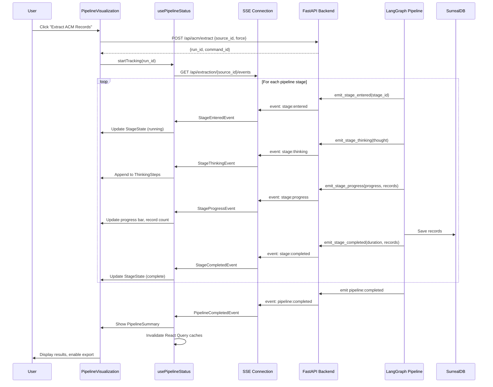
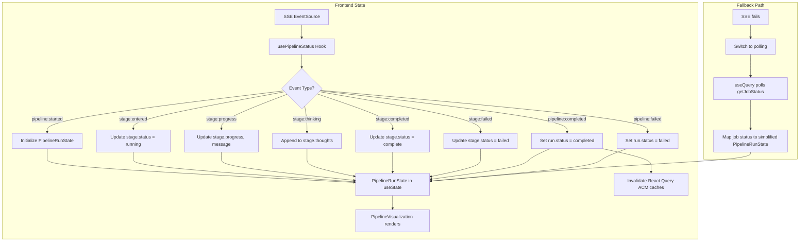
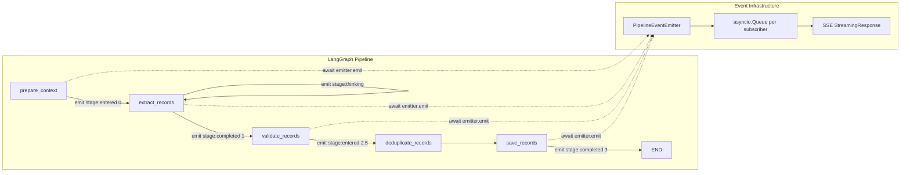
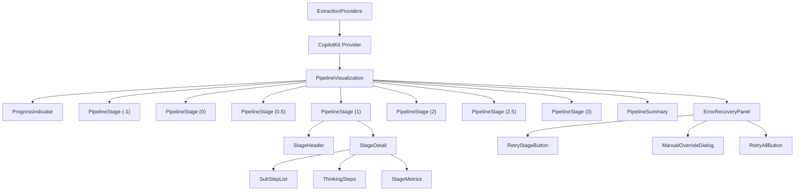

# AG-UI Pipeline Transparency Specification

> **Version:** 1.0
> **Date:** 2026-02-08
> **Status:** DRAFT
> **Author:** Pipeline Architect Agent
> **Audience:** Frontend & Backend Engineers, Tech Lead

---

## Table of Contents

1. [Overview](#1-overview)
2. [Pipeline Stage Definitions](#2-pipeline-stage-definitions)
3. [Pipeline Status Model](#3-pipeline-status-model)
4. [AG-UI / CopilotKit Integration](#4-ag-ui--copilotkit-integration)
5. [Real-Time Event Streaming](#5-real-time-event-streaming)
6. [TypeScript Interfaces](#6-typescript-interfaces)
7. [Pydantic-to-TypeScript Code Generation](#7-pydantic-to-typescript-code-generation)
8. [Component Hierarchy](#8-component-hierarchy)
9. [Error Recovery UI Patterns](#9-error-recovery-ui-patterns)
10. [Migration Path from useExtractionStatus](#10-migration-path-from-useextractionstatus)
11. [Backend Changes for AG-UI Support](#11-backend-changes-for-ag-ui-support)
12. [Data Flow Diagrams](#12-data-flow-diagrams)

---

## 1. Overview

### Problem

The current extraction UI provides minimal feedback during document processing:

- `useExtractionStatus` hook tracks only four phases: `idle | extracting | completed | failed`
- `ACMExtractionBanner` renders a single spinner with "AI is analyzing the document. This may take up to a minute..."
- No visibility into which pipeline stage is active
- No detail about agent decisions, tool selections, or intermediate results
- No progress percentage or record counts during extraction
- No ability to retry individual failed stages

### Solution

Implement AG-UI (Agent-User Interaction) protocol integration using CopilotKit to provide full pipeline transparency. The extraction pipeline has 7 defined stages (Stage -1 through Stage 3). Each stage will report its status, duration, decisions, and output in real time via Server-Sent Events (SSE), rendered in a multi-stage visualization component.

### Design Principles

1. **Progressive disclosure** -- collapsed by default, expandable for detail
2. **Non-blocking** -- pipeline visualization does not interfere with other UI operations
3. **Resilient** -- disconnection from the event stream does not lose state; reconnection picks up current status
4. **Accessible** -- WCAG 2.1 AA compliant; status conveyed via text and ARIA attributes, not color alone

---

## 2. Pipeline Stage Definitions

### Stage Map

| Stage ID | Name | Description | Key Outputs | Story Ref |
|----------|------|-------------|-------------|-----------|
| `-1` | Document Structure Analysis | TOC extraction, building inventory, page tagging, metadata | `DocumentStructure`, `BuildingInventory`, `PageTag[]`, `DocumentMeta` | E1-S16..S19 |
| `0` | Preflight | Format detection (Prensa/Greencap/Generic), content hash, dedup check, parser selection | `PreflightResult` with format, parser, content_hash | E1-S3 |
| `0.5` | Agentic Orchestrator | Section analysis, extraction tool selection (MinerU/Docling/Regex), dynamic routing per section | `OrchestrationPlan` with per-section tool assignments | E1-S20 |
| `1` | Extract | Verbatim extraction with provenance tracking (page, table ID, row/column, bounding box) | `RawACMItem[]` with provenance metadata | E1-S7 |
| `2` | Interpret | Field mapping (consultant to BAR), value normalization, product classification, business rules | `ACMExtractionRecord[]` with confidence scores | E1-S9, E1-S12 |
| `2.5` | Corrective Validation | Schema validation against BAR taxonomy, LLM re-extraction on failure, max 3 correction attempts | Validated records, correction log | E1-S15 |
| `3` | Enrich & Store | Contextual embedding enrichment, parent document section storage, SurrealDB persistence, vector embedding | Saved `ACMRecord[]`, embedding status | E1-S14, E11-S1 |

### Stage Sub-Steps

Each stage contains internal sub-steps that can be reported for fine-grained progress:

```
Stage -1: Document Structure Analysis
  -1.1  TOC Extraction & Content Hierarchy
  -1.2  Building Inventory Compilation
  -1.3  Page-Level Section Tagging
  -1.4  Document Metadata Extraction

Stage 0: Preflight
  0.1   Format Detection
  0.2   Content Hash & Dedup Check
  0.3   Parser Selection

Stage 0.5: Agentic Orchestrator
  0.5.1  Section Content Analysis
  0.5.2  Tool Selection per Section
  0.5.3  Processing Group Assembly

Stage 1: Extract
  1.1   Chunk Preparation
  1.2   LLM Extraction (per chunk)
  1.3   Provenance Attachment

Stage 2: Interpret
  2.1   Field Mapping
  2.2   Value Normalization
  2.3   Product Classification
  2.4   Business Rule Application

Stage 2.5: Corrective Validation
  2.5.1  Schema Validation
  2.5.2  Corrective Re-extraction (attempt N)
  2.5.3  Final Acceptance

Stage 3: Enrich & Store
  3.1   Contextual Embedding Enrichment
  3.2   Parent Document Section Storage
  3.3   SurrealDB Record Persistence
  3.4   Vector Embedding Generation
```

---

## 3. Pipeline Status Model

### Stage Status Enum

Each stage transitions through a defined state machine:

```
pending --> running --> complete
                  \--> failed
                  \--> skipped
```

| Status | Description | Visual |
|--------|-------------|--------|
| `pending` | Not yet started | Grey circle, dimmed text |
| `running` | Currently executing | Animated spinner, teal highlight, duration timer counting |
| `complete` | Finished successfully | Green checkmark, final duration |
| `failed` | Failed with error | Red X icon, error message |
| `skipped` | Intentionally skipped (e.g., disabled in settings) | Grey dash, "Skipped" label |

### Pipeline Run Status

The overall pipeline run also has a top-level status:

| Status | Condition |
|--------|-----------|
| `idle` | No extraction in progress |
| `running` | At least one stage is `running` |
| `completed` | All stages are `complete` or `skipped` |
| `failed` | Any stage is `failed` and no retry in progress |
| `partial` | Some stages completed, pipeline halted on error |

---

## 4. AG-UI / CopilotKit Integration

### Package Dependencies

```json
{
  "dependencies": {
    "@copilotkit/react-core": "^1.x",
    "@copilotkit/react-ui": "^1.x",
    "@copilotkit/runtime": "^1.x"
  }
}
```

Backend Python dependency:

```toml
[project.optional-dependencies]
agui = [
    "copilotkit>=0.1",
]
```

### Architecture

AG-UI (Agent-User Interaction) protocol defines a standard for agents to communicate state, actions, and reasoning to frontend UIs. CopilotKit implements this protocol with React hooks and a backend runtime that bridges LangGraph workflows.

```
+-----------------+       +------------------+       +---------------------+
|  React Frontend |<----->| CopilotKit       |<----->| FastAPI Backend     |
|  (CopilotKit    |  SSE  | Runtime Proxy    |  HTTP | + LangGraph         |
|   React hooks)  |       | /api/copilotkit  |       | acm_extraction.py   |
+-----------------+       +------------------+       +---------------------+
```

### CopilotKit Runtime Setup

The CopilotKit runtime acts as a proxy between the frontend React hooks and the backend LangGraph agent. It is deployed as a Next.js API route or standalone endpoint.

**Next.js API Route** (`frontend/src/app/api/copilotkit/route.ts`):

```typescript
import { CopilotRuntime, LangGraphAdapter } from "@copilotkit/runtime";
import { NextRequest } from "next/server";

const runtime = new CopilotRuntime();

export async function POST(req: NextRequest) {
  const { handleRequest } = runtime;
  return handleRequest(req, {
    adapter: new LangGraphAdapter({
      // Points to the FastAPI backend LangGraph endpoint
      url: process.env.BACKEND_URL + "/api/copilotkit/langgraph",
    }),
  });
}
```

### Frontend Provider Setup

Wrap the application (or the extraction-related pages) with `CopilotKitProvider`:

```tsx
// In layout.tsx or a dedicated provider
import { CopilotKit } from "@copilotkit/react-core";

export function ExtractionProviders({ children }: { children: React.ReactNode }) {
  return (
    <CopilotKit runtimeUrl="/api/copilotkit">
      {children}
    </CopilotKit>
  );
}
```

### useCopilotAction for Extraction

Define extraction as a CopilotKit action that the UI can trigger and observe:

```tsx
import { useCopilotAction } from "@copilotkit/react-core";

function useACMExtraction(sourceId: string) {
  useCopilotAction({
    name: "extract_acm_records",
    description: "Extract ACM records from a source document",
    parameters: [
      { name: "source_id", type: "string", required: true },
      { name: "force", type: "boolean", description: "Force re-extraction" },
      { name: "model_id", type: "string", description: "Override model" },
    ],
    handler: async ({ source_id, force, model_id }) => {
      // This triggers the backend LangGraph extraction pipeline
      // CopilotKit runtime forwards to the LangGraph adapter
      // The response streams back as AG-UI events
    },
  });
}
```

### Thinking Steps Visualization

CopilotKit supports rendering "thinking steps" -- intermediate reasoning from the LLM agent. These map directly to pipeline stage transitions and agent decisions.

Each LangGraph node emits thinking steps via the CopilotKit protocol:

```python
# In acm_extraction.py LangGraph nodes
from copilotkit.langchain import copilotkit_emit_state

async def prepare_context(state, config):
    # ... existing logic ...
    await copilotkit_emit_state(config, {
        "pipeline_stage": "prepare",
        "thinking": "Analyzing document structure. Found 15 pages with 3 building sections.",
        "progress": 0.1,
    })
```

Frontend renders these via CopilotKit's built-in thinking UI or custom components:

```tsx
import { useCopilotChat } from "@copilotkit/react-core";

function ThinkingSteps() {
  const { visibleMessages } = useCopilotChat();
  // Filter for thinking/state messages and render in StageDetail
}
```

---

## 5. Real-Time Event Streaming

### Transport: Server-Sent Events (SSE)

SSE is chosen over WebSocket for pipeline status because:

1. **Unidirectional** -- pipeline events flow server-to-client only
2. **HTTP-native** -- works through proxies and load balancers without upgrade negotiation
3. **Auto-reconnect** -- built-in browser reconnection with `Last-Event-ID`
4. **Simpler** -- no connection management overhead vs WebSocket

For the initial implementation, SSE is the primary transport. WebSocket can be added later if bidirectional communication (e.g., user cancellation, parameter adjustment mid-pipeline) is needed.

### SSE Endpoint

```
GET /api/extraction/{source_id}/events
Accept: text/event-stream

Query Parameters:
  run_id: string (optional, resume specific run)
```

### Event Schema

Each SSE event follows this structure:

```
event: {event_type}
id: {monotonic_event_id}
data: {json_payload}
```

### Event Types

| Event Type | Payload | When Emitted |
|------------|---------|--------------|
| `pipeline:started` | `PipelineStartedEvent` | Pipeline run begins |
| `stage:entered` | `StageEnteredEvent` | A stage begins execution |
| `stage:progress` | `StageProgressEvent` | Progress update within a stage |
| `stage:thinking` | `StageThinkingEvent` | Agent reasoning / decision |
| `stage:completed` | `StageCompletedEvent` | A stage finishes successfully |
| `stage:failed` | `StageFailedEvent` | A stage fails |
| `stage:skipped` | `StageSkippedEvent` | A stage is skipped |
| `pipeline:completed` | `PipelineCompletedEvent` | All stages done |
| `pipeline:failed` | `PipelineFailedEvent` | Pipeline halted on unrecoverable error |
| `heartbeat` | `{}` | Keep-alive every 15 seconds |

### Event Payload Examples

**pipeline:started**
```json
{
  "run_id": "run_abc123",
  "source_id": "source:xyz",
  "started_at": "2026-02-08T10:30:00Z",
  "stages": ["-1", "0", "0.5", "1", "2", "2.5", "3"],
  "total_stages": 7
}
```

**stage:entered**
```json
{
  "run_id": "run_abc123",
  "stage_id": "1",
  "stage_name": "Extract",
  "entered_at": "2026-02-08T10:30:05Z",
  "sub_step": "1.1",
  "sub_step_name": "Chunk Preparation"
}
```

**stage:progress**
```json
{
  "run_id": "run_abc123",
  "stage_id": "1",
  "progress": 0.6,
  "message": "Extracting chunk 3 of 5",
  "records_so_far": 42,
  "sub_step": "1.2",
  "sub_step_name": "LLM Extraction"
}
```

**stage:thinking**
```json
{
  "run_id": "run_abc123",
  "stage_id": "0.5",
  "thought": "Pages 13-18 contain tabular ACM register data. Selecting MinerU for table extraction. Pages 1-12 are policy/methodology text, skipping.",
  "tool_selected": "mineru_table_extractor",
  "confidence": 0.92
}
```

**stage:completed**
```json
{
  "run_id": "run_abc123",
  "stage_id": "1",
  "completed_at": "2026-02-08T10:30:25Z",
  "duration_ms": 20000,
  "records_extracted": 67,
  "summary": "Extracted 67 raw ACM items from 5 chunks across 15 pages"
}
```

**stage:failed**
```json
{
  "run_id": "run_abc123",
  "stage_id": "2.5",
  "failed_at": "2026-02-08T10:30:35Z",
  "duration_ms": 10000,
  "error": "Schema validation failed after 3 correction attempts",
  "error_code": "CORRECTIVE_RAG_EXHAUSTED",
  "records_affected": 3,
  "retry_available": true
}
```

**pipeline:completed**
```json
{
  "run_id": "run_abc123",
  "source_id": "source:xyz",
  "completed_at": "2026-02-08T10:31:00Z",
  "total_duration_ms": 60000,
  "total_records": 64,
  "records_rejected": 3,
  "confidence_distribution": { "high": 45, "medium": 15, "low": 4 }
}
```

---

## 6. TypeScript Interfaces

### Pipeline Event Types

```typescript
// ---- Enums ----

export type StageId = '-1' | '0' | '0.5' | '1' | '2' | '2.5' | '3';

export type StageStatus = 'pending' | 'running' | 'complete' | 'failed' | 'skipped';

export type PipelineRunStatus = 'idle' | 'running' | 'completed' | 'failed' | 'partial';

export type PipelineEventType =
  | 'pipeline:started'
  | 'stage:entered'
  | 'stage:progress'
  | 'stage:thinking'
  | 'stage:completed'
  | 'stage:failed'
  | 'stage:skipped'
  | 'pipeline:completed'
  | 'pipeline:failed'
  | 'heartbeat';

// ---- Stage Metadata ----

export interface StageDefinition {
  id: StageId;
  name: string;
  description: string;
  icon: string; // Lucide icon name
  substeps: SubStepDefinition[];
}

export interface SubStepDefinition {
  id: string;
  name: string;
}

// ---- Stage State ----

export interface StageState {
  id: StageId;
  status: StageStatus;
  enteredAt: string | null;
  completedAt: string | null;
  durationMs: number | null;
  progress: number; // 0.0 - 1.0
  currentSubStep: string | null;
  currentSubStepName: string | null;
  message: string | null;
  recordCount: number | null;
  thoughts: ThinkingStep[];
  error: StageError | null;
}

export interface ThinkingStep {
  timestamp: string;
  thought: string;
  toolSelected: string | null;
  confidence: number | null;
}

export interface StageError {
  message: string;
  code: string;
  recordsAffected: number;
  retryAvailable: boolean;
}

// ---- Pipeline Run State ----

export interface PipelineRunState {
  runId: string;
  sourceId: string;
  status: PipelineRunStatus;
  startedAt: string | null;
  completedAt: string | null;
  totalDurationMs: number | null;
  stages: Record<StageId, StageState>;
  totalRecords: number | null;
  recordsRejected: number | null;
  confidenceDistribution: ConfidenceDistribution | null;
}

export interface ConfidenceDistribution {
  high: number;
  medium: number;
  low: number;
}

// ---- SSE Event Payloads ----

export interface PipelineStartedEvent {
  run_id: string;
  source_id: string;
  started_at: string;
  stages: StageId[];
  total_stages: number;
}

export interface StageEnteredEvent {
  run_id: string;
  stage_id: StageId;
  stage_name: string;
  entered_at: string;
  sub_step: string | null;
  sub_step_name: string | null;
}

export interface StageProgressEvent {
  run_id: string;
  stage_id: StageId;
  progress: number;
  message: string;
  records_so_far: number | null;
  sub_step: string | null;
  sub_step_name: string | null;
}

export interface StageThinkingEvent {
  run_id: string;
  stage_id: StageId;
  thought: string;
  tool_selected: string | null;
  confidence: number | null;
}

export interface StageCompletedEvent {
  run_id: string;
  stage_id: StageId;
  completed_at: string;
  duration_ms: number;
  records_extracted: number | null;
  summary: string;
}

export interface StageFailedEvent {
  run_id: string;
  stage_id: StageId;
  failed_at: string;
  duration_ms: number;
  error: string;
  error_code: string;
  records_affected: number;
  retry_available: boolean;
}

export interface StageSkippedEvent {
  run_id: string;
  stage_id: StageId;
  reason: string;
}

export interface PipelineCompletedEvent {
  run_id: string;
  source_id: string;
  completed_at: string;
  total_duration_ms: number;
  total_records: number;
  records_rejected: number;
  confidence_distribution: ConfidenceDistribution;
}

export interface PipelineFailedEvent {
  run_id: string;
  source_id: string;
  failed_at: string;
  total_duration_ms: number;
  error: string;
  last_successful_stage: StageId | null;
}

// ---- Union Type for All Events ----

export type PipelineEvent =
  | { type: 'pipeline:started'; data: PipelineStartedEvent }
  | { type: 'stage:entered'; data: StageEnteredEvent }
  | { type: 'stage:progress'; data: StageProgressEvent }
  | { type: 'stage:thinking'; data: StageThinkingEvent }
  | { type: 'stage:completed'; data: StageCompletedEvent }
  | { type: 'stage:failed'; data: StageFailedEvent }
  | { type: 'stage:skipped'; data: StageSkippedEvent }
  | { type: 'pipeline:completed'; data: PipelineCompletedEvent }
  | { type: 'pipeline:failed'; data: PipelineFailedEvent }
  | { type: 'heartbeat'; data: Record<string, never> };
```

### Stage Definition Constants

```typescript
export const PIPELINE_STAGES: StageDefinition[] = [
  {
    id: '-1',
    name: 'Document Structure',
    description: 'TOC extraction, building inventory, page tagging, metadata',
    icon: 'FileSearch',
    substeps: [
      { id: '-1.1', name: 'TOC Extraction' },
      { id: '-1.2', name: 'Building Inventory' },
      { id: '-1.3', name: 'Page Tagging' },
      { id: '-1.4', name: 'Metadata Extraction' },
    ],
  },
  {
    id: '0',
    name: 'Preflight',
    description: 'Format detection, content hash, parser selection',
    icon: 'ScanSearch',
    substeps: [
      { id: '0.1', name: 'Format Detection' },
      { id: '0.2', name: 'Dedup Check' },
      { id: '0.3', name: 'Parser Selection' },
    ],
  },
  {
    id: '0.5',
    name: 'Orchestrator',
    description: 'Section analysis, tool selection, dynamic routing',
    icon: 'Brain',
    substeps: [
      { id: '0.5.1', name: 'Section Analysis' },
      { id: '0.5.2', name: 'Tool Selection' },
      { id: '0.5.3', name: 'Group Assembly' },
    ],
  },
  {
    id: '1',
    name: 'Extract',
    description: 'Verbatim extraction with provenance tracking',
    icon: 'FileOutput',
    substeps: [
      { id: '1.1', name: 'Chunk Preparation' },
      { id: '1.2', name: 'LLM Extraction' },
      { id: '1.3', name: 'Provenance Attachment' },
    ],
  },
  {
    id: '2',
    name: 'Interpret',
    description: 'Field mapping, normalization, classification',
    icon: 'Layers',
    substeps: [
      { id: '2.1', name: 'Field Mapping' },
      { id: '2.2', name: 'Normalization' },
      { id: '2.3', name: 'Classification' },
      { id: '2.4', name: 'Business Rules' },
    ],
  },
  {
    id: '2.5',
    name: 'Validate',
    description: 'Schema validation, corrective re-extraction',
    icon: 'ShieldCheck',
    substeps: [
      { id: '2.5.1', name: 'Schema Validation' },
      { id: '2.5.2', name: 'Corrective Extraction' },
      { id: '2.5.3', name: 'Final Acceptance' },
    ],
  },
  {
    id: '3',
    name: 'Enrich & Store',
    description: 'Embedding, parent docs, database storage',
    icon: 'Database',
    substeps: [
      { id: '3.1', name: 'Embedding Enrichment' },
      { id: '3.2', name: 'Parent Sections' },
      { id: '3.3', name: 'DB Persistence' },
      { id: '3.4', name: 'Vector Indexing' },
    ],
  },
];
```

---

## 7. Pydantic-to-TypeScript Code Generation

### Problem

The backend defines domain models in Python (Pydantic) and the frontend maintains manually-written TypeScript interfaces. These drift over time. The current `frontend/src/lib/types/acm.ts` is already missing fields present in the backend `ACMRecord` (e.g., `disturbance_potential`, `sample_no`, `acm_product_group`, classification fields, embedding fields).

### Solution: Automated Type Generation

Use `pydantic2ts` (pydantic-to-typescript) or `datamodel-code-generator` to generate TypeScript interfaces from Pydantic models at build time.

### Recommended Tool: datamodel-code-generator

`datamodel-code-generator` generates TypeScript interfaces from JSON Schema, which Pydantic models can export natively.

### Pipeline

```
Python Pydantic Models
        |
        v  (model.model_json_schema())
  JSON Schema files
        |
        v  (datamodel-codegen)
  TypeScript interfaces
        |
        v  (copy to frontend/src/lib/types/generated/)
  Frontend imports
```

### Build Script

Create `scripts/generate_types.py`:

```python
"""Generate TypeScript interfaces from Pydantic models."""
import json
import subprocess
from pathlib import Path

from open_notebook.domain.acm import ACMRecord
from open_notebook.extractors.acm_schemas import (
    ACMExtractionOutput,
    ACMExtractionRecord,
    ACMExtractionResult,
    BuildingRoomContext,
    ConfidenceDistribution,
    TableBoundingBox,
)

SCHEMA_DIR = Path("schemas/generated")
TS_OUTPUT_DIR = Path("frontend/src/lib/types/generated")

MODELS = [
    ACMRecord,
    ACMExtractionOutput,
    ACMExtractionRecord,
    ACMExtractionResult,
    BuildingRoomContext,
    ConfidenceDistribution,
    TableBoundingBox,
]

def main():
    SCHEMA_DIR.mkdir(parents=True, exist_ok=True)
    TS_OUTPUT_DIR.mkdir(parents=True, exist_ok=True)

    for model in MODELS:
        schema = model.model_json_schema()
        schema_path = SCHEMA_DIR / f"{model.__name__}.json"
        schema_path.write_text(json.dumps(schema, indent=2))

        ts_path = TS_OUTPUT_DIR / f"{model.__name__}.ts"
        subprocess.run([
            "datamodel-codegen",
            "--input", str(schema_path),
            "--input-file-type", "jsonschema",
            "--output", str(ts_path),
            "--output-model-type", "typescript",
            "--target-python-version", "3.11",
        ], check=True)

    print(f"Generated {len(MODELS)} TypeScript files in {TS_OUTPUT_DIR}")

if __name__ == "__main__":
    main()
```

### Integration Points

1. **Makefile target**: `make generate-types` runs the script
2. **Pre-commit hook** (optional): Warn if generated types are stale
3. **CI check**: Fail build if generated types differ from committed versions
4. **Frontend imports**: `import type { ACMRecord } from '@/lib/types/generated/ACMRecord'`

### Dependencies

```toml
[project.optional-dependencies]
codegen = [
    "datamodel-code-generator[http]>=0.25",
]
```

---

## 8. Component Hierarchy

### Overview

```
<ExtractionProviders>                 // CopilotKit + SSE providers
  <PipelineVisualization>             // Main container, manages pipeline run state
    <ProgressIndicator />             // Overall progress bar (0-100%)
    <PipelineStage stage={"-1"}>      // Per-stage row component
      <StageHeader />                 // Icon, name, status badge, duration timer
      <StageDetail>                   // Expandable panel (collapsed by default)
        <ThinkingSteps />             // Agent reasoning log
        <SubStepList />               // Sub-step progress
        <StageMetrics />              // Record counts, timings
      </StageDetail>
    </PipelineStage>
    <PipelineStage stage={"0"} />
    <PipelineStage stage={"0.5"} />
    <PipelineStage stage={"1"} />
    <PipelineStage stage={"2"} />
    <PipelineStage stage={"2.5"} />
    <PipelineStage stage={"3"} />
    <PipelineSummary />               // Final stats after completion
    <ErrorRecoveryPanel />            // Shown on failure, retry/override actions
  </PipelineVisualization>
</ExtractionProviders>
```

### Component Specifications

#### PipelineVisualization

The top-level container. Manages the `PipelineRunState` via the `usePipelineStatus` hook. Renders as a vertical stepper layout.

```tsx
interface PipelineVisualizationProps {
  sourceId: string;
  /** Controls whether the pipeline view is expanded */
  defaultExpanded?: boolean;
  /** Called when extraction completes successfully */
  onComplete?: (result: PipelineCompletedEvent) => void;
  /** Called when extraction fails */
  onError?: (error: PipelineFailedEvent) => void;
}
```

**Layout**: Vertical card with left-aligned step indicators connected by a vertical line. Each stage is a row. The currently running stage is highlighted with a teal left border and subtle background.

**Placement**: Rendered inside the source detail page, between the ACM toolbar and the AG Grid, replacing the current `ACMExtractionBanner`.

#### PipelineStage

Individual stage row in the stepper.

```tsx
interface PipelineStageProps {
  definition: StageDefinition;
  state: StageState;
  isActive: boolean;
  onRetry?: () => void;
}
```

**Visual states**:

| Status | Icon | Left Border | Background | Text |
|--------|------|-------------|------------|------|
| `pending` | Grey circle | `border-gray-200` | transparent | `text-muted-foreground` |
| `running` | Teal spinner (animated) | `border-teal-500` | `bg-teal-50/50` | `text-foreground` |
| `complete` | Green check | `border-green-500` | transparent | `text-foreground` |
| `failed` | Red X | `border-red-500` | `bg-red-50/50` | `text-destructive` |
| `skipped` | Grey dash | `border-gray-300` | transparent | `text-muted-foreground italic` |

**Duration timer**: When `running`, displays elapsed time in `MM:SS` format, updating every second via `requestAnimationFrame`. When `complete`, displays final duration.

#### StageDetail

Expandable content panel within each stage. Collapsed by default. Opens with a smooth height animation (CSS `grid-template-rows` transition).

```tsx
interface StageDetailProps {
  state: StageState;
  definition: StageDefinition;
}
```

Contains:

1. **SubStepList** -- shows sub-steps with individual status indicators
2. **ThinkingSteps** -- chronological list of agent thoughts with timestamps
3. **StageMetrics** -- key-value pairs (records extracted, chunks processed, etc.)

#### ProgressIndicator

Overall pipeline progress bar at the top of the visualization.

```tsx
interface ProgressIndicatorProps {
  stages: Record<StageId, StageState>;
  status: PipelineRunStatus;
}
```

Progress is calculated as:
```
progress = (completed_stages + 0.5 * running_stages) / total_stages
```

Renders as a horizontal bar with VAEA teal gradient fill. Includes text label: "Stage 2 of 7: Extract" or "Complete: 64 records extracted".

#### PipelineSummary

Shown after pipeline completion. Displays final statistics.

```tsx
interface PipelineSummaryProps {
  result: PipelineCompletedEvent;
}
```

Content:
- Total records extracted
- Records rejected
- Confidence distribution (high/medium/low as colored badges)
- Total duration
- Action buttons: "View Records", "Export Excel", "Re-extract"

#### ErrorRecoveryPanel

Shown when a stage fails. Provides recovery actions.

```tsx
interface ErrorRecoveryPanelProps {
  failedStage: StageState;
  onRetryStage: (stageId: StageId) => void;
  onRetryAll: () => void;
  onManualOverride: () => void;
}
```

See Section 9 for detailed error recovery patterns.

---

## 9. Error Recovery UI Patterns

### Pattern 1: Corrective RAG Feedback Display

When Stage 2.5 (Corrective Validation) attempts corrections, the UI shows the correction log:

```
Stage 2.5: Validate
  Attempt 1/3: 3 records failed validation
    - Record B001/R003: friable="Bonded" -> corrected to "Non Friable"
    - Record B002/R001: risk_status="Moderate" -> corrected to "Medium"
    - Record B002/R005: product="" -> correction failed (empty product)
  Attempt 2/3: 1 record still failing
    - Record B002/R005: Re-extracted product from page context -> "Ceiling Tiles"
  Result: 67/67 records valid
```

Each correction attempt is shown as a collapsible entry with before/after values and the corrective prompt reasoning.

### Pattern 2: Manual Override for Failed Classifications

When automatic correction fails, the user can manually fix the record:

```tsx
interface ManualOverrideDialogProps {
  record: ACMExtractionRecord;
  validationErrors: ValidationError[];
  onSave: (corrected: ACMExtractionRecord) => void;
  onSkip: () => void;
}
```

The dialog shows:
1. Original extracted values (read-only, highlighted in red where invalid)
2. Editable fields with validation errors annotated
3. Source PDF context (page excerpt around the extraction point)
4. "Save Correction" and "Skip Record" buttons

### Pattern 3: Stage Retry

Individual stages can be retried independently. The retry button appears in the `ErrorRecoveryPanel`.

```tsx
// Retry API call
POST /api/extraction/{source_id}/retry
{
  "run_id": "run_abc123",
  "stage_id": "2.5",
  "options": {
    "model_override": "claude-sonnet-4-5-20250929",  // Optional: try different model
    "temperature_override": 0.1                       // Optional: adjust parameters
  }
}
```

The pipeline resumes from the failed stage, keeping outputs from prior successful stages.

### Pattern 4: Full Re-extraction

A "Re-extract All" button triggers a fresh pipeline run with `force: true`, deleting existing records.

### Error Code Reference

| Error Code | Stage | Description | Recovery |
|------------|-------|-------------|----------|
| `NO_CONTENT` | 0 | Source has no extractable text | Re-upload document |
| `FORMAT_UNKNOWN` | 0 | Cannot detect document format | Manual parser selection |
| `MODEL_UNAVAILABLE` | 1 | Extraction model failed to provision | Select different model, retry |
| `EXTRACTION_TIMEOUT` | 1 | LLM call exceeded timeout | Retry with smaller chunks |
| `VALIDATION_FAILED` | 2 | Field validation errors (non-corrective) | Manual override |
| `CORRECTIVE_RAG_EXHAUSTED` | 2.5 | Max correction attempts reached | Manual override |
| `STORAGE_FAILED` | 3 | SurrealDB write error | Retry stage |
| `EMBEDDING_FAILED` | 3 | Embedding generation error | Retry stage (non-blocking) |

---

## 10. Migration Path from useExtractionStatus

### Current State

The existing `useExtractionStatus` hook (`frontend/src/lib/hooks/use-extraction-status.ts`) provides:

```typescript
type ExtractionPhase = 'idle' | 'extracting' | 'completed' | 'failed'

interface ExtractionStatus {
  phase: ExtractionPhase
  recordsCreated: number | undefined
  errorMessage: string | undefined
  startTracking: (commandId: string) => void
  dismiss: () => void
}
```

It polls `acmApi.getJobStatus(commandId)` every 3 seconds via React Query.

The `ACMExtractionBanner` renders a flat Alert with spinner/check/X based on phase.

### Migration Strategy: Parallel Adoption

The new pipeline visualization and the existing extraction status will coexist during migration. This avoids a breaking cutover.

#### Phase 1: Add usePipelineStatus Hook (New)

```typescript
// frontend/src/lib/hooks/use-pipeline-status.ts

interface UsePipelineStatusOptions {
  sourceId: string;
  enabled?: boolean;
  onComplete?: (result: PipelineCompletedEvent) => void;
  onError?: (error: PipelineFailedEvent) => void;
}

interface UsePipelineStatusReturn {
  /** Full pipeline run state */
  pipelineState: PipelineRunState | null;
  /** Simplified phase for backward compatibility */
  phase: ExtractionPhase;
  /** Start tracking a new extraction run */
  startTracking: (runId: string) => void;
  /** Dismiss / reset state */
  dismiss: () => void;
  /** Retry a specific failed stage */
  retryStage: (stageId: StageId) => void;
  /** Whether SSE connection is active */
  isConnected: boolean;
}
```

This hook:
1. Opens an SSE connection to `/api/extraction/{sourceId}/events`
2. Reduces incoming events into `PipelineRunState` via a state reducer
3. Exposes a `phase` getter that maps the full state to `ExtractionPhase` for backward compatibility
4. Stores `runId` in sessionStorage (same pattern as current hook)
5. Invalidates React Query ACM caches on completion (same as current hook)

#### Phase 2: Replace ACMExtractionBanner

Replace the simple `ACMExtractionBanner` with `PipelineVisualization`:

```tsx
// Before (current):
<ACMExtractionBanner
  phase={phase}
  recordsCreated={recordsCreated}
  errorMessage={errorMessage}
  onDismiss={dismiss}
/>

// After (new):
<PipelineVisualization
  sourceId={sourceId}
  onComplete={(result) => {
    queryClient.invalidateQueries({ queryKey: ['acm', 'records', sourceId] });
  }}
/>
```

#### Phase 3: Deprecate useExtractionStatus

Once `usePipelineStatus` is stable, deprecate `useExtractionStatus`:

```typescript
/**
 * @deprecated Use usePipelineStatus instead for full pipeline visibility.
 * This hook will be removed in a future version.
 */
export function useExtractionStatus(sourceId: string): ExtractionStatus {
  const { phase, pipelineState, startTracking, dismiss } = usePipelineStatus({ sourceId });
  return {
    phase,
    recordsCreated: pipelineState?.totalRecords ?? undefined,
    errorMessage: /* extract from failed stage */ undefined,
    startTracking,
    dismiss,
  };
}
```

### Fallback Behavior

If SSE connection fails (e.g., behind a proxy that strips SSE), the hook falls back to polling mode using the existing `acmApi.getJobStatus()` pattern. This ensures the UI always has status, even without streaming.

```typescript
// In usePipelineStatus:
const [transport, setTransport] = useState<'sse' | 'polling'>('sse');

useEffect(() => {
  if (transport === 'sse') {
    const eventSource = new EventSource(`/api/extraction/${sourceId}/events`);
    eventSource.onerror = () => {
      // SSE failed, fall back to polling
      eventSource.close();
      setTransport('polling');
    };
    // ... handle events
    return () => eventSource.close();
  }
}, [transport, sourceId]);

// Polling fallback (reuses existing React Query pattern)
const { data: jobStatus } = useQuery({
  queryKey: ['extraction-job', runId],
  queryFn: () => acmApi.getJobStatus(runId!),
  enabled: transport === 'polling' && !!runId,
  refetchInterval: 3000,
});
```

---

## 11. Backend Changes for AG-UI Support

### 11.1 SSE Event Emitter

Add an event emitter to the extraction pipeline that broadcasts stage transitions as SSE events.

**New file**: `api/extraction_events.py`

```python
"""SSE event broadcasting for extraction pipeline transparency."""
import asyncio
import json
import time
from dataclasses import dataclass, field
from enum import Enum
from typing import Any, AsyncGenerator, Optional

from loguru import logger


class StageStatus(str, Enum):
    PENDING = "pending"
    RUNNING = "running"
    COMPLETE = "complete"
    FAILED = "failed"
    SKIPPED = "skipped"


@dataclass
class PipelineEventEmitter:
    """Manages SSE event broadcasting for a single extraction run."""
    run_id: str
    source_id: str
    _subscribers: list[asyncio.Queue] = field(default_factory=list)
    _event_counter: int = 0

    def subscribe(self) -> asyncio.Queue:
        queue: asyncio.Queue = asyncio.Queue()
        self._subscribers.append(queue)
        return queue

    def unsubscribe(self, queue: asyncio.Queue) -> None:
        self._subscribers.discard(queue)

    async def emit(self, event_type: str, data: dict[str, Any]) -> None:
        self._event_counter += 1
        event = {
            "id": self._event_counter,
            "type": event_type,
            "data": data,
        }
        for queue in self._subscribers:
            await queue.put(event)

    async def emit_stage_entered(
        self, stage_id: str, stage_name: str, sub_step: str | None = None
    ) -> None:
        await self.emit("stage:entered", {
            "run_id": self.run_id,
            "stage_id": stage_id,
            "stage_name": stage_name,
            "entered_at": _now_iso(),
            "sub_step": sub_step,
        })

    async def emit_stage_progress(
        self, stage_id: str, progress: float, message: str,
        records_so_far: int | None = None
    ) -> None:
        await self.emit("stage:progress", {
            "run_id": self.run_id,
            "stage_id": stage_id,
            "progress": progress,
            "message": message,
            "records_so_far": records_so_far,
        })

    async def emit_stage_thinking(
        self, stage_id: str, thought: str,
        tool_selected: str | None = None, confidence: float | None = None
    ) -> None:
        await self.emit("stage:thinking", {
            "run_id": self.run_id,
            "stage_id": stage_id,
            "thought": thought,
            "tool_selected": tool_selected,
            "confidence": confidence,
        })

    async def emit_stage_completed(
        self, stage_id: str, duration_ms: int,
        records_extracted: int | None = None, summary: str = ""
    ) -> None:
        await self.emit("stage:completed", {
            "run_id": self.run_id,
            "stage_id": stage_id,
            "completed_at": _now_iso(),
            "duration_ms": duration_ms,
            "records_extracted": records_extracted,
            "summary": summary,
        })

    async def emit_stage_failed(
        self, stage_id: str, duration_ms: int, error: str,
        error_code: str, records_affected: int = 0,
        retry_available: bool = True
    ) -> None:
        await self.emit("stage:failed", {
            "run_id": self.run_id,
            "stage_id": stage_id,
            "failed_at": _now_iso(),
            "duration_ms": duration_ms,
            "error": error,
            "error_code": error_code,
            "records_affected": records_affected,
            "retry_available": retry_available,
        })

    async def stream(self, queue: asyncio.Queue) -> AsyncGenerator[str, None]:
        """Generate SSE-formatted events from the queue."""
        try:
            while True:
                event = await asyncio.wait_for(queue.get(), timeout=15.0)
                yield f"event: {event['type']}\n"
                yield f"id: {event['id']}\n"
                yield f"data: {json.dumps(event['data'])}\n\n"
        except asyncio.TimeoutError:
            yield "event: heartbeat\ndata: {}\n\n"
        except asyncio.CancelledError:
            return


def _now_iso() -> str:
    from datetime import datetime, timezone
    return datetime.now(timezone.utc).isoformat()
```

### 11.2 SSE Endpoint

**New route** in `api/routers/acm.py`:

```python
from fastapi import Request
from fastapi.responses import StreamingResponse

@router.get("/extraction/{source_id}/events")
async def extraction_events(source_id: str, request: Request):
    """SSE endpoint for real-time extraction pipeline events."""
    emitter = get_or_create_emitter(source_id)
    queue = emitter.subscribe()

    async def event_generator():
        try:
            async for chunk in emitter.stream(queue):
                if await request.is_disconnected():
                    break
                yield chunk
        finally:
            emitter.unsubscribe(queue)

    return StreamingResponse(
        event_generator(),
        media_type="text/event-stream",
        headers={
            "Cache-Control": "no-cache",
            "Connection": "keep-alive",
            "X-Accel-Buffering": "no",  # Disable nginx buffering
        },
    )
```

### 11.3 LangGraph Node Instrumentation

Each node in `acm_extraction.py` emits events via the `PipelineEventEmitter`. The emitter is passed through LangGraph's `RunnableConfig`:

```python
async def prepare_context(state: dict, config: RunnableConfig) -> dict:
    emitter: PipelineEventEmitter | None = config.get("configurable", {}).get("emitter")

    if emitter:
        await emitter.emit_stage_entered("0", "Preflight", sub_step="0.1")

    # ... existing prepare_context logic ...

    if emitter:
        await emitter.emit_stage_completed(
            "0", duration_ms=elapsed,
            summary=f"Prepared {len(chunks)} chunks for extraction"
        )

    return { ... }


async def extract_records(state: dict, config: RunnableConfig) -> dict:
    emitter: PipelineEventEmitter | None = config.get("configurable", {}).get("emitter")

    if emitter:
        await emitter.emit_stage_entered("1", "Extract", sub_step="1.2")
        await emitter.emit_stage_thinking(
            "1",
            f"Processing chunk {current_index + 1}/{len(chunks)}: {len(chunk_content)} chars",
        )

    # ... existing extraction logic ...

    if emitter:
        await emitter.emit_stage_progress(
            "1", progress=current_index / len(chunks),
            message=f"Extracted {len(new_records)} records from chunk {current_index + 1}",
            records_so_far=len(existing_records) + len(new_records),
        )

    return { ... }
```

### 11.4 CopilotKit Backend Adapter (Optional)

If CopilotKit integration is pursued beyond SSE, add a LangGraph adapter endpoint:

**New file**: `api/routers/copilotkit.py`

```python
from copilotkit.integrations.fastapi import add_fastapi_endpoint
from copilotkit import CopilotKitSDK, LangGraphAgent

from open_notebook.graphs.acm_extraction import graph

sdk = CopilotKitSDK(
    agents=[
        LangGraphAgent(
            name="acm_extractor",
            description="Extracts ACM records from PDF documents",
            graph=graph,
        )
    ]
)

# In main.py:
# add_fastapi_endpoint(app, sdk, "/api/copilotkit")
```

### 11.5 Pydantic Event Models

**New file**: `open_notebook/extractors/pipeline_events.py`

```python
"""Pydantic models for pipeline SSE events.

These models serve as the source of truth for event schemas.
TypeScript interfaces are auto-generated from these via the
Pydantic-to-TypeScript pipeline (see Section 7).
"""
from enum import Enum
from typing import List, Optional

from pydantic import BaseModel, Field


class StageId(str, Enum):
    STRUCTURE = "-1"
    PREFLIGHT = "0"
    ORCHESTRATOR = "0.5"
    EXTRACT = "1"
    INTERPRET = "2"
    VALIDATE = "2.5"
    ENRICH = "3"


class StageStatus(str, Enum):
    PENDING = "pending"
    RUNNING = "running"
    COMPLETE = "complete"
    FAILED = "failed"
    SKIPPED = "skipped"


class PipelineRunStatus(str, Enum):
    IDLE = "idle"
    RUNNING = "running"
    COMPLETED = "completed"
    FAILED = "failed"
    PARTIAL = "partial"


class ThinkingStep(BaseModel):
    timestamp: str
    thought: str
    tool_selected: Optional[str] = None
    confidence: Optional[float] = None


class StageError(BaseModel):
    message: str
    code: str
    records_affected: int = 0
    retry_available: bool = True


class StageState(BaseModel):
    id: StageId
    status: StageStatus = StageStatus.PENDING
    entered_at: Optional[str] = None
    completed_at: Optional[str] = None
    duration_ms: Optional[int] = None
    progress: float = 0.0
    current_sub_step: Optional[str] = None
    current_sub_step_name: Optional[str] = None
    message: Optional[str] = None
    record_count: Optional[int] = None
    thoughts: List[ThinkingStep] = Field(default_factory=list)
    error: Optional[StageError] = None


class PipelineStartedEvent(BaseModel):
    run_id: str
    source_id: str
    started_at: str
    stages: List[StageId]
    total_stages: int


class StageEnteredEvent(BaseModel):
    run_id: str
    stage_id: StageId
    stage_name: str
    entered_at: str
    sub_step: Optional[str] = None
    sub_step_name: Optional[str] = None


class StageProgressEvent(BaseModel):
    run_id: str
    stage_id: StageId
    progress: float
    message: str
    records_so_far: Optional[int] = None
    sub_step: Optional[str] = None
    sub_step_name: Optional[str] = None


class StageThinkingEvent(BaseModel):
    run_id: str
    stage_id: StageId
    thought: str
    tool_selected: Optional[str] = None
    confidence: Optional[float] = None


class StageCompletedEvent(BaseModel):
    run_id: str
    stage_id: StageId
    completed_at: str
    duration_ms: int
    records_extracted: Optional[int] = None
    summary: str = ""


class StageFailedEvent(BaseModel):
    run_id: str
    stage_id: StageId
    failed_at: str
    duration_ms: int
    error: str
    error_code: str
    records_affected: int = 0
    retry_available: bool = True


class PipelineCompletedEvent(BaseModel):
    run_id: str
    source_id: str
    completed_at: str
    total_duration_ms: int
    total_records: int
    records_rejected: int
    confidence_distribution: dict  # {high: int, medium: int, low: int}
```

---

## 12. Data Flow Diagrams

### End-to-End Data Flow



### State Management Flow



### Backend Event Emission Flow



### Component Rendering Tree



---

## Appendix A: File Locations

### New Frontend Files

| File | Purpose |
|------|---------|
| `frontend/src/lib/hooks/use-pipeline-status.ts` | SSE-based pipeline status hook |
| `frontend/src/lib/types/pipeline.ts` | TypeScript interfaces (Section 6) |
| `frontend/src/lib/types/generated/` | Auto-generated types from Pydantic |
| `frontend/src/components/acm/PipelineVisualization.tsx` | Main container component |
| `frontend/src/components/acm/PipelineStage.tsx` | Individual stage row |
| `frontend/src/components/acm/StageDetail.tsx` | Expandable detail panel |
| `frontend/src/components/acm/StageHeader.tsx` | Stage icon, name, status, timer |
| `frontend/src/components/acm/ProgressIndicator.tsx` | Overall progress bar |
| `frontend/src/components/acm/PipelineSummary.tsx` | Post-completion stats |
| `frontend/src/components/acm/ErrorRecoveryPanel.tsx` | Error actions |
| `frontend/src/components/acm/ThinkingSteps.tsx` | Agent reasoning log |
| `frontend/src/components/acm/ManualOverrideDialog.tsx` | Manual record correction |
| `frontend/src/app/api/copilotkit/route.ts` | CopilotKit runtime proxy |

### New Backend Files

| File | Purpose |
|------|---------|
| `api/extraction_events.py` | PipelineEventEmitter + SSE infrastructure |
| `api/routers/copilotkit.py` | CopilotKit LangGraph adapter |
| `open_notebook/extractors/pipeline_events.py` | Pydantic event models |
| `scripts/generate_types.py` | Pydantic-to-TypeScript build script |
| `schemas/generated/` | Intermediate JSON Schema files |

### Modified Backend Files

| File | Change |
|------|--------|
| `open_notebook/graphs/acm_extraction.py` | Add emitter calls to all nodes |
| `api/routers/acm.py` | Add SSE endpoint |
| `api/main.py` | Register CopilotKit endpoint |

---

## Appendix B: Implementation Priority

| Priority | Item | Dependency |
|----------|------|------------|
| P0 | Pydantic event models (`pipeline_events.py`) | None |
| P0 | TypeScript interfaces (`pipeline.ts`) | Event models |
| P0 | `PipelineEventEmitter` | Event models |
| P0 | SSE endpoint | Emitter |
| P0 | LangGraph node instrumentation | Emitter |
| P0 | `usePipelineStatus` hook | SSE endpoint |
| P0 | `PipelineVisualization` + `PipelineStage` | Hook |
| P1 | `StageDetail` + `ThinkingSteps` | Visualization |
| P1 | `ErrorRecoveryPanel` | Visualization |
| P1 | `ProgressIndicator` | Visualization |
| P1 | Pydantic-to-TypeScript build script | Event models |
| P1 | CopilotKit runtime integration | SSE working |
| P2 | `ManualOverrideDialog` | Error recovery |
| P2 | `PipelineSummary` | Visualization |
| P2 | CopilotKit thinking steps | CopilotKit runtime |

---

*Generated by Pipeline Architect Agent -- 2026-02-08*
