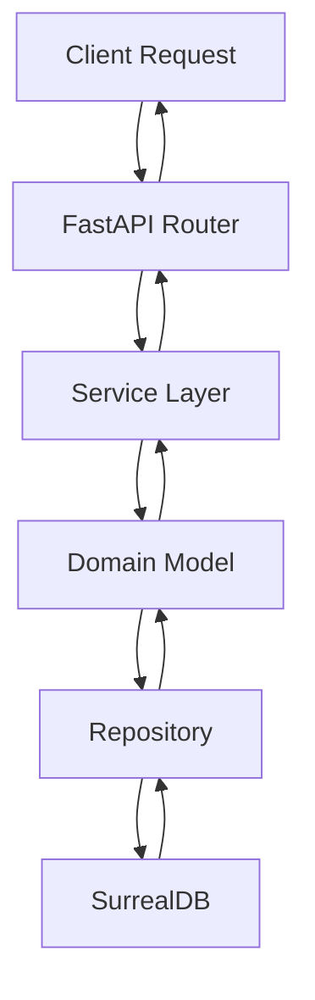
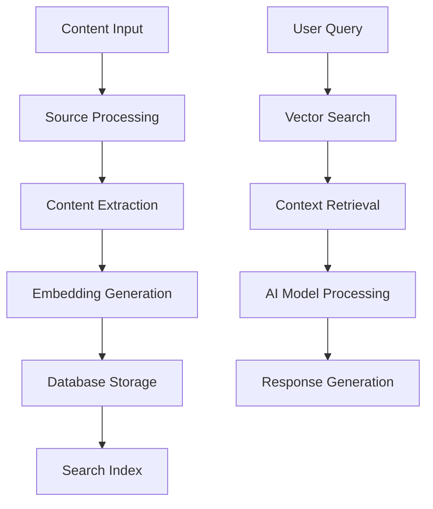
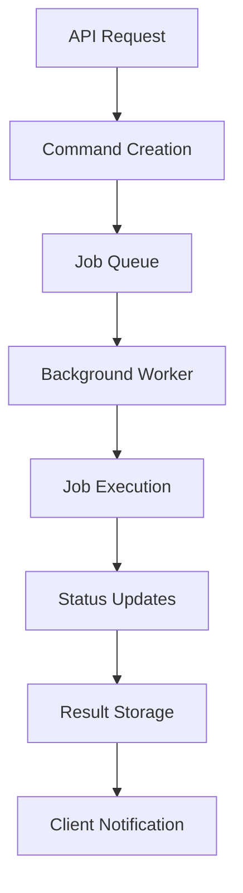
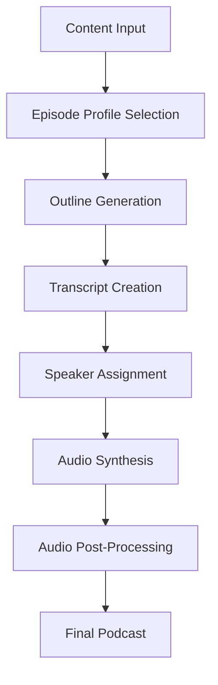

# System Architecture

This document provides a comprehensive overview of Open Notebook's architecture, including system design, component relationships, database schema, and service communication patterns.

## 🏗️ High-Level Architecture

Open Notebook follows a modern layered architecture with clear separation of concerns:

```
┌─────────────────────────────────────────────────────────────┐
│                    Frontend Layer                           │
├─────────────────────────────────────────────────────────────┤
│  React frontend (pages/)  │  REST API Clients (external)     │
└─────────────────────────────────────────────────────────────┘
                                │
                                ▼
┌─────────────────────────────────────────────────────────────┐
│                    API Layer                                │
├─────────────────────────────────────────────────────────────┤
│  FastAPI Routers (api/routers/)  │  Models (api/models.py)  │
│  Middleware (auth, CORS)         │  Service Layer           │
└─────────────────────────────────────────────────────────────┘
                                │
                                ▼
┌─────────────────────────────────────────────────────────────┐
│                   Domain Layer                              │
├─────────────────────────────────────────────────────────────┤
│  Business Logic (open_notebook/domain/)                     │
│  Entity Models │ Validation │ Domain Services              │
└─────────────────────────────────────────────────────────────┘
                                │
                                ▼
┌─────────────────────────────────────────────────────────────┐
│                Infrastructure Layer                         │
├─────────────────────────────────────────────────────────────┤
│  Database (SurrealDB)  │  AI Services (Esperanto)         │
│  File Storage         │  External APIs                    │
└─────────────────────────────────────────────────────────────┘
```

## 🧩 Core Components

### 1. API Layer (`api/`)

**Purpose**: HTTP interface for all application functionality

**Key Components**:
- **FastAPI Application** (`api/main.py`): Main application with middleware and routing
- **Routers** (`api/routers/`): Endpoint definitions organized by domain
- **Models** (`api/models.py`): Pydantic models for request/response validation
- **Services** (`api/*_service.py`): Business logic orchestration
- **Authentication** (`api/auth.py`): Password-based authentication middleware

**Architecture Pattern**: Clean API architecture with service layer abstraction

```python
# Example API structure
@router.post("/notebooks", response_model=NotebookResponse)
async def create_notebook(notebook: NotebookCreate):
    """Create a new notebook with validation and error handling."""
    new_notebook = Notebook(name=notebook.name, description=notebook.description)
    await new_notebook.save()
    return NotebookResponse.from_domain(new_notebook)
```

### 2. Domain Layer (`open_notebook/domain/`)

**Purpose**: Core business logic and domain models

**Key Components**:
- **Base Models** (`base.py`): Abstract base classes with common functionality
- **Entities**: `Notebook`, `Source`, `Note`, `Model`, `Transformation`
- **Services**: Domain-specific business logic
- **Validation**: Data integrity and business rules

**Architecture Pattern**: Domain-Driven Design (DDD) with rich domain models

```python
# Example domain model
class Notebook(BaseModel):
    name: str
    description: str
    archived: bool = False
    
    @classmethod
    async def get_all(cls, order_by: str = "updated desc") -> List["Notebook"]:
        """Retrieve all notebooks with ordering."""
        # Business logic implementation
        
    async def save(self) -> None:
        """Save notebook with validation."""
        # Domain validation and persistence
```

### 3. Database Layer (`open_notebook/database/`)

**Purpose**: Data persistence and query abstraction

**Key Components**:
- **Repository Pattern** (`repository.py`): CRUD operations abstraction
- **Connection Management**: Async SurrealDB connection handling
- **Migrations**: Database schema evolution (`migrations/`)
- **Query Builder**: SurrealQL query construction helpers

**Architecture Pattern**: Repository pattern with async/await

```python
# Repository functions
async def repo_create(table: str, data: Dict[str, Any]) -> Dict[str, Any]
async def repo_query(query_str: str, vars: Optional[Dict[str, Any]] = None) -> List[Dict[str, Any]]
async def repo_update(table: str, id: str, data: Dict[str, Any]) -> List[Dict[str, Any]]
async def repo_delete(record_id: Union[str, RecordID])
```

### 4. AI Processing Layer (`open_notebook/graphs/`)

**Purpose**: AI workflows and content processing

**Key Components**:
- **LangChain Graphs**: Multi-step AI workflows
- **Ask System** (`ask.py`): Question-answering pipeline
- **Chat System** (`chat.py`): Conversational AI
- **Transformations** (`transformation.py`): Content analysis workflows
- **Source Processing** (`source.py`): Content ingestion and embedding

**Architecture Pattern**: LangGraph for workflow orchestration

```python
# Example AI workflow
@create_graph
async def ask_graph(state: AskState):
    """Multi-step question answering workflow."""
    # 1. Strategy generation
    # 2. Search execution
    # 3. Answer synthesis
    # 4. Final response generation
```

### 5. Background Processing (`commands/`)

**Purpose**: Asynchronous job processing

**Key Components**:
- **Command System**: Background job definitions
- **Job Queue**: SurrealDB-backed job scheduling
- **Status Tracking**: Real-time job progress monitoring
- **Error Handling**: Comprehensive error recovery

**Architecture Pattern**: Command pattern with async job queue

### 6. Source Review Status Lifecycle

Sources track their processing state via `review_status`:

```
Upload → 'extracting' → 'pending_review' → (manual review stages) → 'published'
```

- **`extracting`**: Set on upload when `async_processing=True` (forced for all uploads)
- **`pending_review`**: Set on all terminal paths in `acm_commands.py` (success, failure, timeout)
- Further statuses (`building_review`, `acm_review`, `published`) are manual workflow stages

### 7. Extract Page — 3-Panel Progressive Layout

The extract page (`/jobs/{id}/extract`) shows extraction progress with three panels that populate progressively:

1. **DoclingTablesPanel** — Raw Docling table cards (populated during DOCLING_EXTRACTION stage)
2. **BuildingsProgressPanel** — Live building list (populated as `ai.building_saved` events arrive)
3. **LiveRecordsPanel** — Per-building ACM records table (populated as records are saved)

Each panel subscribes to SSE events via `useV3SSE` and updates in real time.

### 8. Job Card Live Stats

Job cards on `/jobs` poll `GET /api/sources/{id}/live-stats` to show live counters during extraction:
- `tables_count`, `buildings_count`, `records_count` — aggregated from DB
- `site_name`, `consultant_name` — from `source_intelligence` table
- Polling managed by `useLiveStats` hook (2-3 second interval, auto-stops when extraction completes)

## 🗃️ Database Schema

Open Notebook uses SurrealDB with a flexible document-oriented schema:

### Core Tables

#### `notebook`
```surrealql
DEFINE TABLE notebook SCHEMAFULL;
DEFINE FIELD name ON TABLE notebook TYPE string;
DEFINE FIELD description ON TABLE notebook TYPE string;
DEFINE FIELD archived ON TABLE notebook TYPE bool DEFAULT false;
DEFINE FIELD created ON TABLE notebook TYPE datetime DEFAULT time::now();
DEFINE FIELD updated ON TABLE notebook TYPE datetime DEFAULT time::now();
```

#### `source`
```surrealql
DEFINE TABLE source SCHEMAFULL;
DEFINE FIELD title ON TABLE source TYPE option<string>;
DEFINE FIELD topics ON TABLE source TYPE option<array<string>>;
DEFINE FIELD asset ON TABLE source TYPE option<object>;
DEFINE FIELD full_text ON TABLE source TYPE option<string>;
DEFINE FIELD notebook_id ON TABLE source TYPE record<notebook>;
DEFINE FIELD embedding ON TABLE source TYPE option<array<number>>;
DEFINE FIELD created ON TABLE source TYPE datetime DEFAULT time::now();
DEFINE FIELD updated ON TABLE source TYPE datetime DEFAULT time::now();
```

#### `note`
```surrealql
DEFINE TABLE note SCHEMAFULL;
DEFINE FIELD title ON TABLE note TYPE option<string>;
DEFINE FIELD content ON TABLE note TYPE option<string>;
DEFINE FIELD note_type ON TABLE note TYPE option<string>;
DEFINE FIELD notebook_id ON TABLE note TYPE record<notebook>;
DEFINE FIELD embedding ON TABLE note TYPE option<array<number>>;
DEFINE FIELD created ON TABLE note TYPE datetime DEFAULT time::now();
DEFINE FIELD updated ON TABLE note TYPE datetime DEFAULT time::now();
```

#### `model`
```surrealql
DEFINE TABLE model SCHEMAFULL;
DEFINE FIELD name ON TABLE model TYPE string;
DEFINE FIELD provider ON TABLE model TYPE string;
DEFINE FIELD type ON TABLE model TYPE string;
DEFINE FIELD created ON TABLE model TYPE datetime DEFAULT time::now();
DEFINE FIELD updated ON TABLE model TYPE datetime DEFAULT time::now();
```

### Specialized Tables

#### `transformation`
```surrealql
DEFINE TABLE transformation SCHEMAFULL;
DEFINE FIELD name ON TABLE transformation TYPE string;
DEFINE FIELD title ON TABLE transformation TYPE string;
DEFINE FIELD description ON TABLE transformation TYPE string;
DEFINE FIELD prompt ON TABLE transformation TYPE string;
DEFINE FIELD apply_default ON TABLE transformation TYPE bool DEFAULT false;
```

#### `episode_profile` (Podcast Generation)
```surrealql
DEFINE TABLE episode_profile SCHEMAFULL;
DEFINE FIELD name ON TABLE episode_profile TYPE string;
DEFINE FIELD description ON TABLE episode_profile TYPE option<string>;
DEFINE FIELD speaker_config ON TABLE episode_profile TYPE string;
DEFINE FIELD outline_provider ON TABLE episode_profile TYPE string;
DEFINE FIELD outline_model ON TABLE episode_profile TYPE string;
DEFINE FIELD transcript_provider ON TABLE episode_profile TYPE string;
DEFINE FIELD transcript_model ON TABLE episode_profile TYPE string;
DEFINE FIELD default_briefing ON TABLE episode_profile TYPE string;
DEFINE FIELD num_segments ON TABLE episode_profile TYPE int DEFAULT 5;
```

#### `speaker_profile` (Podcast Generation)
```surrealql
DEFINE TABLE speaker_profile SCHEMAFULL;
DEFINE FIELD name ON TABLE speaker_profile TYPE string;
DEFINE FIELD description ON TABLE speaker_profile TYPE option<string>;
DEFINE FIELD tts_provider ON TABLE speaker_profile TYPE string;
DEFINE FIELD tts_model ON TABLE speaker_profile TYPE string;
DEFINE FIELD speakers ON TABLE speaker_profile TYPE array<object>;
DEFINE FIELD speakers.*.name ON TABLE speaker_profile TYPE string;
DEFINE FIELD speakers.*.voice_id ON TABLE speaker_profile TYPE option<string>;
DEFINE FIELD speakers.*.backstory ON TABLE speaker_profile TYPE option<string>;
DEFINE FIELD speakers.*.personality ON TABLE speaker_profile TYPE option<string>;
```

### Relationships

**Record Links** (SurrealDB native relationships):
- `source.notebook_id` → `notebook` records
- `note.notebook_id` → `notebook` records
- `episode.command` → `command` records

**Embedding Relationships**:
- Sources and notes can have vector embeddings for semantic search
- Embeddings are stored as arrays of numbers in the same record

## 🔄 Service Communication

### API Communication Flow



### AI Processing Flow



### Background Job Processing



## 🔧 Configuration Management

### Environment Variables

**Database Configuration**:
```bash
SURREAL_URL=ws://localhost:8000/rpc
SURREAL_USER=root
SURREAL_PASSWORD=password
SURREAL_NAMESPACE=open_notebook
SURREAL_DATABASE=main
```

**AI Provider Configuration**:
```bash
OPENAI_API_KEY=sk-...
ANTHROPIC_API_KEY=sk-ant-...
GOOGLE_API_KEY=AI...
```

**Application Configuration**:
```bash
APP_PASSWORD=optional_password
DEBUG=false
LOG_LEVEL=INFO
```

**ACM Extraction Configuration**:
```bash
ACM_EXTRACT_TIMEOUT=3600            # Max seconds for extraction job (default 3600; large Ollama docs need >30min)
ACM_ITEM_EXTRACTION_MODE=per_row    # per_row (default) or bulk
ACM_ROW_EXTRACTION_NUM_CTX=2048     # Ollama context window for per-row extraction
ACM_EXTRACTION_MODEL=llama3.1:8b    # Ollama model for extraction
ACM_ANTHROPIC_API_KEY=sk-ant-...    # Cloud fallback key (Anthropic) for truncation retries
ACM_OPENROUTER_API_KEY=sk-or-...    # Cloud fallback key (OpenRouter) for truncation retries
```

### Configuration Loading

Configuration is managed through the `open_notebook/config.py` module:

```python
class Config:
    """Application configuration with environment variable support."""
    
    # Database settings
    database_url: str = os.getenv("SURREAL_URL", "ws://localhost:8000/rpc")
    database_user: str = os.getenv("SURREAL_USER", "root")
    database_password: str = os.getenv("SURREAL_PASSWORD", "password")
    
    # AI provider settings
    openai_api_key: Optional[str] = os.getenv("OPENAI_API_KEY")
    anthropic_api_key: Optional[str] = os.getenv("ANTHROPIC_API_KEY")
    
    # Application settings
    app_password: Optional[str] = os.getenv("APP_PASSWORD")
    debug: bool = os.getenv("DEBUG", "false").lower() == "true"
```

## 🔍 Search Architecture

### Multi-Modal Search System

Open Notebook implements both full-text and vector search:

**Full-Text Search**:
- SurrealDB native text search capabilities
- Keyword-based matching across content
- Fast and lightweight for exact matches

**Vector Search**:
- Semantic similarity using embeddings
- Cosine similarity scoring
- Context-aware result ranking

### Search Implementation

```python
async def vector_search(
    keyword: str,
    results: int = 10,
    source: bool = True,
    note: bool = True,
    minimum_score: float = 0.2
) -> List[Dict[str, Any]]:
    """Perform vector search across sources and notes."""
    # 1. Generate query embedding
    # 2. Calculate similarity scores
    # 3. Filter by minimum score
    # 4. Rank and return results
```

## 🎙️ Podcast Generation Architecture

### Multi-Speaker Podcast System

The podcast generation feature uses a sophisticated multi-step process:

**Episode Profiles**: Define the structure and style of podcasts
- Speaker configuration
- Content outline generation
- Transcript creation
- Audio synthesis

**Speaker Profiles**: Define individual speaker characteristics
- Voice selection (TTS models)
- Personality traits
- Background information
- Speaking patterns

### Podcast Generation Flow



## 📊 Performance Considerations

### Async/Await Patterns

Open Notebook uses async/await throughout for optimal performance:

```python
async def process_content(content: str) -> ProcessedContent:
    """Process content asynchronously."""
    # Concurrent processing of multiple steps
    embedding_task = asyncio.create_task(generate_embedding(content))
    extraction_task = asyncio.create_task(extract_metadata(content))
    
    embedding, metadata = await asyncio.gather(embedding_task, extraction_task)
    return ProcessedContent(embedding=embedding, metadata=metadata)
```

### Database Optimization

**Connection Pooling**: Efficient database connection management
**Query Optimization**: Indexed queries and optimized SurrealQL
**Batch Operations**: Bulk insert/update operations where possible

### Caching Strategy

- **In-Memory Caching**: Model instances and configuration
- **Result Caching**: Expensive AI operations
- **Content Caching**: Processed documents and embeddings

## 🔒 Security Architecture

### Authentication

**Password-Based Authentication**:
- Optional application-level password protection
- Middleware-based authentication
- Session management

### Data Security

**Privacy-First Design**:
- Local data storage by default
- No external data transmission (except to chosen AI providers)
- Configurable AI provider selection

**Input Validation**:
- Pydantic model validation
- SQL injection prevention
- File upload security

## 🚀 Deployment Architecture

### Container Architecture

```dockerfile
# Multi-stage build for optimal size
FROM python:3.11-slim as builder
# Build dependencies

FROM python:3.11-slim as runtime
# Runtime environment
```

### Service Orchestration

**Docker Compose Configuration**:
- Application container
- SurrealDB container
- Shared volume for data persistence
- Environment variable management

### Scaling Considerations

**Horizontal Scaling**:
- Stateless API design
- Shared database backend
- Load balancer compatibility

**Vertical Scaling**:
- Async processing for CPU-intensive tasks
- Memory optimization for large documents
- Efficient embedding storage

## CopilotKit Chat Architecture

### Overview

ACM-AI integrates CopilotKit v1.51.4 with a single unified LangGraph agent (`unified_agent`) connecting to the frontend via the AG-UI protocol. The previous dual-chat architecture (separate supervisor + CRUD graphs, `SmartChatPanel`, `JobCrudChatPanel`) was fully deprecated in the Unified Chat Epic (2026-03-22).

### Unified Agent (Complete — 2026-03-22; async fix — 2026-03-23; pipeline hardening — 2026-03-31)

The separate `supervisor_graph` and `crud_graph` have been replaced by a single unified LangGraph agent. 14 legacy files were deleted: 8 backend (`supervisor_agent.py`, `crud_agent.py`, `chat.py`, `source_chat.py`, `acm_analyst_agent.py`, `doc_search_agent.py`, `api/routers/chat.py`, `api/routers/source_chat.py`) and 6 frontend (`SmartChatPanel.tsx`, `ChatModeSwitch.tsx`, `CrudToolRenderers.tsx`, `useSmartChat.ts`, `smart-chat.ts`, `copilot-crud/route.ts`).

A root-cause fix (commit `beedf620`, branch `fix/chat-v2`) resolved a `contextvars` scoping bug: Python 3.11's `ThreadPoolExecutor` does not propagate `contextvars`, so the previous `_run_async()` threadpool hack silently discarded `source_id` context, causing all tools to return stale data for every job. All 16 tools are now async; the threadpool helpers are removed.

A second round of pipeline fixes (branch `fix/chat-pipeline-v3`) resolved 11 further root causes:
- `call_unified_agent` now writes resolved `source_id`/`notebook_id` back to LangGraph state (prevents re-resolution loss on subsequent node invocations)
- `_extract_source_id_from_messages` regex expanded from `[a-z0-9]` to `[a-zA-Z0-9_]` (mixed-case SurrealDB IDs no longer silently fail)
- `agui_chat.py` creates a new agent per-request instead of sharing a module-level singleton (concurrent request corruption fix)
- `_pending_writes` dict has a 10-minute TTL with purge-on-write (prevents unbounded accumulation)
- `UnifiedToolRenderers.parseResult` propagates error-shaped payloads to renderers (failed tool calls now show UI)
- `search_documents`/`text_search_documents` use parameterized `$source_id`/`$notebook_id` bindings (replaces f-string interpolation)
- Bidirectional session/thread_id alignment: `useUnifiedChat` passes `thread_id` from `chatSessionStore` into agent state; `UnifiedChatPanel` persists CopilotKit's internal `thread_id` back to the sessions API via `PUT /api/sessions/{id}`
- `_initPromise` in `copilotkit/route.ts` resets on failure, preventing init-state leaks from blocking subsequent requests

Key components:

| File | Purpose |
|------|---------|
| `open_notebook/graphs/unified_agent.py` | 4-node graph: agent, tools, approval_node (interrupt-only HITL). 15 LLM-facing tools. All nodes async. |
| `open_notebook/graphs/llm_router.py` | LLM intent router — rule-based fast-path + LLM fallback. Extracts entity hints (buildings, rooms, risk_levels, materials, record_ids) injected into system prompt. |
| `open_notebook/graphs/tool_context.py` | Thread-safe `contextvars` tool context (replaces module-level globals). |
| `open_notebook/graphs/checkpointer.py` | `AsyncSqliteSaver` singleton (`data/chat_checkpoints.db`) — durable sessions survive restarts. Graph compiled lazily via `get_unified_graph()` after lifespan init. |
| `api/routers/agui_chat.py` | Single unified AG-UI endpoint at `/api/agui/chat` with `session_id` support. |
| `api/routers/unified_sessions.py` | Session CRUD REST endpoints (list/create/update/delete). Returns `thread_id` per session. |
| `prompts/unified_agent.jinja` | System prompt covering all 7 DB tables and 15 tools. |

The HITL interrupt-based write-approval flow is the only HITL path (legacy `route_entry` and `legacy_execute_write_node` have been removed). Session management is provided by `SessionDropdown` + `chatSessionStore`. Each `ChatSession` carries a UUID `thread_id` that maps directly to the LangGraph checkpointer. `ToolStepItem` renders ChatGPT-style step indicators. `UnifiedToolRenderers` merges all 16+ tool renderers.

### Service Flow

```
Frontend (Next.js 15, port 8503)
└── CopilotProvider (root, /api/copilotkit)
    └── UnifiedChatPanel
        ├── SessionDropdown + chatSessionStore (session management)
        ├── UnifiedToolRenderers (16+ tools + useLangGraphInterrupt HITL)
        │   └── HITLApprovalDialog (approve/reject/edit write ops)
        ├── ToolStepItem (ChatGPT-style step indicators)
        └── CopilotChat (UI)

Next.js API Route
└── /api/copilotkit → CopilotRuntime (singleton) → HttpAgent
    → FastAPI /api/agui/chat → LangGraphAgent("unified_agent") → unified_agent graph
```

### HITL Write Approval Flow

The unified agent uses LangGraph's `interrupt()` for human-in-the-loop write approval:

```
1. User requests update → agent calls preview_write tool
2. ToolNode executes preview_write → returns JSON preview
3. check_write_approval node detects preview_write result
4. interrupt() pauses graph → AG-UI interrupt event → SSE
5. CopilotRuntime forwards interrupt → useLangGraphInterrupt hook
6. HITLApprovalDialog renders (approve/reject/edit)
7. User approves → resolve({approved: true}) → Command(resume=value)
8. Graph resumes → execute_pending_write() → SurrealDB write + crud_audit log
9. AIMessage("Updated field X to Y") → agent responds
```

### CRUD Graph Structure

```
[START] → agent → should_continue → {tools, END}
                                      ↓
                                    tools → check_write_approval → agent
                                                    ↓ (if preview_write)
                                              interrupt() → resume
```

- **agent**: Calls LLM with CRUD tools bound (async)
- **tools**: ToolNode executes query_job_records or preview_write (all tools async)
- **approval_node**: Inspects tool results, calls `interrupt()` for write approval (replaces legacy `check_write_approval` + `legacy_execute_write_node`)
- **AsyncSqliteSaver**: Checkpointer for conversation persistence + interrupt state (`data/chat_checkpoints.db`)

### Chat Model Selector

The chat panel exposes a compact in-header model picker (`ChatModelSelector.tsx`). Selecting a model:

1. Writes the chosen `model_id` into CoAgent state via `useCoAgent` (`chatModelId`/`setChatModelId`)
2. Frontend persists the selection to `localStorage` (key: `chat-model-unified`)
3. On the next graph invocation the backend reads `state.get("model_id")` first; falls back to `config.configurable.model_id` if not set
4. The selector only renders when 2 or more language models are registered in the model table

Backend state field:
- `UnifiedAgentState.model_id: Optional[str]` in `unified_agent.py`

### Key Patterns

| Pattern | Implementation | Purpose |
|---------|---------------|---------|
| Lazy singleton runtime | Module-level promise in route.ts | Avoid per-request CopilotRuntime instantiation |
| Per-request agent | New agent created inside endpoint handler | Prevent concurrent request state corruption |
| Backend tool rendering | useRenderToolCall | Render custom UI for LangGraph tool results |
| Default tool fallback | useDefaultTool | Catch-all for unregistered tool calls |
| HITL approval | interrupt() + useLangGraphInterrupt | Gate irreversible writes behind user approval |
| State streaming | copilotkit_emit_state | Show agent progress in real-time |
| Page context | useCopilotReadable | Expose frontend state to agent |
| In-chat model switching | ChatModelSelector + useCoAgent state_id | User selects model per conversation; state flows to backend |
| Bidirectional thread sync | useUnifiedChat + UnifiedChatPanel + unified_sessions.py | CopilotKit thread_id and app session_id kept in sync across both directions |
| Source_id state persistence | call_unified_agent returns resolved ids to state | Prevents re-resolution failure across multi-node graph invocations |

### Dependencies

| Layer | Package | Version | Purpose |
|-------|---------|---------|---------|
| Frontend | @copilotkit/react-core | ^1.51.3 | Hooks (useRenderToolCall, useLangGraphInterrupt, etc.) |
| Frontend | @copilotkit/react-ui | ^1.51.3 | CopilotChat component |
| Frontend | @copilotkit/runtime | ^1.51.3 | CopilotRuntime, copilotRuntimeNextJSAppRouterEndpoint |
| Frontend | @ag-ui/client | ^0.0.43 | HttpAgent for AG-UI protocol |
| Backend | ag-ui-langgraph | >=0.0.25 | LangGraphAgent, add_langgraph_fastapi_endpoint |
| Backend | copilotkit | >=0.1.78 | copilotkit_emit_state, LangGraphAgent (SDK) |

---

This architecture provides a solid foundation for Open Notebook's current capabilities while supporting future enhancements and scaling requirements. The modular design allows for easy extension and modification of individual components without affecting the overall system.