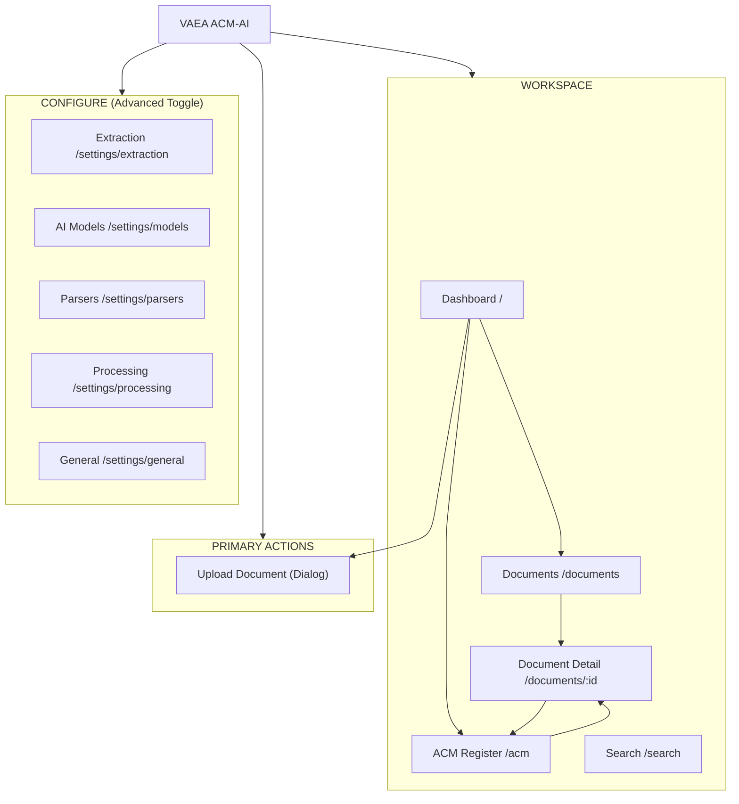
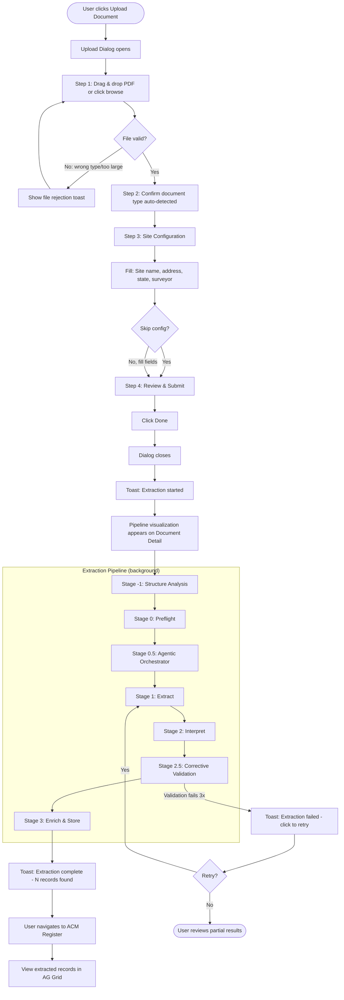
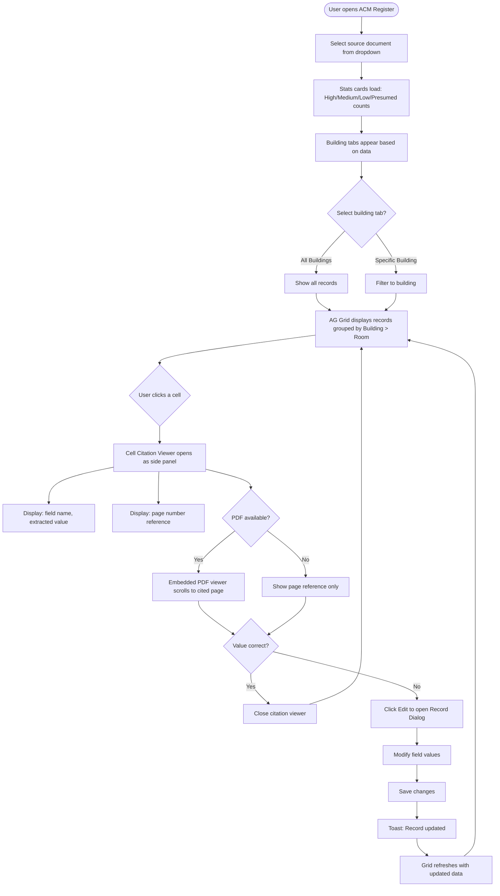
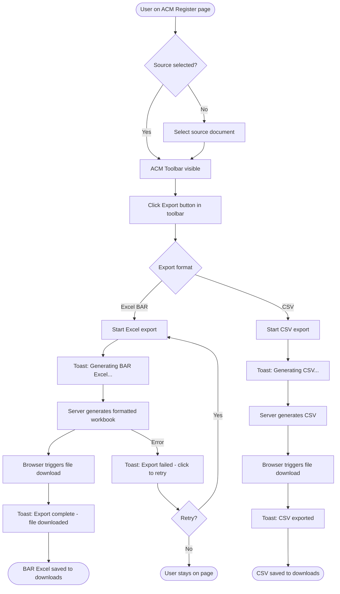
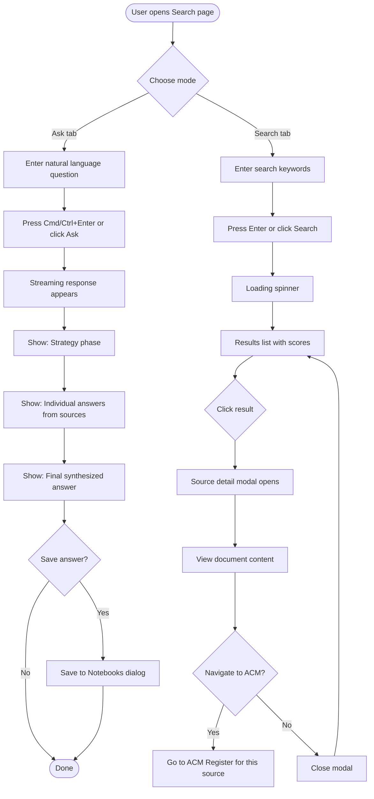
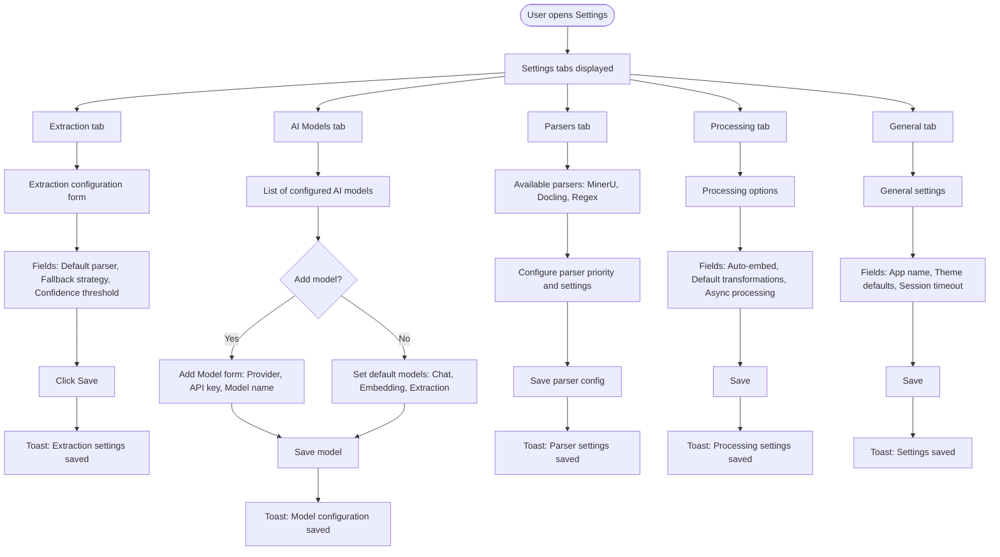
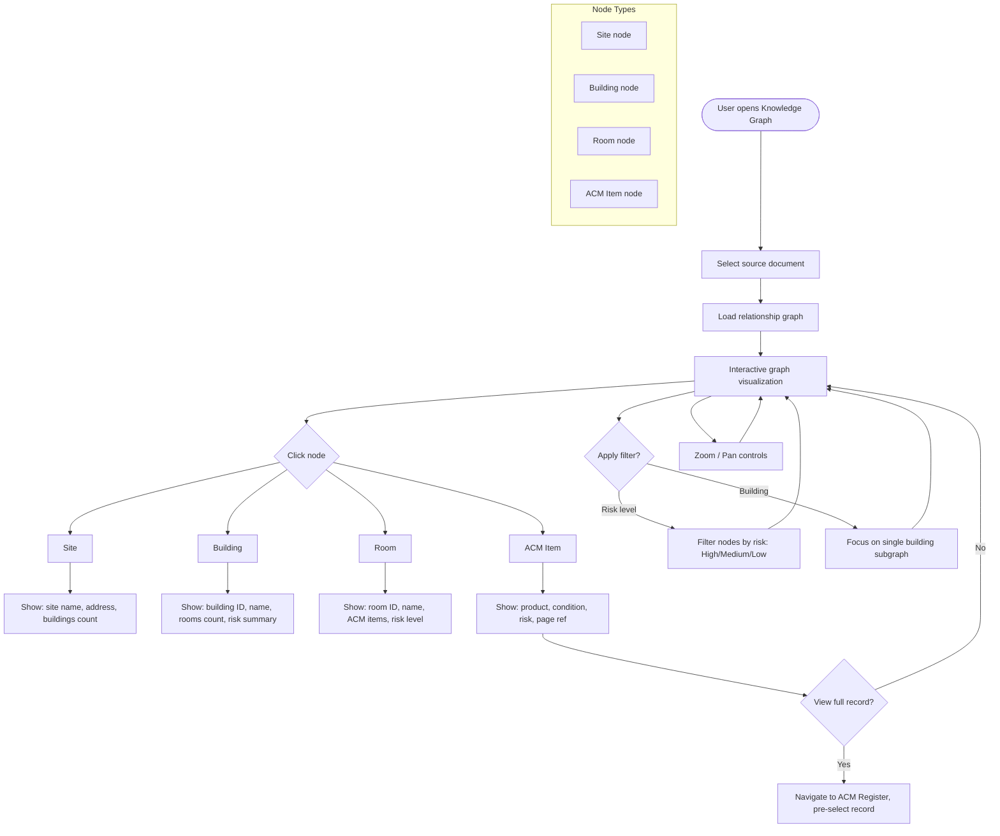

# UI/UX Specification: VAEA ACM-AI

> **Version:** 1.0
> **Date:** 2026-02-08
> **Client:** Victorian Asbestos Eradication Agency (VAEA)
> **Vendor:** CoralShades
> **Status:** APPROVED FOR IMPLEMENTATION

---

## Table of Contents

1. [Information Architecture](#1-information-architecture)
2. [User Flow Diagrams](#2-user-flow-diagrams)
3. [Page Layout Specifications](#3-page-layout-specifications)
4. [Navigation Structure](#4-navigation-structure)
5. [Interaction Patterns](#5-interaction-patterns)
6. [Modal and Dialog Patterns](#6-modal-and-dialog-patterns)
7. [Form Patterns and Validation](#7-form-patterns-and-validation)
8. [Export Workflow](#8-export-workflow)
9. [Responsive Behavior](#9-responsive-behavior)
10. [Dual-Persona UX](#10-dual-persona-ux)

---

## 1. Information Architecture

### 1.1 Site Map



### 1.2 Content Hierarchy

| Level | Content | Access |
|-------|---------|--------|
| L0 - Global | Sidebar navigation, Upload CTA, Theme toggle, Sign out | Always visible |
| L1 - Pages | Dashboard, Documents, ACM Register, Search | Sidebar links |
| L2 - Detail | Document detail, ACM cell viewer, Record dialog | In-page navigation |
| L3 - Overlays | Upload wizard, Export progress, Confirmation dialogs | User-triggered actions |
| L4 - Configure | Extraction, Models, Parsers, Processing, General | Advanced toggle |

### 1.3 Feature Visibility Matrix

| Feature | Compliance Officer | Consultant (Advanced) |
|---------|-------------------|----------------------|
| Dashboard | Full | Full |
| Upload Document | Full | Full + batch mode |
| Documents List | Grid view | Grid + table view |
| ACM Register | View + export | View + edit + extract |
| Search | Simple query | Text + vector + filters |
| Cell Citation Viewer | View only | View + edit record |
| Export BAR Excel | One-click | One-click + CSV option |
| Extraction Settings | Hidden | Full access |
| AI Models | Hidden | Full access |
| Parser Configuration | Hidden | Full access |
| Processing Settings | Hidden | Full access |
| Knowledge Graph | Hidden | Full access |
| Batch Operations | Hidden | Full access |

---

## 2. User Flow Diagrams

### 2.1 UC-1: Upload PDF and Extract ACM Data

This is the primary use case: a compliance officer uploads a SAMP PDF and the system extracts structured ACM register data.



### 2.2 UC-2: Review and Validate ACM Records



### 2.3 UC-3: Export BAR-Compliant Excel



### 2.4 UC-4: Search ACM Data



### 2.5 UC-5: Configure Extraction Settings



### 2.6 UC-6: Explore Knowledge Graph



---

## 3. Page Layout Specifications

### 3.1 Dashboard (`/`)

The dashboard provides at-a-glance compliance overview with VAEA branding.

```
+------------------------------------------------------------------+
| SIDEBAR  |  Dashboard                                             |
| (see     |  Your ACM compliance overview                          |
|  sec 4)  +--------------------------------------------------------+
|          |                                                        |
|          |  +------------+  +------------+  +----------+  +------+|
|          |  | Total      |  | High Risk  |  | Medium   |  | Low  ||
|          |  | Sources    |  | Items      |  | Risk     |  | Risk ||
|          |  | [42]       |  | [7] !      |  | [15]     |  | [20] ||
|          |  | 3 this wk  |  | Require    |  | Monitor  |  | Good ||
|          |  +------------+  | attention  |  | regular  |  | cond ||
|          |                  +------------+  +----------+  +------+|
|          |                                                        |
|          |  +---------------------------+  +---------------------+|
|          |  | Risk Distribution         |  | Recent Uploads      ||
|          |  |                           |  |                     ||
|          |  |   [Donut/Bar chart]       |  | - Report_A.pdf  2h ||
|          |  |   High: 7  Med: 15        |  | - Survey_B.pdf  1d ||
|          |  |   Low: 20  Presumed: 5    |  | - SAMP_C.pdf    3d ||
|          |  |                           |  | - Report_D.pdf  5d ||
|          |  |  View all ACM data ->     |  |                     ||
|          |  +---------------------------+  | View all sources -> ||
|          |                                 +---------------------+|
|          |  +---------------------+                               |
|          |  | Quick Actions       |                               |
|          |  | [Upload Document]   |                               |
|          |  | [View ACM Register] |                               |
|          |  | [Search Documents]  |                               |
|          |  +---------------------+                               |
+------------------------------------------------------------------+
```

**Key elements:**
- 4-column bento grid for stat cards (risk counts)
- Large card for risk distribution chart (donut or horizontal bar)
- Medium card for recent uploads (5 most recent, linked)
- Medium card for quick action buttons
- All cards use skeleton loading (pulse animation) during fetch
- Stats cards use semantic colors: red (high), amber (medium), green (low), purple (presumed)

### 3.2 Documents Page (`/documents`)

Merges the current Sources and Documents pages into a single unified list.

```
+------------------------------------------------------------------+
| SIDEBAR  |  Documents                                    [Upload] |
|          |  Manage your uploaded documents                        |
|          +--------------------------------------------------------+
|          |  [Search...                    ] [Grid|Table] [Filters] |
|          +--------------------------------------------------------+
|          |                                                        |
|          |  +--------------------------------------------------+ |
|          |  | Grid View (default)                               | |
|          |  |                                                    | |
|          |  |  +-------------+  +-------------+  +-------------+ |
|          |  |  | [PDF icon]  |  | [PDF icon]  |  | [PDF icon]  | |
|          |  |  | Report A    |  | Survey B    |  | SAMP C      | |
|          |  |  | 42 records  |  | Processing..|  | 18 records  | |
|          |  |  | [High: 3]   |  | [Spinner]   |  | [Low risk]  | |
|          |  |  | 2 hours ago |  | Just now    |  | 3 days ago  | |
|          |  |  +-------------+  +-------------+  +-------------+ |
|          |  |                                                    | |
|          |  |  +-------------+  +-------------+                  | |
|          |  |  | [PDF icon]  |  | [+ Upload]  |                  | |
|          |  |  | Report D    |  | Add new     |                  | |
|          |  |  | 25 records  |  | document    |                  | |
|          |  |  | [Med risk]  |  |             |                  | |
|          |  |  | 5 days ago  |  |             |                  | |
|          |  |  +-------------+  +-------------+                  | |
|          |  +--------------------------------------------------+ |
+------------------------------------------------------------------+
```

**Key elements:**
- Search/filter bar at top
- View toggle: grid (default) / table
- Each card shows: file type icon, title, record count, risk summary badge, age
- Documents currently processing show a spinner and "Processing..." status
- Empty state: large upload CTA
- Grid uses CSS grid: 3 columns on desktop, 2 on tablet

### 3.3 ACM Register Page (`/acm`)

The core data review page using AG Grid.

```
+------------------------------------------------------------------+
| SIDEBAR  |  ACM Register                                         |
|          |  View and manage ACM records from source documents     |
|          +--------------------------------------------------------+
|          |  Source: [Select a source document...        v]        |
|          +--------------------------------------------------------+
|          |                                                        |
|          |  +----------+  +----------+  +----------+  +--------+ |
|          |  | High     |  | Medium   |  | Low      |  | Presmd | |
|          |  | Risk: 7  |  | Risk: 15 |  | Risk: 20 |  | 5      | |
|          |  +----------+  +----------+  +----------+  +--------+ |
|          |                                                        |
|          |  +--------------------------------------------------+ |
|          |  |  ACM Records                     [Site Config]   | |
|          |  +--------------------------------------------------+ |
|          |  | [All] [Building A] [Building B] [Building C]     | |
|          |  +--------------------------------------------------+ |
|          |  | [Add] [Extract] [Export v] [Refresh]  [Search...] | |
|          |  | [Expand All] [Collapse All]   Showing 42 of 47   | |
|          |  +--------------------------------------------------+ |
|          |  | Location   | Product  | Desc... | Risk | Page |Act||
|          |  +--------------------------------------------------+ |
|          |  | v Bldg A - Main Building (15)                    | |
|          |  |   v Room 101 - Office (3)                        | |
|          |  |     | Vinyl tiles | Floor..| Med  | 12  |ED||
|          |  |     | Cement sheet| Wall...| Low  | 12  |ED||
|          |  |     | Pipe laging | Pipe...| High | 13  |ED||
|          |  |   v Room 102 - Store (2)                         | |
|          |  |     | Millboard  | Heater.| High | 14  |ED||
|          |  |     | Rope seal  | Flue...| Med  | 14  |ED||
|          |  +--------------------------------------------------+ |
|          |  | < 1 2 3 ... > | 50 per page [20|50|100]          | |
|          +--------------------------------------------------------+
|          |                                                        |
|          |  +--CELL CITATION VIEWER (side panel)---------------+ |
|          |  |  Field: Product                                   | |
|          |  |  Value: "Vinyl floor tiles"                       | |
|          |  |  Page: 12                                         | |
|          |  |                                                    | |
|          |  |  [PDF Viewer - page 12 highlighted]               | |
|          |  |  ...                                               | |
|          |  |  [Edit Record] [Close]                             | |
|          |  +--------------------------------------------------+ |
+------------------------------------------------------------------+
```

**Key elements:**
- Source document selector (dropdown with search)
- Risk stats cards (4 cards, same as dashboard but scoped to source)
- Building tabs (dynamically generated from data)
- ACM Toolbar with: Add, Extract, Export (dropdown), Refresh, Search, group controls
- AG Grid with row grouping by Building > Room
- Columns: Location (auto-group), Product, Description, Risk (badge), Result, Friable, Condition, Page, Actions
- Cell click opens citation viewer side panel
- Pagination: 50 per page default, options: 20/50/100

### 3.4 Search Page (`/search`)

Simplified search with ACM-aware query capabilities.

```
+------------------------------------------------------------------+
| SIDEBAR  |  Search                                                |
|          +--------------------------------------------------------+
|          |  Choose a mode                                         |
|          |  [Ask (beta)] [Search]                                 |
|          +--------------------------------------------------------+
|          |                                                        |
|          |  ASK TAB:                                              |
|          |  +--------------------------------------------------+ |
|          |  | Ask Your Knowledge Base                           | |
|          |  | The LLM will answer your query based on docs      | |
|          |  |                                                    | |
|          |  | Question:                                          | |
|          |  | [Which buildings have high-risk friable ACM?    ]  | |
|          |  | Cmd/Ctrl+Enter to submit                           | |
|          |  |                                                    | |
|          |  | Using Default Models     [Advanced]                | |
|          |  | Strategy: gpt-4  Answer: gpt-4  Final: gpt-4      | |
|          |  |                                                    | |
|          |  | [Ask]                    [Save to Notebooks]        | |
|          |  |                                                    | |
|          |  | --- Streaming Response ---                         | |
|          |  | Strategy: Searching 3 sources for asbestos risk... | |
|          |  | Answer 1: Building A has 3 high-risk items...      | |
|          |  | Answer 2: Building C has 1 high-risk item...       | |
|          |  | Final: Based on analysis, Buildings A and C...     | |
|          |  +--------------------------------------------------+ |
+------------------------------------------------------------------+
```

### 3.5 Settings Page (`/settings`)

Tabbed interface consolidating all configuration.

```
+------------------------------------------------------------------+
| SIDEBAR  |  Settings                                   [Refresh]  |
|          +--------------------------------------------------------+
|          |  [Extraction] [AI Models] [Parsers] [Processing] [Gen] |
|          +--------------------------------------------------------+
|          |                                                        |
|          |  EXTRACTION TAB:                                       |
|          |  +--------------------------------------------------+ |
|          |  | Default Extraction Parser                         | |
|          |  | [MinerU           v]                              | |
|          |  |                                                    | |
|          |  | Fallback Strategy                                  | |
|          |  | [Auto-fallback to regex v]                         | |
|          |  |                                                    | |
|          |  | Confidence Threshold                               | |
|          |  | [0.7                    ] (0.0 - 1.0)              | |
|          |  |                                                    | |
|          |  | Auto-extract on Upload                             | |
|          |  | [x] Automatically trigger extraction after upload  | |
|          |  |                                                    | |
|          |  | Corrective Validation                              | |
|          |  | [x] Enable LLM re-extraction on validation failure | |
|          |  | Max correction attempts: [3]                       | |
|          |  |                                                    | |
|          |  | [Save Changes]                                     | |
|          |  +--------------------------------------------------+ |
+------------------------------------------------------------------+
```

---

## 4. Navigation Structure

### 4.1 Sidebar Specification

The sidebar replaces the current 4-section (Collect/Process/Create/Manage) layout with a streamlined 2-section design.

```
+-----------------------------+
| [VAEA Logo]  VAEA ACM-AI  [<]|  <- Collapse button
+-----------------------------+
| [Upload Document]            |  <- Primary CTA (teal bg, white text)
+-----------------------------+
| WORKSPACE                    |  <- Section label
|   Dashboard                  |  <- LayoutDashboard icon
|   Documents                  |  <- FileText icon
|   ACM Register               |  <- FileWarning icon
|   Search                     |  <- Search icon
+-----------------------------+
| CONFIGURE                    |  <- Section label (collapsed by default)
|   Extraction                 |  <- Layers icon
|   AI Models                  |  <- Bot icon
|   Parsers                    |  <- Code icon
|   Processing                 |  <- Cpu icon
|   General                    |  <- Settings icon
+-----------------------------+
| Cmd+K  Quick actions         |  <- Keyboard shortcut hint
+-----------------------------+
| [VAEA Logo]                  |
| Powered by CoralShades       |  <- Vendor attribution
| [Theme] [Sign Out]           |
+-----------------------------+
```

**Behavior:**
- Sidebar is collapsible (icon-only mode, 64px wide)
- Expanded width: 256px
- WORKSPACE section expanded by default
- CONFIGURE section collapsed by default for compliance officers, expanded for consultants
- Active page highlighted with `bg-sidebar-accent` background
- Upload Document button is always visible (not hidden when collapsed - shows as icon)
- Logo area: VAEA Ripple2 logo full (expanded) or icon-only (collapsed)
- Footer: VAEA logo, CoralShades vendor mark, theme toggle, sign out
- Tooltip on hover for collapsed items

### 4.2 Items Removed from Navigation

| Item | Current Location | Action |
|------|-----------------|--------|
| Sources | Collect section | Merged into Documents |
| Notebooks | Process section | Removed from nav (code retained) |
| Podcasts | Create section | Removed from nav (code retained) |
| Transformations | Manage section | Removed from nav (code retained) |
| Advanced | Manage section | Merged into Settings/General |
| Create dropdown | Below Dashboard | Replaced with Upload Document button |

### 4.3 Breadcrumb Pattern

Breadcrumbs appear below the page title for detail pages:

```
Documents > Report_A.pdf > ACM Records
Settings > Extraction
```

Implementation: Simple text breadcrumb using Next.js pathname segments. Not needed for top-level pages.

---

## 5. Interaction Patterns

### 5.1 Pipeline Visualization (AG-UI)

The extraction pipeline uses a multi-stage progress visualization. This replaces the current basic `ACMExtractionBanner` which only shows "extracting..." with a spinner.

**Stage Indicator Component:**

```
+------------------------------------------------------------------+
| Extraction Pipeline                               [Collapse ^]    |
+------------------------------------------------------------------+
| [done] Structure Analysis    0.8s                                 |
| [done] Preflight             0.3s  Format: Prensa                 |
| [>>  ] Agentic Orchestrator  2.1s  Selecting tools...             |
| [    ] Extract               --    Pending                        |
| [    ] Interpret             --    Pending                        |
| [    ] Corrective Validation --    Pending                        |
| [    ] Enrich & Store        --    Pending                        |
+------------------------------------------------------------------+
| Total elapsed: 3.2s          Records found: 0                     |
+------------------------------------------------------------------+
```

**Stage states and icons:**
| State | Icon | Color | Description |
|-------|------|-------|-------------|
| Pending | Circle (outline) | `text-muted-foreground` | Not started |
| Running | Spinner (animated) | `text-primary` (teal) | Currently executing |
| Complete | CheckCircle (filled) | `text-success` (green) | Finished successfully |
| Failed | XCircle (filled) | `text-destructive` (red) | Error occurred |

**Behavior:**
- Collapsed by default: shows single-line summary "Extracting... Stage 2 of 7"
- Expandable to show all stages with details
- Each stage shows: icon, name, duration timer, status detail
- Running stage has animated spinner and pulsing background
- Failed stage shows error message with retry button
- On completion: auto-collapses after 5 seconds, shows summary toast
- Updates via WebSocket/SSE (real-time)

### 5.2 Skeleton Loading

Every page implements skeleton loading instead of a centered spinner.

**Dashboard skeleton:**
```
+----------+  +----------+  +----------+  +----------+
| [pulse]  |  | [pulse]  |  | [pulse]  |  | [pulse]  |
| ####     |  | ####     |  | ####     |  | ####     |
| ##       |  | ##       |  | ##       |  | ##       |
+----------+  +----------+  +----------+  +----------+

+--------------------------+  +--------------------+
| [pulse]                  |  | [pulse]            |
| #########                |  | ####               |
| ####                     |  | ####               |
| ####                     |  | ####               |
+--------------------------+  +--------------------+
```

**Skeleton implementation pattern:**
- Use `Skeleton` component from `@/components/ui/skeleton`
- Match the layout shape of real content
- Use `animate-pulse` (Tailwind) for shimmer effect
- Duration: show skeleton for minimum 200ms to prevent flash
- Transition: fade skeleton out, fade content in (150ms)

**Pages requiring skeletons:**
| Page | Skeleton Elements |
|------|------------------|
| Dashboard | 4 stat cards, 2 medium cards, 1 large card |
| Documents | 6 document cards in grid layout |
| ACM Register | Source dropdown, 4 stat cards, grid area |
| Search | Search input area (no skeleton needed - static) |
| Settings | Form fields group |
| Document Detail | Content panel, metadata panel |

### 5.3 Toast Notifications

Sonner-based toast system for all feedback. Replaces inline Alert components for transient notifications.

**Toast types and usage:**

| Action | Toast Type | Message | Duration |
|--------|-----------|---------|----------|
| Upload started | `promise` | "Processing document..." -> "Document uploaded" | Until resolved |
| Extraction started | `info` | "ACM extraction started for {title}" | 3s |
| Extraction complete | `success` | "Extraction complete: {n} records found" | 5s |
| Extraction failed | `error` | "Extraction failed: {reason}. Click to retry" | Persistent |
| Export started | `promise` | "Generating BAR Excel..." -> "Export ready" | Until resolved |
| Record saved | `success` | "Record updated" | 2s |
| Record deleted | `success` | "Record deleted" | 2s |
| Settings saved | `success` | "Settings saved" | 2s |
| API error | `error` | "Failed to {action}: {reason}" | 5s |
| Connection lost | `warning` | "Connection lost. Retrying..." | Persistent |

**Promise toast pattern (for long-running operations):**
```typescript
toast.promise(exportExcel(sourceId), {
  loading: 'Generating BAR Excel...',
  success: 'Export complete - file downloaded',
  error: 'Export failed. Please try again.',
})
```

### 5.4 Optimistic Updates

CRUD operations on ACM records use optimistic updates for responsive UX.

**Pattern:**
1. User triggers action (edit, delete)
2. UI updates immediately with expected result
3. API request sent in background
4. On success: no UI change needed (already showing correct state)
5. On failure: revert UI to previous state, show error toast

**Operations with optimistic updates:**
| Operation | Optimistic Behavior |
|-----------|-------------------|
| Edit record | Grid cell updates immediately |
| Delete record | Row removed from grid immediately |
| Toggle risk filter | Grid filters immediately (client-side) |
| Site config save | Form shows saved state immediately |

**Operations WITHOUT optimistic updates (server response required):**
| Operation | Reason |
|-----------|--------|
| Extract ACM | Server-side processing, unpredictable duration |
| Export file | Server generates file, browser downloads |
| Create source | Server assigns ID, processes content |

### 5.5 Error Recovery

**Error boundary hierarchy:**
```
App Error Boundary (catches unrecoverable errors)
  -> Page Error Boundary (per-route, shows retry button)
    -> Component Error Boundary (per-feature, shows inline retry)
```

**API error handling:**
- Network errors: Show ConnectionGuard overlay with retry countdown
- 401 Unauthorized: Redirect to login
- 404 Not Found: Show "Document not found" empty state
- 429 Rate Limit: Show toast with retry-after countdown
- 500 Server Error: Show toast with generic retry button

---

## 6. Modal and Dialog Patterns

### 6.1 Dialog Types

| Type | Component | Size | Closable | Usage |
|------|-----------|------|----------|-------|
| Upload Wizard | `AddSourceDialog` | `max-w-[700px]` | Yes (X button) | Multi-step document upload |
| Record Edit | `ACMRecordDialog` | `max-w-[600px]` | Yes | Create/edit ACM records |
| Confirm Delete | `ConfirmDialog` | `max-w-[400px]` | Yes | Destructive action confirmation |
| Cell Viewer | `ACMCellViewer` | Side panel (400px) | Yes (X or Escape) | Citation verification |
| Source Detail | `SourceDialog` | `max-w-[800px]` | Yes | Document content viewer |
| Export Progress | Toast (Sonner) | N/A | Auto-dismiss | Export status feedback |

### 6.2 Dialog Patterns

**Opening:**
- Dialogs animate in with scale + fade (150ms)
- Backdrop overlay: `bg-black/50` with `backdrop-blur-sm`
- Focus trapped inside dialog
- First focusable element receives focus

**Closing:**
- X button in top-right
- Escape key
- Click outside (except for wizards with unsaved changes)
- Animate out with scale + fade (100ms)
- Focus returns to trigger element

**Confirmation dialogs (destructive actions):**
- Red destructive button for confirm action
- "Cancel" button always on left
- Destructive button on right
- Loading state on confirm button during async operation
- Cannot close while operation is pending

### 6.3 Wizard Dialog Pattern (Upload)

The upload dialog uses a multi-step wizard:

```
+----------------------------------------------------+
| Add New Source                                   [X] |
| Upload a document for ACM extraction                |
+----------------------------------------------------+
| Step 1       Step 2       Step 3       Step 4       |
| Source >     Site Config > Notebooks > Processing   |
| (active)     (pending)    (pending)   (pending)    |
+----------------------------------------------------+
|                                                      |
|  [Step content area - varies by step]                |
|                                                      |
+----------------------------------------------------+
| [Cancel]                    [Back] [Next] [Done]    |
+----------------------------------------------------+
```

**Step navigation rules:**
- Can go back to any previously visited step
- Can only advance to next step if current step is valid
- "Done" button is always visible and submits on any step (early completion)
- Steps auto-adjust: upload type has 4 steps (adds Site Config), link/text has 3 steps

---

## 7. Form Patterns and Validation

### 7.1 Form Structure

All forms use React Hook Form + Zod for validation.

**Form section component:**
```
+----------------------------------------------------+
| Section Label                                       |
| Helper text explaining the section                  |
+----------------------------------------------------+
| Field Label                              [Required] |
| [Input field                                      ] |
| Helper text or validation error                     |
|                                                      |
| Field Label                              [Optional] |
| [Input field                                      ] |
+----------------------------------------------------+
```

**Field states:**
| State | Visual |
|-------|--------|
| Default | Standard border color |
| Focus | Teal focus ring (`ring-2 ring-primary`) |
| Error | Red border + red error text below field |
| Disabled | Reduced opacity, no hover effects |
| Loading | Skeleton pulse in place of field |

### 7.2 Validation Rules

**Upload form:**
| Field | Rule | Error Message |
|-------|------|--------------|
| File | Required, max 100MB, accepted types only | "Invalid file type" / "File too large" |
| URL | Required for link type, valid URL format | "Please enter a valid URL" |
| Content | Required for text type | "Please provide content" |
| Title | Required for text type | "Title is required for text sources" |
| Batch size | Max 50 items | "Maximum 50 files per batch" |

**ACM Record form:**
| Field | Rule | Error Message |
|-------|------|--------------|
| Building ID | Required | "Building ID is required" |
| Room ID | Optional | N/A |
| Product | Required | "Product name is required" |
| Risk Status | Enum: High/Medium/Low/Presumed | "Select a risk level" |

**Site Configuration form:**
| Field | Rule | Error Message |
|-------|------|--------------|
| Site Name | Optional | N/A |
| Address | Optional | N/A |
| State | Optional, Australian state enum | "Select a valid state" |
| Surveyor | Optional | N/A |

### 7.3 Form Submission

**Pattern:**
1. Client-side validation runs on submit (Zod schema)
2. If valid: disable form, show loading state on submit button
3. Send API request
4. On success: close dialog/form, show success toast
5. On error: re-enable form, show error toast, preserve user input

**Submit button states:**
| State | Label | Appearance |
|-------|-------|------------|
| Ready | "Save" / "Done" | Primary button (teal) |
| Loading | "Saving..." / "Creating..." | Primary + spinner, disabled |
| Disabled | "Save" / "Done" | Muted, cursor not-allowed |

---

## 8. Export Workflow

### 8.1 Export Types

| Format | File | Description |
|--------|------|-------------|
| BAR Excel | `.xlsx` | Victorian BAR-compliant formatted workbook with headers, risk color coding |
| CSV | `.csv` | Simple comma-separated values for data analysis |

### 8.2 Export Flow

**Trigger:** User clicks Export button in ACM Register toolbar.

**Excel (BAR) Export:**
1. User clicks "Export" -> "Excel (BAR Format)" from dropdown
2. Toast promise: "Generating BAR Excel..."
3. API call: `POST /api/acm/export/excel?source_id={id}`
4. Server generates formatted workbook:
   - Header row with VAEA branding
   - Column headers matching BAR specification
   - Risk cells color-coded (red/amber/green)
   - Per-building worksheet tabs
5. Response: File download triggered via blob URL
6. Toast success: "BAR Excel exported - file downloaded"

**CSV Export:**
1. User clicks "Export" -> "CSV" from dropdown
2. Toast promise: "Generating CSV..."
3. API call: `POST /api/acm/export/csv?source_id={id}`
4. Response: File download triggered
5. Toast success: "CSV exported"

### 8.3 Export Button Behavior

```
[Export v]  <- Dropdown trigger
  |
  +-- Excel (BAR Format)   <- Primary export
  +-- CSV                   <- Alternative export
```

- Button disabled when no source is selected
- Button disabled during active export (shows spinner)
- Dropdown opens above or below based on viewport space

---

## 9. Responsive Behavior

### 9.1 Breakpoints

| Breakpoint | Width | Device | Layout Changes |
|-----------|-------|--------|----------------|
| Desktop (default) | >= 1280px | Desktop monitor | Full sidebar + content |
| Tablet landscape | 1024px - 1279px | iPad landscape | Collapsed sidebar, full content |
| Tablet portrait | 768px - 1023px | iPad portrait, government tablets | Overlay sidebar, stacked layout |
| Mobile | < 768px | Phone (secondary) | Bottom nav, single column |

### 9.2 Desktop (>= 1280px)

- Full sidebar expanded (256px)
- Content area fills remaining width
- AG Grid columns all visible
- Bento grid: 4 columns
- Document grid: 3-4 columns
- Cell citation viewer: side panel (400px)

### 9.3 Tablet Landscape (1024px - 1279px)

- Sidebar auto-collapsed to icon-only (64px)
- Content area gets more width
- AG Grid: horizontal scroll for extra columns
- Bento grid: 4 columns (narrower cards)
- Document grid: 3 columns
- Cell citation viewer: slide-over panel from right

### 9.4 Tablet Portrait (768px - 1023px)

This is the primary "on-site" viewport for government officers using tablets.

- Sidebar: hidden, hamburger menu opens overlay sidebar
- Content: full width
- AG Grid: fewer visible columns, horizontal scroll
- Bento grid: 2 columns
- Document grid: 2 columns
- Cell citation viewer: full-screen modal (not side panel)
- Upload dialog: full-width
- Touch-friendly: larger tap targets (min 44x44px)

### 9.5 Mobile (< 768px) - Secondary Support

- Bottom navigation bar (4 items: Dashboard, Documents, ACM, Search)
- Settings accessible via menu/hamburger
- Single column layout
- AG Grid: card view instead of grid (one record per card)
- Modals: full-screen sheets (slide up from bottom)
- Not a primary development target

---

## 10. Dual-Persona UX

### 10.1 Mode Switching

The application defaults to Compliance Officer mode. An "Advanced" toggle in the sidebar footer or settings reveals consultant features.

**Toggle location:** Settings > General > "Enable advanced features"

Alternatively, the CONFIGURE section label in the sidebar acts as a toggle:
- Collapsed by default for compliance officers
- Expanding it reveals all configuration pages
- State persisted in localStorage

### 10.2 Compliance Officer View (Default)

**Focus:** Upload -> Wait -> Review -> Export

**Visible features:**
- Dashboard with risk overview
- Documents list (grid view only)
- Upload Document button (simplified wizard - skip optional steps)
- ACM Register (view + export only)
- Search (Ask mode only, no advanced models)
- Export BAR Excel (single button)

**Hidden features:**
- CONFIGURE section collapsed
- Extract button hidden from toolbar
- Edit/Delete actions hidden from ACM grid
- Table view toggle hidden
- Batch upload hidden
- Advanced search options hidden

### 10.3 Consultant View (Advanced Toggle)

**Focus:** Full pipeline control and data management

**Additional features revealed:**
- CONFIGURE section expanded with all 5 tabs
- Extract button in ACM toolbar
- Edit/Delete actions in ACM grid
- Table view toggle for documents
- Batch upload mode (multi-file)
- Parser and extraction configuration
- Knowledge Graph access
- Advanced search with vector search and filters
- Record editing capabilities
- Site configuration management

### 10.4 Feature Toggle Implementation

Feature visibility is controlled via a Zustand store:

```typescript
// Conceptual - not actual code
interface UserModeStore {
  isAdvancedMode: boolean
  toggleAdvancedMode: () => void
}
```

Components conditionally render based on mode:
- Sidebar CONFIGURE section: visible when `isAdvancedMode` or always present but collapsed
- ACM toolbar actions: filtered based on mode
- Grid action column: hidden in basic mode
- Settings tabs: only General visible in basic mode

---

## Appendix A: Page Route Map

| Route | Page | Status |
|-------|------|--------|
| `/` | Dashboard | Keep - redesign |
| `/documents` | Documents (merged sources + documents) | Keep - merge |
| `/documents/[id]` | Document Detail | Keep |
| `/acm` | ACM Register | Keep - core |
| `/search` | Search | Keep - simplify |
| `/settings` | Settings (tabbed) | Keep - expand |
| `/settings/extraction` | Extraction config | New |
| `/settings/models` | AI Models (moved from /models) | Move |
| `/settings/parsers` | Parser config | New |
| `/settings/processing` | Processing config | New |
| `/settings/general` | General (merged /settings + /advanced) | Merge |
| `/login` | Login page | Keep |

**Routes to hide from navigation (code retained):**
| Route | Reason |
|-------|--------|
| `/notebooks` | Not part of ACM workflow |
| `/notebooks/[id]` | Not part of ACM workflow |
| `/podcasts` | Not part of ACM workflow |
| `/transformations` | Not part of ACM workflow |
| `/sources` | Merged into /documents |
| `/models` | Moved to /settings/models |
| `/advanced` | Merged into /settings/general |

## Appendix B: Icon Map

| Feature | Icon (Lucide) | Usage |
|---------|--------------|-------|
| Dashboard | `LayoutDashboard` | Sidebar nav |
| Documents | `FileText` | Sidebar nav, cards |
| ACM Register | `FileWarning` | Sidebar nav, page header |
| Search | `Search` | Sidebar nav, search input |
| Upload | `Upload` | Primary CTA |
| Extraction | `Layers` | Settings tab |
| AI Models | `Bot` | Settings tab |
| Parsers | `Code` | Settings tab |
| Processing | `Cpu` | Settings tab |
| General Settings | `Settings` | Settings tab |
| High Risk | `AlertTriangle` | Risk badge, stats |
| Medium Risk | `TrendingUp` | Risk badge, stats |
| Low Risk | `CheckCircle` | Risk badge, stats |
| Presumed Risk | `HelpCircle` | Risk badge, stats |
| Edit | `Edit2` | Grid action |
| Delete | `Trash2` | Grid action |
| Export | `Download` | Toolbar |
| Refresh | `RefreshCw` | Toolbar |
| Theme Toggle | `Sun` / `Moon` | Footer |
| Sign Out | `LogOut` | Footer |
| Collapse Sidebar | `ChevronLeft` | Sidebar header |
| Expand Sidebar | `Menu` | Sidebar header |

---

*End of UI/UX Specification*
