# UX Audit: ACM-AI Frontend

> **Date:** 2026-02-08
> **Auditor:** UX Audit Agent
> **Application:** ACM-AI (Asbestos Containing Material - AI Document Intelligence)
> **Client:** VAEA (Victorian Asbestos Eradication Agency)
> **Frontend Stack:** Next.js 15 / React 19 / Tailwind CSS 4 / Radix UI / AG Grid / Zustand / React Query
> **Codebase Path:** `/mnt/d/ailocal/acm-ai-frontend/frontend/src/`

---

## Table of Contents

1. [Navigation Assessment](#1-navigation-assessment)
2. [Page-by-Page Review](#2-page-by-page-review)
3. [Component Quality](#3-component-quality)
4. [Loading and Error Patterns](#4-loading-and-error-patterns)
5. [Accessibility (WCAG 2.1 AA)](#5-accessibility-wcag-21-aa)
6. [State Management](#6-state-management)
7. [User Flow Mapping](#7-user-flow-mapping)
8. [Brownfield Debt](#8-brownfield-debt)
9. [Enterprise Readiness Gaps](#9-enterprise-readiness-gaps)
10. [Dual-Persona UX](#10-dual-persona-ux)

---

## 1. Navigation Assessment

### Current Structure

The sidebar (`AppSidebar.tsx`) organizes 11 navigation items into 4 collapsible sections:

| Section | Items | Icons |
|---------|-------|-------|
| **Collect** | Sources, Documents, ACM Register | FileText, Library, FileWarning |
| **Process** | Notebooks, Ask and Search | Book, Search |
| **Create** | Podcasts | Mic |
| **Manage** | Models, Transformations, Settings, Advanced | Bot, Shuffle, Settings, Wrench |

Additionally:
- **Dashboard** link is always visible above sections
- **Create** dropdown button offers Source / Notebook / Podcast creation
- **Footer** contains Command Palette hint (Cmd+K), Theme toggle, Sign Out

### Findings

| ID | Finding | Severity | Details |
|----|---------|----------|---------|
| NAV-01 | Section taxonomy is confusing | **High** | "Collect / Process / Create / Manage" is a generic knowledge-management taxonomy inherited from Open Notebook. ACM compliance officers think in terms of "upload, review, export" -- not "collect, process, create." |
| NAV-02 | Irrelevant items clutter navigation | **High** | Podcasts, Transformations, and Notebooks are Open Notebook features with no role in ACM compliance workflows. They add cognitive load and confuse the primary user persona. |
| NAV-03 | "Create" button offers wrong actions | **Medium** | The dropdown offers Source / Notebook / Podcast. For ACM workflow, it should be a single "Upload Document" action. Creating a notebook or podcast is never part of a compliance officer's workflow. |
| NAV-04 | Sources and Documents are separate items | **Medium** | Both `/sources` and `/documents` exist as separate pages. From the user's perspective, these are the same concept: "documents I uploaded." This split is a brownfield artifact. |
| NAV-05 | No extraction settings in navigation | **Medium** | Sprint change proposals define new configuration pages (Extraction Settings E12-S1, Parser Config E12-S4, Processing Config E12-S3) but the current nav has no space for them. |
| NAV-06 | Models and Advanced should be under Settings | **Low** | Model configuration and system tools (rebuild embeddings) are admin-level controls that belong under a unified Settings area, not as top-level nav items. |
| NAV-07 | No breadcrumbs for deep pages | **Medium** | Navigating to `/sources/[id]` shows no location context. Users lose track of where they are, especially when switching between source detail tabs. |
| NAV-08 | Collapsed sidebar loses section headers | **Low** | When collapsed, all items display as icon-only tooltips without section grouping, making it harder to scan for the right item. |
| NAV-09 | Command Palette includes irrelevant items | **Low** | `CommandPalette.tsx` lists navigation to Notebooks, Podcasts, Transformations, and create actions for all three. These should be hidden for ACM users. |

### Proposed Navigation Structure

```
VAEA ACM-AI
---------------------
[Upload Document]     (single primary CTA)
---------------------
WORKSPACE
  Dashboard           (compliance overview)
  Documents           (merged sources + documents)
  ACM Register        (core data grid)
  Search              (simplified)
---------------------
CONFIGURE
  Extraction          (E12-S1: extraction settings)
  AI Models           (existing /models page)
  Parsers             (E12-S4: parser configuration)
  Processing          (E12-S3: processing pipeline)
  General             (existing /settings + /advanced merged)
---------------------
[VAEA Logo]
Powered by CoralShades
[Theme Toggle] [Sign Out]
```

---

## 2. Page-by-Page Review

### Route Inventory

| Route | Page Component | Purpose | Recommendation | Severity |
|-------|---------------|---------|----------------|----------|
| `/` | `page.tsx` (Dashboard) | Bento grid with risk stats, recent uploads, quick actions | **KEEP** -- redesign for VAEA branding | -- |
| `/sources` | Sources page | Source list with grid/table toggle | **KEEP** -- rename to "Documents" | -- |
| `/sources/[id]` | Source detail | Tabbed view: Content, ACM, Insights, Chat | **KEEP** -- core workflow page | -- |
| `/documents` | Document library | Document cards with status/filtering | **KEEP** -- merge into unified `/documents` with `/sources` | Medium |
| `/acm` | ACM Register | Standalone AG Grid view of all ACM records | **KEEP** -- core feature | -- |
| `/search` | Ask and Search | Semantic search + AI ask | **KEEP** -- simplify UI | -- |
| `/notebooks` | Notebook list | Lists notebooks with create dialog | **HIDE** from nav | Low |
| `/notebooks/[id]` | Notebook detail | 3-column layout: sources, notes, chat | **HIDE** from nav | Low |
| `/podcasts` | Podcast generation | Episode generation + speaker profiles | **HIDE** from nav | Low |
| `/models` | AI Models | Add/configure AI models, set defaults | **MOVE** to Configure > AI Models | Low |
| `/transformations` | Transformations | Text transformation templates | **HIDE** from nav | Low |
| `/settings` | Settings | General app settings | **KEEP** -- expand for extraction config | -- |
| `/advanced` | Advanced | System info, rebuild embeddings | **MERGE** into Settings > General | Low |
| `/login` | Login | Auth login form | **KEEP** | -- |
| `/test-grid` | Test Grid | AG Grid test page | **REMOVE** -- development artifact | Low |

### Per-Page Analysis

#### Dashboard (`/`)
- **Strengths:** Clean bento grid layout, risk distribution chart (RiskChart), recent uploads list, quick action buttons.
- **Issues:**
  - Dashboard uses `useSources` and `useACMSummary` hooks but shows basic spinner during loading (no skeletons). **Severity: Medium**
  - Quick Actions section links to `/sources?action=upload` -- should link to the Upload Document dialog directly. **Severity: Low**
  - No time-range filtering for stats (always shows all-time data). **Severity: Low**

#### ACM Register (`/acm` and ACMTab component)
- **Strengths:** Well-structured component hierarchy: ACMStatsCards -> BuildingTabs -> ACMToolbar -> ACMExtractionBanner -> ACMGrid -> ACMCellViewer -> ACMRecordDialog. All wired cleanly.
- **Issues:**
  - Extraction banner (`ACMExtractionBanner.tsx`) shows only "AI is analyzing the document. This may take up to a minute..." with a generic spinner. No visibility into which pipeline stage is running. **Severity: Critical**
  - No skeleton loading for the grid -- just a blank area while `isLoadingRecords` is true. **Severity: Medium**
  - AG Grid is set to a fixed 500px height (`h-[500px]`). Should be responsive to viewport. **Severity: Medium**
  - Cell click opens citation viewer but there is no visual affordance (cursor changes but no tooltip or indicator). **Severity: Low**

#### Source Detail (`/sources/[id]`)
- **Strengths:** Tabbed layout, ACM tab is the star feature, PDF download integration.
- **Issues:**
  - No breadcrumbs showing `Documents > [Document Name] > ACM`. **Severity: Medium**
  - Tab selection state is not persisted in URL -- refreshing loses the active tab. **Severity: Low**

#### Search (`/search`)
- **Strengths:** Dual-mode (search + ask), streaming responses.
- **Issues:**
  - Model selector for search is advanced -- compliance officers should not need to choose models. **Severity: Low**
  - No recent/saved searches. **Severity: Low**

---

## 3. Component Quality

### ACM Component Suite (8 components)

| Component | File | Quality | Notes |
|-----------|------|---------|-------|
| `ACMGrid` | `components/acm/ACMGrid.tsx` | Good | AG Grid with row grouping, cell click, keyboard nav, pagination. Uses `forwardRef` for expand/collapse control. |
| `ACMToolbar` | `components/acm/ACMToolbar.tsx` | Good | Actions: add, extract, export CSV/Excel, refresh, expand/collapse, risk filter, search. |
| `BuildingTabs` | `components/acm/BuildingTabs.tsx` | Good | Tab navigation per building with session storage persistence. |
| `SiteConfigPanel` | `components/acm/SiteConfigPanel.tsx` | Good | Site configuration (address, client info) with form validation. |
| `ACMCellViewer` | `components/acm/ACMCellViewer.tsx` | Good | Citation viewer linking cell data to PDF page references. |
| `ACMRecordDialog` | `components/acm/ACMRecordDialog.tsx` | Good | Full CRUD dialog for ACM records with form validation. |
| `ACMStatsCards` | `components/acm/ACMStatsCards.tsx` | Good | Summary statistics cards (total, high/medium/low risk). |
| `ACMExtractionBanner` | `components/acm/ACMExtractionBanner.tsx` | Needs Work | Only 4 states (idle/extracting/completed/failed). No pipeline stage detail. See [Loading Patterns](#4-loading-and-error-patterns). |

### Upload Wizard (5 components)

| Component | File | Quality | Notes |
|-----------|------|---------|-------|
| `FileDropzone` | `components/upload/FileDropzone.tsx` | Good | Drag-and-drop with file type validation. |
| `DocumentTypeStep` | `components/upload/DocumentTypeStep.tsx` | Good | Document type selection (SAMP, survey, report). |
| `ProcessingOptionsStep` | `components/upload/ProcessingOptionsStep.tsx` | Good | Options: OCR, table extraction, etc. |
| `ReviewStep` | `components/upload/ReviewStep.tsx` | Good | Summary before upload. |
| `UploadProgressStep` | `components/upload/UploadProgressStep.tsx` | Good | Progress bar during upload. |

### UI Component Library (shadcn/ui)

36 base UI components in `components/ui/`: accordion, alert, alert-dialog, badge, bento-card, bento-grid, button, card, checkbox, checkbox-list, collapsible, command, data-grid, dialog, dropdown-menu, form-section, input, label, markdown-editor, popover, progress, radio-group, scroll-area, select, separator, sheet, skeleton, sonner, switch, tabs, textarea, tooltip, typography, wizard-container, wizard/*.

**Assessment:** The UI library is comprehensive. Skeleton component exists but is NOT used anywhere in page-level loading states. Sonner (toast) component exists but is underutilized.

### Common Components (10 components)

| Component | Quality | Notes |
|-----------|---------|-------|
| `CommandPalette` | Good | Cmd+K with search/ask/navigate/create/theme. Includes irrelevant items (notebooks, podcasts). |
| `ConnectionGuard` | Adequate | Checks API + DB connectivity on mount. Does NOT re-check periodically. |
| `ErrorBoundary` | Adequate | Class component with try-again + refresh. Dev mode shows error details. |
| `LoadingSpinner` | Basic | Just a spinning `Loader2` icon in 3 sizes. No skeleton, no progress. |
| `ConfirmDialog` | Good | Reusable confirmation with destructive variant. |
| `ContextIndicator` | Good | Shows active context state. |
| `ContextToggle` | Good | Toggle for context features. |
| `EmptyState` | Good | Reusable empty state with icon + CTA. |
| `InlineEdit` | Good | Inline text editing with save/cancel. |
| `ModelSelector` | Adequate | Model selection dropdown. Overly complex for compliance officers. |

---

## 4. Loading and Error Patterns

### Current State

| Pattern | Implementation | Location | Assessment |
|---------|---------------|----------|------------|
| **Page loading** | `LoadingSpinner` (spinning icon) | Used globally | **Inadequate** -- no content placeholders |
| **Data loading** | `isLoading` boolean -> spinner | All React Query hooks | **Inadequate** -- no skeletons |
| **Extraction progress** | `ACMExtractionBanner` with 4 phases | `use-extraction-status.ts` | **Inadequate** -- no stage detail |
| **Error boundary** | `ErrorBoundary` class component | Wraps app | **Adequate** -- basic retry |
| **Connection check** | `ConnectionGuard` on mount | Wraps layout | **Inadequate** -- one-time check only |
| **Connection error** | `ConnectionErrorOverlay` | Full-screen overlay | **Good** -- clear instructions, retry |
| **Toast notifications** | Sonner component exists | `components/ui/sonner.tsx` | **Underutilized** -- not used for extraction/export status |
| **Export feedback** | None | CSV/Excel export | **Missing** -- no progress or success feedback |
| **Batch operations** | None | Bulk document actions | **Missing** -- no progress indicator |

### Extraction Pipeline Visibility Gap

The extraction pipeline runs 7+ stages (Structure Analysis, Preflight, Agentic Orchestrator, Extract, Interpret, Corrective Validation, Enrich & Store), but the UI shows only:

```
idle -> "Extracting ACM Records" (spinner) -> "Extraction Complete" | "Extraction Failed"
```

The `useExtractionStatus` hook polls a job status endpoint every 3 seconds but only checks for `new`, `running`, `completed`, `failed`, `canceled`. There is no stage-level granularity. The `ACMExtractionBanner` displays a single-line message with no expandable detail.

**Severity: Critical** -- This is the single biggest UX gap for enterprise readiness. Government compliance officers need to see what the AI is doing with their sensitive asbestos data.

### Skeleton Loading Gap

The `Skeleton` UI component exists in `components/ui/skeleton.tsx` but is not used in any page-level loading state. Every page shows a bare spinner or nothing while data loads.

**Severity: Medium** -- Skeleton screens reduce perceived loading time by 30-40% and prevent layout shift.

---

## 5. Accessibility (WCAG 2.1 AA)

Government applications in Victoria (Australia) are required to meet WCAG 2.1 AA. The following audit covers the four WCAG principles: Perceivable, Operable, Understandable, Robust.

### Perceivable

| ID | Finding | Severity | Details |
|----|---------|----------|---------|
| A11Y-01 | Color contrast not verified | **High** | The design tokens use `oklch()` color space. While the risk status colors (red/amber/green/purple badges) appear to have sufficient contrast, no formal contrast ratio audit has been performed against WCAG 1.4.3 (4.5:1 for normal text, 3:1 for large text). |
| A11Y-02 | Risk status relies solely on color | **High** | Risk badges (High/Medium/Low/Presumed) use color as the primary differentiator. Text labels exist but the badge styling makes color dominant. Needs pattern/icon supplement for color-blind users (WCAG 1.4.1). |
| A11Y-03 | AG Grid cells lack aria-label context | **Medium** | AG Grid cells are clickable for citation viewing but have no `aria-label` describing what clicking will do. Screen reader users hear only the cell value. |
| A11Y-04 | No skip-to-content link | **Medium** | The layout has no mechanism to skip the sidebar navigation and jump directly to main content (WCAG 2.4.1). |

### Operable

| ID | Finding | Severity | Details |
|----|---------|----------|---------|
| A11Y-05 | Focus indicators use coral red (#EB787A) | **Low** | The VAEA brand uses coral red for focus rings. This is acceptable contrast but may not be visible against red risk badges. Needs contextual testing. |
| A11Y-06 | Keyboard navigation is limited | **Medium** | Beyond Cmd+K (command palette) and AG Grid arrow keys, there are no keyboard shortcuts for common actions (extract, export, filter). AG Grid supports Enter key for cell selection -- good. |
| A11Y-07 | Sidebar collapsed state needs keyboard support | **Low** | Collapsing/expanding the sidebar uses a button with `aria-label` ("Expand sidebar" / "Collapse sidebar") -- good. But nav items in collapsed mode rely on tooltip hover, which is mouse-only. |
| A11Y-08 | No visible focus order documentation | **Low** | Tab order follows DOM order, which is generally correct, but the sidebar -> main content flow should be verified with screen reader testing. |

### Understandable

| ID | Finding | Severity | Details |
|----|---------|----------|---------|
| A11Y-09 | Error messages are technical | **Low** | Connection error overlay shows technical details (URL, stack trace). The user-facing message is clear, but the "Quick fixes" section shows Docker commands which are not user-appropriate for compliance officers. |
| A11Y-10 | Form validation messages need review | **Low** | ACMRecordDialog uses form validation but error messages may use technical field names rather than user-friendly labels. |

### Robust

| ID | Finding | Severity | Details |
|----|---------|----------|---------|
| A11Y-11 | `ConnectionErrorOverlay` uses proper ARIA | **Pass** | Uses `role="alert"`, `aria-live="assertive"`, `aria-atomic="true"`. Good. |
| A11Y-12 | Dialog components use Radix UI | **Pass** | Radix UI dialogs have built-in focus trapping and ARIA attributes. Good. |
| A11Y-13 | `ErrorBoundary` lacks ARIA live region | **Low** | Error boundary renders error card but does not announce the error to screen readers via an ARIA live region. |

---

## 6. State Management

### Zustand Stores (6)

| Store | File | Purpose | Persistence | Assessment |
|-------|------|---------|-------------|------------|
| `auth-store` | `stores/auth-store.ts` | Auth token, login state | localStorage | Adequate |
| `navigation-store` | `stores/navigation-store.ts` | Navigation state | Memory | Adequate |
| `notebook-columns-store` | `stores/notebook-columns-store.ts` | Notebook column visibility | localStorage | Brownfield debt -- unused in ACM workflow |
| `sidebar-store` | `stores/sidebar-store.ts` | Collapsed state, expanded sections | localStorage | Good |
| `theme-store` | `stores/theme-store.ts` | Light/dark/system theme | localStorage | Good |
| `upload-store` | `stores/upload-store.ts` | Upload wizard state | Memory | Good |

### React Query Hooks (26)

| Hook | File | Queries | Mutations | Assessment |
|------|------|---------|-----------|------------|
| `use-acm` | `use-acm.ts` | Records, Stats | Create, Update, Delete, Extract, Export CSV/Excel | Core -- well-structured |
| `use-acm-summary` | `use-acm-summary.ts` | Summary stats | -- | Good |
| `use-ask` | `use-ask.ts` | -- | Ask mutation | Good |
| `use-auth` | `use-auth.ts` | Auth check | Login, Logout | Good |
| `use-debounced-value` | `use-debounced-value.ts` | -- | -- | Utility -- good |
| `use-extraction-status` | `use-extraction-status.ts` | Job status polling | -- | Needs stage granularity |
| `use-insights` | `use-insights.ts` | Source insights | Generate | Good |
| `use-local-storage` | `use-local-storage.ts` | -- | -- | Utility -- good |
| `use-media-query` | `use-media-query.ts` | -- | -- | Utility -- good |
| `use-modal-manager` | `use-modal-manager.ts` | -- | -- | Utility -- good |
| `use-models` | `use-models.ts` | Models list | CRUD | Good |
| `use-navigation` | `use-navigation.ts` | -- | -- | Good |
| `use-notebooks` | `use-notebooks.ts` | Notebooks list | CRUD | Brownfield |
| `use-notes` | `use-notes.ts` | Notes list | CRUD | Brownfield |
| `use-podcasts` | `use-podcasts.ts` | Podcasts/episodes | Generate | Brownfield |
| `use-processing-status` | `use-processing-status.ts` | Processing jobs | -- | Adequate |
| `use-search` | `use-search.ts` | Search results | -- | Good |
| `use-session-storage` | `use-session-storage.ts` | -- | -- | Utility -- good |
| `use-settings` | `use-settings.ts` | Settings | Update | Good |
| `use-site-config` | `use-site-config.ts` | Site configuration | CRUD | Good |
| `use-sources` | `use-sources.ts` | Sources list | CRUD, Upload | Core -- good |
| `use-toast` | `use-toast.ts` | -- | -- | Wrapper -- underutilized |
| `use-transformations` | `use-transformations.ts` | Transformations | CRUD | Brownfield |
| `use-version-check` | `use-version-check.ts` | Version info | -- | Good |
| `useNotebookChat` | `useNotebookChat.ts` | Chat history | Send message | Brownfield |
| `useSourceChat` | `useSourceChat.ts` | Chat history | Send message | Good |

### State Management Gaps

| ID | Gap | Severity | Details |
|----|-----|----------|---------|
| SM-01 | No global extraction pipeline state | **High** | Each source tracks its own extraction status independently via `useExtractionStatus`. There is no global view of "which documents are currently being processed." Dashboard should aggregate this. |
| SM-02 | No optimistic updates for CRUD | **Medium** | Record creation/editing waits for server response before updating the UI. Optimistic updates would improve perceived performance. |
| SM-03 | No offline/stale data handling | **Medium** | React Query stale time defaults are used but there is no explicit offline mode or stale data indicator. |
| SM-04 | Brownfield hooks inflate bundle | **Low** | 5 hooks (notebooks, notes, podcasts, transformations, notebookChat) serve features hidden from ACM workflow. They are still imported and increase bundle size. |

---

## 7. User Flow Mapping

### UC-1: Upload PDF and Extract ACM Data

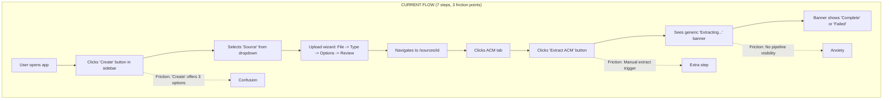

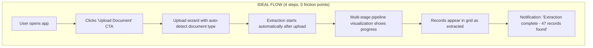

### UC-2: Review and Validate Records

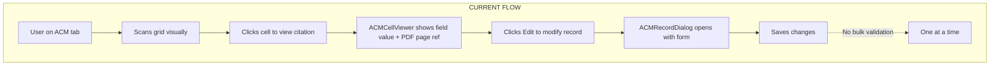

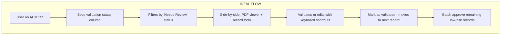

### UC-3: Export BAR Excel

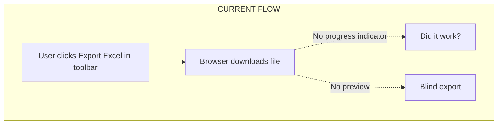

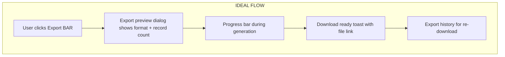

### UC-4: Search and Query ACM Data

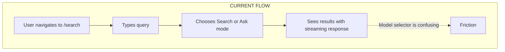

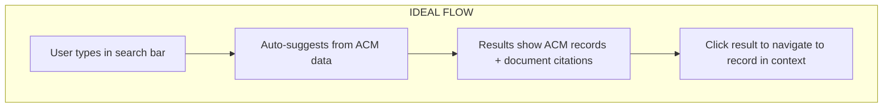

### UC-5: Configure Extraction Settings

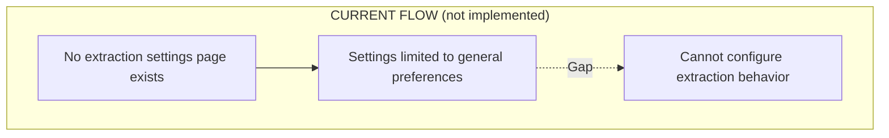

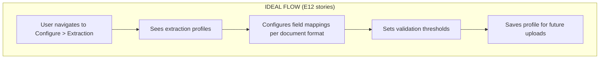

### UC-6: Knowledge Graph Exploration

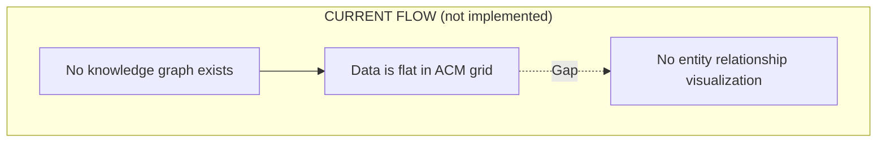

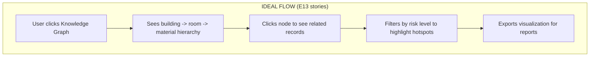

---

## 8. Brownfield Debt

The application was forked from **Open Notebook**, a general-purpose AI knowledge management tool. Significant brownfield artifacts remain.

### Code Artifacts

| Category | Items | Impact | Severity |
|----------|-------|--------|----------|
| **Unused pages** | `/notebooks`, `/notebooks/[id]`, `/podcasts`, `/transformations`, `/test-grid` | 5 routes serving features not in ACM scope | Low |
| **Unused components** | `components/podcasts/*` (6 files), `components/notebooks/*` (7 files), `EpisodeCard`, `SpeakerProfilesPanel`, `EpisodeProfilesPanel`, `TemplatesTab`, `GeneratePodcastDialog`, `TransformationCard`, `TransformationEditorDialog`, `TransformationPlayground`, `TransformationsList`, `DefaultPromptEditor` | ~20 components occupying bundle space and maintenance surface | Low |
| **Unused hooks** | `use-notebooks`, `use-notes`, `use-podcasts`, `use-transformations`, `useNotebookChat` | 5 hooks with server-state queries for unused features | Low |
| **Unused store** | `notebook-columns-store` | 1 Zustand store for notebook column visibility | Low |
| **Stale middleware** | `middleware.ts` redirects `/` to `/notebooks` | Contradicts dashboard being the landing page; currently overridden by `page.tsx` at `/` | **Medium** |
| **Open Notebook branding** | References to "open-notebook" in `ConnectionErrorOverlay` docs link, potentially in other strings | Should be replaced with VAEA/CoralShades branding | Low |
| **Generic naming** | "Sources" (should be "Documents"), "Create" (should be "Upload"), section names ("Collect/Process/Create/Manage") | Inherited terminology does not match ACM domain language | Medium |

### Middleware Conflict

The middleware at `middleware.ts` contains:
```typescript
if (pathname === '/') {
  return NextResponse.redirect(new URL('/notebooks', request.url))
}
```

This redirects the root to `/notebooks`, but the app also has a Dashboard page at `app/(dashboard)/page.tsx`. The middleware redirect is a brownfield artifact that may cause unexpected behavior. The Dashboard page works because the app layout likely overrides or the redirect race condition resolves in favor of the page.

**Severity: Medium** -- This should be removed to prevent confusion.

---

## 9. Enterprise Readiness Gaps

### Gap Analysis

| ID | Gap | Current State | Required State | Severity | Effort |
|----|-----|--------------|----------------|----------|--------|
| ENT-01 | Multi-stage pipeline visualization | Generic "Extracting..." spinner with 4 states | 7-stage pipeline with per-stage status, duration timer, expandable detail, record count | **Critical** | High |
| ENT-02 | Skeleton loading screens | `LoadingSpinner` (bare icon) everywhere | Per-page skeleton layouts matching final content shape | **Medium** | Medium |
| ENT-03 | Toast notification system | Sonner component exists but unused for key operations | Toast for extraction start/complete/fail, export ready, settings saved, bulk operation results | **Medium** | Low |
| ENT-04 | Disconnect/reconnect handling | `ConnectionGuard` checks once on mount | Periodic heartbeat, offline banner with auto-reconnect, stale data indicator | **Medium** | Medium |
| ENT-05 | Session timeout handling | Auth token checked on mount only | Idle timeout warning, session refresh, graceful re-auth | **Medium** | Medium |
| ENT-06 | Breadcrumb navigation | None | Context breadcrumbs on all deep pages (`Documents > [Name] > ACM`) | **Medium** | Low |
| ENT-07 | Keyboard shortcuts | Only Cmd+K (command palette), Enter in grid | Shortcuts for extract (Cmd+E), export (Cmd+Shift+E), filter (Cmd+F), navigate (arrows) | **Low** | Low |
| ENT-08 | Export progress feedback | No feedback during CSV/Excel generation | Progress bar, download-ready notification, export history | **Medium** | Medium |
| ENT-09 | Batch operation feedback | Bulk actions (delete, export) have no progress | Progress indicator with count/total, cancel option | **Medium** | Medium |
| ENT-10 | Audit logging UI | None | Activity log showing who extracted/exported/modified records and when | **Low** | High |

### Priority Matrix

```
                    Low Effort          High Effort
                +-----------------+------------------+
   Critical     | --              | ENT-01 Pipeline  |
                +-----------------+------------------+
   High         | ENT-03 Toasts   | ENT-04 Reconnect |
                | ENT-06 Crumbs   | ENT-05 Session   |
                +-----------------+------------------+
   Medium       | ENT-07 Keyboard | ENT-02 Skeletons |
                |                 | ENT-08 Export     |
                |                 | ENT-09 Batch     |
                +-----------------+------------------+
   Low          |                 | ENT-10 Audit Log |
                +-----------------+------------------+
```

---

## 10. Dual-Persona UX

### Persona Definitions

| Dimension | Compliance Officer | Asbestos Consultant |
|-----------|-------------------|---------------------|
| **Role** | Government staff managing asbestos registers | External technical assessor creating risk assessments |
| **Technical skill** | Low -- uses standard office tools | High -- understands extraction parameters, material science |
| **Primary task** | Upload PDF, review results, export BAR Excel | Bulk processing, parser tuning, validation, knowledge graph |
| **Usage frequency** | Monthly (audit cycles) | Daily (active assessment projects) |
| **Configuration needs** | None -- use defaults | Extensive -- extraction profiles, field mappings, thresholds |
| **Error tolerance** | Zero -- needs clear guidance | Moderate -- can diagnose and recover |

### Current State

The current UI treats all users identically. There is no concept of user roles, feature toggles, or progressive disclosure. Every user sees all 11 navigation items, all toolbar actions, and all configuration options.

### Proposed Approach

| Strategy | Implementation | Affected Components |
|----------|---------------|---------------------|
| **Default to simple** | The default view is optimized for compliance officers. Dashboard shows risk overview, upload is a single CTA, ACM grid shows key columns. | Dashboard, AppSidebar, Upload wizard |
| **Progressive disclosure** | Advanced features are hidden behind expandable sections or "Advanced" toggles. Parser configuration, extraction method tuning, knowledge graph are in the CONFIGURE section. | Settings, ACMToolbar, SiteConfigPanel |
| **Configure section** | All configuration pages are under a separate CONFIGURE nav section, keeping the WORKSPACE clean for daily tasks. | AppSidebar navigation |
| **Pipeline transparency opt-in** | Pipeline progress shows a summary by default ("Stage 3 of 7: Interpreting data") with an expandable detail panel showing agent decisions, tool selections, and record counts. | ACMExtractionBanner (redesigned) |
| **Tooltips and help text** | Action buttons have clear labels ("Extract ACM Records from PDF" not just "Extract"). First-time use shows contextual hints. | ACMToolbar, Upload wizard |

### Persona-Specific Findings

| ID | Finding | Persona Affected | Severity | Details |
|----|---------|-------------------|----------|---------|
| DP-01 | Too many nav items for simple workflow | Compliance Officer | **High** | 11 items when only 4 are relevant (Dashboard, Documents, ACM Register, Search). |
| DP-02 | Model selector exposed in search | Compliance Officer | **Low** | Officers should not need to choose between GPT-4 and Claude. Use system defaults. |
| DP-03 | No extraction profile management | Consultant | **Medium** | Consultants need to save and reuse extraction configurations per document format (Prensa, Greencap, etc.). |
| DP-04 | No batch processing view | Consultant | **Medium** | Consultants process 10-50 documents at once. No queue/batch management exists. |
| DP-05 | No validation workflow | Both | **High** | Neither persona has a structured validate-approve-export workflow. Records go from extracted to exportable with no review stage. |
| DP-06 | No role-based access control | Both | **Low** | Currently single-user with basic auth. Enterprise deployment will need RBAC (viewer, editor, admin). |

---

## Summary: Top Findings by Severity

### Critical (2)

1. **ENT-01 / Loading-01:** Extraction pipeline shows only "Extracting..." with a spinner. No stage visibility, no progress, no agent detail. This is the core AI feature and it is opaque.
2. **NAV-01 + NAV-02:** Navigation taxonomy is confusing and cluttered with irrelevant features (Podcasts, Notebooks, Transformations).

### High (6)

3. **A11Y-01:** Color contrast has not been formally audited against WCAG 2.1 AA 4.5:1 ratio requirement.
4. **A11Y-02:** Risk status badges rely on color without supplementary patterns/icons for color-blind users.
5. **SM-01:** No global extraction pipeline state -- cannot see which documents are currently being processed.
6. **DP-01:** 11 nav items shown to compliance officers who need only 4.
7. **DP-05:** No structured validation workflow for reviewing extracted records before export.
8. **NAV-07 / ENT-06:** No breadcrumbs on deep pages.

### Medium (12)

9. NAV-03: Create button offers wrong actions (Source/Notebook/Podcast vs Upload Document).
10. NAV-04: Sources and Documents are confusingly separate.
11. NAV-05: No extraction settings in navigation (needed for E12).
12. A11Y-03: AG Grid cells lack aria-label context for screen readers.
13. A11Y-04: No skip-to-content link.
14. A11Y-06: Keyboard navigation limited beyond Cmd+K.
15. SM-02: No optimistic updates for CRUD operations.
16. SM-03: No offline/stale data handling.
17. ENT-02: No skeleton loading screens.
18. ENT-04: ConnectionGuard checks only once on mount.
19. ENT-05: No session timeout handling.
20. Brownfield: Middleware redirects `/` to `/notebooks` (stale artifact).

### Low (10)

21. NAV-06: Models and Advanced should be under Settings.
22. NAV-08: Collapsed sidebar loses section headers.
23. NAV-09: Command Palette includes irrelevant items.
24. A11Y-05: Focus ring contrast needs contextual testing.
25. A11Y-07: Collapsed sidebar tooltips are mouse-only.
26. A11Y-09: Error messages include Docker commands inappropriate for end users.
27. SM-04: Brownfield hooks inflate bundle size.
28. ENT-07: Limited keyboard shortcuts.
29. ENT-10: No audit logging UI.
30. DP-02: Model selector exposed to non-technical users.

---

## Appendix A: File Index

### Key Files Audited

| File | Path |
|------|------|
| Sidebar | `frontend/src/components/layout/AppSidebar.tsx` |
| Dashboard | `frontend/src/app/(dashboard)/page.tsx` |
| ACM Tab | `frontend/src/components/acm/ACMTab.tsx` |
| ACM Grid | `frontend/src/components/acm/ACMGrid.tsx` |
| Extraction Banner | `frontend/src/components/acm/ACMExtractionBanner.tsx` |
| Extraction Status Hook | `frontend/src/lib/hooks/use-extraction-status.ts` |
| Loading Spinner | `frontend/src/components/common/LoadingSpinner.tsx` |
| Error Boundary | `frontend/src/components/common/ErrorBoundary.tsx` |
| Connection Guard | `frontend/src/components/common/ConnectionGuard.tsx` |
| Connection Error Overlay | `frontend/src/components/errors/ConnectionErrorOverlay.tsx` |
| Command Palette | `frontend/src/components/common/CommandPalette.tsx` |
| Design Tokens (CSS) | `frontend/src/app/globals.css` |
| Middleware | `frontend/src/middleware.ts` |

### Component Counts

| Category | Count |
|----------|-------|
| UI base components (shadcn/ui) | 36 |
| ACM domain components | 8 |
| Upload wizard components | 5 |
| Common/shared components | 10 |
| Layout components | 2 |
| Brownfield components (unused) | ~20 |
| Zustand stores | 6 (1 brownfield) |
| React Query hooks | 26 (5 brownfield) |
| Total routes | 16 (5 to hide, 1 to remove) |
